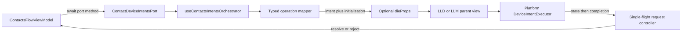

# Contacts DIE orchestration architecture

## Target flow



The hook returns `{ deviceIntents, dieProps }`, where `dieProps` is `undefined` while idle and otherwise contains only shared core executor props. Each app conditionally mounts its own wrapper and supplies `sourceFlow="contacts"`.

## 1. Clean the domain-facing port contract

Update [`features/platform/contacts/src/contactDeviceIntentsPort.ts`](features/platform/contacts/src/contactDeviceIntentsPort.ts):

- Rename port DTOs to remove misleading `Intent` terminology: `RegisterExternalAddressInput/Result`, `RenameExternalContactInput/Result`, and `EditExternalAddressInput/Result`.
- Rename `editExternalAddressScope` to `editExternalAddress`, because the operation may edit the identifier, scope, or both.
- Add typed `ContactDeviceIntentBusyError`, `ContactDeviceIntentCancelledError`, and an address-edit execution error carrying `partialResult?: ContactAddress["device"]` and the original cause.
- Keep `createMockContactDeviceIntentsPort()` for explicit tests/story use, but remove it as a production default from flow factories.

## 2. Model typed Contacts operations separately from orchestration

Add a narrow `device` subpath under [`features/platform/contacts/src/device/`](features/platform/contacts/src/device/) with small responsibilities:

- `types.ts`: structural Contacts initialization input, union aliases for the five relevant intent states/inputs, and generic operation/classification types.
- `resolveContactDeviceContext.ts`: resolve token parent/network metadata, `blockchainFamily`, EVM `chainId`, and `managerAppName`; permit only the Ethereum app in this ticket. Explicitly reject Tron until the separate optional-chain-ID domain change lands. Do not use a broad `evm -> Ethereum` family map.
- `operations/registerExternalAddress.ts`, `renameExternalContact.ts`, and `editExternalAddress.ts`: pure port-input-to-intent mappers and terminal-state classifiers.

The edit mapper selects the smallest correct intent:

- label only → scope intent;
- address only → identifier intent;
- both → combined intent;
- neither → return the existing context without mounting DIE.

Each operation exposes a pure classifier rather than subscribing to the job observable:

```ts
type ContactOperationOutcome<Result> =
  | { type: "pending" }
  | { type: "success"; result: Result }
  | { type: "failure"; error: Error };

type ContactOperation<JobState, Result> = {
  intent: ContactIntent;
  initializationInput: ContactsDeviceInitializationInput;
  classify: (state: JobState) => ContactOperationOutcome<Result>;
};
```

## 3. Correct combined-edit recovery data

Update [`features/platform/contacts/src/device/intents/editExternalAddressIntent/types.ts`](features/platform/contacts/src/device/intents/editExternalAddressIntent/types.ts) and its scaffold job:

- Remove `appliedStep` from `EditExternalAddressResult`; a result is simply the latest complete data snapshot.
- Keep step metadata on UI/job states where useful.
- Add `partialResult?: EditExternalAddressResult` to `failed`, populated when the identifier step succeeded and the scope step failed.
- Map such a failure to the typed port error carrying a domain `partialResult`.

In [`features/flow/contacts/src/steps/Detail/createContactAddressDetailActionsPorts.ts`](features/flow/contacts/src/steps/Detail/createContactAddressDetailActionsPorts.ts), catch that typed error, persist its partial device context with the corresponding updated address data, then rethrow so the existing flow remains in its error lifecycle.

## 4. Build a single-flight Promise controller and thin React hook

Add a pure request controller plus [`features/platform/contacts/src/device/useContactsIntentsOrchestrator.ts`](features/platform/contacts/src/device/useContactsIntentsOrchestrator.ts):

- Controller owns request ID, latest classified outcome, resolve/reject-once handlers, busy rejection, cancellation, missing-terminal-result error, and stale-callback protection.
- Refs hold settlement data so synchronous RxJS emissions followed by completion cannot race React state updates.
- React state holds only the active renderable operation so intent and initialization input change atomically.
- `onIntentJobStateChanged` captures/classifies the latest state; `onIntentJobComplete` settles from that captured outcome; `onIntentJobError` rejects observable errors.
- User cancellation and unmount first deactivate DIE (ensuring its sole subscription is torn down), then reject with `ContactDeviceIntentCancelledError`.
- A concurrent port call rejects with `ContactDeviceIntentBusyError`; no queue or replacement is allowed.

No `Observable<JobState> -> Promise<Result>` helper is added to DIE core: DIE retains the sole subscription, avoiding duplicate device execution.

## 5. Expose and wire the shared hook

- Add a narrow `@features/platform-contacts/device` package export; keep existing raw intent definitions under `@features/platform-contacts/device/intents`.
- Desktop: call the hook in [`apps/ledger-live-desktop/src/mvvm/features/Contacts/screens/Contacts/useContactsViewModel.ts`](apps/ledger-live-desktop/src/mvvm/features/Contacts/screens/Contacts/useContactsViewModel.ts), thread the returned port into add/rename/edit adapters, return `dieProps`, and mount `DeviceIntentExecutorLWD` once in the Contacts parent view.
- Mobile: do the same in [`apps/ledger-live-mobile/src/mvvm/features/Contacts/screens/ContactDetail/useContactDetailScreenViewModel.ts`](apps/ledger-live-mobile/src/mvvm/features/Contacts/screens/ContactDetail/useContactDetailScreenViewModel.ts) and mount `DeviceIntentExecutorLWM` once in the Contact Detail parent screen.
- Remove hidden production mock defaults from the two flow port factories/hooks; tests must inject the mock explicitly.
- Add `"contacts"` to the shared DIE tracking `SourceFlow` type and pass it from both app wrappers.

## 6. Verify behavior and architectural boundaries

Add focused tests for:

- all port↔intent input/result mappings and branded proof parsing;
- Ethereum-app context resolution, unsupported app rejection, token-parent handling, and explicit Tron rejection;
- edit-intent selection and failed second-step `partialResult` propagation;
- Promise success, emitted failed state, observable error, user cancellation, unmount, busy rejection, missing final result, stale callbacks, and synchronous emit+complete;
- Desktop and Mobile integration proving each parent mounts DIE and all three production paths receive the orchestrated port;
- flow persistence of partial edit results before rethrowing the failure.

Run package-scoped formatting, type checks, Jest suites, lint diagnostics, and the repository’s required changed-file validation. Confirm every plan item after implementation and update an existing current-branch PR description if one exists.
