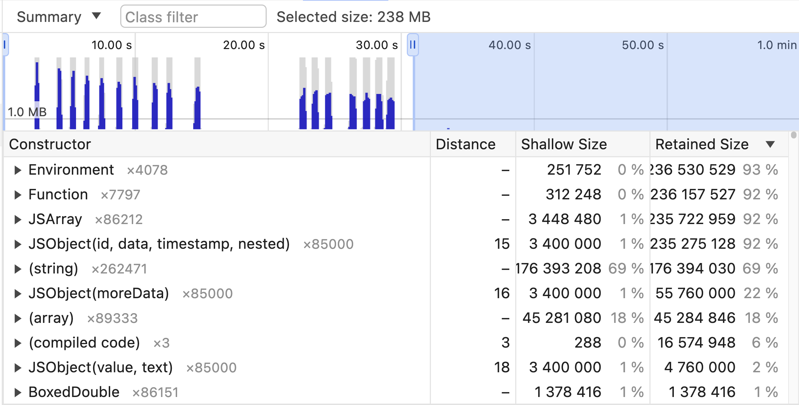

# Skill: Hunt JS Memory Leaks

Find and fix JavaScript memory leaks using React Native DevTools memory profiling.

## Quick Pattern

**Incorrect (listener not cleaned up):**

```jsx
useEffect(() => {
  const sub = EventEmitter.addListener('event', handler);
  // Missing cleanup!
}, []);
```

**Correct (proper cleanup):**

```jsx
useEffect(() => {
  const sub = EventEmitter.addListener('event', handler);
  return () => sub.remove();
}, []);
```

## When to Use

- App memory usage grows over time
- App crashes after extended use
- Navigating between screens increases memory
- Suspecting event listeners or timers not cleaned up

## Prerequisites

- React Native DevTools accessible
- App running in development mode

## Step-by-Step Instructions

### 1. Open Memory Profiler

1. Launch React Native DevTools (press `j` in Metro)
2. Go to **Memory** tab
3. Select **"Allocation instrumentation on timeline"**

### 2. Record Memory Allocations

1. Click **"Start"** at the bottom
2. Perform actions that might leak (navigate, trigger events, etc.)
3. Wait 10-30 seconds
4. Click **"Stop"**

### 3. Analyze the Timeline

**Key indicators:**
- **Blue bars** = Memory allocated
- **Gray bars** = Memory freed (garbage collected)
- **Blue bars that stay blue** = Potential leak!

### 4. Investigate Leaking Objects



The Memory tab shows:
- **Timeline** (top): Blue bars = allocations, select time range to filter
- **Summary view** (bottom): Lists constructors with allocation counts

**Key columns:**
- **Constructor**: Object type (e.g., `JSObject`, `Function`, `(string)`)
- **Count**: Number of instances (×85000 = 85,000 objects)
- **Shallow Size**: Memory of the object itself
- **Retained Size**: Memory freed if object is deleted (including references)

**Red flag**: Large retained size % with small shallow size % = closures or references holding large objects.

**To investigate:**
1. Click on a blue spike in the timeline
2. Look at the Constructor list below
3. Check **Shallow size** vs **Retained size**
4. Expand constructors to see individual allocations
5. Click to see the exact source location

### 5. Verify the Fix

After fixing, re-profile. All bars should turn gray (except the most recent).

## Code Examples

### Common Leak Patterns

**1. Listeners Not Cleaned Up:**

```jsx
// BAD: Memory leak
const BadEventComponent = () => {
  useEffect(() => {
    const subscription = EventEmitter.addListener('myEvent', handleEvent);
    // Missing cleanup!
  }, []);
  
  return <Text>Listening...</Text>;
};

// GOOD: Proper cleanup
const GoodEventComponent = () => {
  useEffect(() => {
    const subscription = EventEmitter.addListener('myEvent', handleEvent);
    return () => subscription.remove(); // Cleanup!
  }, []);
  
  return <Text>Listening...</Text>;
};
```

**2. Timers Not Cleared:**

```jsx
// BAD: Memory leak
const BadTimerComponent = () => {
  useEffect(() => {
    const timer = setInterval(() => {
      setCount(prev => prev + 1);
    }, 1000);
    // Missing cleanup!
  }, []);
};

// GOOD: Proper cleanup
const GoodTimerComponent = () => {
  useEffect(() => {
    const timer = setInterval(() => {
      setCount(prev => prev + 1);
    }, 1000);
    return () => clearInterval(timer); // Cleanup!
  }, []);
};
```

**3. Closures Capturing Large Objects:**

```jsx
// BAD: Closure captures entire array
class BadClosureExample {
  private largeData = new Array(1000000).fill('data');
  
  createLeakyFunction() {
    return () => this.largeData.length; // Captures this.largeData
  }
}

// GOOD: Only capture what's needed
class GoodClosureExample {
  private largeData = new Array(1000000).fill('data');
  
  createEfficientFunction() {
    const length = this.largeData.length; // Extract value
    return () => length; // Only captures primitive
  }
}
```

**4. Global Arrays Growing:**

```jsx
// BAD: Global array never cleared
let leakyClosures = [];

const createLeak = () => {
  const data = generateLargeData();
  leakyClosures.push(() => data); // Keeps growing!
};

// GOOD: Clear when done or use WeakRef
const createNoLeak = () => {
  const data = generateLargeData();
  const closure = () => data;
  // Use it and let it be garbage collected
  return closure;
};
```

## Memory Profiler Metrics

| Metric | Meaning |
|--------|---------|
| **Shallow size** | Memory held by the object itself |
| **Retained size** | Memory freed if object is deleted (includes references) |

**Large retained size with small shallow size** = Object holding references to other large objects (common in closures).

## Common Pitfalls

- **Not forcing GC**: GC runs periodically. Allocate something else to trigger collection before concluding there's a leak.
- **Ignoring gray bars**: Gray = properly collected. Only blue bars that persist are leaks.
- **Missing useEffect cleanup**: Most common React Native leak source.

## Related Skills

- [native-memory-leaks.md](./native-memory-leaks.md) - Native-side memory leaks
- [js-profile-react.md](./js-profile-react.md) - General profiling
