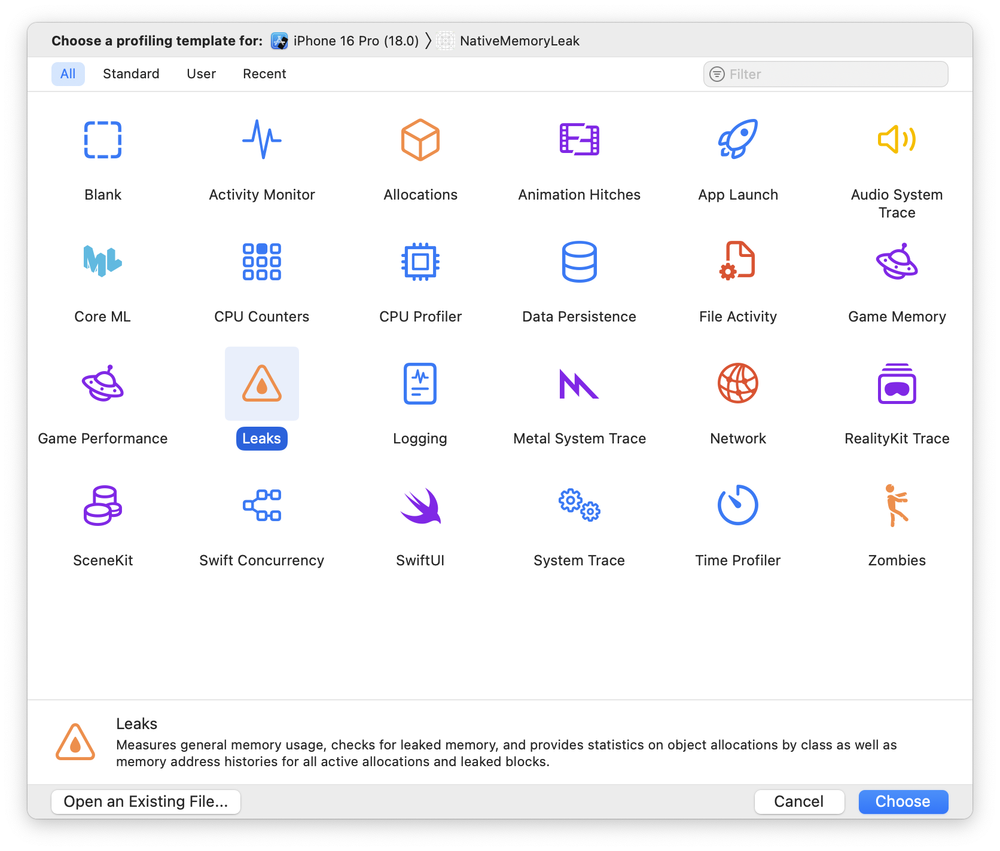

# Skill: Hunt Native Memory Leaks

Find native memory leaks using Xcode Leaks and Android Studio Memory Profiler.

## Quick Command

```bash
# iOS: Profile with Leaks instrument
# Xcode → Product → Profile (Cmd+I) → Leaks template

# Android: Memory Profiler
# Android Studio → Run → Profile → Track Memory Consumption
```

## When to Use

- App memory grows despite JS profiler showing no leaks
- Native modules suspected of leaking
- Activity recreation causes memory growth (Android)
- C++/Swift/Kotlin code under investigation

## iOS: Xcode Leaks

### Quick Check: Memory Report

1. Run app via Xcode
2. Open **Debug Navigator** (side panel)
3. Click **Memory**
4. Watch graph for continuous growth

### Deep Analysis: Instruments Leaks



1. **Xcode → Product → Profile** (or Cmd+I)
2. Select **Leaks** template (highlighted with orange triangle icon in the grid)
3. Click **Choose**
4. Click **Record** (red circle)
5. Use the app, perform suspect actions
6. Stop recording

The template picker shows all available Instruments:
- **Leaks**: Memory leak detection (what we need)
- **Allocations**: All memory allocations over time
- **Time Profiler**: CPU usage profiling
- **Zombies**: Detect messages to deallocated objects

### Analyzing Results

**Red markers** = Leaked memory detected

Click on leak to see:
- **Leaked Object**: Type and size
- **Responsible Library**: Which code leaked
- **Responsible Frame**: Exact function
- **Stack Trace**: Full call path (right panel)

**Double-click function** to see source code.

### Common iOS Leak: Missing delete

```cpp
// BAD: Memory leak
void createNewStrings() {
    std::string* str = new std::string("Hello");
    // Forgot delete str;
}

// GOOD: Fixed
void createNewStrings() {
    std::string* str = new std::string("Hello");
    // ... use str ...
    delete str;
}

// BETTER: Use smart pointers
void createNewStrings() {
    auto str = std::make_unique<std::string>("Hello");
    // Automatically deleted
}
```

## Android: Memory Profiler

### Launch Profiler

1. **Run → Profile** (or click Profile in toolbar)
2. Or: **View → Tool Windows → Profiler**
3. Select **"Track Memory Consumption"**

### Recording

1. Start the app
2. Perform actions that might leak
3. Watch memory graph for growth patterns

### Analyzing Allocations

Memory profiler shows:
- **Allocations count**: Objects created
- **Deallocations count**: Objects freed
- **Live objects**: Still in memory

**If allocations >> deallocations**, you have a leak.

### Common Android Leak: Listener Not Removed

```kotlin
// BAD: Leaks MainActivity on config change
class MainActivity : AppCompatActivity(), Callback {
    override fun onCreate(savedInstanceState: Bundle?) {
        super.onCreate(savedInstanceState)
        EventManager.addListener(this)
        // Never removed!
    }
}

// GOOD: Remove listener
class MainActivity : AppCompatActivity(), Callback {
    override fun onCreate(savedInstanceState: Bundle?) {
        super.onCreate(savedInstanceState)
        EventManager.addListener(this)
    }
    
    override fun onDestroy() {
        EventManager.removeListener(this)
        super.onDestroy()
    }
}
```

### Activity Recreation Test

Android recreates activities on:
- Screen rotation
- Dark mode change
- Locale change

**Test**: Rotate device multiple times, check if old activities are freed.

React Native note: RN opts out via `android:configChanges` in manifest, but native code might not.

## Debugging Workflow

### iOS

1. Profile with Instruments Leaks
2. Trigger suspect actions repeatedly
3. Wait for red leak markers
4. Click to identify responsible frame
5. Fix and re-test

### Android

1. Profile memory consumption
2. Trigger suspect actions (rotate, navigate)
3. Check allocation/deallocation counts
4. Look for classes with 0 deallocations
5. Fix and re-test

## Code Fixes by Pattern

### Reference Cycle (Swift)

```swift
// BAD
class Parent {
    var child: Child?
}
class Child {
    var parent: Parent?  // Strong reference cycle
}

// GOOD
class Parent {
    var child: Child?
}
class Child {
    weak var parent: Parent?  // Weak breaks cycle
}
```

### Missing Cleanup (C++)

```cpp
// BAD
void process() {
    auto* data = new LargeData();
    if (error) return;  // Leak!
    delete data;
}

// GOOD: RAII with unique_ptr
void process() {
    auto data = std::make_unique<LargeData>();
    if (error) return;  // Automatically cleaned up
}
```

### Global Singleton Holding References (Kotlin)

```kotlin
// BAD: Holds strong references
object Cache {
    private val items = mutableMapOf<String, Callback>()
}

// GOOD: Use weak references
object Cache {
    private val items = mutableMapOf<String, WeakReference<Callback>>()
}
```

## Verification

After fixing:
1. Re-run profiler
2. Perform same actions
3. Verify:
   - iOS: No red leak markers
   - Android: Allocations ≈ Deallocations

## Common Pitfalls

- **Testing in debug mode**: Some leaks only appear in release
- **Not waiting for GC**: Force GC before concluding no leak
- **Ignoring small leaks**: They add up over time
- **Missing cleanup in invalidate()**: Turbo Modules need proper cleanup

## Related Skills

- [native-memory-patterns.md](./native-memory-patterns.md) - Understanding memory patterns
- [js-memory-leaks.md](./js-memory-leaks.md) - JS-side leaks
- [native-threading-model.md](./native-threading-model.md) - Module invalidation
