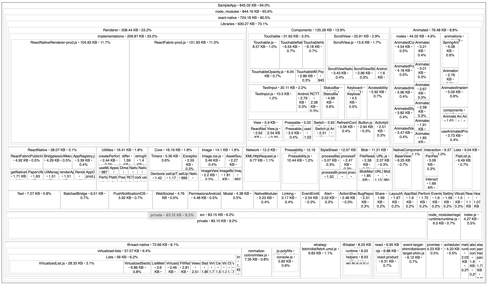

# Skill: Analyze JS Bundle Size

Use source-map-explorer and Expo Atlas to visualize what's in your JavaScript bundle.

## Quick Command

```bash
# React Native CLI
npx react-native bundle \
  --entry-file index.js \
  --bundle-output output.js \
  --platform ios \
  --sourcemap-output output.js.map \
  --dev false --minify true && \
npx source-map-explorer output.js --no-border-checks

# Expo
EXPO_UNSTABLE_ATLAS=true npx expo export --platform ios && npx expo-atlas
```

## When to Use

- JS bundle seems too large
- Want to identify heavy dependencies
- Investigating startup time issues
- Before/after optimization comparison

> **Note**: This skill involves interpreting visual treemap output (source-map-explorer, Expo Atlas). AI agents cannot yet process screenshots autonomously. Use this as a guide while reviewing the visualization manually, or await MCP-based visual feedback integration (see roadmap).

## Understanding Hermes Bytecode

Modern React Native (0.70+) uses Hermes bytecode, not raw JavaScript:
- Skips parsing at runtime
- Still benefits from smaller bundles
- Heavy imports still execute on startup

**Impact of bundle size:**
- Larger bytecode = longer download from store
- More imports on init path = slower TTI

## Method 1: source-map-explorer

### Generate Bundle with Source Map

**React Native CLI:**

```bash
npx react-native bundle \
  --entry-file index.js \
  --bundle-output output.js \
  --platform ios \
  --sourcemap-output output.js.map \
  --dev false \
  --minify true
```

**Expo (SDK 51+):**

```bash
npx expo export --platform ios --source-maps --output-dir dist
# Bundle at: dist/ios/_expo/static/js/ios/*.js
# Source map at: dist/ios/_expo/static/js/ios/*.map
```

### Analyze

```bash
npx source-map-explorer output.js --no-border-checks
```

**Note**: `--no-border-checks` needed due to Metro's non-standard source maps.

Opens browser with treemap visualization:



The treemap shows:
- **Hierarchy**: `node_modules/` → `react-native/` → `Libraries/` → individual files
- **Size**: Box area proportional to file size (KB shown in labels)
- **Major components visible**: 
  - `react-native` (724.18 KB, 80.5%)
  - `Renderer` (208.44 KB) - ReactNativeRenderer-prod.js, ReactFabric-prod.js
  - `Components` (125.29 KB) - Touchable, ScrollView, etc.
  - `Animated` (79.48 KB) - Animation system
  - `virtualized-lists` (57.57 KB) - FlatList internals

Click on any section to drill down into that directory.

**Limitation**: May lose ~30% info due to mapping issues.

## Method 2: Expo Atlas

More accurate for Expo projects (or with workaround for bare RN).

### For Expo Projects

```bash
# Start with Atlas enabled
EXPO_UNSTABLE_ATLAS=true npx expo start --no-dev

# Or export
EXPO_UNSTABLE_ATLAS=true npx expo export
```

Then launch UI:

```bash
npx expo-atlas
```


Expo Atlas provides more accurate visualization for Expo projects, with similar treemap interface showing module sizes and dependencies.

### For Non-Expo Projects

Use `expo-atlas-without-expo` package.

## Method 3: Re.Pack Bundle Analysis (Webpack/Rspack)

If using Re.Pack:

### webpack-bundle-analyzer

```bash
rspack build --analyze
```

### bundle-stats / statoscope

```bash
# Generate stats
npx react-native bundle \
  --platform android \
  --entry-file index.js \
  --dev false \
  --minify true \
  --json stats.json

# Analyze
npx bundle-stats --html --json stats.json
```

### Rsdoctor

```javascript
// rspack.config.js
const { RsdoctorRspackPlugin } = require('@rsdoctor/rspack-plugin');

module.exports = {
  plugins: [
    process.env.RSDOCTOR && new RsdoctorRspackPlugin(),
  ].filter(Boolean),
};
```

Run with:

```bash
RSDOCTOR=true npx react-native start
```

## What to Look For

### Red Flags

| Finding | Problem | Solution |
|---------|---------|----------|
| Entire library imported | Barrel exports | Use direct imports |
| Duplicate packages | Multiple versions | Dedupe in package.json |
| Dev dependencies in bundle | Incorrect imports | Check conditional imports |
| Large polyfills | Unnecessary for Hermes | Remove (see native-sdks-over-polyfills.md) |
| Moment.js with locales | Bloated date library | Switch to date-fns or dayjs |

### Common Offenders

- **Lodash full import**: Use `lodash-es` or specific imports
- **Moment.js**: Replace with `date-fns` or `dayjs`
- **Intl polyfills**: Check Hermes support
- **AWS SDK**: Import specific services only

## Code Examples

### Identify Barrel Import Impact

```tsx
// BAD: Imports entire library through barrel
import { format } from 'date-fns';

// In bundle: All of date-fns loaded

// GOOD: Direct import
import format from 'date-fns/format';

// In bundle: Only format function
```

## Comparing Bundles

### source-map-explorer

```bash
# Generate baseline
npx react-native bundle ... --bundle-output baseline.js --sourcemap-output baseline.js.map

# Make changes, generate new bundle
npx react-native bundle ... --bundle-output current.js --sourcemap-output current.js.map

# Compare manually in browser
```

### Re.Pack (automated)

```bash
npx bundle-stats compare baseline-stats.json current-stats.json
```

## Quick Commands

**React Native CLI:**

```bash
# iOS bundle analysis
npx react-native bundle \
  --entry-file index.js \
  --bundle-output ios-bundle.js \
  --platform ios \
  --sourcemap-output ios-bundle.js.map \
  --dev false \
  --minify true && \
npx source-map-explorer ios-bundle.js --no-border-checks

# Android bundle analysis  
npx react-native bundle \
  --entry-file index.js \
  --bundle-output android-bundle.js \
  --platform android \
  --sourcemap-output android-bundle.js.map \
  --dev false \
  --minify true && \
npx source-map-explorer android-bundle.js --no-border-checks
```

**Expo:**

```bash
# Use Expo Atlas (recommended for Expo projects)
EXPO_UNSTABLE_ATLAS=true npx expo export --platform ios
npx expo-atlas
```

## Related Skills

- [bundle-barrel-exports.md](./bundle-barrel-exports.md) - Fix barrel import issues
- [bundle-tree-shaking.md](./bundle-tree-shaking.md) - Enable dead code elimination
- [bundle-library-size.md](./bundle-library-size.md) - Check library sizes before adding
