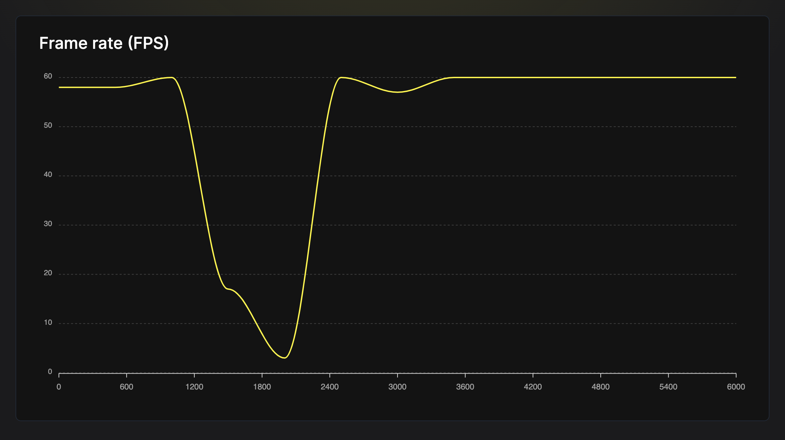

# Skill: Higher-Order Lists

Replace ScrollView with FlatList or FlashList for performant large list rendering.

## Quick Pattern

**Incorrect:**

```jsx
<ScrollView>
  {items.map((item) => <Item key={item.id} {...item} />)}
</ScrollView>
```

**Correct:**

```jsx
<FlashList
  data={items}
  keyExtractor={(item) => item.id}
  renderItem={({ item }) => <Item {...item} />}
  estimatedItemSize={50}
/>
```

## When to Use

- Rendering more than 10-20 items in a list
- List scrolling is choppy or laggy
- App freezes when loading list data
- Memory usage spikes with long lists

## Prerequisites

- `@shopify/flash-list` for FlashList (recommended)
- Understanding of list virtualization

## Step-by-Step Instructions

### 1. Identify the Problem



The FPS graph shows a severe performance problem during list rendering:
- FPS starts at ~60 (smooth)
- Drops to ~3 FPS during heavy list operation
- Recovers after rendering completes

```jsx
// BAD: ScrollView renders ALL items at once
const BadList = ({ items }) => (
  <ScrollView>
    {items.map((item, index) => (
      <View key={index}>
        <Text>{item}</Text>
      </View>
    ))}
  </ScrollView>
);
```

With 5000 items, this creates 5000 views immediately, causing:
- Multi-second freeze
- FPS drop to 0
- High memory usage

### 2. Replace with FlatList

```jsx
import { FlatList } from 'react-native';

const BetterList = ({ items }) => {
  const renderItem = ({ item }) => (
    <View>
      <Text>{item}</Text>
    </View>
  );
  
  return (
    <FlatList
      data={items}
      renderItem={renderItem}
      keyExtractor={(item, index) => index.toString()}
    />
  );
};
```

FlatList only renders visible items + buffer (windowing).

### 3. Optimize FlatList with getItemLayout

For fixed-height items, skip layout measurement:

```jsx
const ITEM_HEIGHT = 50;

const OptimizedList = ({ items }) => {
  const renderItem = ({ item }) => (
    <View style={{ height: ITEM_HEIGHT }}>
      <Text>{item}</Text>
    </View>
  );
  
  const getItemLayout = (_, index) => ({
    length: ITEM_HEIGHT,
    offset: ITEM_HEIGHT * index,
    index,
  });
  
  return (
    <FlatList
      data={items}
      renderItem={renderItem}
      keyExtractor={(item, index) => index.toString()}
      getItemLayout={getItemLayout}
    />
  );
};
```

### 4. Upgrade to FlashList (Best Performance)

```bash
npm install @shopify/flash-list
```

```jsx
import { FlashList } from '@shopify/flash-list';

const BestList = ({ items }) => {
  const renderItem = ({ item }) => (
    <View style={{ height: 50 }}>
      <Text>{item}</Text>
    </View>
  );
  
  return (
    <FlashList
      data={items}
      renderItem={renderItem}
      estimatedItemSize={50}  // Required for FlashList
    />
  );
};
```

**FlashList advantages:**
- Recycles views instead of creating new ones
- 78/100 vs 25/100 performance score in benchmarks
- Smoother scrolling at ~54 FPS vs lower for FlatList

## Code Examples

### Variable Height Items

```jsx
// Calculate average for estimatedItemSize
// Items are 50px, 100px, 150px
// Average: (50 + 100 + 150) / 3 = 100px

<FlashList
  data={items}
  renderItem={renderItem}
  estimatedItemSize={100}
/>
```

### Mixed Item Types

```jsx
<FlashList
  data={items}
  renderItem={({ item }) => {
    if (item.type === 'header') return <Header {...item} />;
    if (item.type === 'product') return <Product {...item} />;
    return <DefaultItem {...item} />;
  }}
  getItemType={(item) => item.type}  // Helps recycling
  estimatedItemSize={80}
/>
```

### FlatList Optimizations (if not using FlashList)

```jsx
<FlatList
  data={items}
  renderItem={renderItem}
  // Performance props
  removeClippedSubviews={true}
  maxToRenderPerBatch={10}
  updateCellsBatchingPeriod={50}
  initialNumToRender={10}
  windowSize={5}
  // Avoid re-renders
  keyExtractor={(item) => item.id}
  extraData={selectedId}  // Only when selection changes
/>
```

## Performance Comparison

| Component | 5000 Items Load | Scroll FPS | Memory |
|-----------|-----------------|------------|--------|
| ScrollView | 1-3 seconds freeze | < 30 | High |
| FlatList | ~100ms | ~45 | Medium |
| FlashList | ~50ms | ~54 | Low |

## Decision Matrix

| Scenario | Recommendation |
|----------|---------------|
| < 20 static items | ScrollView OK |
| 20-100 items | FlatList minimum |
| > 100 items | FlashList |
| Complex item layouts | FlashList with `getItemType` |
| Fixed height items | Add `getItemLayout` or `estimatedItemSize` |

## Common Pitfalls

- **Inline renderItem functions**: Causes re-renders. Define outside or use `useCallback`.
- **Missing keyExtractor**: Use unique IDs, not array index when possible.
- **Ignoring estimatedItemSize warning**: FlashList warns if not set. Always provide it.
- **Heavy item components**: Keep list items light. Move side effects out.

## Related Skills

- [js-profile-react.md](./js-profile-react.md) - Profile list rendering
- [js-measure-fps.md](./js-measure-fps.md) - Measure scroll performance
