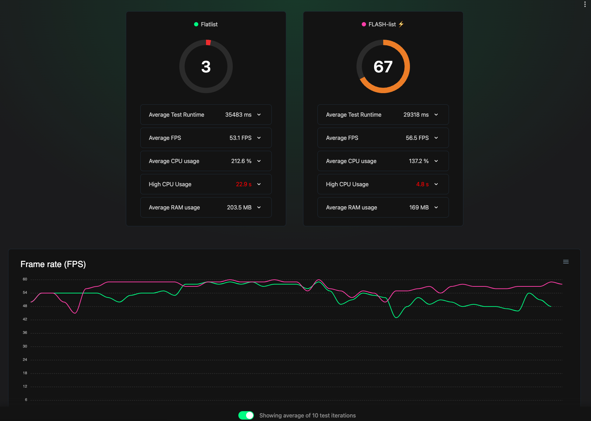

# Skill: Measure JS FPS

Monitor and measure JavaScript frame rate to quantify app smoothness and identify performance regressions.

## Quick Command

```bash
# Method 1: Built-in Perf Monitor
# Shake device → Dev Menu → "Perf Monitor"

# Method 2: Flashlight (Android, detailed reports)
curl https://get.flashlight.dev | bash
flashlight measure
```

## When to Use

- Animations feel choppy or janky
- Scrolling is not smooth
- Need baseline FPS metrics before/after optimization
- Want to compare performance across builds

## Prerequisites

- React Native app running on device/simulator
- For Flashlight: Android device (iOS not supported)

> **Note**: This skill involves interpreting visual output (FPS graphs, performance overlays). AI agents cannot yet process screenshots autonomously. Use this as a guide while reviewing metrics manually, or await MCP-based visual feedback integration (see roadmap).

## Step-by-Step Instructions

### Method 1: React Perf Monitor (Quick Check)

1. Open Dev Menu:
   - iOS Simulator: `Ctrl + Cmd + Z` or Device > Shake
   - Android Emulator: `Cmd + M` (Mac) / `Ctrl + M` (Windows)

2. Select **"Perf Monitor"**

3. Observe the overlay showing:
   - **UI (Main) thread FPS** - Native rendering
   - **JS thread FPS** - JavaScript execution
   - **RAM usage**

4. Hide with "Hide Perf Monitor" from Dev Menu

**Interpretation:**
- **60 FPS** = Smooth (16.6ms per frame)
- **< 60 FPS** = Dropping frames
- **120 FPS** target for high refresh rate devices (8.3ms per frame)

### Method 2: Flashlight (Automated Benchmarking)

> Android only. Provides detailed reports and JSON export.



Flashlight shows comparative performance data:
- **Score** (0-100): Overall performance rating (higher is better)
- **Average FPS**: Target 60 FPS for smooth scrolling
- **FPS Graph**: Real-time frame rate over test duration
- **CPU/RAM metrics**: Resource consumption

The image shows FlatList (score: 3) vs FlashList (score: 67) - a dramatic difference visible in both the score and FPS graph.

**Installation:**

```bash
# Install Flashlight CLI
curl https://get.flashlight.dev | bash
```

**Usage:**

```bash
# Start measuring (app must be running on Android)
flashlight measure
```

**Features:**
- Real-time FPS graph
- Average FPS calculation
- CPU and RAM metrics
- Overall performance score
- JSON export for CI comparison

### Important: Disable Dev Mode

**Always disable development mode for accurate measurements:**

**Android:**
1. Open Dev Menu
2. Settings > JS Dev Mode → **OFF**

**iOS (React Native CLI):**
```bash
# Run Metro in production mode
npx react-native start --reset-cache
# Then build release variant
```

**Expo:**
```bash
# Start Metro without dev mode
npx expo start --no-dev --minify
# For accurate measurements, use EAS Build for release testing
```

## Code Examples

### Identify FPS Drop Source

If **UI FPS drops but JS FPS is fine:**
- Native rendering issue
- Too many views/complex layouts
- Heavy native animations

If **JS FPS drops but UI FPS is fine:**
- JavaScript computation blocking
- Expensive React re-renders
- Look for `longRunningFunction` patterns

If **Both drop:**
- Mixed issue, start with JS profiling

### Target Frame Budgets

```javascript
// 60 FPS = 16.6ms per frame
const FRAME_BUDGET_60 = 16.6;

// 120 FPS = 8.3ms per frame  
const FRAME_BUDGET_120 = 8.3;

// If your function takes longer, it will drop frames
const longRunningFunction = () => {
  let i = 0;
  while (i < 1000000000) { // This blocks for seconds!
    i++;
  }
};
```

## Interpreting Results

| FPS Range | User Perception | Action |
|-----------|-----------------|--------|
| 55-60 | Smooth | Acceptable |
| 45-55 | Slight stutter | Investigate |
| 30-45 | Noticeable jank | Optimize required |
| < 30 | Very choppy | Critical fix needed |

## Flashlight CI Integration

```bash
# Export measurements to JSON
flashlight measure --output results.json

# Compare builds
flashlight compare baseline.json current.json
```

## Common Pitfalls

- **Measuring in dev mode**: Results will be artificially slow
- **Not using real device**: Simulators don't reflect real performance
- **Ignoring UI thread**: React Native has two threads - JS issues don't always show on UI thread
- **Single measurement**: Run multiple times, FPS varies

## Related Skills

- [js-profile-react.md](./js-profile-react.md) - Find what's causing FPS drops
- [js-animations-reanimated.md](./js-animations-reanimated.md) - Fix animation-related drops
- [js-lists-flatlist-flashlist.md](./js-lists-flatlist-flashlist.md) - Fix scroll-related drops
