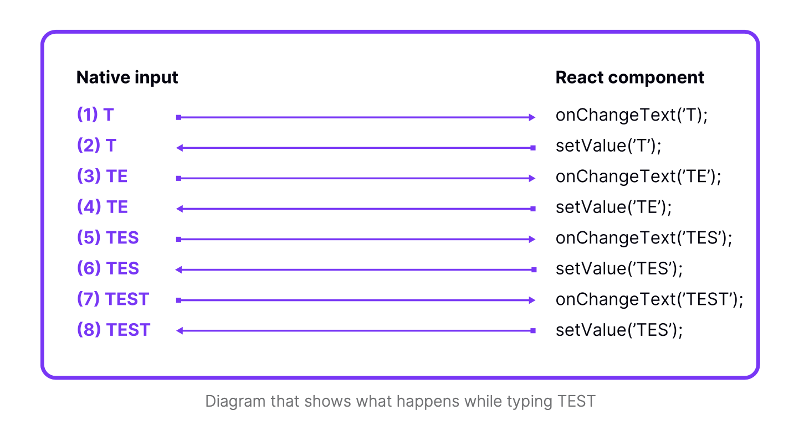

# Skill: Uncontrolled Components

Fix TextInput synchronization and flickering issues by using uncontrolled component pattern.

## Quick Pattern

**Before (controlled - may flicker on legacy arch):**

```jsx
<TextInput value={text} onChangeText={setText} />
```

**After (uncontrolled - native owns state):**

```jsx
<TextInput defaultValue={text} onChangeText={setText} />
```

## When to Use

- TextInput flickers or shows wrong characters during fast typing
- Text input lags behind user input on low-end devices
- Using legacy (non-New Architecture) React Native
- Need maximum input responsiveness

## Prerequisites

- Understanding of React controlled vs uncontrolled components
- TextInput component in use

## Problem Description



The diagram shows what happens when typing "TEST" with a controlled `TextInput`:

1. User types "T" → `onChangeText('T')` fires
2. React calls `setValue('T')` → native updates to "T"
3. User types "E" → `onChangeText('TE')` fires
4. React calls `setValue('TE')` → native updates to "TE"
5. ...continues for each character

**The problem**: Each character requires a round-trip between native and JavaScript. On legacy architecture, if React state update is slow, native may show intermediate states (flicker).

**New Architecture note:** This issue is largely resolved in New Architecture, but uncontrolled pattern still provides best performance.

## Step-by-Step Instructions

### 1. Identify Controlled TextInput

```jsx
// Controlled - value prop syncs state to native
const ControlledInput = () => {
  const [value, setValue] = useState('');
  
  return (
    <TextInput
      value={value}           // This causes sync issues
      onChangeText={setValue}
    />
  );
};
```

### 2. Convert to Uncontrolled

Remove the `value` prop to make it uncontrolled:

```jsx
// Uncontrolled - native owns the state
const UncontrolledInput = () => {
  const [value, setValue] = useState('');
  
  return (
    <TextInput
      defaultValue={value}     // Only sets initial value
      onChangeText={setValue}  // Still updates React state
    />
  );
};
```

### 3. Use Ref for Programmatic Control

If you need to read/set value programmatically:

```jsx
const UncontrolledWithRef = () => {
  const inputRef = useRef(null);
  
  const clearInput = () => {
    inputRef.current?.clear();
  };
  
  const getValue = () => {
    // Use onChangeText to track value, or native methods
  };
  
  return (
    <TextInput
      ref={inputRef}
      defaultValue=""
      onChangeText={(text) => console.log('Current:', text)}
    />
  );
};
```

## Code Examples

### Full Migration Example

**Before (Controlled):**

```jsx
const SearchInput = () => {
  const [query, setQuery] = useState('');
  const [results, setResults] = useState([]);
  
  const handleChange = (text) => {
    setQuery(text);
    fetchResults(text).then(setResults);
  };
  
  return (
    <View>
      <TextInput
        value={query}              // Remove this
        onChangeText={handleChange}
        placeholder="Search..."
      />
      <ResultsList data={results} />
    </View>
  );
};
```

**After (Uncontrolled):**

```jsx
const SearchInput = () => {
  const [query, setQuery] = useState('');
  const [results, setResults] = useState([]);
  
  const handleChange = (text) => {
    setQuery(text);
    fetchResults(text).then(setResults);
  };
  
  return (
    <View>
      <TextInput
        defaultValue=""           // Initial value only
        onChangeText={handleChange}
        placeholder="Search..."
      />
      <ResultsList data={results} />
    </View>
  );
};
```

### When You Need Value Control

For input masking or validation that modifies input:

```jsx
// Option 1: Accept the controlled behavior (may flicker)
const MaskedInput = () => {
  const [value, setValue] = useState('');
  
  const handleChange = (text) => {
    // Phone mask: (123) 456-7890
    const masked = maskPhone(text);
    setValue(masked);
  };
  
  return (
    <TextInput
      value={value}  // Necessary for masking
      onChangeText={handleChange}
    />
  );
};

// Option 2: Use a native masked input library
// react-native-masked-text handles this natively
```

## Decision Matrix

| Scenario | Recommendation |
|----------|---------------|
| Simple text input | Uncontrolled |
| Search/filter input | Uncontrolled |
| Form with validation on submit | Uncontrolled |
| Input masking (phone, credit card) | Controlled or native library |
| Character-by-character validation | Controlled |
| New Architecture app | Either works well |

## Common Pitfalls

- **Forgetting `defaultValue`**: Without it, input starts empty
- **Trying to clear with state**: Use `ref.current.clear()` instead
- **Mixing patterns**: Don't use both `value` and `defaultValue`

## Related Skills

- [js-profile-react.md](./js-profile-react.md) - Profile input performance
- [js-concurrent-react.md](./js-concurrent-react.md) - Defer expensive search operations
