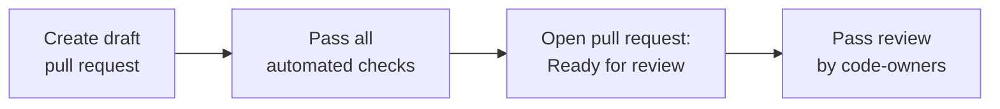

# Contributing to Ledger Wallet

Thanks for contributing! These guidelines apply to internal and external contributors, including agents. Please read fully before opening a pull request.

> [!IMPORTANT]
> For **Ledger Wallet** we are currently accepting bug fixes and invited contributions only. Feature PRs that do not align with our roadmap or long-term goals will be closed without extensive review.

## Getting Started

1. External contributors should fork the repository.
2. Create your branch from `develop`.
3. Follow the [main README](README.md) to get started.
4. Follow additional setup instructions in the README files of the app or lib you are working on.

## Branch & Commit Conventions

### Branch naming

| Prefix | When to use |
|--------|-------------|
| `feat/` | Adding a new feature |
| `bugfix/` | Fixing a bug |
| `support/` | Refactors, tests, CI, tooling improvements |

### Commit messages

We follow [Conventional Commits](https://www.conventionalcommits.org/) and enforce it with [commitlint](https://commitlint.js.org/).

Use `pnpm commit` for an interactive prompt, or `pnpm commitlint --from <target-branch>` to validate your branch.

### Rebase & merge strategy

**Always prefer rebasing** unless your branch contains merge commits from sub-features.

- Small, self-contained branches → rebase on `develop`.
- Branches with cross-branch merges → merge `develop` into them to stay up to date.


## The PR Lifecycle

Open your PR as a **Draft** and pass all automated checks before making it **Ready for Review**.



### Automated checks

Before marking your PR ready for review, ensure all of the following pass:

- **lint, TypeScript** — all linter and type checks must pass.
- **unit tests, e2e** — all tests must be green. See [testing requirements](https://developers.ledger.com/docs/ledger-live/contributing/reference/testing).
- **SonarQube** — a green state is expected: above 80% test coverage and no unhandled code smells. See [SonarQube Guide](docs/contributing/sonarqube-guide.md).
- **Copilot** — request a Copilot review, address or explicitly dismiss every comment, and resolve all threads.

### Code owner review

- Click **"Ready for review"** to convert from Draft — this automatically requests the relevant code owners via `CODEOWNERS`.
- When a reviewer leaves feedback and you push a fix, **re-request their review** (GitHub "Re-request" button).
- If you receive a review request for files you don't own, feel free to uncheck it.


#### Your daily review duty

> [!TIP]
> Check incoming review requests **at least once per day**:
> 👉 [PRs waiting for my review](https://github.com/LedgerHQ/ledger-live/pulls?q=is%3Aopen+is%3Apr+review-requested%3A%40me+sort%3Aupdated-asc+-label%3AHODL+-label%3A%22do+not+review%22+draft%3Afalse)

See [`docs/contributing/pr-review-guide.md`](docs/contributing/pr-review-guide.md) for reviewer guidance.

## Changelogs

We use [changesets](https://github.com/changesets/changesets) for versioning. Run:

```bash
pnpm changeset
```

A changeset is **required** for any user-facing change or library API modification. See the [wiki](https://github.com/LedgerHQ/ledger-live/wiki/Changesets) for the full guide.

## Translations

We use [Smartling](https://www.smartling.com/) for automated translations.

**Only edit the English source files.** Never commit files for other locales.

See the README files of [Ledger Wallet Desktop](apps/ledger-live-desktop) and [Ledger Wallet Mobile](apps/ledger-live-mobile) for the source file paths.

> [!TIP]
> **Tip 1 — Request Copilot while still in Draft**
>
> 

> [!TIP]
> **Tip 2 — Re-request review after pushing fixes**
>
> 

## Developer Portal

Tools and resources for building on Ledger are at the [Ledger Developer Portal](https://developers.ledger.com/).
