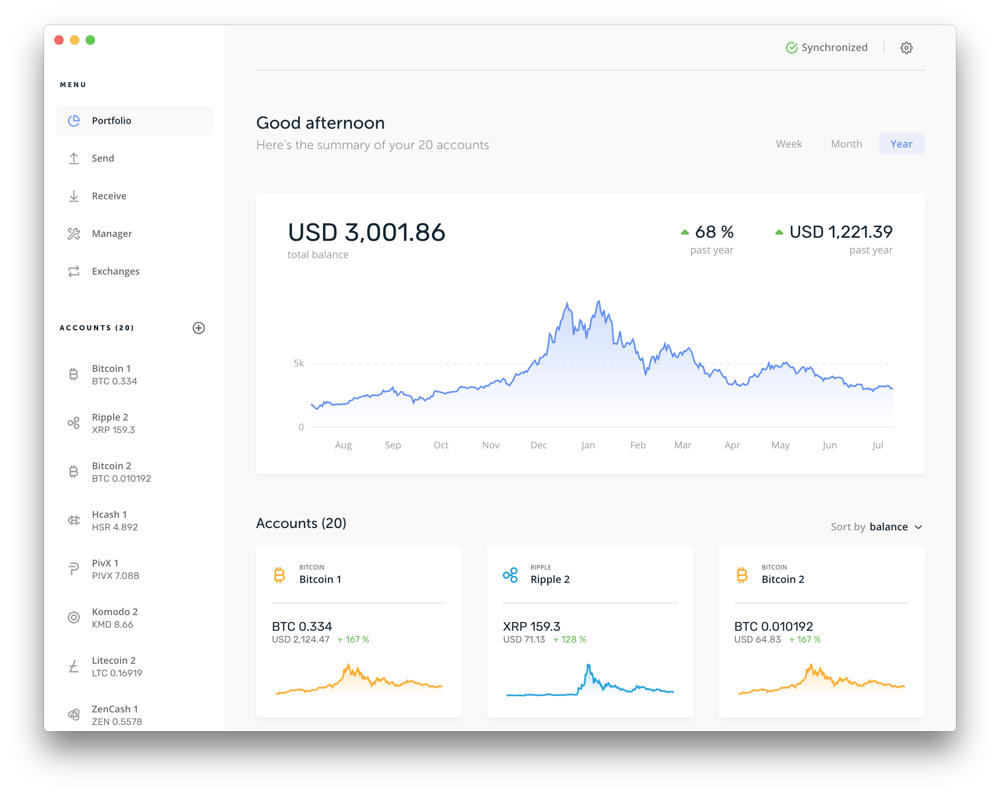

# Ledger Live Desktop

Ledger Live Desktop is the Electron app for Ledger hardware wallets on macOS,
Windows, and Linux. Users can manage crypto assets, install apps on Ledger
devices, update firmware, verify public addresses, and sign transactions.

- Related app: [Ledger Live Mobile](../ledger-live-mobile/README.md)
- Shared business logic: [ledger-live-common](../../libs/ledger-live-common/README.md)
- Download: [ledger.com/ledger-live](https://www.ledger.com/ledger-live/)
- System requirements: [Ledger Support](https://support.ledger.com/hc/en-us/articles/4403310017041-Ledger-Live-system-requirements-?docs=true)

<a href="https://github.com/LedgerHQ/ledger-live-desktop/releases">
  <p align="center">
    
  </p>
</a>

## Architecture

The app is built with Electron, React, Redux, and RxJS. It uses LedgerJS and
shared Ledger Wallet logic to communicate with devices, synchronize accounts,
and prepare transactions.

Main source areas:

| Path                    | Purpose                                                                 |
| ----------------------- | ----------------------------------------------------------------------- |
| `src/main`              | Electron main process                                                   |
| `src/internal`          | Internal worker process for commands and device logic                   |
| `src/renderer`          | React UI, screens, modals, bridges, analytics, i18n, and renderer setup |
| `src/renderer/families` | Per-currency UI logic                                                   |
| `tests`                 | App-local Playwright/component test helpers and specs                   |

Releases are signed, and the updater verifies signatures before applying a new
version. Hash/signature verification details are available on
[live.ledger.tools/lld-signatures](https://live.ledger.tools/lld-signatures).

## Development

Run commands from the repository root.

Use the repo root setup first:

```bash
mise install
pnpm i
```

Linux also needs USB/HID native dependencies:

```bash
sudo apt-get update
sudo apt-get install libudev-dev libusb-1.0-0-dev
```

Common desktop commands:

```bash
pnpm dev:lld
pnpm dev:lld:msw
pnpm build:lld
pnpm desktop test:jest
pnpm desktop lint
pnpm desktop lint:guardrails
pnpm desktop typecheck
```

See the repo-level [common commands](../../docs/common-commands.md) and
[validation guidance](../../docs/validate-before-finishing.md) for maintained
command coverage.

## Watching Dependencies

In another terminal, run the relevant watcher when changing shared packages used
by Desktop:

```bash
pnpm watch:es:common
pnpm watch:es:ljs
pnpm watch:es:coin
pnpm turbo run watch:es --filter="./libs/ledgerjs/packages/hw-app-btc"
pnpm turbo run watch:es --filter="./libs/coin-modules/coin-bitcoin"
```

## Testing

- Jest: `pnpm desktop test:jest`
- App-local Playwright helpers/specs: [tests/README.md](tests/README.md)
- Full Desktop E2E setup and Speculos flows: [../../e2e/desktop/README.md](../../e2e/desktop/README.md)

## Local Notes

Optional debug environment variables can be set in `.env`:

```bash
NO_DEBUG_DB=1
NO_DEBUG_ACTION=1
NO_DEBUG_TAB_KEY=1
NO_DEBUG_NETWORK=1
NO_DEBUG_ANALYTICS=1
NO_DEBUG_WS=1
NO_DEBUG_DEVICE=1
NO_DEBUG_COUNTERVALUES=1
```

Other environment variables are defined in
[libs/env/src/env.ts](../../libs/env/src/env.ts).

Linting uses oxlint for most rules and `pnpm desktop lint:guardrails` for the
remaining ESLint-only security guardrail around external links.

Translations are handled internally. If a translation string is broken, report
it to Ledger support rather than editing localized content directly.

For blockchain integration guidance, use the
[Ledger Developer Portal](https://developers.ledger.com/docs/coin/general-process/).
