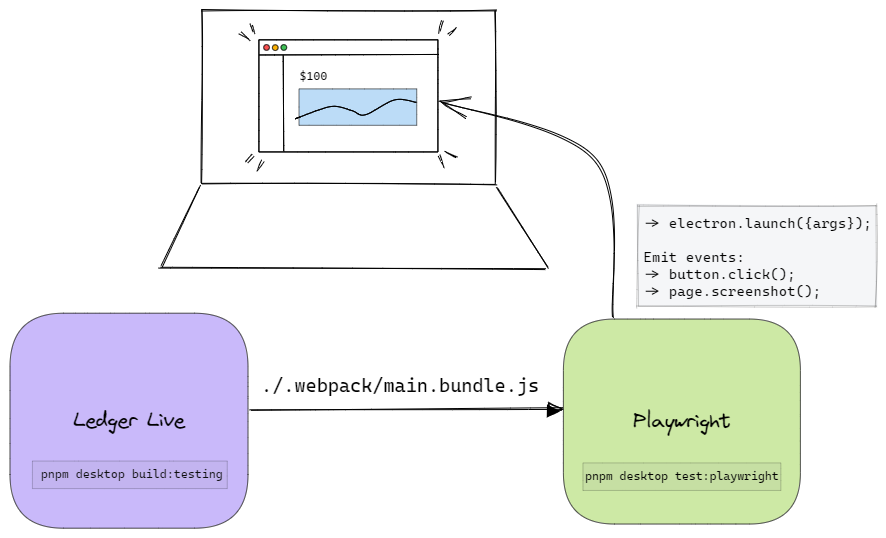
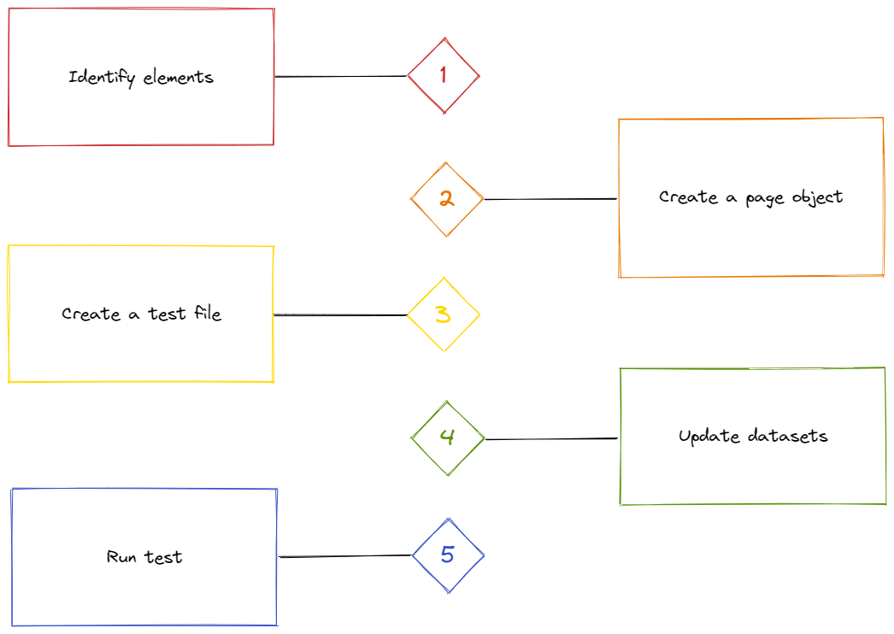
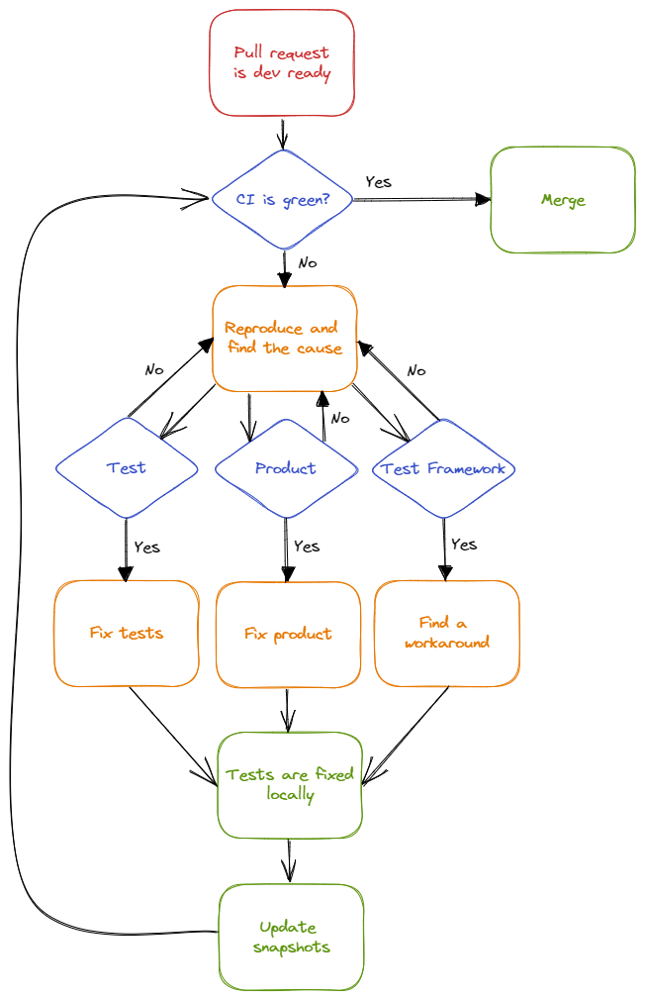

# Table of Contents
- [Introduction](#introduction)
- [Pre-requisites](#pre-requisites)
    - [Visual Studio Code extensions](#visual-studio-code-extensions)
- [Installation](#installation)
- [Setup](#setup)
- [Execution](#execution)
    - [Build](#build)
    - [Run tests](#run-tests)
- [Recorder](#recorder)
- [Development](#development)
    - [Workflow](#workflow)
        - [Step 1 - Identify elements](#step-1---identify-elements)
        - [Step 2 - Create a page object](#step-2---create-a-page-object)
        - [Step 3 - Create a test file](#step-3---create-a-test-file)
        - [Step 4 - Update datasets](#step-4---update-dataset)
        - [Step 5 - Run test](#step-5---run-test)
    - [Playwright API](#playwright-api)
- [Continuous Integration](#continuous-integration)
    - [Workflow](#workflow-1)
    - [Commands](#commands)
- [Debugging](#debugging)
- [Resources](#resources)
    - [Releases](#releases)
    - [Documentation](#documentation)
        - [Code coverage](#code-coverage)

# Introduction

An open source framework for easily writing UI tests for our Electron app. Playwright sets up and tears down your app and allows it to be test-driven remotely. Built on top of Devtools protocol.

# Pre-requisites

> We assume your setup is running [*ledger-live*](https://github.com/LedgerHQ/ledger-live) monorepo or at least *ledger-live-desktop* app.
> If not, please check the [installation guide](https://github.com/LedgerHQ/ledger-live#installation) and the [wiki](https://github.com/LedgerHQ/ledger-live#installation).

## Visual Studio Code extensions
It's recommended to install those extensions.
- [Typescript](https://marketplace.visualstudio.com/items?itemName=ms-vscode.vscode-typescript-next)
- [Prettier](https://marketplace.visualstudio.com/items?itemName=esbenp.prettier-vscode)
- [Playwright Test](https://marketplace.visualstudio.com/items?itemName=ms-playwright.playwright)

# Installation

Clone *ledger-live* repository, install and build dependencies.
```
git clone https://github.com/LedgerHQ/ledger-live.git`
pnpm i --filter="ledger-live-desktop..."`
pnpm build:lld:deps
```

# Setup

Playwright launches Ledger Live application using Electron `executablePath` and pass the main bundle and other options as parameters.

> :information_source: Please have a look at `apps/ledger-live-desktop/tests/fixtures/common.ts` .



# Execution

## Build

Before executing any test, don’t forget to build the app, do it whenever the source code changed.
```
pnpm desktop build:testing
```

> It must generate bundles in `apps/ledger-live-desktop/.webpack/` directory.

## Run tests

Run a single test
```
pnpm desktop test:playwright playwright/specs/<testname>.spec.ts
```
Run all tests in a directory
```
pnpm desktop test:playwright playwright/specs/onboarding/
```
Run all the tests
```
pnpm desktop test:playwright
```
Run all tests matching a tag
```
pnpm desktop test:playwright --grep @onboarding
```

# Recorder

To speed up test development, you can generate tests by recording your actions.
```
pnpm desktop test:playwright:recorder
```

> :warning: Fully recorded tests don’t generate maintainable tests. Please see [Development](#development) section.

# Development

## Workflow



---
### Step 1 - Identify elements

<u>Path:</u> `src/...`

To interact with web elements (buttons, input fields, images, …), they should be identified using a [*data-test-id*](https://playwright.dev/docs/selectors#id-data-testid-data-test-id-data-test-selectors) for unique elements or a [*class*](https://developer.mozilla.org/en-US/docs/Web/CSS/Class_selectors) for multiple elements.

> :information_source: As a convention, this is the pattern we must use: `<context>-<text or purpose>-<element type>`.

*I want to identify the Get started CTA button in onboarding flow.*

Look for your element in `src/renderer/...` and give it a `data-test-id` attribute.

```html
<Button data-test-id=”onboarding-getstarted-button”>
    Get started
</Button>
```

> :x: Don’t use a className in this case because the element is unique.

---

### Step 2 - Create a page object

> :information_source: [Page objects](https://martinfowler.com/bliki/PageObject.html) are [JavaScript classes](https://developer.mozilla.org/en-US/docs/Web/JavaScript/Reference/Classes).

<u>Path:</u> `tests/models/`

A page object regroups all elements you can interact with and all actions you can do in a specific app screen.

*I want to declare get started button element in a page object related to Onboarding.*

Create `tests/models/onboardingPage.js`

**Locators**

Declare your element
```javascript
constructor(page: Page) {
  this.page = page;
  this.getStartedButton = page.locator("data-test-id=onboarding-getstarted-button");
}
```

**Methods**

> :information_source: Please name your methods according to the [Keyword-driven testing](https://en.wikipedia.org/wiki/Keyword-driven_testing) methodology.

Create an action by interacting with declared elements, you can make multiple actions in one method and wait for a specific state if needed.

```javascript
async getStarted() {
  await this.getStartedButton.click();
  await this.loader.waitFor({ state: "detached" });
};
```

> :warning: Don’t write any assertions (with [expect](https://playwright.dev/docs/test-assertions) library) in a page object, make it re-usable by everyone; as an alternative you can use [waitFor](https://playwright.dev/docs/api/class-locator#locator-wait-for) method if you need to have a better control of the app state.

**Example**

At the end, it should look like this:

```javascript
import { Page, Locator } from "@playwright/test";

export class OnboardingPage {
  readonly page: Page;
  readonly getStartedButton: Locator;

  constructor(page: Page) {
    this.page = page;
    this.getStartedButton = page.locator("data-test-id=onboarding-get-started-button");
  }

  async getStarted() {
    await this.getStartedButton.click();
    await this.loader.waitFor({ state: "detached" });
  }
}
```

---

### Step 3 - Create a test file

<u>Path</u>: `tests/specs/`

A test file regroups a series of actions and assertions to build a test scenario.

*I want to create a file to test onboarding flow.*

Create `tests/specs/onboarding/new-device.spec.ts`

```javascript
test("Onboarding with a new device", ({ page }) => {
  const onboardingPage = new OnboardingPage(page);

  await test.step("Get started", async () => {
    await onboardingPage.getStarted();
    await expect(page).toHaveScreenshot('next-page.png')
  });
});
```

Each `test()` declaration will launch a unique electron/chromium session. To understand how tests are executed, please see .

**Matchers**

Playwright uses [expect](https://playwright.dev/docs/test-assertions) library for test assertions;

- on `page` (browser) e.g: `await expect(page).toHaveTitle('Ledger Live');`
- or a `locator` (web element) e.g: `await expect(getStartedButton).toBeEnabled();`

**Visual comparison**

> :information_source: Because of the Ledger Live application architecture (Hardware device, Market variation, Blockchain), we are forced to mock basically everything when automated tests are executed.
>
> To make the most of this test framework, we opted for visual comparison, it permits us to assert the whole layout of the app.

Playwright permits to compare screenshots. This assertion should be used **carefully** to avoid **heavy maintenance**, as example:

*I want to check a button is redirecting me to another page.*

> Don’t use a visual comparison to check that, `await expect(page).toHaveURL(regexp)` is enough. Choose wisely your assertions, sometimes it's too overkill to take a screenshot.
>
> Also, be sure to not create duplicates and compare same screen twice.

*I want to compare exactly the page I’m seeing.*
```javascript
await expect(page).toHaveScreenshot(name);
```

> :information_source: You can take a screenshot of the whole page, including overflowing elements.
> ```javascript
> expect(page.screenshot({ fullPage: true })).toMatchSnapshot(name);
> ```
> :x: This is currently not working with our application, please see [this](https://github.com/microsoft/playwright/issues/11041) issue.

*I want to organize my screenshot set.*
```javascript
await expect(page).toHaveScreenshot([directory, name]);
```

*I want to compare a single element on the page.*
```javascript
await expect(onboardingPage.getStartedButton).toHaveScreenshot();
```

**Example**

At the end, it should look like this:

```javascript
import test from "../../fixtures/common";
import { expect } from "@playwright/test";
import { OnboardingPage } from "../../models/OnboardingPage";

test("Onboarding new device", async ({ page }) => {
  const onboardingPage = new OnboardingPage(page);

  await test.step("Get started", async () => {
    await onboardingPage.getStarted();
    await expect(page).toHaveScreenshot('next-page.png');
  });
});
```

---

### Step 4 - Update dataset

Once tests are written, if you made screenshot comparisons, you will need to generate a new dataset of screenshots.
```
pnpm desktop test:playwright:update-snapshots  app/ledger-live-desktop/tests/specs/onboarding/new-device.spec.ts
```

### Step 5 - Run test

:warning: **Test your test.**

Run it at least 3 times to be sure it's not flaky.

```
pnpm desktop test:playwright app/ledger-live-desktop/tests/specs/onboarding/new-device.spec.ts
```

> :information_source: If you get into troubles, please read [this](https://playwright.dev/docs/test-assertions#page-assertions-to-have-screenshot-1) and [this](https://playwright.dev/docs/test-assertions#locator-assertions-to-have-screenshot-1).

### Playwright API

:note: Here are some resources that might help during a test development.

*I want to interact with the browser.*

https://playwright.dev/docs/api/class-page 

*I want to interact with an element.*

https://playwright.dev/docs/api/class-locator 

*I want to create or update a page object.*

https://playwright.dev/docs/test-pom 

*I want to organize my tests.*

https://playwright.dev/docs/api/class-test 

*I want to perform assertions.*

https://playwright.dev/docs/assertions 

*I want to perform visual comparison.*

https://playwright.dev/docs/test-snapshots 

# Continuous Integration

## Workflow



### Commands
- Generate new screenshots for all test suites

    `/generate-screenshots`

    > This command is meant to be posted as a comment in your pull request.
    >
    > :warning: You might not have the permission to do it.

- Push an empty commit to trigger CI checks
    ```
    git commit -m 'Run CI checks' --allow-empty`
    git push
    ```

# Debugging

*I want to pause my script execution and check manually what’s going on.*

Place `page.pause();` in your test file before the line you want to debug.

*I want to enable the debugger.*

    PWDEBUG=1 pnpm desktop test:playwright

*I want Chrome DevTools.*

    DEV_TOOLS=1 pnpm desktop test:playwright

*I want verbose logging.*

    DEBUG=pw:api pnpm desktop test:playwright

# Resources
## Releases
- [Playwright changelogs](https://github.com/microsoft/playwright/releases)
- [Electron changelogs](https://releases.electronjs.org/)

## Documentation
- [Playwright Documentation](https://playwright.dev/docs/intro)
- [Playwright ⨯ Electron](https://playwright.dev/docs/api/class-electron)
- [Electron Documentation](https://www.electronjs.org/fr/docs/latest)

### Code coverage
- [Documentation](https://playwright.dev/docs/api/class-coverage)
- [Playwright ⨯ Istanbul](https://github.com/mxschmitt/playwright-test-coverage)
