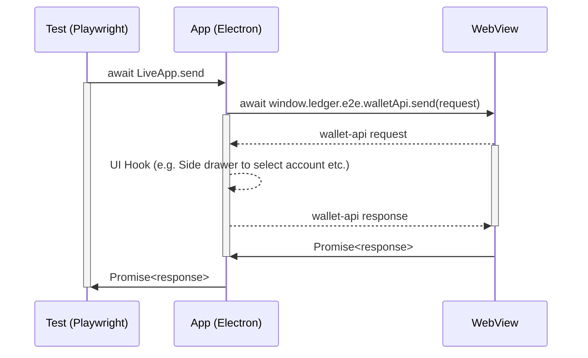
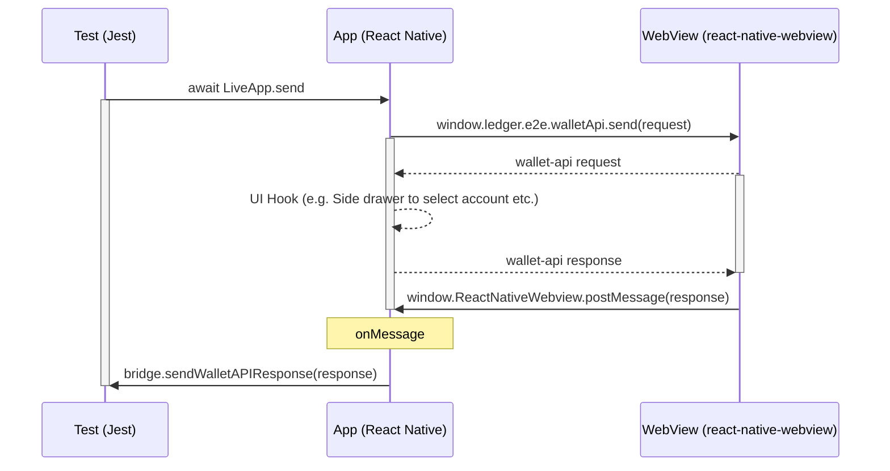

# Dummy Wallet API App

The purpose of this app is to allow automated front end testing of Ledger Live's Wallet API server implementation, and verify that Ledger Live correctly:

- handles the rendering of external Live Apps
- handles calls of the Wallet API client from external Live apps

The app is a simple [Create React App](https://github.com/facebook/create-react-app) which uses the [Wallet API](https://www.npmjs.com/package/@ledgerhq/wallet-api).

## Local Dummy App setup steps

```sh
pnpm i
pnpm --filter="dummy-wallet-app" start # Start development server
```

## Serve production build

```sh
### Setup

pnpm i
pnpm --filter="dummy-wallet-app" build

### Desktop
pnpm build:lld:deps
pnpm desktop build:testing
pnpm desktop test:playwright wallet-api.spec.ts

###  Mobie
pnpm mobile start

### iOS
pnpm build:llm:deps
pnpm mobile e2e:build -c ios.sim.debug
pnpm mobile e2e:test -c ios.sim.debug apps/ledger-live-mobile/e2e/specs/wallet-api.spec.ts

### Android
pnpm build:llm:deps
pnpm mobile e2e:build -c android.emu.debug
pnpm mobile e2e:test -c android.emu.debug apps/ledger-live-mobile/e2e/specs/wallet-api.spec.ts
```

# How does it work?

## Desktop



- `LiveApp.send`: This method turns a JSON-RPC request object into JSON. Then, it calls injected method via [`webview.executeJavaScript`](https://www.electronjs.org/docs/latest/api/webview-tag#webviewexecutejavascriptcode-usergesture). It allows testing engineers to simply await for a response from Live's wallet server and `expect` against the response.
- `window.ledger.e2e.walletApi.send`: This is an injected method in Dummy App to send request to wallet api server. It returns `Promise<response>` on desktop.

### Steps to write a test

First start the local Dummy app at port 3000 by default and check that it can be accessed. Then we load a manifest which corresponds to this live app into the `MOCK_REMOTE_LIVE_MANIFEST` environmental variable (make sure the URL of the live app matches that of the live app, typically `http://localhost:3000`).

```typescript
import { getMockAppManifest } from "PATH/TO/utils/serve-dummy-app";

test.beforeAll(async () => {
  try {
    const port = await server.start("dummy-wallet-app/build");
    const url = `http://localhost:${port}`;
    const response = await request.get(url);
    if (response.ok()) {
      continueTest = true;
      console.info(
        `========> Dummy Wallet API app successfully running on port ${port}! <=========`,
      );
      process.env.MOCK_REMOTE_LIVE_MANIFEST = JSON.stringify(
        server.liveAppManifest({
          id: "dummy-live-app",
          url,
          name: "Dummy Wallet API Live App",
          apiVersion: "2.0.0",
          content: {
            shortDescription: {
              en: "App to test the Wallet API",
            },
            description: {
              en: "App to test the Wallet API with Playwright",
            },
          },
        }),
      );
    } else {
      throw new Error("Ping response != 200, got: " + response.status);
    }
  } catch (error) {
    console.warn(`========> Dummy test app not running! <=========`);
    console.error(error);
  }
});
```

Then in the test we first send the Wallet API method that we want from the live app, perform any actions in Ledger Live, receive the response in the Live app, and verify the response by fulfilling the promise we initiated in the first step:

```typescript
const discoverPage = new DiscoverPage(page);

await test.step("account.request", async () => {
   // previous test steps....

  // generate a random id
   const id = randomUUID();

// send the account.request method and save the promise for later
   const resPromise = discoverPage.send({
     jsonrpc: "2.0",
     id,
     method: "account.request",
     params: {
       currencyIds: ["ethereum", "bitcoin"],
     },
   });

// perform actions in Ledger Live to get the wallet API response
   await drawer.selectCurrency("bitcoin");
   await drawer.selectAccount("bitcoin");

// get the response value that the live app received
   const res = await resPromise;

   // verify the response is as expected
   expect(res).toStrictEqual({
     jsonrpc: "2.0",
     id,
     result: {
       rawAccount: {
         id: "2d23ca2a-069e-579f-b13d-05bc706c7583",
         // etc..
       }
     }
   })
```

### Mobile



- `LiveApp.send`: The same as desktop but uses [`webview.injectJavaScript`](https://github.com/react-native-webview/react-native-webview/blob/master/docs/Reference.md#injectjavascriptstr) instead.
- `window.ledger.e2e.walletApi.send`: This global method behaves differently on mobile. If dummy app finds `window.ReactNativeWebView` which injected by `react-native-webview` module, it does not return a promise but calls `window.ReactNativeWebView.postMessage` method to send response back to App runtime. This message will be catched on `onMessage` handler passed to the webview component. Then, the handler sends the request to Test runtime via E2E bridge(ws) + `e2eBridgeServer` subject.

### Dummy App

`useE2EInjection` injects `window.ledger.e2e.walletApi.send` method.
