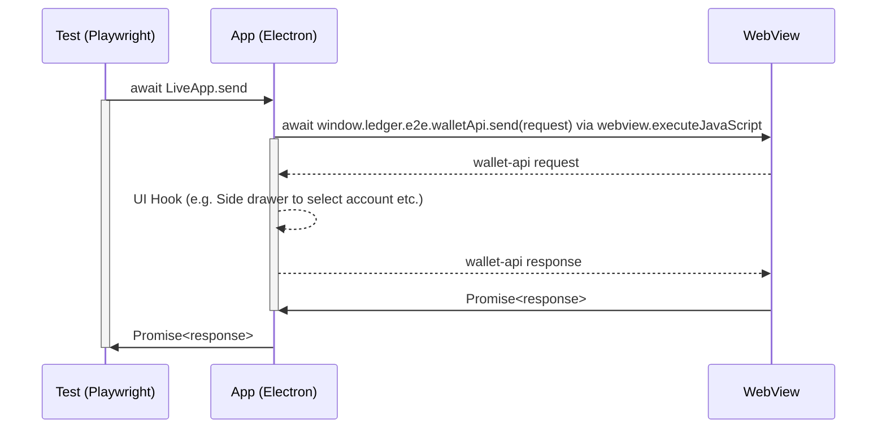
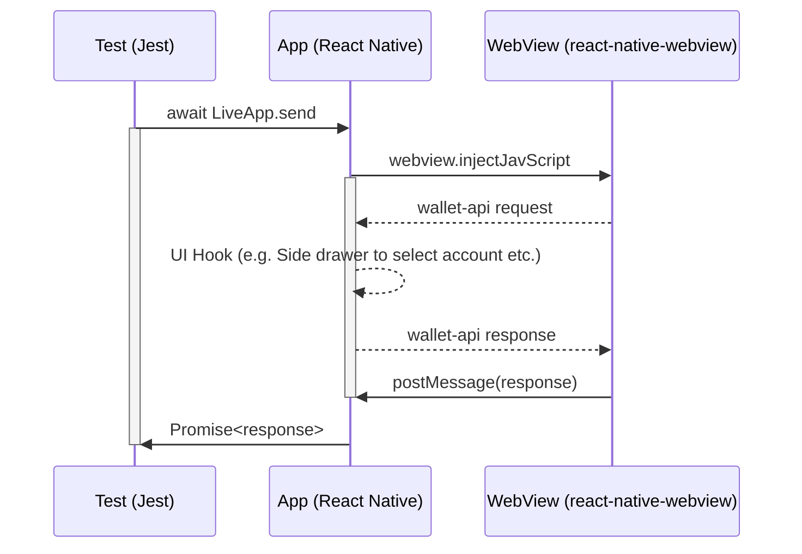

# Dummy App

The purpose of this app is to allow automated front end testing of Ledger Live's Wallet API server implementation, and verify that Ledger Live correctly:

- handles the rendering of external Live Apps
- handles calls of the Wallet API client from external Live apps

The app is a simple [Create React App](https://github.com/facebook/create-react-app) which uses the [Wallet API](https://www.npmjs.com/package/@ledgerhq/wallet-api).## How to run locally for development

## Run dummy app locally

```sh
pnpm i

# Start development server
pnpm --filter="dummy-wallet-app" start

# Create production build
pnpm --filter="dummy-wallet-app" build

# Serve production build
pnpm --filter="dummy-wallet-app" serve
```

## Run E2E test locally

```sh
### Setup

pnpm i
pnpm --filter="dummy-wallet-app" build

### Desktop

pnpm desktop build:testing
pnpm desktop test:playwright wallet-api.spec.ts

### iOS

pnpm mobile e2e:build -c ios.sim.debug
pnpm mobile e2e:test -c ios.sim.debug apps/ledger-live-mobile/e2e/specs/wallet-api.spec.ts

### Android

pnpm mobile e2e:build -c android.emu.debug
pnpm mobile e2e:test -c android.emu.debug apps/ledger-live-mobile/e2e/specs/wallet-api.spec.ts
```

## [WIP] How it works?

### Desktop

#### Loading dummy app in discover catalog

Add manifest json string to `MOCK_REMOTE_LIVE_MANIFEST`.

```typescript
import { getMockAppManifest } from "PATH/TO/utils/serve-dummy-app";

test.beforeAll(async () => {
  process.env.MOCK_REMOTE_LIVE_MANIFEST = JSON.stringify(
    // getMockAppManifest accepts object to override mock values
    getMockAppManifest({
      id: "dummy-app",
      url: "localhost:3000",
      name: "Dummy App",
      apiVersion: "2.0.0",
      content: {
        shortDescription: {
          en: "App to test the Wallet API",
        },
        description: {
          en: "App to test the Wallet API with Playwright",
        },
      },
    }),
  );
});
```



- `LiveApp.send`: This method turns JSON-RPC request object into JSON. Then, it calls injected method via [`webview.executeJavaScript`](https://www.electronjs.org/docs/latest/api/webview-tag#webviewexecutejavascriptcode-usergesture). It allows testing engineers to simply await for a response from Live's wallet server and `expect` against the response.
- `window.ledger.e2e.walletApi.send`: This is an injected method in Dummy App to send request to wallet api server. It returns `Promise<response>`.

### Mobile


