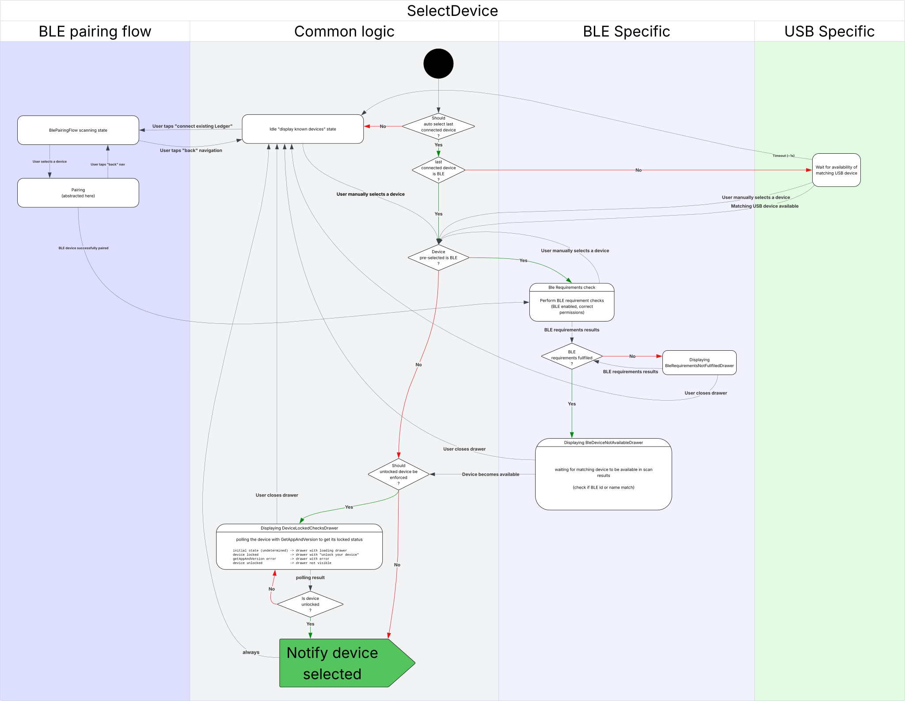

# SelectDevice Component

A device selection component that handles the connection and selection of Ledger hardware devices via USB, Bluetooth (BLE), and proxy connections.

## Overview

It provides a complete user interface for discovering, selecting, and connecting to Ledger devices. It manages the entire device selection flow, including device discovery, Bluetooth requirements checking, device availability verification, and device lock status checking.

## State Diagram

The component implements a complex state machine for device selection.
The following diagram illustrates the flow.
NB: There is some redundancy in the current implementation, it will have to be simplified at some point.

## Device Selection Flow

The component implements a 4-step device selection process:

### Step 1: Selection

A device can be selected in two ways:

1. **Auto-connection** (if `autoSelectLastConnectedDevice` is enabled):

   - **USB devices**: Waits 1200ms for the device to be plugged in. If detected, auto-selects it.
   - **BLE devices**: Automatically selects the last connected device if available.

2. **Manual selection**:
   - **USB devices**: Only appear if plugged in.
   - **BLE devices**:
     - **Known devices state**: Displays previously paired devices for selection.
     - **Pairing state**: Shows all scanned BLE devices for pairing.

### Step 2: First Checks

Once a device is selected:

- **BLE devices**:
  - Checks Bluetooth requirements (enabled, permissions, etc.).
  - Shows a drawer with instructions if requirements aren't met.
  - If the device isn't in the scanned devices list, shows "Power on and unlock your device" drawer.
  - Proceeds when the device appears in the scanned devices list.
- **USB devices**: Proceeds directly to the next step.

### Step 3: Device Locked Check

(Only if `performDeviceLockedCheck` is enabled)

- If the device is locked, shows a drawer with unlock instructions.
- If any other error occurs, shows an error drawer.
- Proceeds when the device is unlocked and ready.

### Step 4: Notification

- Updates Redux store properties:
  - Sets last connected device
  - Marks device as connected
  - Updates known devices (for BLE)
  - Disables read-only mode
- Calls `onSelect` callback to notify the parent component.

## Important Notes

### BLE Scanning Side Effects

This component uses BLE scanning hooks that can only run when Ledger Live Mobile is not communicating with a device. If you need to communicate with a device via BLE while this component is mounted, set `stopBleScanning={true}`.

### Device Locked Check

By default, the component checks if the device is locked before calling `onSelect`.
If it causes issues in a given flow, it can be disables this with `performDeviceLockedCheck={false}`.
