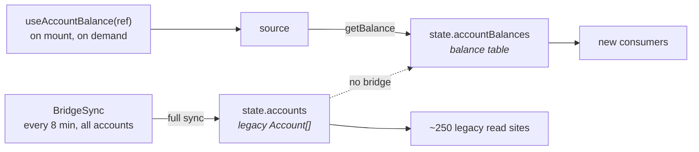
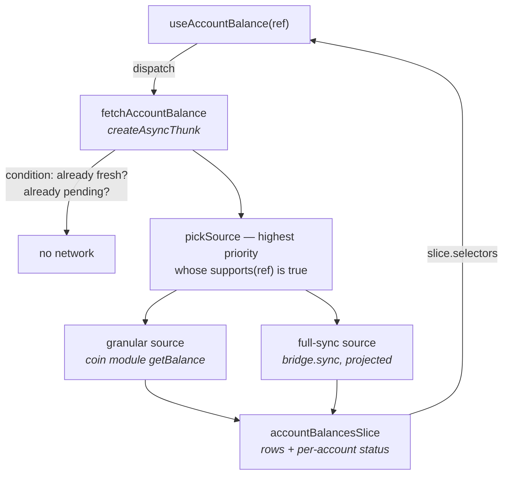
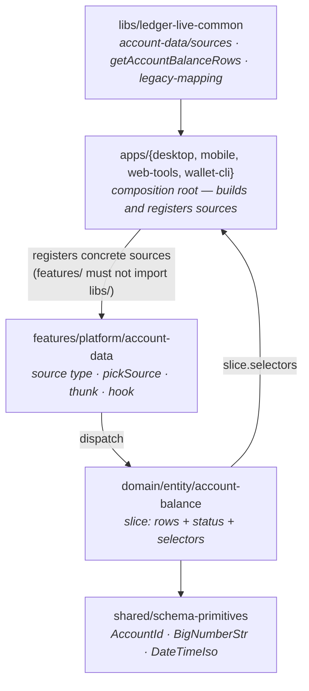

# The account data layer

> [!CAUTION]
> **Status: EXPLORATION** — first slice (`balance`) of the [account domain migration](https://ledgerhq.atlassian.net/wiki/spaces/WXP/pages/7389904957/Account+domain+migration+discovery). Tracked in [LIVE-36765](https://ledgerhq.atlassian.net/browse/LIVE-36765). Nothing here is stable, and no product screen depends on it yet.

This document states **what the API is for** and **how it is meant to be consumed**, before the
design. If you only read one section, read [Purpose](#purpose) and
[How a consumer uses it](#how-a-consumer-uses-it).

---

## Purpose

**One sentence:** let a caller obtain *one piece* of account data without paying for all of it, and
without owning an `Account`.

Today there is exactly one way to obtain any piece of account data: `AccountBridge.sync()`. It takes
a whole `Account` and returns a whole `Account` — core fields, the full operation history, the
balance-history cache, the staking bag, every coin-specific resource bag — as one indivisible unit.
There is no way to express *"I only want the balance"*, and no way to ask at all unless you already
hold the object you are asking about.

Three consequences fall out of that, and they are the three things this layer exists to fix.

| Consequence | What it costs today |
| --- | --- |
| **A read is all-or-nothing.** | Rendering one balance costs an operation history, a token discovery pass and a graph derivation. |
| **A read needs the answer to ask the question.** | You cannot get an account's balance until something else has already synced that account into the store. |
| **Freshness is per account, not per datum.** | A balance and a two-year-old operation page share one `lastSyncDate`, so neither can be refreshed on its own cadence. |

> [!NOTE]
> Two slices exist today: `balance` and `operations`. The second was built specifically to falsify
> the first's design — [what survived and what broke](#the-second-slice-what-survived-and-what-broke).

The second one is the one that actually hurts, and it is why this is an architecture problem rather
than a performance problem. Because a read needs a synced `Account`, every consumer becomes a
consumer of *the whole account store*, and the whole account store becomes a thing that must be
loaded, ordered and awaited before anything renders. That is where the race conditions come from —
not from the network.

**So the goal is not "fewer HTTP calls".** Fewer calls is a side effect. The goal is: **account data
that loads autonomously, on demand, per datum** — so a screen that needs a balance mounts, asks, and
renders, with no dependency on a global sync having happened first.

### What it is not

- **Not a replacement for `BridgeSync`.** `BridgeSync` keeps running, in the background, beside this
  layer and not behind it. See [Accepted trade-offs](#accepted-trade-offs).
- **Not a cache.** The balance table is a store of record: persisted, locally mutated when a pending
  operation lands, and eventually replicated through Ledger Sync. That is why it is an entity slice
  and not an RTK Query cache.
- **Not a coin abstraction.** How cheap a balance read is, is the coin module's business. This layer
  only asks *whether* a module can serve one on its own.

---

## How a consumer uses it

Two teams are the intended first consumers, and they want different halves of it.

### wallet-xp — the portfolio and the account screens

The shape of the win here is **a list of accounts that renders before anything is synced**.

```ts
// features/.../AccountRow.tsx
const { balance, subAccountBalances, status } = useAccountBalance(ref);
```

`ref` is `{ accountId, currencyId, address, derivationMode, parentId? }` — five strings, derivable
from anything the app already holds, including a Ledger Sync descriptor that was never synced.
Mounting the hook is what triggers the read; unmounting stops caring. There is no "sync all
accounts, then render" step in the middle.

> [!IMPORTANT]
> **The graph is not part of the balance.** `AccountRowItem` today renders `<Delta>`, which reads
> `balanceHistoryCache` — a pure function of the *entire* operation history. So on the portfolio row
> as it exists today, asking for a balance still drags in operations. The surfaces that are free of
> that coupling, and therefore the honest first targets, are: `components/AccountsList/AccountRow.tsx`,
> the Ledger Sync device-account list, and the send flow on intent-capable families.

### ptx — asset and account selection

The shape of the win here is **not needing the account store at all**.

The Modular Drawer is the concrete case. `getBalanceAndFiatValueByAssets(accounts, assets,
counterValuesState, targetCurrency)` takes `AccountLike[]` and reads exactly two things off each
account: `balance`, and enough currency identity to price it. It takes the god object because that is
the only thing on offer — the drawer does not want operations, and a swap quote does not want a
balance-history cache.

With the layer, the same screen selects rows out of the balance table:

```ts
const balances = useSelector(state => accountBalancesSlice.selectors.selectAll(state));
```

and stops being blocked on `accountsSelector`. The same argument applies to a max-amount check in a
send or swap flow: `validateIntent` on intent-capable families already takes `Balance[]`, not an
`Account`.

### wallet-cli and web-tools — the proof that it is framework-free

`wallet-cli` has no React and no Redux store, and runs the entity reducer over a local variable.
web-tools `/sync` resolves an incoming Ledger Sync descriptor without a full sync. Both work today
and are the reason the core is a plain function plus a slice, not a React context.

---

## The two worlds, and where the duplication comes from

The review asked for this explicitly: *analyse the current syncs and explain where the duplication
between the two worlds comes from.* Here it is.

### World A — the legacy sync loop

`BridgeSync` (`libs/ledger-live-common/src/bridge/react/BridgeSync.tsx`, 415 lines) is a
priority queue over account ids:

| Trigger | Cadence | Scope |
| --- | --- | --- |
| boot | `SYNC_BOOT_DELAY` = **2 s** | all accounts, shuffled |
| background tick | `SYNC_ALL_INTERVAL` = **8 min** | all accounts, shuffled, only when the queue is idle |
| pending operations | `SYNC_PENDING_INTERVAL` = **10 s** | accounts with a pending op |
| explicit | on demand | `SYNC_ONE_ACCOUNT` / `SYNC_SOME_ACCOUNTS` / `SYNC_ALL_ACCOUNTS` |

with `SYNC_MAX_CONCURRENT` = **4** in flight. Each job runs `bridge.sync(account, syncConfig)` and
writes the result back through `updateAccountWithUpdater`. The unit is the account. There is no unit
below it.

### World B — the coin module API

A family routed through the generic coin framework implements `CoinModuleApi`: `getBalance`,
`listOperations`, `lastBlock`, and friends. These are *independently callable*. `getBalance(context,
address, options)` returns every asset held at an address — native and tokens — in one call, and
needs no `Account`.

### Where they overlap

They are not two independent sync systems. World A **runs on top of** World B for the families it
covers. `genericGetAccountShape` is the adapter, and a single full sync of one account calls:

```
genericGetAccountShape(account)
  ├─ Promise.all
  │   ├─ coinModuleApi.lastBlock(context)
  │   ├─ coinModuleApi.getBalance(context, address, opts)   ← the only call a balance needs
  │   ├─ bridgeApi.getValidators(...)         (staking families)
  │   ├─ bridgeApi.getAccountReadiness(...)   (families that have it)
  │   └─ chain-specific shape
  ├─ getSyncHash(currency, blacklistedTokenIds)
  ├─ paginateOperations(coinModuleApi.listOperations)       ← 1..N pages
  ├─ buildSubAccounts(...)                                  ← a CAL lookup per token held
  └─ bridgeApi.refreshOperations(...)                       (when needed)
```

**So the duplication is not "two systems fetching the same thing".** It is one call —
`getBalance` — buried inside a fan-out of five to N+ calls that the caller did not ask for, executed
on a fixed 8-minute cadence whether or not anything is on screen, and reachable only through an
object the caller must already own.

Which gives the honest statement of the problem:

> A balance is already one HTTP call away, for 16 families. It is the *packaging* that costs — the
> `Account` in, the `Account` out, and the 8-minute loop that is the only thing allowed to call it.

That is why the fix is a layer that calls `getBalance` directly, and not a faster `BridgeSync`.

### And the duplication this layer *introduces*

Running both is genuinely more calls, not fewer, for as long as the old screens exist:



An account visible on an old screen *and* on a new one is read twice, and the two tables' freshness
diverges. This is [accepted](#accepted-trade-offs), on purpose, and it is the price of not having a
writer race.

---

## The legacy bridge: how legacy is it, really?

The review's question, restated: *we run hybrid for a long time — so calling one source "legacy" and
the other "new" may be wishful thinking. Which is it?*

Straight answers:

**1. Is the legacy source a temporary shim?** No. It is a permanent-until-proven-otherwise fallback.
16 families implement `CoinModuleApi`; only 6 are routed through it by
`genericCoinFrameworkFamilies.json`; and several families (UTXO chains in particular) have no
plausible independent balance read at all — a bitcoin balance *is* a walk of the UTXO set, which is
the sync. For those, "legacy" is not a stage, it is the correct implementation.

**2. Then is "legacy vs new" the right axis?** No — and this is the useful correction. The axis that
matters is **"can this source produce a balance without producing everything else?"**. That is a
per-family, per-datum property, not a per-era one. The word `legacy` in `legacyBridgeSource` names
where the code lives, not how long it lives. A more honest name for the two sources is
`granular` / `full-sync`, and the doc uses those from here on.

**3. Does the fallback cost more than today?** No. The fallback path *is* today's path — the same
`bridge.sync()`, projected onto balance rows. A screen on a non-granular family pays exactly what it
pays now. The layer's guarantee is *never worse*, and *cheaper where the module allows it*.

**4. When does the full-sync source go away?** When every family a user can hold declares a granular
balance capability, which is not a date anyone should promise. The source is removed by deleting a
registration, not by a migration — that is the entire reason sources are registered at the
composition root.

**5. Does "implements `CoinModuleApi`" mean "can serve a balance independently"?** **No**, and this
is the trap. `coin-tron`'s `getBalance` is a single `GET /v1/accounts/{address}` that already carries
TRC10 and TRC20 holdings. `coin-evm`'s also has to discover which token contracts the address holds,
so it is not a 1:1 chain call. Both are correct; they are not the same cost. Only the module knows,
which is why the capability must be **declared by the source**, not inferred by the wallet from a
family boolean — and why the three divergent hardcoded "families with the new API" lists in this repo
are a symptom, not an implementation detail.

---

## The design

After the 2026-09-04 review, deliberately small. Two concepts, not seven.



| Concept | What it is |
| --- | --- |
| **source** | `{ id, priority, supports(ref), getBalances(ref, signal) }`. Declares *whether* it can serve this ref, and how cheaply, by its priority. Registered at the app composition root; never imported by a screen. |
| **slice** | `@domain/entity-account-balance`. The rows, the status, and — per RTK 2 — the selectors, all in one place. |

Everything else that was in the exploration is gone: no `deliveries` set, no set-cover router, no
scheduler, no reference-counted demand, no polling, no store mirror, no host adapter, no React
context. Freshness and de-duplication are the thunk's `condition`, reading the state that is already
there.

**Source selection is one rule:** highest priority whose `supports(ref)` is true — *new world first
when available*, full-sync otherwise. There is no plan, no cover, no pruning.

### Where the code lives



Two placements follow from review decisions:

- **Selectors live in the slice**, through RTK 2's `createSlice({ selectors })` + `getSelectors`, not
  in a separate file typed against an app-wide state contract.
- **Legacy mappers live in live-common**, not in the entity. `@domain/entity-account-balance` must
  not know what an `Account` is; a shared legacy-mapping lib in `libs/ledger-live-common` owns the
  `Account → AccountBalance[]` projection, and owns it for the next entity too.
- **The two concrete sources live in live-common too** (`account-data/sources`), for the same
  reason and one more: they are built from the coin layer, and three hand-written copies of the same
  twenty lines is how the family gate diverges. A host passes only its store accessors.

---

## The second slice: what survived, and what broke

[LIVE-36923](https://ledgerhq.atlassian.net/browse/LIVE-36923) asked for a second datum
specifically to break the design if the design was wrong, and picked `operations` because it is the
one with real unknowns. Its deliverable was: *either the shape survives a non-cheap slice unchanged,
or the place it breaks.* Both happened. Here is the split.

### What survived unchanged

| | |
| --- | --- |
| `AccountRef` | The same five strings. A history read needs no more identity than a balance read. |
| `pickSource` | One generic type parameter, zero logic change — selection reads `supports` and `priority`, neither of which knows what is being read. |
| Registration | A second module-level list. Same call shape, same composition-root ownership. |
| Entity per datum | Slice owns rows, status and selectors; `getSelectors()` still lets wallet-cli run it over a local variable. |
| Plain function + plain thunk | `readAccountOperations` works with no store, exactly as `readAccountBalances` does. |
| Legacy mappers in live-common | A second mapper, same folder, same argument. |

### Where it broke

**1. One source type does not generalize.** `getBalances(ref)` and `getOperations(ref, query)` differ
in arity, in return shape and in whether a cursor means anything. Widening one type to cover both is
the `capabilities` set this exploration deleted. Two source types and two registries is the smaller
price.

**2. Freshness moved off the data.** A balance row's `at` *is* its freshness. An operation's `date`
is when it happened, which says nothing about when we last looked for newer ones. So the operations
entry carries `at` on the **account**, not on the row — the balance slice's rule does not transfer.

**3. One `maxAge` guard is not enough.** "Is the head stale?" and "is there more below?" are
different questions. A user scrolling to the bottom of a history is always inside any sensible
max-age window, so a freshness-guarded "load more" would return a page it already has. Two thunks:
`fetchAccountOperations` (freshness-guarded) and `fetchMoreAccountOperations` (cursor-guarded, and
deliberately not freshness-guarded).

**4. Replace and merge are both needed.** The balance reducer replaces an account's rows atomically,
which is the only correct thing for a set a chain reports by omission. A history needs both: a head
read **replaces** the window (a merge would keep operations a reorg has since dropped), a page read
**appends** and deduplicates (a paginated source can repeat a boundary operation).

**5. The two sources stopped being interchangeable.** A bridge sync has no notion of a page: it
returns the whole history or nothing. The source declares `paginated: false`, and the layer must not
hand it a cursor another source issued. "Load more" on a full-sync family is not slow — it does not
exist, because the first read already returned everything.

**6. `operationsCount` is not knowable from a page.** The full sync can report a total because it
holds everything; a paginated read cannot, and reporting the page size would turn every
"N transactions" label into a lie. `selectAccountOperationsTotal` returns `undefined` on a partial
window, and every consumer has to handle it. **This is a real behaviour change from
`account.operationsCount`, which ~88 call sites read today.**

**7. A per-datum entity leaks.** An operation row needs `assetId` to render its amount. The balance
entity already holds one per account, but deriving it would mean either decoding a token account id —
which cannot be decoded — or joining against the balance table, which makes a history unrenderable
until a balance has been read. The field is duplicated onto the row, deliberately: independent
loadability is the point of the slicing, and a mandatory cross-slice dependency would defeat it.

**8. The granular path has to fan token operations out by hand.** A module's `listOperations` reports
against the *address*, token transfers included, while the full sync gets the split from
`inferSubOperations`. Without `encodeTokenAccountId` in the granular reader, every token account's
history comes back empty on one source and full on the other. Fixed here — and it is the concrete
shape of the parity risk that made wallet-cli disable the granular path in the first place.

### Parity is still unproven, and the gate says so

`granularOperationFamilies` defaults to **empty**: every family reads its history through the full
sync, in both wallets and in wallet-cli. A balance is one number that is either right or wrong; a
history is a set, and a source that silently omits from it is worse than one that is slow. web-tools
turns the granular path on — it is a developer playground whose job is to make the difference
observable.

So the two data have different gates, read from different places, and **a family being granular for
`balance` says nothing about `operations`**. That per-datum, per-family asymmetry is the strongest
argument this exercise has produced for slicing at all.

### The graph, and why it is a third slice

The open question was: the portfolio graph is derived client-side from the full history, so
*"don't load operations"* and *"show the graph"* pull opposite ways. Reading
`generateHistoryFromOperationsG` settles it, and the answer is better than expected.

The derivation walks **backwards from the current balance**, subtracting each operation's amount, and
stops at `maxDatapoints`:

| Granularity | Datapoints | Operations it actually needs |
| --- | --- | --- |
| `HOUR` | 8 × 24 | the last **week** |
| `DAY` | 400 | the last **~13 months** |
| `WEEK` | 1000 | ~19 years — effectively everything |

So the graph does not need "all operations". It needs operations back to a **horizon set by the
granularity**, which is exactly expressible as *page until the oldest loaded operation is older than
X* — a loop over `fetchMoreAccountOperations` with a stop condition, not a new capability. Only the
`WEEK` series genuinely needs the whole history, and it is also the one whose oldest points move
least.

That makes `balanceHistory` a **derived** slice whose input is bounded, rather than a reason to keep
loading everything. It takes the current balance (slice one) and a bounded window of operations
(slice two) — which is the first time in this exploration that two slices compose into a third.

---

## Accepted trade-offs

Settled in review — recorded here so they are not relitigated.

| Trade-off | Why it is accepted |
| --- | --- |
| The legacy account table duplicates the calls, and freshness diverges between the two worlds. | The alternative is a second writer racing `BridgeSync` for the account store. Avoiding race conditions is the point of the exercise; duplicated reads are cheaper than that. |
| `BridgeSync` keeps syncing in the background **beside** the layer, not behind it. | Putting it behind means owning it, and owning it means migrating ~250 legacy read sites before anything ships. |
| Network calls rise while old screens still full-sync. | Temporary and bounded: reads are triggered on demand, there is **no polling**, and the rise ends as surfaces move over. |

---

## Open ends

- **No product screen consumes the table yet.** The devtool and web-tools `/sync` are the only
  readers. Until a real surface does, the win is architectural, not measured.
- **Operations parity is still unproven**, and the gate reflects it: every family reads its history
  through the full sync in both wallets. See
  [the second slice](#the-second-slice-what-survived-and-what-broke).
- **`operationsCount` has ~88 read sites** that assume a number always exists. A paginated history
  cannot always give one, so those sites need a decision before any of them moves over.
- **A token account's balance is not independently readable.** One chain call returns every asset at
  an *address*, so a token row arrives with its parent's read. Sources take the main-account ref.
- **`AccountId` is an unbranded string outside this branch.** Branding it repo-wide needs Coin team
  alignment — [LIVE-36922](https://ledgerhq.atlassian.net/browse/LIVE-36922).
- **Amount validation is strict.** Balance amounts are non-negative integers in the asset's smallest
  unit; an account carrying anything else fails projection, for that account only.
