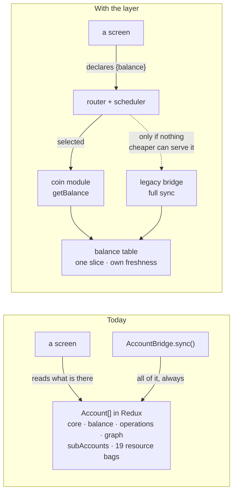
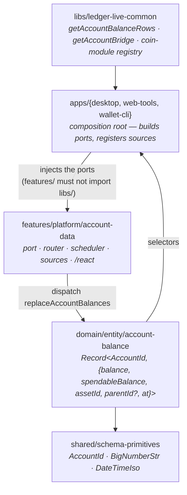
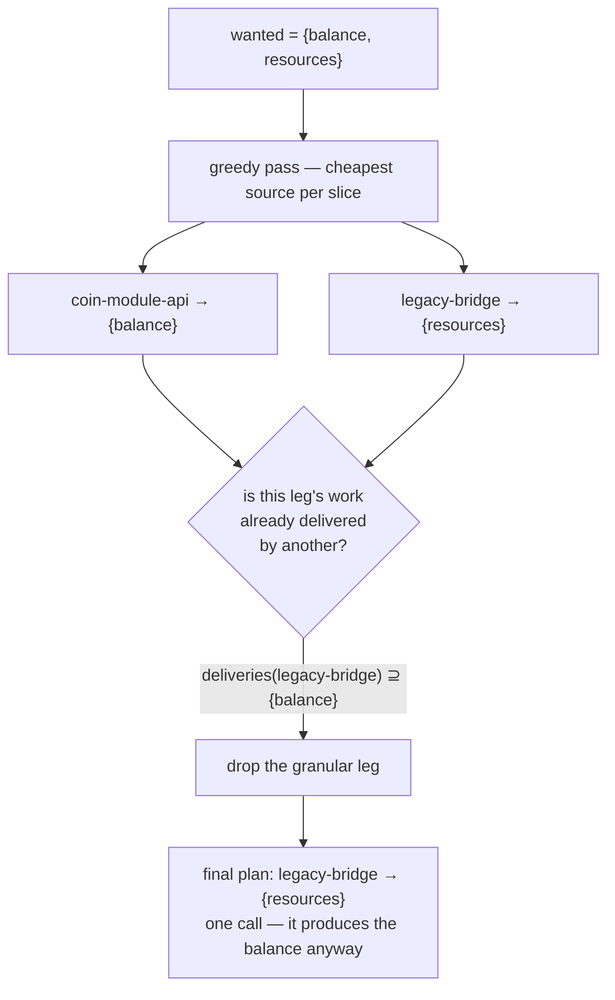
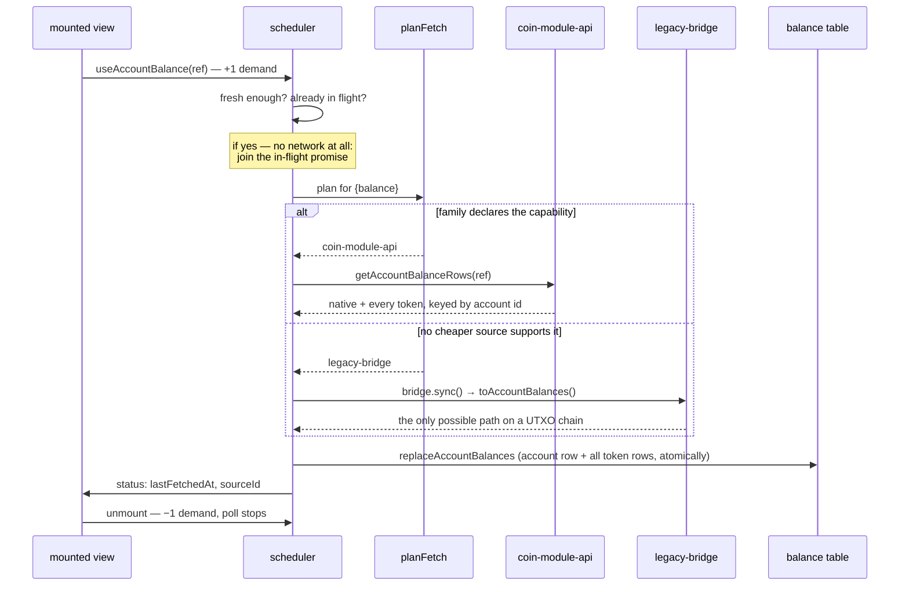

# The account data layer

> [!CAUTION]
> **Status: UNSTABLE** — First slice (`balance`) of the [account domain migration](https://ledgerhq.atlassian.net/wiki/spaces/WXP/pages/7389904957/Account+domain+migration+discovery) (LIVE-32095). The API is still being designed.

Today there is exactly one way to obtain any piece of account data: `AccountBridge.sync()`, which
returns a whole `Account` — core fields, the full operation history, the balance-history cache, every
coin-specific resource bag — as one indivisible unit. `sync(initialAccount, syncConfig)` cannot
express "I only want the balance", and requires a full `Account` to ask for an update to one.

This layer lets a screen ask for **one slice**, and routes each slice to the cheapest source that can
serve it.

## The inversion

The arrow that changes direction is the one at the top: the app stops syncing everything and letting
the UI read the leftovers; the UI states its need and the framework satisfies the minimum.

## Seven new words

Read in order — each only uses the ones above it.

| Word                | What it is                                                                                                                              |
| ------------------- | --------------------------------------------------------------------------------------------------------------------------------------- |
| `AccountSlice`      | The unit of demand: `core`, `balance`, `operations`, `balanceHistory`, `staking`, `resources`. All six declared, only `balance` served. |
| `AccountRef`        | `{ accountId, currencyId, address, derivationMode, parentId? }` — all strings. Address-oriented, so a read needs no `Account`.          |
| `AccountDataSource` | One way of obtaining data. Registered at the app composition root; never imported by a screen.                                          |
| `capabilities`      | Slices a source serves **independently** — asking for one does not pay for the others.                                                  |
| `deliveries`        | Slices a source emits **anyway**, whatever was asked. Always a superset of `capabilities`.                                              |
| `planFetch`         | The router. A capability set-cover that subtracts _deliveries_, then prunes redundant legs.                                             |
| `scheduler`         | Freshness per `(account, slice)`, coalescing, concurrency bound, reference-counted demand.                                              |
| `port`              | Why sources are injected: `features/` may not import `libs/`, so each app builds the concrete source.                                   |

## Where the code lives

That single inversion — sources built at the top, injected downward — is the entire reason the `port`
concept exists, and it is what makes the same layer usable from a React app _and_ from a Bun CLI with
no Redux store.

**Why not RTK Query?** The coin modules own their transport, so there is no `baseQuery` to hang
endpoints on. And the balance table is a store of record: persisted, locally mutated once pending
operations land, replicated through Ledger Sync. An RTK Query cache models none of that.

## The load-bearing distinction

`capabilities` and `deliveries` look redundant. Everything the router does correctly, it does because
they are separate sets.

|                   | `capabilities`           | `deliveries`                      |
| ----------------- | ------------------------ | --------------------------------- |
| `coin-module-api` | `{balance}`              | `{balance}`                       |
| `legacy-bridge`   | **∅** — never _selected_ | `{balance}` (and the rest, later) |

An empty capability set means the legacy source can produce anything but never cheaply, so the router
only ever reaches it to cover a remainder. Non-empty deliveries mean the router knows one run of it
satisfies several wants at once:

> [!IMPORTANT]
> **Asking for a family resource bag silently opts you back into the full sync; asking only for a
> balance does not.** A screen that asks for more than it needs pays for more than it needs. Which is
> why the compatibility selectors must stay visibly a fallback, not a comfortable default.

Subtract deliveries, not the slices a source was picked for. That is the whole trick —
[`router.ts`](../features/platform/account-data/src/router.ts).

## A request, end to end

The two gates before the plan are where a portfolio's forty rows become forty cheap reads rather than
forty syncs. `replaceAccountBalances` is atomic over an account _and_ all its token rows because
chains report a token swept to zero by **omitting** it — a plain upsert would freeze that row at its
pre-sweep value forever.

## Wired in four places

| Surface                 | What it does now                                                                                                                  | What it proves                                                                                             |
| ----------------------- | --------------------------------------------------------------------------------------------------------------------------------- | ---------------------------------------------------------------------------------------------------------- |
| web-tools · Ledger Sync | Resolving an incoming descriptor no longer runs a full `bridge.sync()` — a balance-only bridge answers with a `{balance}` request | `descriptorToAccount` already rebuilds every other field with no network; the sync was paid for one number |
| web-tools · `/sync`     | Balance first, with `served by coin-module-api` / `legacy-bridge` and the token rows; full sync is a button                       | Makes the routing decision observable                                                                      |
| wallet-cli · `balances` | The hardcoded `coinFrameworkFamilies` set is gone; the router decides. Output unchanged                                           | No React, no store — the entity reducer runs over a local variable. The core is framework-free             |
| desktop                 | Reducer mounted, both sources registered, balances mirrored from the legacy account store                                         | Adoption is not a rewrite: `accountsSelector` and the ~250 sites behind it keep working                    |

**Capability is not the same as implementation.** 16 families implement `CoinModuleApi`
(canton, cardano, celo, cosmos, evm, hypercore, kaspa, multiversx, near, solana, stacks, stellar,
tezos, tron, vechain, xrp); only 6 are routed through it by
`genericCoinFrameworkFamilies.json`. Ten have a working `getBalance` the wallet never calls.

## What is not true yet

> [!WARNING]
> **On EVM, a granular balance read still fetches the whole transaction history** — not through the
> full sync, but inside `getBalance` itself.
> [`coin-evm/src/logic/getBalance.ts`](../libs/coin-modules/coin-evm/src/logic/getBalance.ts) calls
> `explorerApi.getOperations(config, currencyId, address, 0)` to discover which token contracts the
> address has touched, and the Ledger explorer client paginates recursively to the end.
>
> So an EVM balance costs: one `eth_getBalance`, one `getStakes`, **the entire history of the
> address**, then one `balanceOf` per contract. On a very active address it does not complete in a UI
> timeframe.

The generalisable lesson: **"implements `CoinModuleApi`" does not mean "can serve a balance
independently."** Only the module knows — which is why `capabilities` must be declared by the module
rather than inferred by the wallet from a family boolean. It also sharpens the backend ask: a
_tokens-held_ endpoint would fix EVM outright.

Contrast [`coin-tron/src/logic/getBalance.ts`](../libs/coin-modules/coin-tron/src/logic/getBalance.ts),
which is one `GET /v1/accounts/{address}` returning native + TRC10 + TRC20 inline, with no history
call at all. Tron is the family to demo the win on.

Two more open ends:

- **The graph sits next to the balance.** `AccountRowItem` renders `<Delta>`, which pulls
  `balanceHistoryCache` → `generateHistoryFromOperations`. The portfolio graph is a pure function of
  the entire operation history, so on most product surfaces asking for a balance drags in
  operations. Surfaces without that coupling today: `components/AccountsList/AccountRow.tsx`, the
  Ledger Sync devtool, and the send flow on intent-capable families (`validateIntent` takes
  `Balance[]`, not an `Account`).
- **`BridgeSync` still polls everything.** The scheduler sits _beside_ it, not in front. A
  balance-only screen adds no cost but does not remove the background sync either.
- **Operations parity is unproven** — wallet-cli disabled coin-framework `getOperations` for every
  family. This is the argument for per-slice capabilities: take the balance win now, leave
  `operations` on the bridge, same family, no contradiction.

## Adding a slice

1. Add the `SliceUpdate` variant in [`port.ts`](../features/platform/account-data/src/port.ts).
2. Add it to a source's `deliveries` (and `capabilities` if it is independently servable).
3. Add the entity package and dispatch it from the scheduler.

The routing does not change — that is the point of declaring the full `AccountSlice` vocabulary up
front. Every source runs the shared conformance suite,
[`sourceRequirements.ts`](../features/platform/account-data/src/sourceRequirements.ts).
