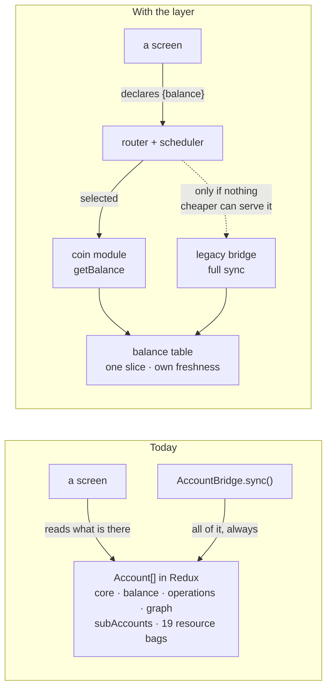
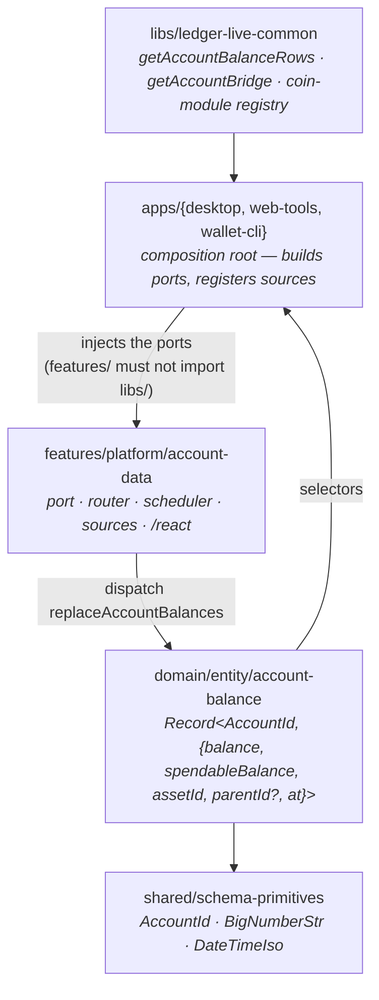
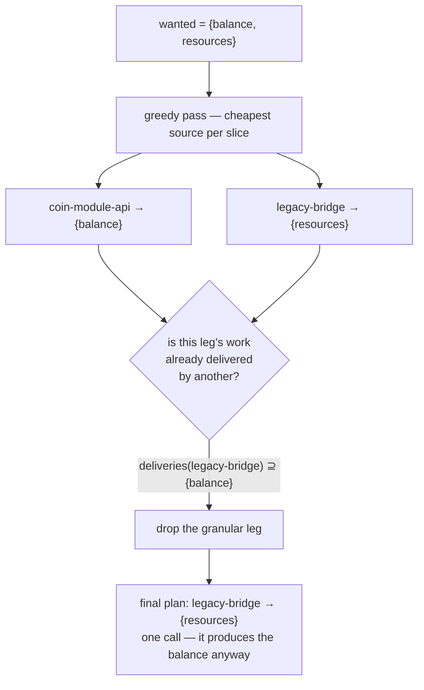
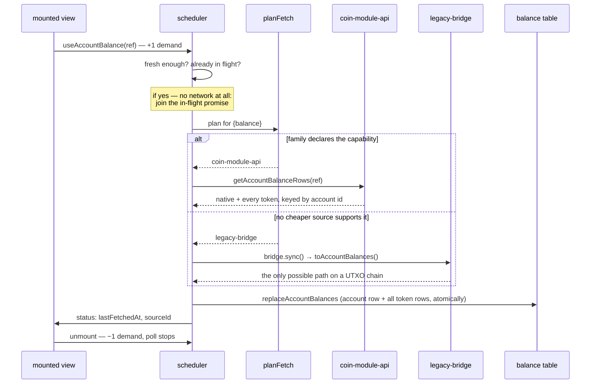

# The account data layer

> [!CAUTION]
> **Status: UNSTABLE** — First slice (`balance`) of the [account domain migration](https://ledgerhq.atlassian.net/wiki/spaces/WXP/pages/7389904957/Account+domain+migration+discovery) (LIVE-32095). The API is still being designed.

Today there is exactly one way to obtain any piece of account data: `AccountBridge.sync()`, which
returns a whole `Account` — core fields, the full operation history, the balance-history cache, every
coin-specific resource bag — as one indivisible unit. `sync(initialAccount, syncConfig)` cannot
express "I only want the balance", and requires a full `Account` to ask for an update to one.

This layer lets a screen ask for **one slice**, and routes each slice to the cheapest source that can
serve it.

> [!TIP]
> **To see it: Desktop → DevTools → Debugging → _Account Balances_.** `Read balance` forces a
> round-trip; `Read all` respects freshness — the reads it _skips_ are the interesting part. No
> device needed: web-tools `/sync`, paste `tron:T…`.

## The inversion



The arrow that changes direction is the one at the top: the app stops syncing everything and letting
the UI read the leftovers; the UI states its need and the framework satisfies the minimum.

## Seven new words

Read in order — each only uses the ones above it.

| Word                | What it is                                                                                                                              |
| ------------------- | --------------------------------------------------------------------------------------------------------------------------------------- |
| `AccountSlice`      | The unit of demand: `core`, `balance`, `operations`, `balanceHistory`, `staking`, `resources`. All six declared, only `balance` served. |
| `AccountRef`        | `{ accountId, currencyId, address, derivationMode, parentId? }` — all strings. Address-oriented, so a read needs no `Account`.          |
| `AccountDataSource` | One way of obtaining data. Registered at the app composition root; never imported by a screen.                                          |
| `capabilities`      | Slices a source serves **independently** — asking for one does not pay for the others.                                                  |
| `deliveries`        | Slices a source emits **anyway**, whatever was asked. Always a superset of `capabilities`.                                              |
| `planFetch`         | The router. A capability set-cover that subtracts _deliveries_, then prunes redundant legs.                                             |
| `scheduler`         | Freshness per `(account, slice)`, coalescing, concurrency bound, reference-counted demand.                                              |
| `port`              | Why sources are injected: `features/` may not import `libs/`, so each app builds the concrete source.                                   |

## Where the code lives



That single inversion — the concrete coin layer reaching the port from above — is the entire reason
the `port` concept exists, and it is what makes the same layer usable from a React app _and_ from a
Bun CLI with no Redux store.

### One host adapter per app, not one source set per app

An app does not hand-write its sources. It implements `AccountDataHost` — four functions — and
`createDefaultAccountDataSources(host)` builds both sources from it:

```ts
const host: AccountDataHost = {
  granularFamilies: getEnabledGenericCoinFrameworkFamilies, // read, never copied
  familyOf: id => findCryptoCurrencyById(id)?.family,
  readAssetBalances: ref => getAccountBalanceRows(ref), // shared, family-agnostic
  syncAccountBalances: ref => /* this app's full sync */,
};
```

This is not about brevity. The **capability decision** — which families can serve a balance on their
own — has to exist in exactly one place per app, read from a shared gate. Four apps each writing their
own `capabilities` callback is precisely how this repo ended up with three divergent "families with
the new API" lists. `mirrorLegacyAccountBalances`, `accountRefOf` and the full-sync
projection are shared for the same reason; only the store access genuinely differs per host.

The devtool obeys the rule from the other side: `@devtools/account-balances` imports no
`@devtools/*` package and reaches no app internals. Its props come from
`useAccountBalancesToolProps` in `@devtools/bindings` — the sanctioned bridge — and the host supplies
only what it alone knows, its accounts shaped as `AccountRef`s.

**Why not RTK Query?** The coin modules own their transport, so there is no `baseQuery` to hang
endpoints on. And the balance table is a store of record: persisted, locally mutated once pending
operations land, replicated through Ledger Sync. An RTK Query cache models none of that.

## The load-bearing distinction

`capabilities` and `deliveries` look redundant. Everything the router does correctly, it does because
they are separate sets.

|                   | `capabilities`           | `deliveries`                      |
| ----------------- | ------------------------ | --------------------------------- |
| `coin-module-api` | `{balance}`              | `{balance}`                       |
| `legacy-bridge`   | **∅** — never _selected_ | `{balance}` (and the rest, later) |

An empty capability set means the legacy source can produce anything but never cheaply, so the router
only ever reaches it to cover a remainder. Non-empty deliveries mean the router knows one run of it
satisfies several wants at once:



> [!IMPORTANT]
> **Asking for a family resource bag silently opts you back into the full sync; asking only for a
> balance does not.** A screen that asks for more than it needs pays for more than it needs. Which is
> why the compatibility selectors must stay visibly a fallback, not a comfortable default.

Subtract deliveries, not the slices a source was picked for. That is the whole trick —
[`router.ts`](../features/platform/account-data/src/router.ts).

## A request, end to end



The two gates before the plan are where a portfolio's forty rows become forty cheap reads rather than
forty syncs. `replaceAccountBalances` is atomic over an account _and_ all its token rows because
chains report a token swept to zero by **omitting** it — a plain upsert would freeze that row at its
pre-sweep value forever.

## Wired in six places

| Surface                 | What it does now                                                                                                                  | What it proves                                                                                             |
| ----------------------- | --------------------------------------------------------------------------------------------------------------------------------- | ---------------------------------------------------------------------------------------------------------- |
| web-tools · Ledger Sync | Resolving an incoming descriptor no longer runs a full `bridge.sync()` — a balance-only bridge answers with a `{balance}` request | `descriptorToAccount` already rebuilds every other field with no network; the sync was paid for one number |
| web-tools · `/sync`     | Balance first, with `served by coin-module-api` / `legacy-bridge` and the token rows; full sync is a button                       | Makes the routing decision observable                                                                      |
| wallet-cli · `balances` | The hardcoded `coinFrameworkFamilies` set is gone; the router decides. Output unchanged                                           | No React, no store — the entity reducer runs over a local variable. The core is framework-free             |
| desktop                 | Reducer mounted, sources registered, balances mirrored from the legacy account store                                              | Adoption is not a rewrite: `accountsSelector` and the ~250 sites behind it keep working                    |
| mobile                  | The same, through the same host adapter. Nothing reads the table through the layer yet                                            | The architecture is ready: the first screen that wants a balance costs a hook call, not an integration     |
| desktop · DevTools      | `@devtools/account-balances`: every account with its balance, the source that served it, its token rows and their age             | The routing decision stops being something you take on trust — and it is the layer's first real consumer   |

**Capability is not the same as implementation.** 16 families implement `CoinModuleApi`
(canton, cardano, celo, cosmos, evm, hypercore, kaspa, multiversx, near, solana, stacks, stellar,
tezos, tron, vechain, xrp); only 6 are routed through it by
`genericCoinFrameworkFamilies.json`. Ten have a working `getBalance` the wallet never calls.

## Verified on Tron

[`coin-tron/src/logic/getBalance.ts`](../libs/coin-modules/coin-tron/src/logic/getBalance.ts) is a
single `GET /v1/accounts/{address}` whose response already carries the native balance plus every
TRC10 and TRC20 holding — no history fetch, no per-token round trip. Paste a `tron:T…` address into
web-tools `/sync`, or open the devtool below, and the balance renders with
`served by coin-module-api` and its token rows without the full sync ever running.

`coin-evm` is the other shape: its `getBalance` also has to discover which token contracts the
address holds, so it is not a 1:1 chain call. Both work. **How cheap a `getBalance` is, is the
module's business, not this layer's** — and that is the point worth carrying: _"implements
`CoinModuleApi`" does not mean "can serve a balance independently"_. Only the module knows, which is
why `capabilities` must be declared by the module rather than inferred by the wallet from a family
boolean.

## What is not true yet

Open ends:

- **The graph sits next to the balance.** `AccountRowItem` renders `<Delta>`, which pulls
  `balanceHistoryCache` → `generateHistoryFromOperations`. The portfolio graph is a pure function of
  the entire operation history, so on most product surfaces asking for a balance drags in
  operations. Surfaces without that coupling today: `components/AccountsList/AccountRow.tsx`, the
  Ledger Sync devtool, and the send flow on intent-capable families (`validateIntent` takes
  `Balance[]`, not an `Account`).
- **`BridgeSync` still owns background syncing.** The scheduler sits _beside_ it, not in front, so
  the background cost is unchanged. It no longer _duplicates_ it, though: freshness reads the row's
  `at`, which the legacy mirror stamps from `lastSyncDate`, so a balance read seconds after a sync is
  a no-op rather than — on a family with no granular module — a second full sync.
- **Operations parity is unproven** — wallet-cli disabled coin-framework `getOperations` for every
  family. This is the argument for per-slice capabilities: take the balance win now, leave
  `operations` on the bridge, same family, no contradiction.
- **wallet-cli reads only `evm` granularly.** A deliberate narrowing of the wallet's own gate: the
  adapter it replaced was hardcoded to `createLocalEvmApi`, so no other family ever took that path
  there. Widening is one line plus a `balances` before/after per family — the difference to watch is
  token resolution, not the native amount.
- **Both apps run the mirror for a table nothing reads yet.** It short-circuits on account identity,
  so an unchanged account costs a `Map` lookup, but it is still work done for data no product screen
  consumes today.
- **Amounts are validated on the legacy path.** `AmountStrSchema` rejects negative and fractional
  values, so an account whose balance is neither fails projection — for that account only, reported
  through `onError`, with the rest of the pass continuing.

## Adding a slice

1. Add the `SliceUpdate` variant in [`port.ts`](../features/platform/account-data/src/port.ts).
2. Add it to a source's `deliveries` (and `capabilities` if it is independently servable).
3. Add the entity package and dispatch it from the scheduler.

The routing does not change — that is the point of declaring the full `AccountSlice` vocabulary up
front. Every source runs the shared conformance suite,
[`sourceRequirements.ts`](../features/platform/account-data/src/sourceRequirements.ts).
