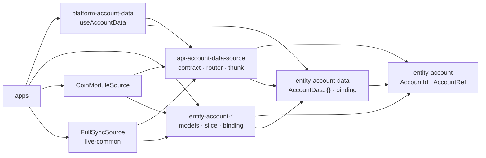
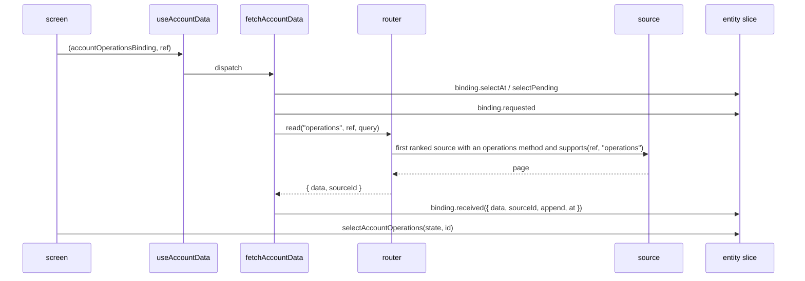

# The account data layer

> [!CAUTION]
> **Status: EXPLORATION.** No product screen reads this yet.

A screen reads one datum of one account, a balance or a page of operations, without a whole
`Account` and without a global sync having run first. It calls `useAccountData(binding, ref)`. The
router picks the first source, in the order the app ranked them, that can serve that datum for that
account, and the answer lands in the datum's own slice.

Adding a datum touches its entity package and the sources that can serve it. The three protocol
packages, the hook and the apps' composition do not change. A test proves it:
[`newDatum.test.tsx`](../features/platform/account-data/src/newDatum.test.tsx) declares, stores and
serves a new datum from a single file.

## The pieces

| Package | Holds | Knows |
| --- | --- | --- |
| [`@domain/entity-account`](../domain/entity/account) | `AccountId`, and `AccountRef`: the id plus currency, address and derivation mode | nothing new |
| [`@domain/entity-account-data`](../domain/entity/account-data) | the open `AccountData` map, one key per datum, and `AccountDataBinding`. Types only | `entity-account` |
| `@domain/entity-account-*` ([balance](../domain/entity/account-balance), [operations](../domain/entity/account-operations)) | the datum's models, its slice, its binding, and the `declare module` that adds its key to `AccountData` | `entity-account`, `entity-account-data` |
| [`@domain/api-account-data-source`](../domain/api/account-data-source) | `AccountDataSource`, `createAccountDataRouter`, `fetchAccountData` | `entity-account`, `entity-account-data` |
| [`@features/platform-account-data`](../features/platform/account-data) | `useAccountData`, and nothing else | `api-account-data-source`, `entity-account-data` |
| sources | [`CoinModuleSource`](../features/platform/account-source-coin-module), [`FullSyncSource`](../libs/ledger-live-common/src/account-data/FullSyncSource.ts) | the `AccountDataSource` type and the models they return |
| apps | the ranked source list, in the thunk `extraArgument` | everything: they are the glue |

The split follows the layer rules. An entity may only depend on entities, so the map every entity
augments sits at entity level. The source contract, the router and the thunk are data access, so
they sit in `domain/api`. The hook is React glue, so it sits in `features/platform`.

## Who knows whom


```mermaid
flowchart LR
    account["entity-account<br/>AccountId · AccountRef"]
    data["entity-account-data<br/>AccountData {} · binding"]
    entity["entity-account-*<br/>models · slice · binding"]
    source["api-account-data-source<br/>contract · router · thunk"]
    hook["platform-account-data<br/>useAccountData"]
    coin["CoinModuleSource"]
    full["FullSyncSource<br/>live-common"]
    apps["apps"]
    data --> account
    entity --> account
    entity --> data
    source --> account
    source --> data
    hook --> source
    hook --> data
    coin --> source
    coin --> entity
    full --> source
    full --> entity
    apps --> hook
    apps --> entity
    apps --> coin
    apps --> full
```

No arrow joins an entity to a source, a source to another source, or the router to any datum.

## Reading a datum


```mermaid
sequenceDiagram
    participant S as screen
    participant H as useAccountData
    participant T as fetchAccountData
    participant R as router
    participant X as source
    participant E as entity slice
    S->>H: (accountOperationsBinding, ref)
    H->>T: dispatch
    T->>E: binding.selectAt / selectPending
    T->>E: binding.requested
    T->>R: read("operations", ref, query)
    R->>X: first ranked source with an operations method and supports(ref, "operations")
    X-->>R: page
    R-->>T: { data, sourceId }
    T->>E: binding.received({ data, sourceId, append, at })
    S->>E: selectAccountOperations(state, id)
```

The hook drives the read and owns no data. The screen reads the data with the entity's own selectors.

`fetchAccountData` applies the same rules to every datum:

- **Freshness.** A head read younger than `maxAge` (30 s by default) is not repeated. A stamp in the
  future counts as stale.
- **One read per ref in flight.** A second head read of the same ref returns at once instead of
  reading again. A read for another ref of the same account, such as a rotated address, still runs.
- **Next page.** `more: true` resumes from `binding.selectNextQuery`, skips the freshness guard, and
  asks only the source that answered the head: a cursor means nothing to another source.
- **Replace or merge.** `received` carries `append`. The operations slice replaces its window on a
  head read and merges on a next page. The balance slice is never paginated.

Without React or Redux, `router.read(datum, ref, query)` returns the same answer.

## Adding a datum

1. In a new `domain/entity/account-<datum>` package: the models, a slice, and a binding typed
   `AccountDataBinding<"<datum>", WithState>`.
2. In the same package, declare the key:

   ```ts
   declare module "@domain/entity-account-data" {
     interface AccountData {
       staking: { query: undefined; result: AccountStaking };
     }
   }
   ```

3. In each source that can serve it, add a method named after the key, and accept the key in
   `supports`. `FullSyncSource` maps it from the legacy `Account` in
   [`legacy-mapping/`](../libs/ledger-live-common/src/legacy-mapping). A source that cannot serve it
   does nothing.
4. In each app, add the reducer to the root reducer.

The type system checks the rest: a source method returning the wrong shape does not compile.

## The sources today

| Source | Serves | Gate |
| --- | --- | --- |
| `CoinModuleSource` | a balance from one `getBalance`; a page of operations from one `listOperations` | per datum, the families the app passes. Desktop and mobile pass the generic coin framework families for `balance`, and none for `operations` |
| `FullSyncSource` | every datum, from one `AccountBridge.sync()` | any known currency whose account is in the legacy store |

`FullSyncSource` reads through `syncAccountOnce`, so a balance and an operations read of the same
account running at once share one sync.

`CoinModuleSource` never imports live-common. The app injects `loadCoinModule`, which loads the
coin module lazily through the existing registry, and `tokenAccountIdOf`, the legacy token account id
encoding. Both come from
[`coinModulePorts`](../libs/ledger-live-common/src/account-data/coinModulePorts.ts), whose test checks
the operation mapping against the legacy adapter.

Operations stay on the full sync until the coin module history is proven on par. A family served
for `balance` says nothing about `operations`.

## Compared with the two explorations

| In the explorations | Here |
| --- | --- |
| One source type and one registry per datum | One `AccountDataSource`, derived from the `AccountData` map |
| A numeric priority per source | The order of the array the app passes |
| One thunk and one hook per datum, with the guards copied | One `fetchAccountData`, one `useAccountData`, driven by a binding |
| `register*Sources` called from an app setup file | The router in the thunk `extraArgument` |
| `create*Sources` factories in live-common, granular code included | `FullSyncSource` in live-common; `CoinModuleSource` in `features/platform` |
| `paginated: false` to stop a cursor crossing sources | The next page is pinned to the source that answered the head |

Production code for the read path, sources excluded: 456 lines in the second exploration's
`features/platform/account-data`, for two datums. Here, 325 lines across `entity-account-data`,
`api-account-data-source` and `platform-account-data`, fixed whatever the number of datums. Each
datum adds a binding and a `declare module` block, about 30 lines, in its own entity.

## Open points

- **Persistence.** The slices are meant as stores of record: persisted, updated locally when a
  pending operation lands, and later replicated through Ledger Sync. Neither the explorations nor
  this branch wire persistence in the apps.
- **wallet-cli** still reads through its own adapters. Moving it onto `router.read` means reworking
  its `Balance` model and output, which is outside this branch.
- **Background sync.** The existing `BridgeSync` loop does not go through `FullSyncSource`, so a
  background sync and a slice read of the same account can still both run.
- **Routing change mid-history.** If the source that answered the head stops supporting the account,
  the next page fails with `NoAccountSourceError` rather than falling back. A head read recovers.
