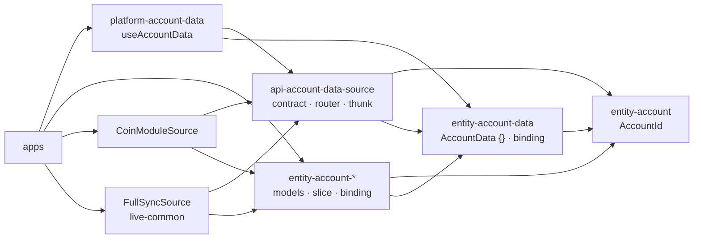
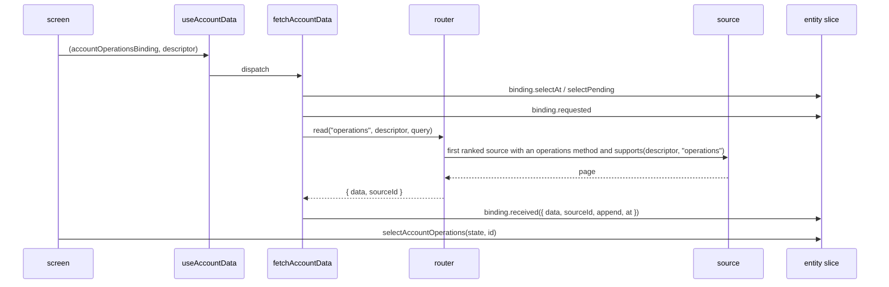
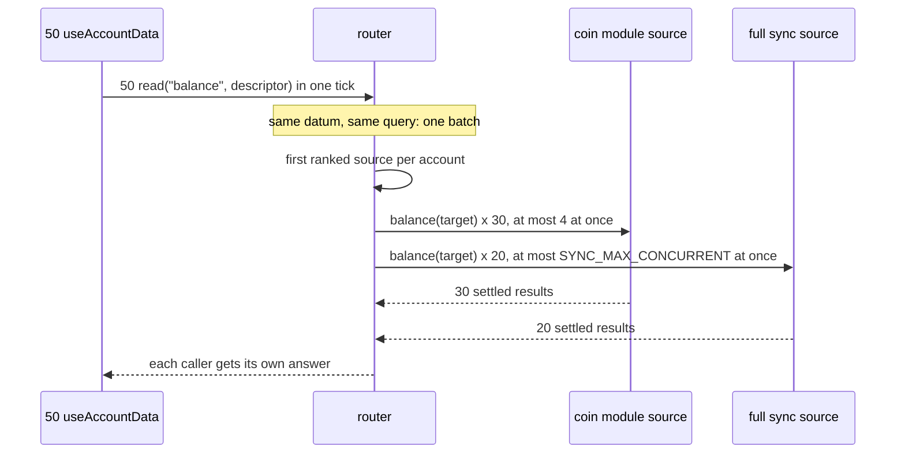
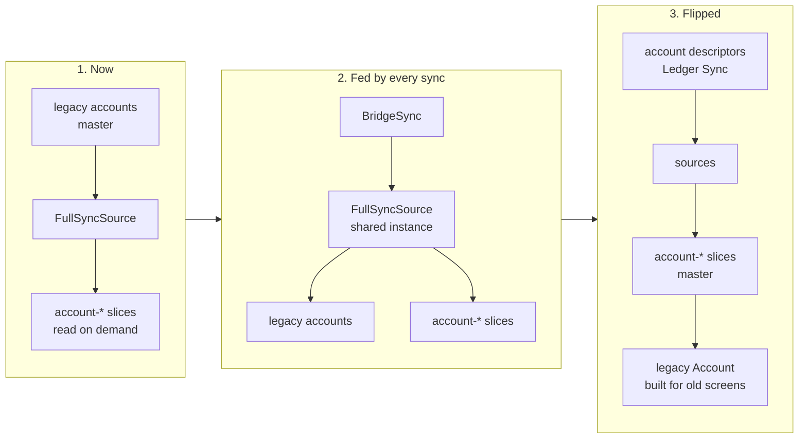

# The account data layer

> [!CAUTION]
> **Status: EXPLORATION.** No product screen reads this yet.

A screen reads one datum of one account, a balance or a page of operations, without a whole
`Account` and without a global sync having run first. It calls `useAccountData(binding, descriptor)`. The
router picks the first source, in the order the app ranked them, that can serve that datum for that
account, and the answer lands in the datum's own slice.

Adding a datum touches its entity package and the sources that can serve it, plus one reducer line
per app. The framework packages and the apps' source setup do not change. A test proves it:
[`newDatum.test.tsx`](../features/platform/account-data/src/newDatum.test.tsx) declares, stores and
serves a new datum from a single file.

## The account descriptor

An account is identified by an `AccountDescriptor` from [`@domain/entity-account-descriptor`](../domain/entity/account-descriptor), which replaces the `AccountRef` of the earlier PoCs ([ADR](https://ledgerhq.atlassian.net/wiki/spaces/WXP/pages/7599489111/ADR+Account+descriptor+as+the+common+account+identity)): the network, the derivation path, and the account key (the xpub for a UTXO account, the address otherwise). It is the same metadata from discovery to every source, and it holds nothing secret, mutable (`freshAddress`) or server-assigned.

- **The account id is a hash of the canonical descriptor string**, computed by `computeAccountId` in [`@domain/entity-account-alias`](../domain/entity/account-alias). Slices are keyed by it, and `useAccountData` returns it as `accountId`.
- **Sources decide from the descriptor alone.** Each source exposes `supports(descriptor, datum): boolean`, pure and synchronous. The datum is there because `CoinModuleSource` gates its families per datum. Whatever is asynchronous or mutable stays inside the reader.
- **Readers get an `AccountTarget`**: `{ accountId, descriptor }`.
- **Identity.** Descriptors are compared, deduplicated and hashed through `accountDescriptorKey`, which is canonical (`'` or `h` in the path, EVM address case, network case). `serializeAccountDescriptor` gives the string as given.
- The only inputs besides the descriptor are static tables: network to currency id, and (currency, path) to (derivation mode, index), in `libs/ledger-live-common/src/account-data/legacyAccount.ts`.

## Discovery

[`@features/platform-account-discovery`](../features/platform/account-discovery) emits the accounts of a
currency as a stream of descriptors, following the legacy scan rules held as a table. It asks the
sources one question the readers do not answer: `exists(descriptor)`, whether the account has any
history. `AccountDataSource` gets an optional `exists` and `supportsExists`, and the router routes
`exists` like a read. The scan itself needs a device, injected as `derive`: the
[Account Discovery devtool](../devtools/account-discovery) on desktop runs it on the connected one.

## The pieces

| Package | Holds | Knows |
| --- | --- | --- |
| [`@domain/entity-account`](../domain/entity/account) | `AccountId`, `TokenAccountId` | nothing new |
| [`@domain/entity-account-descriptor`](../domain/entity/account-descriptor) | `AccountDescriptor`, its canonical key, the network tables | currency registry |
| [`@domain/entity-account-alias`](../domain/entity/account-alias) | `computeAccountId(descriptor)`, the hashed account id | `entity-account`, `entity-account-descriptor` |
| [`@domain/entity-account-data`](../domain/entity/account-data) | the open `AccountData` map, one key per datum, and `AccountDataBinding`. Types only | `entity-account` |
| [`@domain/api-account-data-source`](../domain/api/account-data-source) | `AccountDataSource`, `createAccountDataRouter` (`read`, `readBatch`), `fetchAccountData`, `fetchAccountDataBatch`; `./testing` holds two toy datums | `entity-account`, `entity-account-alias`, `entity-account-descriptor`, `entity-account-data` |
| [`@features/platform-account-data`](../features/platform/account-data) | `useAccountData`, and nothing else | `api-account-data-source`, `entity-account-alias`, `entity-account-descriptor`, `entity-account-data` |
| `@domain/entity-account-*` ([balance](../domain/entity/account-balance), [operations](../domain/entity/account-operations)) | the datum's models, its slice, its binding, and the `declare module` that adds its key to `AccountData` | `entity-account`, `entity-account-data` |
| sources | [`CoinModuleSource`](../features/platform/account-source-coin-module), [`FullSyncSource`](../libs/ledger-live-common/src/account-data/FullSyncSource.ts) | the `AccountDataSource` type and the models they return |
| apps | `config/account-data-setup.ts`: the ranked sources and their family gates, spread into the thunk `extraArgument` | everything: they are the glue |
| devtools | [`@devtools/account-balances`](../devtools/account-balances), [`@devtools/account-operations`](../devtools/account-operations), on desktop | `fetchAccountData`, the entities |

The split follows the layer rules. An entity may only depend on entities, so the map every entity
augments sits at entity level. The source contract, the router and the thunk are data access, so
they sit in `domain/api`. The hook is React glue, so it sits in `features/platform`.

## Who knows whom


```mermaid
flowchart LR
    account["entity-account<br/>AccountId"]
    data["entity-account-data<br/>AccountData {} · binding"]
    entity["entity-account-*<br/>models · slice · binding"]
    source["api-account-data-source<br/>contract · router · thunk"]
    hook["platform-account-data<br/>useAccountData"]
    coin["CoinModuleSource"]
    full["FullSyncSource<br/>live-common"]
    apps["apps"]
    data --> account
    entity --> account
    entity --> data
    source --> account
    source --> data
    hook --> source
    hook --> data
    coin --> source
    coin --> entity
    full --> source
    full --> entity
    apps --> hook
    apps --> entity
    apps --> coin
    apps --> full
```

No arrow joins an entity to a source, a source to another source, or the router to any datum.

## Reading a datum


```mermaid
sequenceDiagram
    participant S as screen
    participant H as useAccountData
    participant T as fetchAccountData
    participant R as router
    participant X as source
    participant E as entity slice
    S->>H: (accountOperationsBinding, descriptor)
    H->>T: dispatch
    T->>E: binding.selectAt / selectPending
    T->>E: binding.requested
    T->>R: read("operations", descriptor, query)
    R->>X: first ranked source with an operations method and supports(descriptor, "operations")
    X-->>R: page
    R-->>T: { data, sourceId }
    T->>E: binding.received({ data, sourceId, append, at })
    S->>E: selectAccountOperations(state, id)
```

The hook drives the read and owns no data. The screen reads the data with the entity's own selectors.

`fetchAccountData` applies the same rules to every datum:

- **Freshness.** A head read younger than `maxAge` (30 s by default) is not repeated. A stamp in the
  future counts as stale.
- **One read per account in flight.** A second head read of the same account returns at once instead
  of reading again. A rotated fresh address does not make a second account: it is not part of the
  descriptor.
- **Next page.** `more: true` resumes from `binding.selectNextQuery`, skips the freshness guard, and
  asks only the source that answered the head: a cursor means nothing to another source.
- **Replace or merge.** `received` carries `append`. The operations slice replaces its window on a
  head read and merges on a next page. The balance slice is never paginated.

Without React or Redux, `router.read(datum, descriptor, query)` returns the same answer.

## Many accounts at once

A portfolio reads the same datum for dozens of accounts. Read one by one, that is dozens of source
calls in parallel with no limit: on `FullSyncSource`, dozens of `AccountBridge.sync()` at once, where
the background `BridgeSync` never runs more than `SYNC_MAX_CONCURRENT` (4 by default). And a source
that can answer many accounts in one call, as a portfolio backend would, never gets the chance.

The router fixes both, and nothing above it changes: not the entities, not the bindings, not the hook.

### What a source may add

```ts
type AccountDataBatchReader<K> = (
  targets: readonly AccountTarget[],
  query: AccountDataQuery<K> | undefined,
  signal?: AbortSignal,
) => Promise<PromiseSettledResult<AccountDataResult<K>>[]>; // one per target, in order

type AccountDataSource = {
  // ...id, supports, the single readers
  readonly batch?: { readonly [K in AccountDatum]?: AccountDataBatchReader<K> };
  readonly maxBatchSize?: number; // the router splits above this
  readonly concurrency?: number; // calls in flight on this source, default 4
};
```

`batch` is derived from the same `AccountData` map, so a new datum still touches no framework file.
A source implements, per datum, a single reader, a batch reader, or both. The router makes up the
other one:

- **No batch reader:** the router reads each account with the single reader, never more than the
  source's `concurrency` at once.
- **No single reader:** the router answers a single read with a batch of one.

Each result is settled on its own, so one account failing never fails the others. In a class, give
`batch` an explicit type (`readonly batch: AccountDataSource["batch"] = { ... }`): `implements`
does not type property initialisers. `id`, `supports`, `batch`, `maxBatchSize` and `concurrency` are
reserved: no datum may use those names.

### How the router reads many accounts


```mermaid
sequenceDiagram
    participant H as 50 useAccountData
    participant R as router
    participant B as coin module source
    participant F as full sync source
    H->>R: 50 read("balance", descriptor) in one tick
    Note over R: same datum, same query: one batch
    R->>R: first ranked source per account
    R->>B: balance(target) x 30, at most 4 at once
    R->>F: balance(target) x 20, at most SYNC_MAX_CONCURRENT at once
    B-->>R: 30 settled results
    F-->>R: 20 settled results
    R-->>H: each caller gets its own answer
```

1. **Merging.** `router.read` waits one microtask. The reads issued in the same tick for the same
   datum, the same query and the same pinned source become one batch. A refresh of 50 rows mounted
   in one render is one batch. A next page carries its own cursor, so it never merges with another.
2. **Routing, rank unchanged.** Each account goes to the first ranked source that has a reader for
   the datum and supports the account, exactly as for one account. Being able to batch never moves a
   source up the list.
3. **One call per group.** The accounts of a source are read together: in chunks of `maxBatchSize`
   through its batch reader, or one by one through its single reader. Groups of different sources run
   in parallel.
4. **A cap per source, across calls.** The router keeps one queue per source, shared by every read.
   Two batches started at once on the same source still never exceed its `concurrency` together.
5. **Duplicates.** An account asked twice in one batch is read once, and both callers get the
   answer.

### Failures and abort

- A descriptor no source can answer fails with `NoAccountSourceError`, alone.
- A batch call that rejects fails the accounts of that chunk, and only those. It is not retried
  account by account, which would turn one outage into a storm of calls.
- A batch reader answering the wrong number of results is a source bug: its chunk fails.
- Merged reads share one call, so a caller's `signal` stops that caller waiting and nothing more,
  as with `FullSyncSource`'s shared sync. With `readBatch`, the signal goes to the source, and reads
  still waiting for a slot leave the queue.

### The batch thunk

`fetchAccountDataBatch(binding, descriptors, { maxAge, query, signal })` is the explicit form, for a
"refresh all" or a caller without React. It applies the single read's guards to each account: freshness,
and the same in-flight table, so a `useAccountData` mounting during a batch joins it instead of
reading again. An account listed twice is read once. It reads heads only: each
account's next page has its own cursor. The desktop balances devtool uses it for "Read all".

Without a store, `router.readBatch(datum, descriptors, query)` returns one settled `{ data, sourceId }` per
descriptor, in order.

Merging is on by default. `createAccountDataRouter(sources, { coalesce: false })` turns it off;
`{ concurrency }` changes the default cap.

## Adding a datum

1. In a new `domain/entity/account-<datum>` package: the models, a slice, and a binding typed
   `AccountDataBinding<"<datum>", WithState>`.
2. In the same package, declare the key:

   ```ts
   declare module "@domain/entity-account-data" {
     interface AccountData {
       staking: { query: undefined; result: AccountStaking };
     }
   }
   ```

3. In each source that can serve it, add a method named after the key, and accept the key in
   `supports`. `FullSyncSource` maps it from the legacy `Account`, next to its other mappers. A
   source that cannot serve it does nothing.
4. In each app, add the reducer to the root reducer.

The type system checks the rest: a source method returning the wrong shape does not compile.

## Shipping the framework first

The framework is `entity-account-data`, `api-account-data-source` and `platform-account-data`, plus
the descriptor and alias packages. None of them depends on an entity or a source, including in tests:
they are tested on two toy datums from `@domain/api-account-data-source/testing`, a `counter` read in
one go and a paginated `feed`. They can merge on their own, before any `account-*` entity or any
source, and each team then adds its datum or its source against a contract that is already in
`develop`.

What the framework leaves to each entity is the shape of its datum. How minimal or normalised
`account-balance` should be, and what the UI needs from it, is decided in that entity: the framework
only carries whatever `result` type the entity declares.

## The sources today

| Source | Serves | Gate |
| --- | --- | --- |
| `CoinModuleSource` | a balance from one `getBalance`; a page of operations from one `listOperations` | per datum, the families in the app's `coinModuleFamilies`: the generic coin framework families for `balance`, none for `operations` |
| `FullSyncSource` | every datum, from one `AccountBridge.sync()`, at most `SYNC_MAX_CONCURRENT` syncs at once | any known currency; the read finds the legacy account by comparing descriptors and fails if none matches |

`FullSyncSource` keeps one run per legacy account in flight on the instance, so a balance and an operations
read of the same account running at once share one sync. It re-keys the legacy ids the sync reports (accounts, token accounts, operations) to the hashed account id. Its legacy `Account` mappers are private
functions in the same file: nothing else maps that way, and they go when the legacy model goes.

`CoinModuleSource` never imports live-common. The app injects `loadCoinModule`, which loads the
coin module lazily through the existing registry, and `tokenAccountIdOf`, the legacy token account id
encoding. Both come from
[`coinModulePorts`](../libs/ledger-live-common/src/account-data/coinModulePorts.ts), whose test feeds
the same core operations to both sources and checks they produce the same rows.

Operations stay on the full sync until the coin module history is proven on par. A family served
for `balance` says nothing about `operations`.

## Consistency across datums

Splitting balance and operations into two slices raises a fair question: a screen can show a balance
and a history that disagree. The split does not create that risk. Two reads made at different times
disagree whatever they are stored in, and one legacy `Account` only looked consistent because a
single sync wrote every field at once.

What the layer guarantees today:

- **Same source, same instant: one snapshot.** A balance and an operations read of the same account
  running together on `FullSyncSource` share one sync, so they come from one `Account`.
- **Every datum records its provenance.** Each slice stores the source that answered and when. A
  consumer that needs two datums to agree can check that they come from the same source within a
  window it chooses.

What it does not guarantee: two reads made at different times, or served by different sources, can
disagree by the blocks between them. `getBalance` and `listOperations` are two calls, so even the
coin module source can straddle a block.

When a screen needs a strict pair, such as a balance history derived from the balance and the
operations, the protocol extends without breaking: a source may answer several datums from one read
(a `snapshot` method taking a list of datums), and the router asks it before falling back to
separate reads. Nothing needs it yet, so it is not built.

## Switching the master

Today the legacy `accounts` slice is the master. `FullSyncSource` finds the legacy `Account` through
the app's `findAccount(descriptor)` and syncs it; the new slices are read models filled on demand, on their own
lifecycle.


```mermaid
flowchart LR
    subgraph now["1. Now"]
        direction TB
        l1["legacy accounts<br/>master"] --> f1["FullSyncSource"] --> n1["account-* slices<br/>read on demand"]
    end
    subgraph fed["2. Fed by every sync"]
        direction TB
        b2["BridgeSync"] --> f2["FullSyncSource<br/>shared instance"]
        f2 --> l2["legacy accounts"]
        f2 --> n2["account-* slices"]
    end
    subgraph flip["3. Flipped"]
        direction TB
        d3["account descriptors<br/>Ledger Sync"] --> s3["sources"] --> n3["account-* slices<br/>master"]
        n3 --> a3["legacy Account<br/>built for old screens"]
    end
    now --> fed --> flip
```

1. **Now.** The legacy slice is the master. Old and new screens can show different values for a
   while, which the 2026-09-28 refinement accepted.
2. **Fed by every sync.** The background `BridgeSync` goes through the same `FullSyncSource`
   instance, and each finished sync writes every datum it can serve into the new slices through
   their bindings. The two stores stop drifting because one writer fills both.
3. **Flipped.** The master becomes the account descriptors (what Ledger Sync already carries, from which
   the descriptor derives) plus the new slices. Local
   writes, such as a pending operation after a broadcast, go to the slices first. For the screens
   not yet migrated, the app rebuilds a legacy `Account` from the slices. `FullSyncSource` then builds
   the `Account` it syncs from a descriptor instead of reading the legacy store.
4. **Removed.** Once no screen reads the legacy slice, it goes, and with it the rebuilt `Account`.

The switch is possible without touching the framework or the entities because of three properties
already in place: sources never read the store (the app injects `findAccount`, today a lookup among the legacy accounts, tomorrow a lookup in a descriptor store), the descriptor is
derivable from a Ledger Sync account that was never synced, and every slice is keyed by `AccountId`. Only the
app's `account-data-setup` and the sync wiring change at each step. None of steps 2 to 4 is built
here.

## Compared with the explorations

| In #21560 / #21566 | In PoC 3 (#22709) | Here |
| --- | --- | --- |
| One source type and one registry per datum | One interface with a method per datum, edited centrally | One `AccountDataSource`, derived from the `AccountData` map that each entity augments |
| Numeric priority | Order of the array | Order of the array |
| `supports(ref)` per source | `supports(ref)` per source | pure `supports(descriptor, datum)`, so balance and operations are gated separately |
| One thunk and one hook per datum | One thunk and one hook per datum, in a package per entity | One `fetchAccountData`, one `useAccountData`, driven by a binding |
| Many accounts: one read each, unbounded | Many accounts: one read each, unbounded | Reads merged per tick, one call per source, a batch reader when the source has one, a cap per source |
| Registry filled from an app setup file | Router in a React `AccountDataProvider` | Router in the thunk `extraArgument`, built in `account-data-setup` |
| Granular code in live-common | Coin module source in live-common, token id encoding duplicated | `CoinModuleSource` in `features/platform`, two ports injected |
| Mappers in `legacy-mapping/` | Mappers private in `FullSyncSource` | Mappers private in `FullSyncSource` |
| Module-level in-flight map | In-flight map on the source instance | In-flight map on the source instance |
| `paginated: false` | Cursor handed to whichever source the router picks | Next page pinned to the source that answered the head |

Production code for the read path, sources and entities excluded: 691 lines here, the same whatever
the number of datums. 366 of them are the batch work: merging, the per-source cap, chunking and the
batch thunk. Without batching it is 325 lines. PoC 3 has 384 lines for two datums, without batching,
and each new datum adds a thunk and a hook package. Here each datum adds its binding and its
`declare module` block, 26 lines for balance and 34 for operations, in its own entity.

## Open points

- **No source batches for real yet.** Every coin module read takes one address, and a sync is one
  account, so both sources rely on the router's bounded simulation. The batch reader is there for a
  portfolio backend that answers many accounts in one call; the framework is tested with a toy one.
- **Persistence.** The slices are meant as stores of record: persisted, updated locally, and later
  replicated through Ledger Sync. No version of this layer wires persistence in the apps yet.
- **wallet-cli** still reads through its own adapters. Moving it onto `router.read` means reworking
  its `Balance` model and output.
- **Entity shape.** Whether `account-balance` is minimal and normalised enough for both the sources
  and the UI is an entity question, to settle with the teams that own the screens and the coin
  modules.
- **Routing change mid-history.** If the source that answered the head stops supporting the account,
  the next page fails with `NoAccountSourceError` rather than falling back. A head read recovers.
