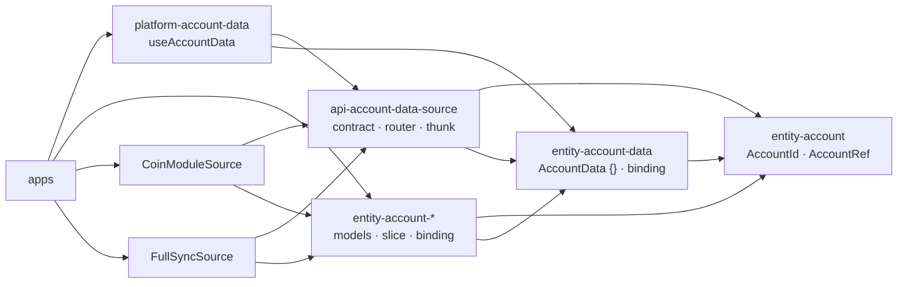
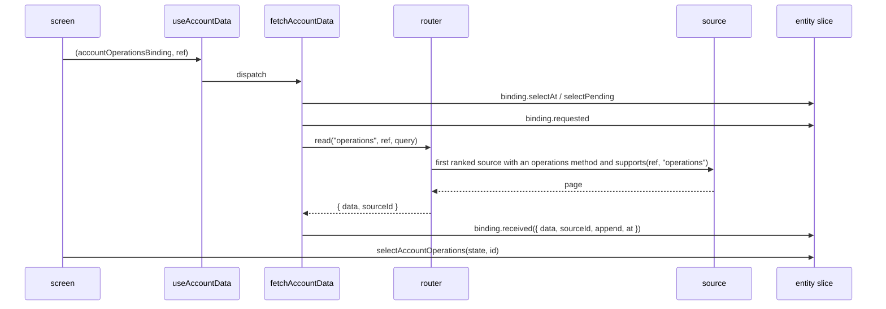
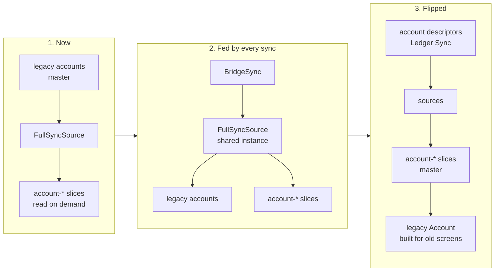

# The account data layer

> [!CAUTION]
> **Status: FRAMEWORK ONLY.** No datum, no real source and no screen yet. Slices and sources arrive one datum at a time.

A screen reads one datum of one account, a balance or a page of operations, without a whole
`Account` and without a global sync having run first. It calls `useAccountData(binding, ref)`. The
router picks the first source, in the order the app ranked them, that can serve that datum for that
account, and the answer lands in the datum's own slice.

Adding a datum touches its entity package and the sources that can serve it, plus one reducer line
per app. The framework packages and the apps' source setup do not change. A test proves it:
[`newDatum.test.tsx`](../features/platform/account-data/src/newDatum.test.tsx) declares, stores and
serves a new datum from a single file.

## The pieces

| Package | Holds | Knows |
| --- | --- | --- |
| [`@domain/entity-account`](../domain/entity/account) | `AccountId`, and `AccountRef`: the id plus currency, address and derivation mode | nothing new |
| [`@domain/entity-account-data`](../domain/entity/account-data) | the open `AccountData` map, one key per datum, and `AccountDataBinding`. Types only | `entity-account` |
| [`@domain/api-account-data-source`](../domain/api/account-data-source) | `AccountDataSource`, `createAccountDataRouter`, `fetchAccountData`; `./testing` holds two toy datums | `entity-account`, `entity-account-data` |
| [`@features/platform-account-data`](../features/platform/account-data) | `useAccountData`, and nothing else | `api-account-data-source`, `entity-account-data` |
| `@domain/entity-account-*` (none yet) | the datum's models, its slice, its binding, and the `declare module` that adds its key to `AccountData` | `entity-account`, `entity-account-data` |
| sources | [`CoinModuleSource`](../features/platform/account-source-coin-module), [`FullSyncSource`](../features/platform/account-source-full-sync): empty shells | the `AccountDataSource` type |
| apps | `config/account-data-setup.ts`: the ranked sources, spread into the thunk `extraArgument` | everything: they are the glue |

The split follows the layer rules. An entity may only depend on entities, so the map every entity
augments sits at entity level. The source contract, the router and the thunk are data access, so
they sit in `domain/api`. The hook is React glue, so it sits in `features/platform`.

## Who knows whom


```mermaid
flowchart LR
    account["entity-account<br/>AccountId · AccountRef"]
    data["entity-account-data<br/>AccountData {} · binding"]
    entity["entity-account-*<br/>models · slice · binding"]
    source["api-account-data-source<br/>contract · router · thunk"]
    hook["platform-account-data<br/>useAccountData"]
    coin["CoinModuleSource"]
    full["FullSyncSource"]
    apps["apps"]
    data --> account
    entity --> account
    entity --> data
    source --> account
    source --> data
    hook --> source
    hook --> data
    coin --> source
    coin --> entity
    full --> source
    full --> entity
    apps --> hook
    apps --> entity
    apps --> coin
    apps --> full
```

No arrow joins an entity to a source, a source to another source, or the router to any datum.

## Reading a datum


```mermaid
sequenceDiagram
    participant S as screen
    participant H as useAccountData
    participant T as fetchAccountData
    participant R as router
    participant X as source
    participant E as entity slice
    S->>H: (accountOperationsBinding, ref)
    H->>T: dispatch
    T->>E: binding.selectAt / selectPending
    T->>E: binding.requested
    T->>R: read("operations", ref, query)
    R->>X: first ranked source with an operations method and supports(ref, "operations")
    X-->>R: page
    R-->>T: { data, sourceId }
    T->>E: binding.received({ data, sourceId, append, at })
    S->>E: selectAccountOperations(state, id)
```

The hook drives the read and owns no data. The screen reads the data with the entity's own selectors.

`fetchAccountData` applies the same rules to every datum:

- **Freshness.** A head read younger than `maxAge` (30 s by default) is not repeated. A stamp in the
  future counts as stale.
- **One read per ref and query in flight.** A second head read of the same ref and query returns at
  once instead of reading again. A read for another ref or query of the same account, such as a
  rotated address, still runs.
- **Next page.** `more: true` resumes from `binding.selectNextQuery`, skips the freshness guard, and
  asks only the source that answered the head: a cursor means nothing to another source. It only
  continues the last successful head read, for the same ref and query.
- **Replace or merge.** `received` carries `append`. A paginated slice replaces its window on a head
  read and merges on a next page; a datum with no `selectNextQuery` is never paginated.

Without React or Redux, `router.read(datum, ref, query)` returns the same answer.

## Adding a datum

1. In a new `domain/entity/account-<datum>` package: the models, a slice, and a binding typed
   `AccountDataBinding<"<datum>", WithState>`.
2. In the same package, declare the key:

   ```ts
   declare module "@domain/entity-account-data" {
     interface AccountData {
       staking: { query: undefined; result: AccountStaking };
     }
   }
   ```

3. In each source that can serve it, add a method named after the key, and accept the key in
   `supports`. `FullSyncSource` maps it from the legacy `Account`. A source that cannot serve it does nothing.
4. In each app, add the reducer to the root reducer.

The type system checks the rest: a source method returning the wrong shape does not compile.

## Testing without an entity

The framework packages depend on no entity and no source, including in tests. They are tested on two
toy datums from `@domain/api-account-data-source/testing`: a `counter` read in one go and a paginated
`feed`. Each team then adds its datum or its source against a contract already in `develop`.

What the framework leaves to each entity is the shape of its datum: it only carries whatever `result`
type the entity declares.

## The sources

Both are empty shells: no datum method, and `supports` returns `false`, so the router falls through
and `NoAccountSourceError` is thrown. They exist so the apps' ranked list and the package boundaries
are settled before any slice.

| Source | Meant to serve |
| --- | --- |
| `CoinModuleSource` | a datum straight from a coin module call, with no full sync |
| `FullSyncSource` | every datum, from one `AccountBridge.sync()` of the legacy `Account` |

Neither imports live-common: what they need from legacy code is injected by the app.

## Consistency across datums

Splitting balance and operations into two slices raises a fair question: a screen can show a balance
and a history that disagree. The split does not create that risk. Two reads made at different times
disagree whatever they are stored in, and one legacy `Account` only looked consistent because a
single sync wrote every field at once.

What the layer is designed to guarantee:

- **Same source, same instant: one snapshot.** `FullSyncSource` is meant to share one sync between
  datums of the same account read together, so they come from one `Account`.
- **Every datum records its provenance.** Each slice stores the source that answered and when
  (`AccountDataReceived`). A consumer that needs two datums to agree can check that they come from the
  same source within a window it chooses.

What it does not guarantee: two reads made at different times, or served by different sources, can
disagree by the blocks between them. `getBalance` and `listOperations` are two calls, so even the
coin module source can straddle a block.

When a screen needs a strict pair, such as a balance history derived from the balance and the
operations, the protocol extends without breaking: a source may answer several datums from one read
(a `snapshot` method taking a list of datums), and the router asks it before falling back to
separate reads. Nothing needs it yet, so it is not built.

## Switching the master

Today the legacy `accounts` slice is the master. Once `FullSyncSource` is implemented it reads the
legacy `Account` through an app-injected `getAccount` and syncs it; the new slices are read models
filled on demand, on their own lifecycle.


```mermaid
flowchart LR
    subgraph now["1. Now"]
        direction TB
        l1["legacy accounts<br/>master"] --> f1["FullSyncSource"] --> n1["account-* slices<br/>read on demand"]
    end
    subgraph fed["2. Fed by every sync"]
        direction TB
        b2["BridgeSync"] --> f2["FullSyncSource<br/>shared instance"]
        f2 --> l2["legacy accounts"]
        f2 --> n2["account-* slices"]
    end
    subgraph flip["3. Flipped"]
        direction TB
        d3["account descriptors<br/>Ledger Sync"] --> s3["sources"] --> n3["account-* slices<br/>master"]
        n3 --> a3["legacy Account<br/>built for old screens"]
    end
    now --> fed --> flip
```

1. **Now.** The legacy slice is the master. Old and new screens can show different values for a
   while, which the 2026-09-28 refinement accepted.
2. **Fed by every sync.** The background `BridgeSync` goes through the same `FullSyncSource`
   instance, and each finished sync writes every datum it can serve into the new slices through
   their bindings. The two stores stop drifting because one writer fills both.
3. **Flipped.** The master becomes the account descriptors (what Ledger Sync already carries: id,
   currency, address, derivation mode, from which `AccountRef` derives) plus the new slices. Local
   writes, such as a pending operation after a broadcast, go to the slices first. For the screens
   not yet migrated, the app rebuilds a legacy `Account` from the slices. `FullSyncSource` then builds
   the `Account` it syncs from a descriptor instead of reading the legacy store.
4. **Removed.** Once no screen reads the legacy slice, it goes, and with it the rebuilt `Account`.

The switch is possible without touching the framework or the entities because of three properties:
sources never read the store (the app injects what they need), an `AccountRef` is derivable from a
descriptor that was never synced, and every slice is keyed by `AccountId`. Only the app's
`account-data-setup` and the sync wiring change at each step. None of steps 2 to 4 is built.

## Open points

- **Persistence.** Slices are meant as stores of record: persisted, updated locally, later replicated
  through Ledger Sync. Not wired yet.
- **wallet-cli** still reads through its own adapters; it can move onto `router.read` later.
- **Routing change mid-history.** If the source that answered the head stops supporting the account,
  the next page fails with `NoAccountSourceError` rather than falling back. A head read recovers.
