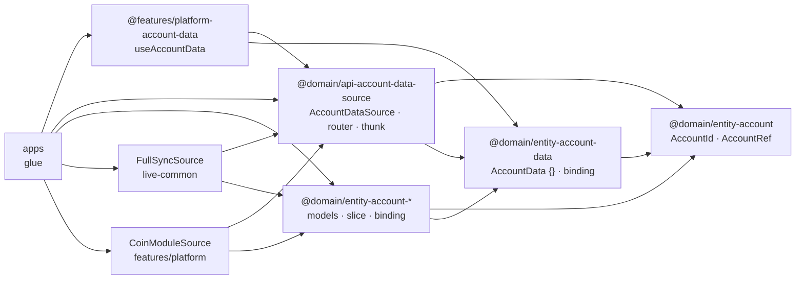

# Account data layer

> [!WARNING]
> **EXPLORATION.** Third iteration of the account-balance / account-operations PoC, protocol variant. The [refinement notes](https://ledgerhq.atlassian.net/wiki/spaces/WXP/pages/7575339017/2026-09-28+refinement+notes) hold the constraints.

Nobody knows anybody: the boundary between an entity, a source, the router and an app is a protocol, not an import.

## Who knows whom

```mermaid
flowchart LR
    account["@domain/entity-account<br/>AccountId · AccountRef"]
    data["@domain/entity-account-data<br/>AccountData {} · binding"]
    entity["@domain/entity-account-*<br/>models · slice · binding"]
    source["@domain/api-account-data-source<br/>AccountDataSource · router · thunk"]
    platform["@features/platform-account-data<br/>useAccountData"]
    full["FullSyncSource<br/>live-common"]
    coin["CoinModuleSource<br/>features/platform"]
    apps["apps<br/>glue"]
    data --> account
    entity --> account
    entity --> data
    source --> account
    source --> data
    platform --> source
    platform --> data
    full --> source
    full --> entity
    coin --> source
    coin --> entity
    apps --> platform
    apps --> source
    apps --> entity
    apps --> full
    apps --> coin
```

| Piece | Imports | Never imports |
| --- | --- | --- |
| `@domain/entity-account-*` | `entity-account`, `entity-account-data` | the source package, any source, other slices |
| `@domain/api-account-data-source` | `entity-account`, `entity-account-data` | any slice, any source, React |
| `@features/platform-account-data` | `api-account-data-source`, `entity-account-data` | any slice, any source |
| `FullSyncSource`, `CoinModuleSource` | the `AccountDataSource` type, the models of the entities they serve | the router, the thunk, bindings, slices, apps, each other |
| apps | everything | nothing: this is the glue |

## Reading

`useAccountData(binding, ref)` dispatches `fetchAccountData(binding, ref)`, which asks `extra.accountData.read(datum, ref, query)`. The router picks the first source (array order is the priority) that has the method for that datum and answers `supports(ref, datum)`. The result goes to the slice through `binding.received`.

- A source is one object: `{ id, supports(ref, datum), balance?(ref, query, signal), operations?(ref, query, signal) }`.
- A cursor is only sent back to the source that issued it (`sourceId` of the head read).
- `FullSyncSource` shares one `AccountBridge.sync` per account while in flight, so balance and operations requested together sync once.
- `CoinModuleSource` reads the coin module directly. The families it serves per datum are injected by the app, the package holds no family list.

## Adding a slice (`account-staking`)

1. `domain/entity/account-staking`: models, slice, binding, and the `declare module "@domain/entity-account-data"` block that adds `staking`.
2. Each source that can serve it adds one method `staking(ref, query, signal)` and accepts it in `supports`. A source that cannot does nothing.
3. Apps: add the reducer to the root reducer, as for any slice.
4. Consumers: `useAccountData(accountStakingBinding, ref)` and the entity selectors.

None of the protocol packages changes. `features/platform/account-data/src/extensibility.test.tsx` declares a third datum and reads it without touching them.

## Deviations from the design

- `router.read` takes an options object `{ signal, sourceId }` instead of a bare `signal`, to route a cursor back to its source.
- The binding has `headQuery` (the query of a head read) and an optional `selectSourceId`.
- One localized cast in `router.ts`: TypeScript cannot correlate a generic datum key with its mapped method signature.

## Not in this PoC

wallet-cli, web-tools, the background sync, persistence of the slices, any product screen.
