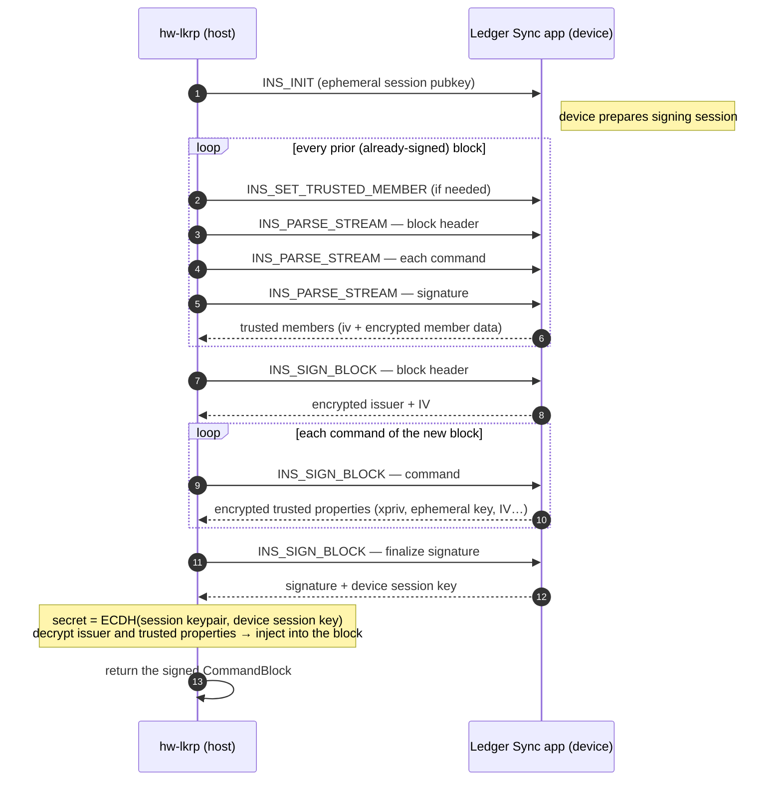

# 1 · Hardware & the low-level LKRP library

> Layer 1 of the [Ledger Sync stack](./README.md). Code:
> [`libs/hw-ledger-key-ring-protocol`](../../libs/hw-ledger-key-ring-protocol)
> (formerly `hw-trustchain`).

This layer talks to the **Ledger Sync** hardware-wallet app
([app-ledger-sync](https://github.com/LedgerHQ/app-ledger-sync)) over APDU and turns those
raw exchanges into a higher-level abstraction the [TrustchainSDK](./02-trustchain-sdk.md)
can use.

> [!NOTE]
> The full cryptographic specification lives in
> [ARCH Trustchain — specifications](https://ledgerhq.atlassian.net/wiki/spaces/TA/pages/4105207815).
> This page documents only what the **library** exposes and how it drives the device.

## What it exposes

| Abstraction | File | Role |
|---|---|---|
| `Crypto` | `src/Crypto.ts` | Keypair generation, ECDH, encrypt/decrypt of user data, randomness. |
| `Device` | `src/Device.ts` | Interface over a signer. Two implementations: `ApduDevice` (hardware) and `SoftwareDevice` (in-memory, used for adding members without the device). |
| `StreamTree` | `src/StreamTree.ts` | The derivation **tree** of command streams. Resolves derivation paths and members, computes the application root path used for key rotation. |
| `CommandStream` | `src/CommandStream.ts`, `src/CommandBlock.ts` | An immutable, signed log of command blocks (`Seed`, `Derive`, `AddMember`, `PublishKey`, `CloseStream`). |

## The derivation tree & the application path

A Trustchain is a tree of command streams. The branch a given application writes to is the
**application root path**:

```
m / {treeIndex}' / {applicationId}' / {rotationIndex}'
        0'              16'                 0'
```

`StreamTree.getApplicationRootPath(applicationId, increment = 0)` (in `src/StreamTree.ts`)
returns this path. The three segments (all *hardened*, hence the `'`):

- **`treeIndex`** — the top-level branch of the trustchain tree. Currently always `0`.
- **`applicationId`** — identifies the **consuming application**, so each app derives its own
  branch (and therefore its own encryption key) under the same trustchain:
  - **`16` = Ledger Sync** — used by Ledger Wallet Desktop & Mobile (`useTrustchainSdk` sets
    `applicationId = 16`).
  - **`17` = wallet-cli** — the incoming wallet-cli integration
    ([PR #17743](https://github.com/LedgerHQ/ledger-live/pull/17743); see the
    `ringInitPreservesLedgerSyncMember` scenario which drives `applicationId: 17`).
- **`rotationIndex`** — starts at `0` and is incremented by `1` every time the key is rotated
  (see [key rotation](./02-trustchain-sdk.md#key-rotation-on-member-removal)).

> [!NOTE]
> Because the root is shared across applications, a `CloseStream` can retire **one** application
> branch without destroying the others. [PR #18568](https://github.com/LedgerHQ/ledger-live/pull/18568)
> makes a closed stream observable here — `ResolvedCommandStream.isClosed()`, plus
> `StreamTree.getApplicationStreams()` / `hasAnotherOpenApplication()` — which powers
> [per-application deactivation](./02-trustchain-sdk.md#deactivating-ledger-sync-per-application-close).

## Building & signing a stream

A `CommandStream` is edited fluently, then **issued** (signed) by a `Device`:

```ts
// derive() takes hardened indices — here the path m/0'/16'/0'
//   (treeIndex / applicationId=Ledger Sync / rotationIndex)
const path = [0, 16, 0].map(DerivationPath.hardenedIndex);

stream.edit()
  .seed(topic)                            // Seed: initialize the root
  .derive(path)                           // Derive: open the application branch
  .addMember(name, pubkey, permissions)   // AddMember (+ PublishKey)
  .publishKey(pubkey)                     // encrypt the branch key for a recipient
  .close()                                // CloseStream
  .issue(device, tree);                   // sign with the device → new stream
```

### The APDU sign flow

`ApduDevice.sign(stream)` (`src/ApduDevice.ts`) signs the **last, unsigned** block of a stream.
The device never trusts data blindly: it first *parses & validates* every prior block, then
signs, returning encrypted "trusted properties" (the branch's xpriv, ephemeral keys, IVs) that
only the holder of the session ECDH secret can read.

The APDU instructions involved (`src/ApduDevice.ts`):

| Instruction | Byte | Role |
|---|---|---|
| `INS_GET_PUBLIC_KEY` | `0x05` | Get the device pubkey / sign the auth challenge. |
| `INS_INIT` | `0x06` | Open a signing session (ephemeral session key). |
| `INS_SIGN_BLOCK` | `0x07` | Sign the block header, commands, then finalize. |
| `INS_PARSE_STREAM` | `0x08` | Validate and extract trusted data from prior blocks. |
| `INS_SET_TRUSTED_MEMBER` | `0x09` | Preload a trusted member for the operation. |



### Trusted properties (TLV)

The device returns command-specific encrypted data, TLV-encoded. The flag `TP_ENCRYPT` marks
fields the device encrypts to the session secret:

| Tag | Field | Encrypted |
|---|---|---|
| `0x00` | `IV` | — |
| `0x01` | `IssuerPublicKey` | ✅ |
| `0x02` | `Xpriv` (branch extended private key) | ✅ |
| `0x03` | `EphemeralPublicKey` | — |
| `0x04` | `CommandIV` | — |
| `0x05` | `GroupKey` | — |
| `0x06` | `TrustedMember` | ✅ |

These properties are what let a later member decrypt the branch and, ultimately, recover the
`walletSyncEncryptionKey`.

> [!TIP]
> A `SoftwareDevice` (`src/Device.ts`) implements the same `Device` interface purely in
> software from a member's keypair. The SDK uses it to add **remaining** members during a key
> rotation without asking the user to re-tap their hardware wallet for each one.
