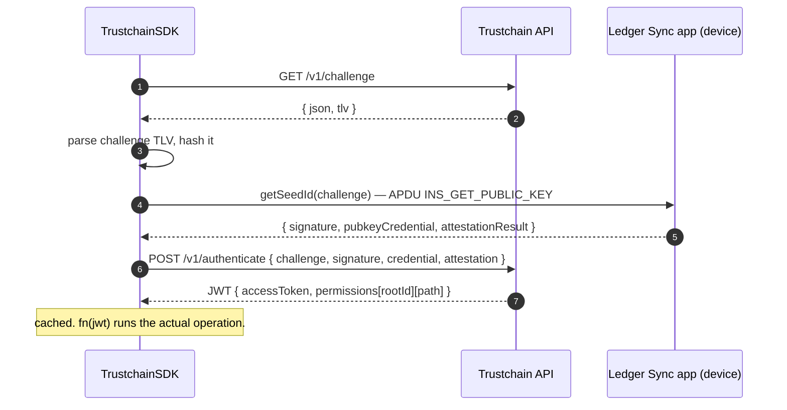
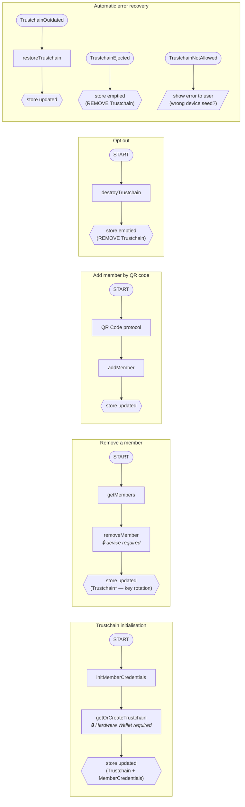
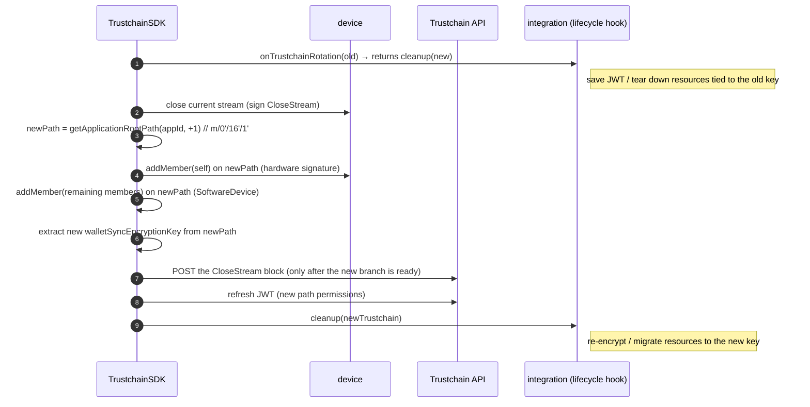
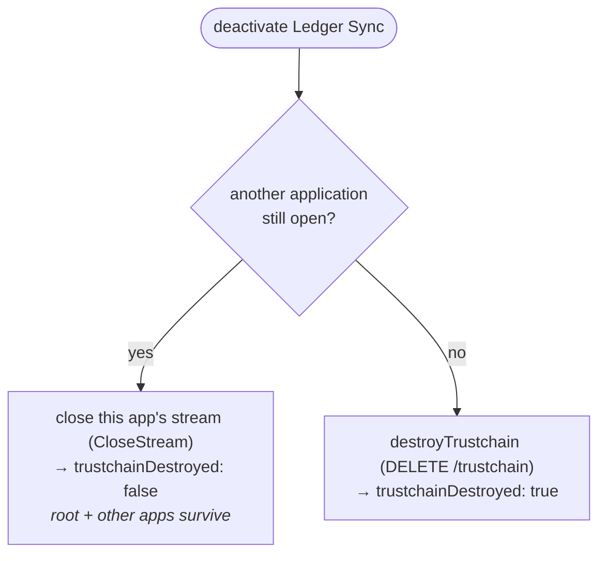

# 2 · TrustchainSDK

> Layer 2 of the [Ledger Sync stack](./README.md). Code:
> [`libs/ledger-key-ring-protocol/src`](../../libs/ledger-key-ring-protocol/src) ·
> interface: [`src/types.ts`](../../libs/ledger-key-ring-protocol/src/types.ts) (formerly `trustchain`).

**TrustchainSDK** is the main entry point of the LKRP library. It provides everything needed
to **create, modify and destroy** the Trustchain for a given Ledger Wallet instance. That
instance becomes a **member** of the Trustchain, authenticating with a **MemberCredentials**
(a public/private key pair).

> [!NOTE]
> See also the protocol specs:
> [Trustchain specifications](https://ledgerhq.atlassian.net/wiki/spaces/TA/pages/4105207815) ·
> [backend doc](https://ledgerhq.atlassian.net/wiki/spaces/BE/pages/4207083651).

## The core objects (the "trustchain store")

Each instance keeps two objects locally:

```ts
// trustchain store (persisted per Ledger Wallet instance)
{
  trustchain: Trustchain | null,
  memberCredentials: MemberCredentials | null,
}

type MemberCredentials = {
  pubkey: string,      // this member's id
  privatekey: string,  // kept local only
}

type Trustchain = {
  rootId: string,                  // immutable id of the trustchain
  walletSyncEncryptionKey: string, // secret shared between members, encrypts Cloud Sync data
  applicationPath: string,         // m/0'/16'/0' — the branch we read the key from
}
```

- `walletSyncEncryptionKey` is derived at the `applicationPath` location of the
  [derivation tree](./01-hardware-lkrp.md#the-derivation-tree--the-application-path).
- `applicationPath` **rotates** (the last index increments) when the key must change — e.g.
  when a member is removed. See [key rotation](#key-rotation-on-member-removal).

## Public API

Exported from `getSdk()` ([`src/index.ts`](../../libs/ledger-key-ring-protocol/src/index.ts)),
implementing the `TrustchainSDK` interface ([`src/types.ts`](../../libs/ledger-key-ring-protocol/src/types.ts)).

| Method | Device? | What it does |
|---|---|---|
| `initMemberCredentials()` | — | Generate this instance's keypair (once, then persisted). |
| `withAuth(trustchain, creds, fn, policy?)` | — | Run `fn(jwt)` with a valid JWT; handles cache / refresh / re-auth. |
| `getOrCreateTrustchain(deviceId, creds, …)` | ✅ | Create the root + application branch, or join an existing one. Returns `{ type: "created" \| "updated" \| "restored", trustchain }`. |
| `restoreTrustchain(trustchain, creds)` | — | Re-derive the encryption key after a rotation. |
| `getMembers(trustchain, creds)` | — | List current members. Throws `TrustchainEjected` if we are no longer one. |
| `addMember(trustchain, creds, member)` | — | Add a member (no hardware — uses a `SoftwareDevice`). |
| `removeMember(deviceId, trustchain, creds, member, …)` | ✅ | Remove a member → **triggers key rotation**. Returns the new `Trustchain`. |
| `destroyTrustchain(trustchain, creds)` | — | Delete the whole trustchain (all applications). |
| `destroyApplication(trustchain, creds)` *(upcoming — [PR #18568](https://github.com/LedgerHQ/ledger-live/pull/18568))* | — | Close **only this application's** stream; destroy the whole trustchain only if it was the last open application. Returns `{ trustchainDestroyed }`. See [deactivation](#deactivating-ledger-sync-per-application-close). |
| `encryptUserData(trustchain, bytes)` / `decryptUserData(trustchain, bytes)` | — | Symmetric encrypt/decrypt with `walletSyncEncryptionKey`. Used by [CloudSyncSDK](./04-cloud-sync-sdk.md). |
| `invalidateJwt()` | — | Drop the cached JWT, forcing re-auth on the next call. |

## Authenticating with the device (JWT)

Every Trustchain API call is authorized by a **JWT** obtained by signing a server challenge
with the hardware wallet. `withAuth` wraps this and caches the token.



`withAuth(…, policy)` accepts a cache policy:

- `"cache"` — reuse the cached JWT while valid (default).
- `"refresh"` — `GET /v1/refresh` with the current token (used by the notifications stream).
- `"no-cache"` — always run the full challenge flow.

If the JWT lacks permission for `trustchain.applicationPath`, the SDK throws — see
[error recovery](#errors--automatic-recovery).

## Operations and their effect on the local store

Every SDK flow ultimately **updates or empties** the local trustchain store. This is the map
of integrations:



`encryptUserData` / `decryptUserData` are not part of any single flow — they are called by the
[wallet-sync watch loop](./06-watch-loop.md) through the [CloudSyncSDK](./04-cloud-sync-sdk.md)
to protect the data at rest.

## Key rotation (on member removal)

Removing a member must invalidate the old encryption key so the removed member can no longer
read future data. `removeMember` therefore opens a **new branch** of the derivation tree and
re-adds everyone except the removed member:



`restoreTrustchain` performs the read-only half of this: given a (possibly rotated) trustchain
it re-fetches the tree and re-derives `walletSyncEncryptionKey` at the current path.

## Deactivating Ledger Sync (per-application close)

> [!IMPORTANT]
> **Upcoming — [PR #18568](https://github.com/LedgerHQ/ledger-live/pull/18568).** A single
> Trustchain root is shared by several applications, each on its own
> [`m/0'/{applicationId}'/…` branch](./01-hardware-lkrp.md#the-derivation-tree--the-application-path)
> (Ledger Sync = `16`, wallet-cli ring = `17`).

Today both Ledger Sync and the wallet-cli ring deactivate via `destroyTrustchain` →
`DELETE /trustchain/{rootId}`, which destroys the **whole root**. So "Delete Sync" would also
wipe the ring, and `ring destroy` would wipe Ledger Sync.

PR #18568 introduces a `destroyApplication(trustchain, creds) → { trustchainDestroyed }`
primitive that **closes only the current application's stream** — signed with the member's
*software* key (no hardware device, matching today's UX) — and destroys the whole trustchain
only when it was the **last open application**.



The enabler is making a closed stream **observable client-side**: the resolver now exposes
`ResolvedCommandStream.isClosed()` (it previously ignored `CloseStream`), and
`StreamTree.getApplicationStreams()` / `hasAnotherOpenApplication()` enumerate the application
streams. Consequently `restoreTrustchain` and `getMembers` reject a closed stream with
`TrustchainEjected`, and `getOrCreateTrustchain` reopens on the next index after a close.

Because ejection is already handled by the [watch-loop recovery](#errors--automatic-recovery)
(`onTrustchainRefreshNeeded` → `resetTrustchainStore`), the **UI needs no change**; the
integrations' `useDestroyTrustchain` hooks simply call `destroyApplication` instead of
`destroyTrustchain`.

## Errors & automatic recovery

The SDK surfaces a small set of typed errors; the [watch loop](./06-watch-loop.md) reacts to
them automatically so the user rarely sees anything:

| Error | Meaning | Recovery |
|---|---|---|
| `TrustchainOutdated` | Our `applicationPath` is behind (a rotation happened). | `restoreTrustchain` → store updated, keep syncing. |
| `TrustchainEjected` | We are no longer a member (removed by someone else). | Empty the store (opt-out state). |
| `TrustchainNotAllowed` | JWT carries no permission for this trustchain. | Show error to the user — see [errors](./errors.md#trustchainnotallowed). |

## Trustchain API endpoints

| Method | Endpoint | Purpose |
|---|---|---|
| `GET` | `/v1/challenge` | Get an authentication challenge. |
| `POST` | `/v1/authenticate` | Exchange the signed challenge for a JWT. |
| `GET` | `/v1/refresh` | Refresh an expiring JWT. |
| `GET` | `/v1/trustchains` | List the member's trustchains. |
| `GET` | `/v1/trustchain/{id}` | Fetch the stream tree. |
| `POST` | `/v1/seed` | Create the root trustchain. |
| `POST` | `/v1/trustchain/{id}/derivation` | Add a derivation branch. |
| `PUT` | `/v1/trustchain/{id}/commands` | Append commands to a branch. |
| `DELETE` | `/v1/trustchain/{id}` | Destroy the trustchain. |
| `GET` (WS) | `/v1/qr` | WebSocket channel for [QR-code sync](./03-qr-code-protocol.md). |
