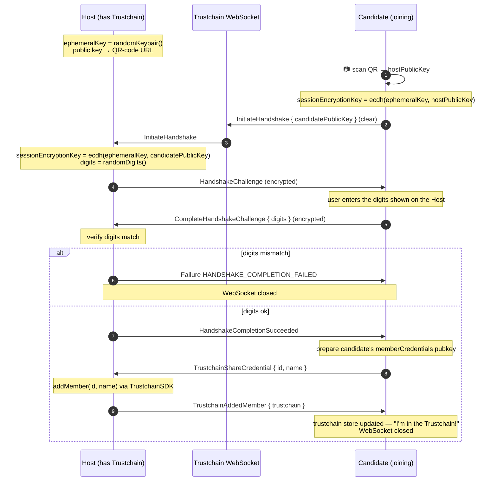

# 3 · QR-code sync protocol

> Part of [TrustchainSDK](./02-trustchain-sdk.md). Code:
> [`libs/ledger-key-ring-protocol/src/qrcode`](../../libs/ledger-key-ring-protocol/src/qrcode) ·
> see also [the product flow](https://ledgerhq.atlassian.net/wiki/spaces/WXP/pages/4652957708).

The QR-code protocol lets a user add a **second instance** to their Trustchain **without a
hardware wallet on the second device**: one instance displays a QR code, the other scans it,
and they perform an encrypted handshake over a WebSocket relayed by the Trustchain API.

## The two roles

| Role | Function | Does what |
|---|---|---|
| **Host** | `createQRCodeHostInstance()` | Generates an ephemeral keypair, encodes its public key in the QR-code URL, displays the QR. |
| **Candidate** | `createQRCodeCandidateInstance()` | Scans the QR, recovers the host public key, connects to the WebSocket. |

Both derive the **same session key** by ECDH over their ephemeral keys — the relay never sees
plaintext. A short **digit code** displayed on one screen and typed on the other defends
against a man-in-the-middle on the relay.

> [!IMPORTANT]
> The QR-code URL embeds an **ephemeral** public key, not a member identity. The session key
> protects the channel; the actual Trustchain membership is exchanged inside it.

## The handshake

The sequence below is the canonical flow where the **Host already owns the Trustchain** and the
Candidate joins it:



All messages after the handshake are encrypted with the session key and wrapped as:

```ts
{ version: 1, publisher: hex(pubkey), message: "<MessageType>", payload: { encrypted } }
```

## The symmetric case

The protocol is symmetric about *who already holds the Trustchain*. The code branches right
after `HandshakeCompletionSucceeded`:

- If the **Candidate** already has a Trustchain and the Host is the newcomer, the Candidate
  sends `TrustchainRequestCredential`; the Host replies with `TrustchainShareCredential`, the
  Candidate calls `addMember` for the Host and returns `TrustchainAddedMember`.
- If the Host holds it (diagram above), the roles of "who calls `addMember`" are reversed.

Either way the outcome is the same: the newcomer ends up as a member and receives the
`Trustchain` object, with the local store updated.

## Sequence enforcement

Each side runs its messages through a single-use state machine
([`protocol.ts`](../../libs/ledger-key-ring-protocol/src/qrcode/protocol.ts)) covering both what
it receives and what it sends. A message is only accepted at the one point of the sequence where
it is expected:

```text
init → initiated → challenged → pin-exchanged → authenticated → … → finished
```

| State | Next message | Host | Candidate |
|---|---|---|---|
| `init` | `InitiateHandshake` | receives | sends |
| `initiated` | `HandshakeChallenge` | sends | receives |
| `challenged` | `CompleteHandshakeChallenge` | receives | sends |
| `pin-exchanged` | `HandshakeCompletionSucceeded` | sends | receives |
| `authenticated` | `TrustchainShareCredential` / `TrustchainRequestCredential` | receives | sends |

The handshake being symmetric, the candidate runs the same table with every direction flipped.
From `authenticated` on, the remaining states (`credential-shared`, `credential-requested`,
`credential-returned`) follow the two branches of [the symmetric case](#the-symmetric-case), and
only the side that owns the Trustchain reaches the `TrustchainAddedMember` it sends.

The host binds the publisher of the first message it accepts — an `InitiateHandshake`, whose
`publisher` must be the `ephemeral_public_key` it carries — and every later message must repeat
it; the candidate likewise only accepts the publisher encoded in the scanned URL. A duplicate,
out-of-order or foreign message rejects with a `QRCodeProtocolError` and closes the WebSocket —
`addMember` is never called and no `Trustchain` is disclosed before the `authenticated` state.

Every encrypted frame is decrypted before it is acted upon, including the two that carry nothing
(`HandshakeCompletionSucceeded`, `TrustchainRequestCredential`): opening a frame is what proves it
comes from the peer holding the session key rather than from the relay. `Failure` is the one
message that is neither encrypted nor authenticated, so it is only taken from `pin-exchanged` on,
the states from which a side can legitimately emit one.
