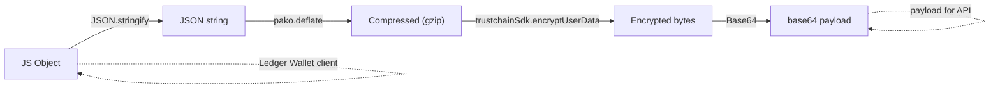
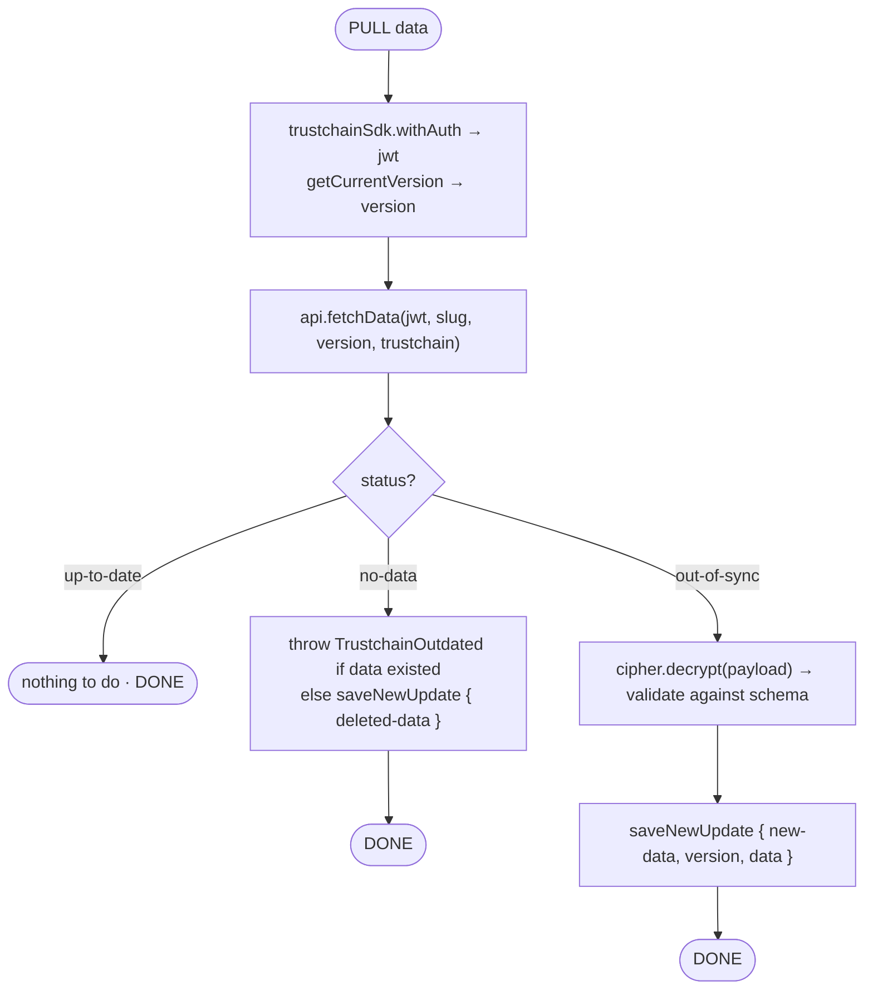
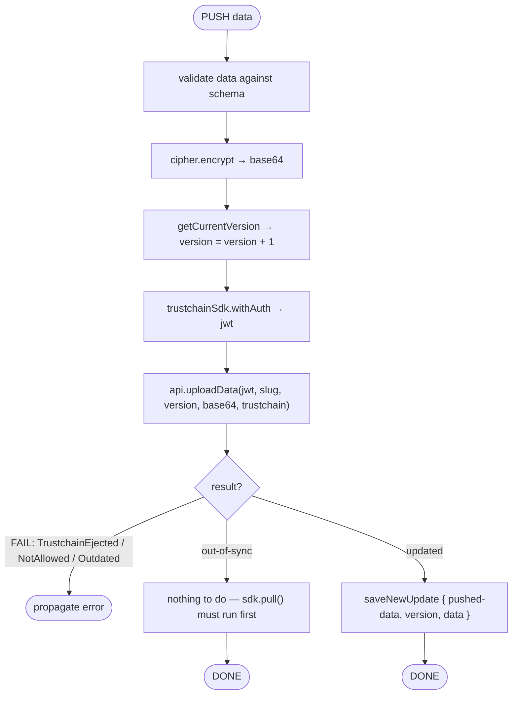
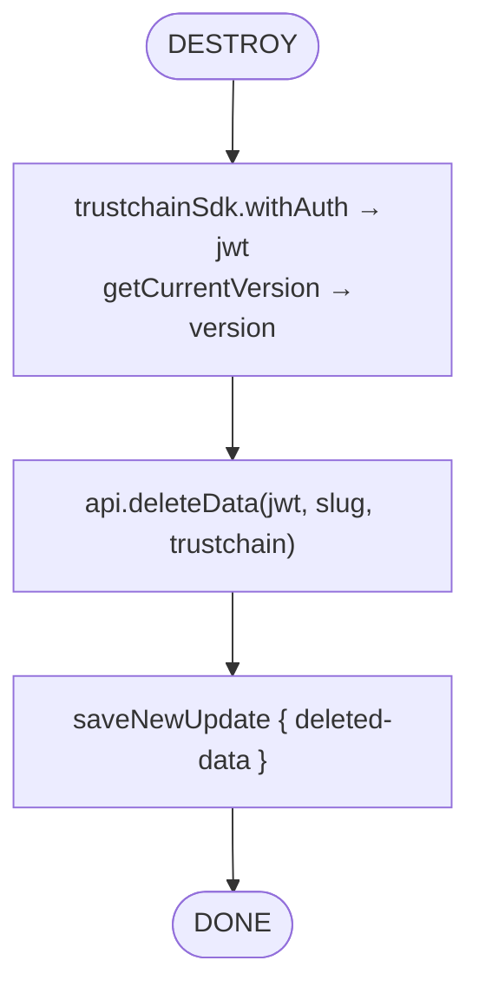

# 4 · CloudSyncSDK

> Layer 3 of the [Ledger Sync stack](./README.md). Code:
> [`libs/live-wallet/src/cloudsync`](../../libs/live-wallet/src/cloudsync) ·
> [backend doc](https://ledgerhq.atlassian.net/wiki/spaces/BE/pages/4161175870).

`CloudSyncSDK` stores and retrieves the **encrypted** wallet-sync data. It is deliberately
**generic** (it knows nothing about accounts) and exposes three atomic operations plus a
notifications stream:

```ts
interface CloudSyncSDKInterface<Data> {
  pull(trustchain, memberCredentials): Promise<void>;
  push(trustchain, memberCredentials, data: Data): Promise<void>;
  destroy(trustchain, memberCredentials): Promise<void>;
  listenNotifications(trustchain, memberCredentials): Observable<number>;
}
```

It is constructed with a `slug` (e.g. `"live"`), the Zod `schema` for `Data`, a `trustchainSdk`,
a `getCurrentVersion()` accessor and a `saveNewUpdate` callback — the callback is how the
generic SDK hands results back to the [wallet-sync layer](./05-wallet-sync-data-manager.md).

> [!IMPORTANT]
> The decoupling is intentional: `CloudSyncSDK` is a thin layer over the Cloud Sync API, but it
> still owns **atomicity**. The processing of pulled data happens *inside* `pull()` (via
> `saveNewUpdate`) so that pull/push behave as truly atomic operations, free of race conditions.

## The cipher layers

Data is JSON, gzip-compressed, encrypted with the Trustchain key, then base64-encoded
([`cipher.ts`](../../libs/live-wallet/src/cloudsync/cipher.ts)):



`cipher.encrypt` runs left→right (push); `cipher.decrypt` runs right→left (pull). The Cloud Sync
API only ever sees the opaque `base64 payload`.

## The UpdateEvent

Every operation reports its outcome to `saveNewUpdate` as one of:

```ts
type UpdateEvent<Data> =
  | { type: "new-data";    data: Data; version: number }  // pulled from backend
  | { type: "pushed-data"; data: Data; version: number }  // our push succeeded
  | { type: "deleted-data" };                              // data was deleted
```

> [!NOTE]
> Although it looks like events, this is **not** an event system: each call `await`s the
> `saveNewUpdate` promise, because we must *wait* for the local processing to finish to
> guarantee atomicity.

## pull()



## push()



> [!CAUTION]
> `out-of-sync` on push means another instance pushed concurrently. We do **not** force-write;
> the next `pull()` reconciles first. This is the optimistic-locking guarantee.

## destroy()



## Atomicity & versioning

- **Single in-flight lock**: `pull`, `push`, and `destroy` share one lock — a concurrent call
  rejects with `CloudSyncSDK locked (...)`. Combined with the watch-loop semaphore, only one
  operation ever runs at a time.
- **Optimistic locking**: each push commits `version + 1`; the backend accepts it only if it
  matches `serverVersion + 1`, otherwise returns `out-of-sync`.
- `saveNewUpdate` must persist the **data and the version together**, so local state and version
  never drift apart.

## listenNotifications() (optional)

A WebSocket (`/atomic/v1/{slug}/notifications`) that emits the latest version number so an
instance can pull immediately instead of waiting for the next poll.

- Client sends the JWT on connect, and again on `"JWT expired"`.
- Server `"ping"` → client `"pong"` heartbeat.
- Numeric messages are emitted as versions; the Observable completes on close.

## Cloud Sync API endpoints

All under `/atomic/v1/{slug}`, query `id={rootId}&path={applicationPath}`, `Authorization: Bearer {jwt}`:

| Method | Response | Meaning |
|---|---|---|
| `GET` | `{ status: "no-data" }` / `"up-to-date"` / `{ status: "out-of-sync", version, payload, date, info }` | Fetch with version check. |
| `POST` (body `{ payload }`) | `{ status: "updated" }` / `{ status: "out-of-sync", … }` | Atomic upsert (optimistic lock). |
| `DELETE` | `204` | Delete the data. |
| `GET` (WS) `/notifications` | version numbers | Real-time version stream. |
