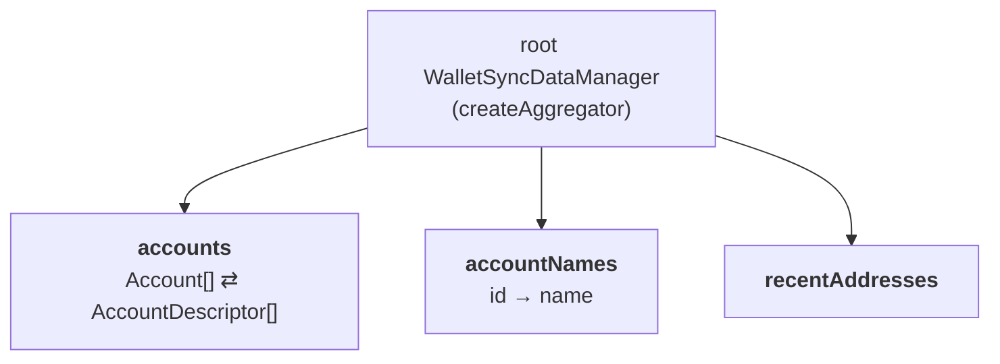
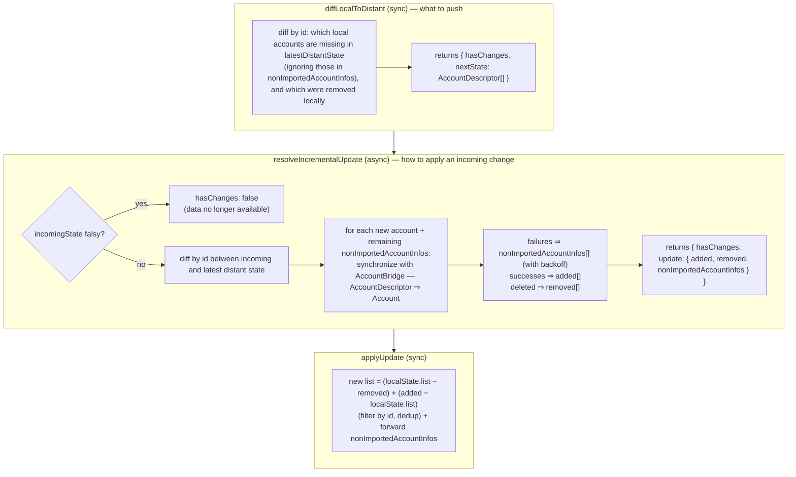

# 5 · WalletSyncDataManager

> Layer 4 of the [Ledger Sync stack](./README.md). Code:
> [`libs/live-wallet/src/walletsync`](../../libs/live-wallet/src/walletsync).

`WalletSyncDataManager` is where Ledger Wallet's world (rich `Account` objects, names, …) meets
the wallet-sync data model (minimal descriptors stored in Cloud Sync). It owns all the
**reconciliation** between local and distant state.

## Four concepts

| Concept | Role | 💡 In short |
|---|---|---|
| **LocalState** | All the data the client holds locally. | the **INPUT** of reconciliation |
| **DistantState** | The subset stored in Cloud Sync (enough to restore LocalState). | the **OUTPUT** of reconciliation |
| **Update** | A payload describing the mutation to apply to LocalState. | a **MUTATION** on LocalState |
| **Schema** | A Zod type validating what we store in Cloud Sync. | a **Zod description** of DistantState |

The whole system is captured by one equation — *new local state = old local state, plus the
distant transition*:

```
stateB = stateA + (distA → distB)
```

## The interface

```ts
interface WalletSyncDataManager<LocalState, Update, Schema extends ZodType,
                                 DistantState = z.infer<Schema>> {
  schema: Schema;
  diffLocalToDistant: (local: LocalState, latest: DistantState | null) => DistantDiff<DistantState>;
  resolveIncrementalUpdate: (ctx, local: LocalState, latest: DistantState | null,
                             incoming: DistantState | null) => Promise<UpdateDiff<Update>>;
  applyUpdate: (local: LocalState, update: Update) => LocalState;
}
```

- **`diffLocalToDistant`** — *synchronous*. Did the local state diverge from the last known
  distant state? Returns `{ hasChanges, nextState }` — what we should **push**.
- **`resolveIncrementalUpdate`** — *asynchronous*. Given a distant transition `latest → incoming`,
  what `Update` should we apply locally? May fetch from the blockchain (e.g. full account sync).
- **`applyUpdate`** — *synchronous*. `stateA + Update → stateB`. Agnostic to how the integration
  stores the state.

In pseudo-code, push decision and pull resolution are:

```
distB ?= diffLocalToDistant(stateB, distA)               // what to push

resolution = await resolveIncrementalUpdate(ctx, stateA, distA, distB)
if (resolution.hasChanges) stateB = applyUpdate(stateA, resolution.update)
```

## A modular architecture

To make new synced features cheap to add, the manager is **composed of feature modules**, each
implementing the interface for its own slice of the data. An `createAggregator` builds one root
manager that dispatches every field to its module and re-aggregates the results — all types are
inferred automatically.



Current modules ([`root.ts`](../../libs/live-wallet/src/walletsync/root.ts)):

```ts
const modules = { accounts, accountNames, recentAddresses };
const root = createAggregator(modules);
// DistantState = { accounts?, accountNames?, recentAddresses? }   (each field optional)
```

> [!NOTE]
> The Confluence docs only listed `accounts` and `accountNames`; a third module
> **`recentAddresses`** has since been added. The point of the design is exactly this: adding a
> module (e.g. a future swap history) does not touch the others.

> [!TIP]
> Forward compatibility: the aggregator **preserves unknown fields** of the distant state it
> doesn't recognise, and every module field is optional. This lets different app versions
> (which may know more or fewer modules) sync against the same data without clobbering it.
> See [scenarios](./scenarios.md): *preserves unknown fields*, *compatibility tests*.

## The `accounts` module

The most involved module ([`modules/accounts.ts`](../../libs/live-wallet/src/walletsync/modules/accounts.ts)).

- **LocalState**: `{ list: Account[], nonImportedAccountInfos }` — the full rich accounts plus a
  queue of accounts that failed to import (for retry).
- **DistantState**: `AccountDescriptor[]` — the minimum to restore an account:

  ```ts
  type AccountDescriptor = {
    id: string; currencyId: string; freshAddress: string;
    seedIdentifier: string; derivationMode: string; index: number;
  };
  ```



> [!IMPORTANT]
> Restoring an account is **not** free: from an `AccountDescriptor` we must run a full
> `AccountBridge` synchronisation (network) to rebuild the `Account`. This can fail (currency
> unsupported, network down…). Failures are not lost — they go to `nonImportedAccountInfos` and
> are **retried with exponential backoff** (≈30s, then ×1.3 each attempt, capped at 2h). The
> [watch loop](./06-watch-loop.md) drives the retry via `localIncrementalUpdate`.

## The `accountNames` module

Minimal ([`modules/accountNames.ts`](../../libs/live-wallet/src/walletsync/modules/accountNames.ts)):
`Map<id, name>` locally, `Record<id, name>` distant, **last-write-wins** (an incoming state that
differs from both local and latest replaces all names). Names are applied on top of the UI, not
on the blockchain.

> [!NOTE]
> This module is explicitly expected to evolve — see [LIVE-13452](https://ledgerhq.atlassian.net/browse/LIVE-13452).
