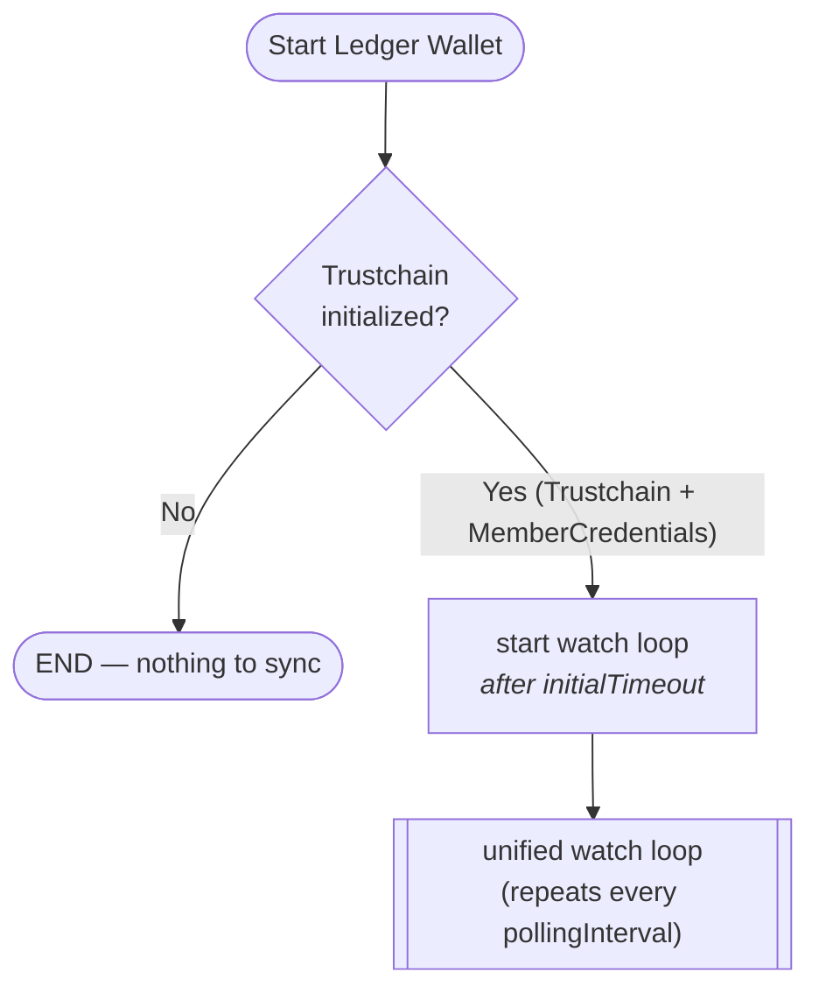
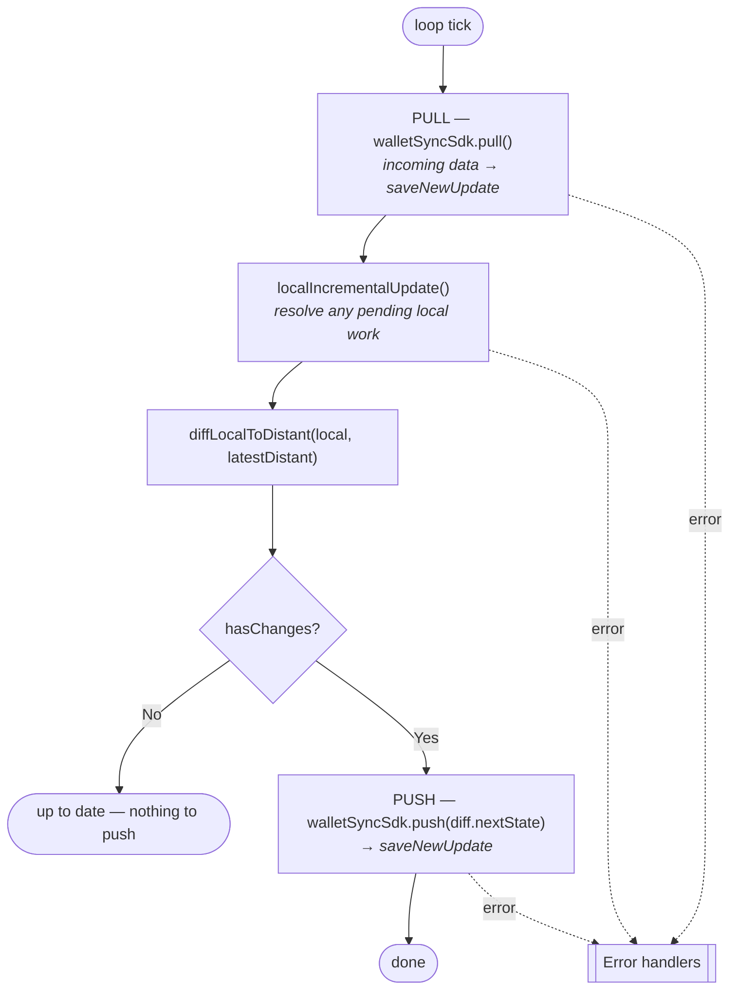
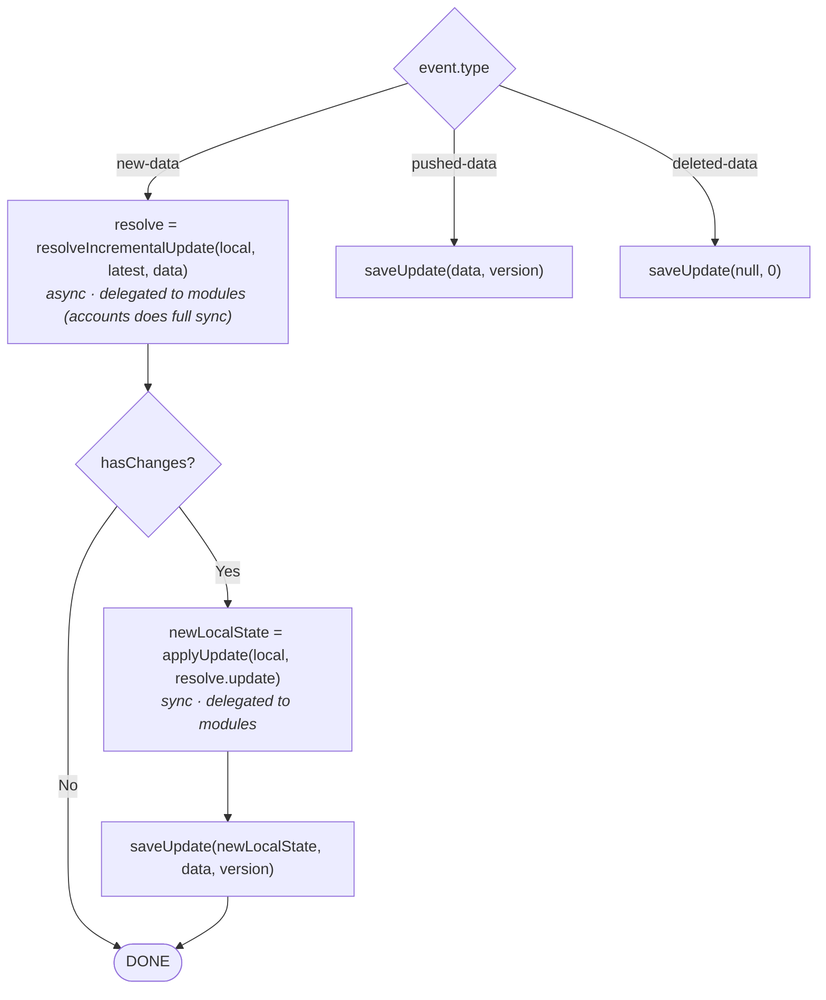
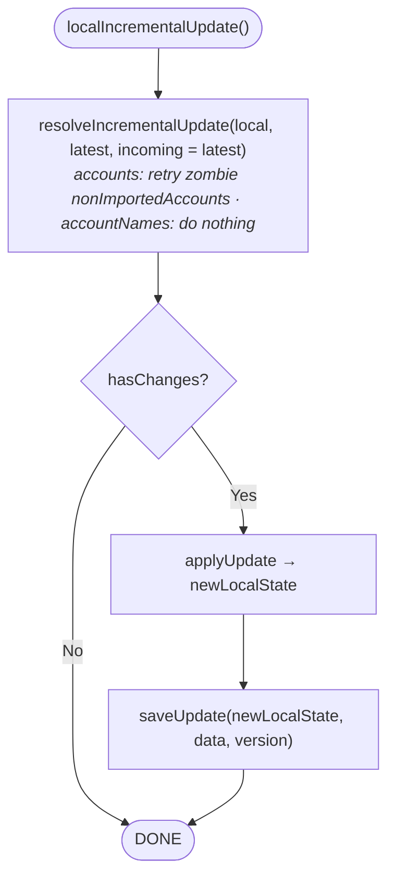

# 6 · The watch loop

> How everything above runs continuously inside a Ledger Wallet instance. Code:
> [`createWalletSyncWatchLoop.ts`](../../libs/live-wallet/src/walletsync/createWalletSyncWatchLoop.ts) ·
> [`incrementalUpdates.ts`](../../libs/live-wallet/src/walletsync/incrementalUpdates.ts).

The watch loop is the lifecycle that ties [CloudSyncSDK](./04-cloud-sync-sdk.md) and the
[WalletSyncDataManager](./05-wallet-sync-data-manager.md) together so the app stays in sync
**automatically** — the user does nothing.

## Startup

The loop only starts when the [Ledger Sync feature flag](./07-app-integration.md#feature-flags--entry-points)
is enabled **and** a `trustchain` + `memberCredentials` exist.

> [!NOTE]
> Timing is configurable via `watchConfig`. Code defaults: `initialTimeout` 1 s,
> `pollingInterval` 10 s, `userIntentDebounce` 1 s. (The original diagram showed 5 s / 10 s.)

## The unified watch loop

One iteration, guarded by a `pending` flag so iterations never overlap:

**Error handling**: `TrustchainEjected` / `TrustchainOutdated` trigger
`onTrustchainRefreshNeeded` (which [restores or empties the trustchain](./02-trustchain-sdk.md#errors--automatic-recovery));
any other error goes to `onError`.

> [!TIP]
> A **user intent** (rename, manual refresh, …) calls `onUserRefreshIntent()`, which reschedules
> the next tick to `userIntentDebounce` (≈1 s) instead of waiting a full `pollingInterval` — so
> the change propagates almost immediately. An optional WebSocket
> ([listenNotifications](./04-cloud-sync-sdk.md#listennotifications-optional)) can trigger a tick
> the moment another instance pushes.

## `saveNewUpdate` — applying an incoming update

`CloudSyncSDK.pull()` hands each [UpdateEvent](./04-cloud-sync-sdk.md#the-updateevent) to the
`saveNewUpdate` callback built by `makeSaveNewUpdate`. This is the glue that runs the data
manager and then asks the integration to persist via its own `saveUpdate`:

> [!IMPORTANT]
> `saveUpdate` is provided by **each integration** — it's where the result lands in the app's
> store (Redux for Desktop/Mobile, local React state for the web-tools). See
> [app integration](./07-app-integration.md#the-saveupdate-callback).

## `localIncrementalUpdate` — draining pending local work

`localIncrementalUpdate` is a variant of `saveNewUpdate` with **no incoming data**: it passes the
`latest` distant state as *both* the current and incoming state to `resolveIncrementalUpdate`.
Modules that have nothing local to do return early; modules with pending work act.

> [!NOTE]
> This exists because the `accounts` module stores failed imports as
> [`nonImportedAccountInfos`](./05-wallet-sync-data-manager.md#the-accounts-module). Like a
> garbage collector, these "zombies" must be periodically retried even when no new distant data
> arrives — that's the job of `localIncrementalUpdate` on every tick.
