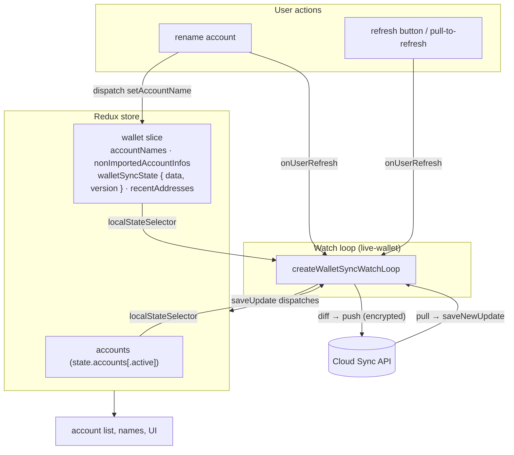

# 7 · App integration (Desktop & Mobile)

> How [the watch loop](./06-watch-loop.md) is wired into the two apps. Code:
> `apps/ledger-live-desktop` (LWD) and `apps/ledger-live-mobile` (LWM), under
> `src/mvvm/features/WalletSync/`.

The [`live-wallet`](../../libs/live-wallet) library is integration-agnostic: it exposes the
watch loop and asks each app to provide **selectors**, a **`saveUpdate`** function, the **SDK
instances** and a few **callbacks**. Desktop and Mobile wire those into Redux + React almost
identically.

## The wiring

Each app mounts a `<WalletSyncProvider>` near the root (LWD `renderer/Default.tsx`, LWM
`AppProviders.tsx`). The provider runs `useWatchWalletSync()`, which:

1. builds the `TrustchainSDK` (`useTrustchainSdk`) and `CloudSyncSDK` (`useCloudSyncSDK`),
2. starts the watch loop with the app's selectors + `saveUpdate`,
3. returns `{ visualPending, walletSyncError, onUserRefresh }` via context
   (`useWalletSyncUserState()`), consumed by the UI (refresh button, error badge).

The loop only runs when the feature flag is on and `trustchain` + `memberCredentials` exist;
the returned `unsubscribe` tears it down on unmount / dependency change.



## What each app provides

| Contract | Desktop / Mobile implementation |
|---|---|
| `localStateSelector` | `{ accounts: { list, nonImportedAccountInfos }, accountNames, recentAddresses }` read from Redux. **LWD** reads `state.accounts`; **LWM** reads `state.accounts.active`. |
| `latestDistantStateSelector` / `latestDistantVersionSelector` | from `walletSelector(state).walletSyncState` (`{ data, version }`). |
| `saveUpdate` | dispatches into Redux — see below. |
| `onTrustchainRefreshNeeded` | restores or empties the trustchain store (handles `TrustchainOutdated` / `TrustchainEjected`). |
| `onError` / `setVisualPending` / `onUserRefreshIntent` | surface error + spinner; debounce expedited pulls. |

### The `saveUpdate` callback

This is the bridge from sync results back into the app store. On an incoming update it dispatches:

```ts
dispatch(walletSyncUpdate(data, version));          // persist distant state + version
if (newLocalState) {
  dispatch(setNonImportedAccounts(newLocalState.accounts.nonImportedAccountInfos));
  dispatch(setAccountNames(newLocalState.accountNames));
  dispatch(updateRecentAddresses(newLocalState.recentAddresses));
  dispatch(replaceAccounts(newLocalState.accounts.list)); // updates the global account list + DB
}
```

Account **names** are stored in a `Map<id, name>` (the `wallet` slice) and applied on top of the
UI via selectors; they are not part of the `Account` object itself.

### Building the SDKs

`useTrustchainSdk` constructs the SDK with context `{ applicationId: 16, name: <instance name>,
apiBaseUrl }`, where `name` is the user-set instance name and the URLs come from the feature
flag's `environment` param. `useCloudSyncSDK` builds `new CloudSyncSDK({ slug: "live", schema:
walletsync.schema, trustchainSdk, getCurrentVersion, saveNewUpdate })`.

A `trustchainLifecycle` implementing the `onTrustchainRotation` hook is passed to the SDK so
that, on a [key rotation](./02-trustchain-sdk.md#key-rotation-on-member-removal), the Cloud Sync
data is re-encrypted with the new key (deleting the data tied to the old key and re-pushing).

## Feature flags & entry points

| | Desktop | Mobile |
|---|---|---|
| Feature flag | `lldWalletSync` | `llmWalletSync` |
| Accounts source | `state.accounts` | `state.accounts.active` |
| Manual refresh | top-bar `ActivityIndicator` | `RefreshControl` (pull-to-refresh) |
| Activation entry | Settings entry point + `WalletSync/Drawer` | `Settings/General/WalletSyncRow` + `ActivationDrawer` |

The activation/management UI is a multi-flow drawer — **Activation**, **Synchronize** (add an
instance, incl. [QR-code](./03-qr-code-protocol.md)), **ManageInstances**, **ManageBackup** —
backed by a dedicated `walletSync` UI reducer (flow/step/drawer visibility), separate from the
synced `wallet` data slice.

> [!NOTE]
> The `useDestroyTrustchain` hook calls
> [`destroyApplication`](./02-trustchain-sdk.md#deactivating-ledger-sync-per-application-close)
> instead of `destroyTrustchain`, so deactivating Ledger Sync no longer wipes other applications
> sharing the same trustchain root (e.g. the wallet-cli ring). No UI change — ejection is already
> handled by the watch-loop recovery.

> [!TIP]
> "One identity = one Ledger Wallet instance." Because the watch loop is per-instance, the
> [web-tools playground](./cookbook.md#test-on-the-web-tools-playground) can simulate many
> instances at once (one per browser tab) to test propagation between members.
