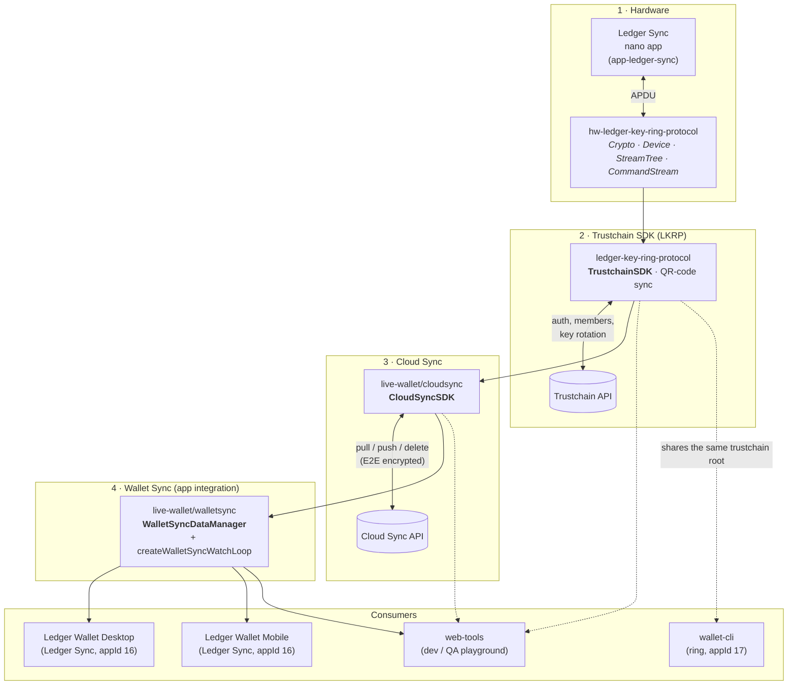

# Ledger Sync — Technical Documentation

Ledger Sync lets a user's wallet data (their list of accounts, account names, …) live
**beyond a single Ledger Wallet instance** and stay synchronized, end-to-end encrypted,
across every instance the user owns (Desktop, Mobile, and the dev web-tools).

> [!NOTE]
> The general philosophy is that it must be **effortless for the user**: there is almost
> nothing to set up, everything is automated. All the complexity of reconciling state and
> handling every edge case is on us. This is why the feature is built as a **stack of
> layers**, from the hardware up to the app, each with its own tests.

This documentation was migrated from the
[Ledger Sync — Tech Documentation](https://ledgerhq.atlassian.net/wiki/spaces/WXP/pages/4539121797)
Confluence space and re-grounded on the current code. All diagrams are rebuilt as Mermaid.

## Index

The docs go from the lowest layer to the highest, but **each one stands alone** — jump straight
to what you need.

| Doc | What it covers | Start here if you… |
|---|---|---|
| [Hardware & LKRP low level](./01-hardware-lkrp.md) | nano app + `hw-ledger-key-ring-protocol`: APDU, StreamTree, the derivation tree | work on the protocol / crypto / device |
| [TrustchainSDK](./02-trustchain-sdk.md) | auth, members, key rotation, deactivation, the Trustchain object & state | manage members / auth / deactivation |
| [QR-code sync protocol](./03-qr-code-protocol.md) | adding a member by scanning a QR code | build the add-an-instance flow |
| [CloudSyncSDK](./04-cloud-sync-sdk.md) | cipher layers, atomic pull/push/delete, versioning | store/retrieve the synced data |
| [WalletSyncDataManager](./05-wallet-sync-data-manager.md) | modular reconciliation, local ⇄ distant | add a new synced data type |
| [The watch loop](./06-watch-loop.md) | how it runs continuously inside an app | debug sync timing / lifecycle |
| [App integration](./07-app-integration.md) | wiring into Ledger Wallet Desktop & Mobile (Redux/React) | work in the apps (LWD/LWM) |
| [Cookbook](./cookbook.md) | install the app, web-tools playground, add a module | get hands-on |
| [Behaviour scenarios](./scenarios.md) | the catalogue of guaranteed behaviours | check what's guaranteed/tested |
| [User-facing errors](./errors.md) | errors a user can actually see | triage an error |
| [Test strategy](./test-strategy.md) | deterministic scenario + unit testing | write or understand the tests |

## A note on naming: Trustchain vs. LKRP

The protocol that secures Ledger Sync was historically called **Trustchain**. It has since
been productized as the **Ledger Key Ring Protocol (LKRP)** and the libraries were renamed:

| Old name (Confluence) | Current code location |
|---|---|
| `hw-trustchain` | [`libs/hw-ledger-key-ring-protocol`](../../libs/hw-ledger-key-ring-protocol) |
| `trustchain` | [`libs/ledger-key-ring-protocol`](../../libs/ledger-key-ring-protocol) |

The **domain types are unchanged** — the code still uses `Trustchain`, `MemberCredentials`,
`TrustchainSDK`, `TrustchainOutdated`, etc. So throughout these docs "Trustchain" refers to
the protocol/objects and "LKRP" to the library/product that implements it.

## The layered architecture

From the lowest level (hardware) to the highest (the app the user sees):

> [!NOTE]
> A single trustchain root can host **several applications**, each on its own derivation branch
> keyed by `applicationId` (Ledger Sync = `16`, wallet-cli `ring` = `17`). They must coexist
> without ejecting each other — see the `ringInitPreservesLedgerSyncMember` scenario and
> [per-application deactivation](./02-trustchain-sdk.md#deactivating-ledger-sync-per-application-close).

- The **encryption key** used by Cloud Sync (`walletSyncEncryptionKey`) is derived and shared
  securely through the Trustchain — the Cloud Sync API only ever stores opaque encrypted blobs.
- Each higher layer is a thin, well-tested abstraction over the one below it.

## Components

| Component | Code | What it does |
|---|---|---|
| Ledger Sync app | [app-ledger-sync](https://github.com/LedgerHQ/app-ledger-sync) | Hardware-wallet app that lets us create the Trustchain. |
| hw-ledger-key-ring-protocol | [`libs/hw-ledger-key-ring-protocol`](../../libs/hw-ledger-key-ring-protocol) | Talks to the app over APDU; exposes `Crypto`, `Device`, `StreamTree`, `CommandStream`. |
| ledger-key-ring-protocol | [`libs/ledger-key-ring-protocol`](../../libs/ledger-key-ring-protocol) | `TrustchainSDK`: create/modify/destroy the Trustchain, member management, QR-code sync, the encryption key. |
| Trustchain API | [trustchain-backend](https://github.com/LedgerHQ/trustchain-backend) | CRUD-like API for Trustchain operations + authentication. |
| live-wallet / cloudsync | [`libs/live-wallet/src/cloudsync`](../../libs/live-wallet/src/cloudsync) | `CloudSyncSDK`: atomic pull / push / delete of the encrypted wallet-sync data. |
| Cloud Sync API | [cloud-sync-backend](https://github.com/LedgerHQ/cloud-sync-backend) | Stores encrypted data, authenticated via the Trustchain API. |
| live-wallet / walletsync | [`libs/live-wallet/src/walletsync`](../../libs/live-wallet/src/walletsync) | Bridges Ledger Wallet's world (accounts, …) with the wallet-sync data model; the watch-loop lifecycle. |
| web-tools | [`apps/web-tools/src/trustchain`](../../apps/web-tools/src/trustchain) · [live.ledger.tools/trustchain](https://live.ledger.tools/trustchain) | Dev/QA tools to debug Trustchain, Cloud Sync and test synchronization across simulated instances. |

> [!TIP]
> High-level first? Start at [App integration](./07-app-integration.md) or
> [the watch loop](./06-watch-loop.md). Going deep? Follow the index top to bottom.
