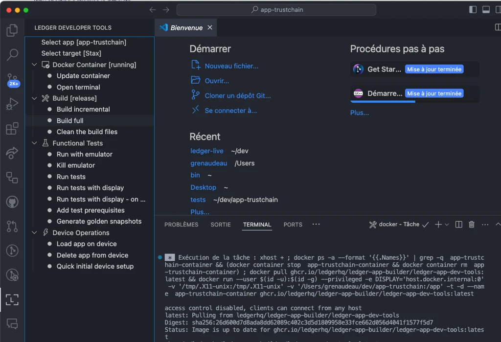
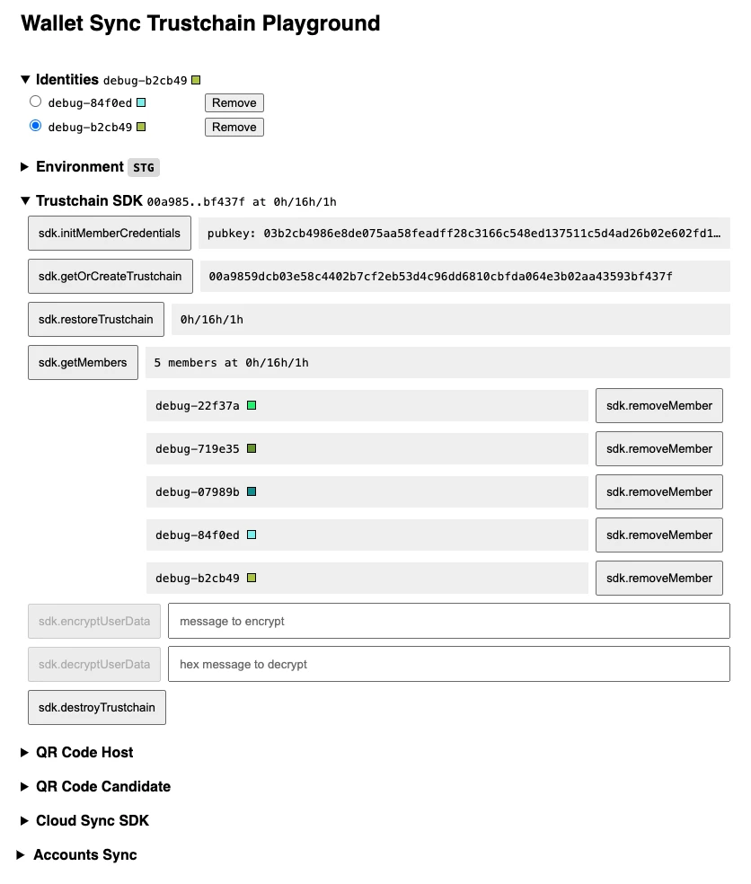
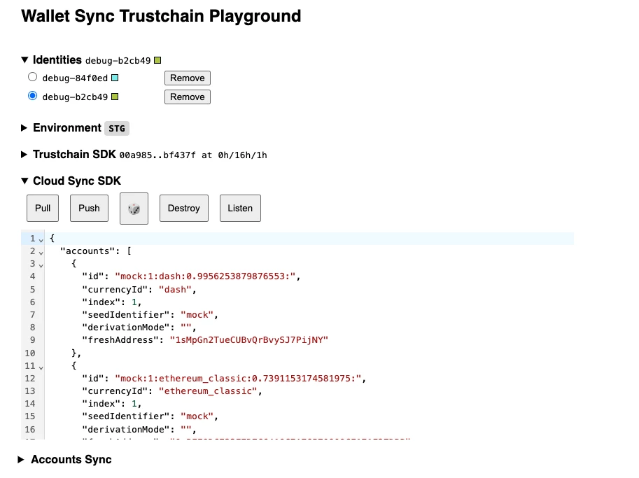
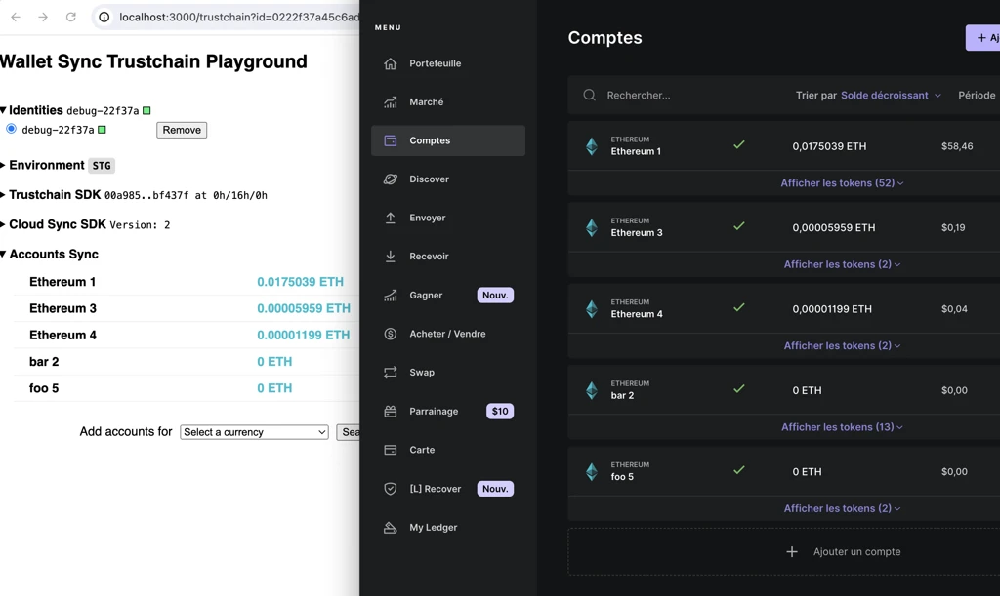

# Cookbook

Practical how-tos for working on Ledger Sync.

## Install the Ledger Sync app on your hardware wallet

### From My Ledger (testing providers)

The app is deployed on the testing providers, keyed by device:

| Provider | Device |
|---|---|
| 80 | Nano X (LNX) |
| 81 | Nano S Plus (LNSP) |
| 82 | Flex |
| 83 | Stax |

### By building it (advanced)

1. Clone [`app-ledger-sync`](https://github.com/LedgerHQ/app-ledger-sync/tree/seed-id) on the
   `seed-id` branch.
2. Make sure **Docker** is running.
3. Open the project in **VS Code** with the **Ledger Develop Tools** extension installed.
4. Build with **Ledger Develop Tools**.
5. Plug a device (works with **Stax** or **Nano S Plus**) and use **Load app on device**.
6. On the device, accept the unsecured-install prompts to finish installing.

## Test on the web-tools playground

For the first time in Ledger Wallet's history, a user's data lives **beyond a single instance**.
To test this you need several instances at once — which LWD/LWM can't do on one machine. The
**web-tools** simulate extra instances: open as many browser tabs as you want, each is a
different instance/member.

Deployed automatically from `develop`: **[live.ledger.tools/trustchain](https://live.ledger.tools/trustchain)**
(code: [`apps/web-tools/src/trustchain`](../../apps/web-tools/src/trustchain)).

The UI follows the [architecture layers](./README.md#the-layered-architecture). Two global panels
sit on top:

- **Identities** — each identity = one simulated Ledger Wallet instance (state stored in the
  browser, shared across tabs). The selected identity is contextual to every panel below.
- **Environment** — switch API, mock the SDK, tweak the allowed-currencies list (handy to
  simulate an unsupported-currency sync failure), etc.

Then come the three integration levels, following the architecture:

### Trustchain SDK level

Auth and member management. Start with `initMemberCredentials`, then run actions in order (a
button enables once its dependencies are met, e.g. `getOrCreateTrustchain` needs a device auth
token, so `authWithDevice` first). Device actions require a plugged device with the Ledger Sync
app open. Hover a button for a description.

> [!TIP]
> Multi-instance demo (video, linked on Confluence — not embedded):
> [test with multiple tabs](https://ledgerhq.atlassian.net/wiki/spaces/WXP/pages/4821843997)
> (showcase of [PR #7298](https://github.com/LedgerHQ/ledger-live/pull/7298)).

### Cloud Sync SDK level

Push / pull / delete / listen on the encrypted data directly. Some errors shown here are
technical and are handled automatically at the next level, so they stay invisible in the real app.

### Account Sync level

The closest to the real Ledger Wallet experience: automatic propagation and conflict
reconciliation across instances; import accounts, rename them, etc.

## Develop a new WalletSync module

The modular [WalletSyncDataManager](./05-wallet-sync-data-manager.md#a-modular-architecture)
design exists precisely so new synced features are cheap to add.

1. Read the [WalletSyncDataManager](./05-wallet-sync-data-manager.md) doc first.
2. Implement the interface (`schema`, `diffLocalToDistant`, `resolveIncrementalUpdate`,
   `applyUpdate`) for your slice of data in `libs/live-wallet/src/walletsync/modules/`.
3. Register it in [`root.ts`](../../libs/live-wallet/src/walletsync/root.ts) — types are inferred
   automatically by the aggregator.
4. Add state generators under `src/walletsync/__mocks__/modules/` (see the `__mocks__/README.md`)
   so the [generic tests](./test-strategy.md) exercise your module, plus a specific test.

> [!TIP]
> Video walkthrough — implementing an `accountFavorites` module in under 30 minutes:
> <https://youtu.be/oZSJp41lBVs>. For the advanced `nonImportedAccounts` topic see the
> [accounts module](./05-wallet-sync-data-manager.md#the-accounts-module).
