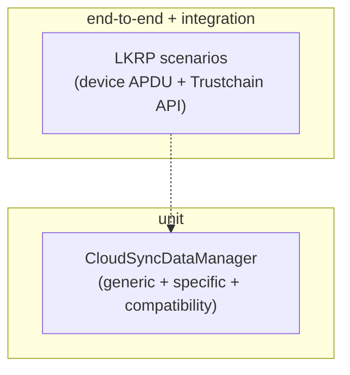

# Test strategy

Ledger Sync is tested at every layer of the [stack](./README.md), with carefully
**deterministic** tests so they run in CI without a device or network.



## Deterministic scenario tests (LKRP)

The [TrustchainSDK](./02-trustchain-sdk.md) has end-to-end **and** integration tests that run
fully deterministically by **mocking everything external**: HTTP via `msw`, device APDU via
`hw-transport-mocker`, and crypto randomness (monkey-patched).

The trick: a scenario is recorded **once** end-to-end against a real Speculos device + staging
API, then **replayed** deterministically forever after.

- Record missing snapshots: the lib's `e2e` script
  ([`scripts/e2e.ts`](../../libs/ledger-key-ring-protocol/scripts/e2e.ts)). To regenerate one,
  delete its JSON and re-run.
- Snapshots live in [`mocks/scenarios/*.json`](../../libs/ledger-key-ring-protocol/mocks/scenarios)
  (recorded `apdus`, `http.transactions`, and `crypto` randomness).
- Replayed by `src/__tests__/integration/sdk.test.ts` (against the real SDK) and the mock SDK.

A scenario is a single **isomorphic** TypeScript file — the *same* function is used to record and
to replay, so an assertion failure is caught in either mode. They live in
[`tests/scenarios/`](../../libs/ledger-key-ring-protocol/tests/scenarios) (start from
`_template.ts`). Example:

```ts
// tests/scenarios/tokenExpires.ts
export async function scenario(deviceId: string, { withDevice, pauseRecorder }: ScenarioOptions) {
  const apiBaseUrl = getEnv("TRUSTCHAIN_API_STAGING");
  const hwDeviceProvider = new HWDeviceProvider(apiBaseUrl, withDevice);
  const sdk = new SDK({ applicationId: 16, name: "Foo", apiBaseUrl }, hwDeviceProvider);
  const creds = await sdk.initMemberCredentials();

  const jwt1 = await hwDeviceProvider.withJwt(deviceId, jwt => Promise.resolve(jwt));
  await pauseRecorder(6 * 60 * 1000);
  const { trustchain } = await sdk.getOrCreateTrustchain(deviceId, creds);
  const jwt2 = await hwDeviceProvider.withJwt(deviceId, jwt => Promise.resolve(jwt));
  expect(jwt1).not.toEqual(jwt2); // jwt refreshed after expiry
  await sdk.destroyTrustchain(trustchain, creds);
}
```

(Some scenarios instead take a `sdkForName(name)` helper from `ScenarioOptions` to drive
several members in one scenario — see `_template.ts`.)

The recorder/replayer glue (< 200 LoC) is in `tests/test-helpers/`. See
[behaviour scenarios](./scenarios.md) for the catalogue of what these cover.

## CloudSyncDataManager unit tests

The [CloudSyncDataManager](./05-wallet-sync-data-manager.md) is tested per module:

- **Accounts** — [`libs/live-wallet/src/accounts/__tests__/cloudSyncModule.test.ts`](../../libs/live-wallet/src/accounts/__tests__/cloudSyncModule.test.ts)
- **Account names** — [`domain/entity/account-name/src/__tests__/`](../../domain/entity/account-name/src/__tests__/)
- **Recent addresses** — [`domain/entity/recent-addresses/src/__tests__/`](../../domain/entity/recent-addresses/src/__tests__/)
