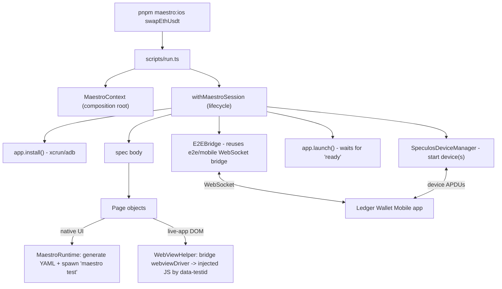

# E2E Tests - Mobile (Maestro POC)

This folder contains a **proof of concept** for running the **Ledger Wallet Mobile** end-to-end
(E2E) tests with [Maestro](https://maestro.mobile.dev/) instead of Detox.

It is **not** raw Maestro `.yaml` flows. It's a small TypeScript orchestration layer on top of the
Maestro CLI: specs are written in TypeScript, use Page Objects, and reuse the existing mobile E2E
**WebSocket bridge** + **Speculos** infrastructure that the Detox suite already relies on.

> Status: POC. Only two specs exist (`addAccount`, `swapEthUsdt`) and several production-readiness
> pieces are intentionally missing — see [Known limitations](#known-limitations--future-work).
> For the production Detox suite, see [../mobile/README.md](../mobile/README.md).

---

## How it works

A run is started by `scripts/run.ts` with a `--project` (which build/platform) and an optional
positional spec selector (which test; omit it to run every spec). It builds a `MaestroContext` (a
composition root that wires every page object and runtime helper together) and executes the chosen
spec(s) inside `withMaestroSession`, which owns the full lifecycle: app install -> Speculos ->
bridge -> app launch -> test body -> cleanup.



### Key pieces

- **Entry point** — [scripts/run.ts](scripts/run.ts) parses `--project` and an optional positional
  spec selector, initializes the bridge globals, and runs the selected spec (or every spec when none
  is given), reporting a per-spec PASS/FAIL summary.
- **Composition root** — [context.ts](context.ts) instantiates and wires the runtime, page objects,
  bridge and Speculos manager. It also exposes `switchToLiveApp()`, which confirms the live-app
  WebView is loaded (once) before its DOM is driven.
- **Session lifecycle** — [runtime/session.ts](runtime/session.ts) (`withMaestroSession`): sets E2E
  env, installs the app, runs any Speculos CLI commands, starts the main Speculos, starts the
  bridge, launches the app, awaits `ready` (app connected + settings/accounts imported + feature
  flags applied + Speculos registered), runs the spec body, then tears everything down in `finally`.
- **Two driving surfaces** — each step drives either native UI or the live-app DOM:
  - **Native UI** via [runtime/maestro.ts](runtime/maestro.ts) (`MaestroRuntime`) — turns JS command
    objects into a temporary `.yaml` flow and spawns `maestro test`.
  - **Live-app WebView DOM** via [runtime/webView.ts](runtime/webView.ts) (`WebViewHelper`) — Maestro
    can't see into the swap live-app's DOM, so it drives it by injecting JS over the bridge
    (`webviewDriver`) and matching on `data-testid`.
- **Reused bridge** — [../mobile/bridge/server.ts](../mobile/bridge/server.ts), the same WebSocket
  bridge the Detox suite uses (load userdata, set feature flags, register Speculos, drive WebViews).
- **Speculos + CLI** — [devices/speculos.ts](devices/speculos.ts) starts/stops Speculos devices
  (and reverses ports on Android), while [runtime/cli.ts](runtime/cli.ts) runs `wallet-cli` commands
  against dedicated Speculos instances (e.g. to seed account data before a swap).
- **Modular drawer on swap** — tapping a currency field in the swap WebView makes the in-app
  wallet-api `account.request` open the native modular drawer. The swap spec drives it natively via
  [pages/modularDrawer.ts](pages/modularDrawer.ts) `selectAsset` (search -> asset -> network if asked
  -> first account), the same way Detox does. The `setAutoPickAccount` bridge flag is still available
  as a fallback (it resolves the first matching account without opening the drawer) in case the iOS
  XCUITest view-hierarchy snapshot struggles with the drawer overlaying the WebView.

### Folder layout

| Path | Purpose |
| --- | --- |
| `scripts/` | CLI entry point (`run.ts`) and standalone `typecheck.js`. |
| `runtime/` | Core glue: Maestro process driver, bridge, session, CLI runner, WebView driver. |
| `pages/` | Page Objects (`app`, `portfolio`, `modularDrawer`, `swap`, `swapLiveApp`). |
| `specs/` | The tests, registered in `specs/index.ts`. |
| `config/` | Project definitions (platform, appId, app path, Metro need). |
| `devices/` | Speculos device manager. |
| `utils/` | Spec helpers (e.g. `swapUtils`). |
| `userdata/` | Importable app state fixtures (e.g. `skip-onboarding.json`). |
| `types/` | Ambient TypeScript declarations. |

---

## Quick Start

### 1. Prerequisites

This POC reuses the Detox E2E environment (Speculos, simulators/emulators, toolchain). Set that up
first by following [../mobile/README.md](../mobile/README.md), then add Maestro on top:

- macOS (required for iOS), Xcode, Android Studio + an emulator.
- Docker Desktop running, with the Speculos image pulled:

```bash
docker pull ghcr.io/ledgerhq/speculos:latest
```

- Install the **Maestro CLI** (must be on your `PATH` — the runner shells out to `maestro`):

```bash
curl -Ls "https://get.maestro.mobile.dev" | bash
maestro --version   # sanity check
```

See the [Maestro install docs](https://maestro.mobile.dev/getting-started/installing-maestro) for details.

### 2. Environment Variables

Same Speculos variables as the Detox suite (the Maestro runner sets the E2E bridge vars —
`DETOX=1`, `E2E_BRIDGE=1`, `MOCK=0`, `DISABLE_TRANSACTION_BROADCAST` — for you automatically):

```bash
export SPECULOS_IMAGE_TAG=ghcr.io/ledgerhq/speculos:latest
export SPECULOS_DEVICE="nanoX"          # nanoSP | nanoX | nanoS | stax | flex | nanoGen5
# Optional:
# export SPECULOS_ADDRESS="..."         # point at a remote Speculos host
# export PRODUCTION="true"              # use prod swap manifest instead of staging
# export SWAP_API_BASE="..."           # override the swap API base used by swapSetup
```

### 3. Build the app

Maestro installs the same builds Detox uses. Build from the **repo root** (`ledger-live/`):

```bash
# iOS release  -> project "ios"        (appId com.ledger.live, no Metro)
pnpm mobile e2e:build -c ios.sim.release

# iOS debug    -> project "ios.debug"  (appId com.ledger.live.debug, needs Metro)
pnpm mobile pod
pnpm mobile e2e:build -c ios.sim.debug

# Android      -> project "android"    (appId com.ledger.live.detox, no Metro)
pnpm mobile e2e:build -c android.emu.release
```

> The `android` project intentionally installs the **detox** APK variant
> (`apk/detox/app-<arch>-detox.apk`), so the existing release build is reused as-is. The
> `android.debug` project uses the `debug` APK and needs Metro.

### 4. Run tests

Each `maestro:<project>` script runs on one build/platform. Append a spec name (or path) to run
just that test — Playwright/Detox style — or omit it to run **every** spec on that project. From the
**`e2e/maestro/`** directory:

```bash
pnpm maestro:ios                  # run ALL specs on iOS (release)
pnpm maestro:ios addAccount       # run only addAccount on iOS
pnpm maestro:ios swapEthUsdt      # run only swapEthUsdt on iOS
pnpm maestro:android              # run ALL specs on Android (release)
pnpm maestro:ios:debug            # all specs on iOS (debug, needs Metro)
pnpm maestro:android:debug        # all specs on Android (debug, needs Metro)
```

The spec selector accepts a name (`swapEthUsdt`) or a path (`specs/swapEthUsdt.ts`).

Debug projects need the Metro bundler running in another terminal (from repo root):

```bash
pnpm mobile start
```

Generic form — pick any `--project`, then optionally a spec (no spec = run all):

```bash
pnpm maestro -- --project <ios|ios.debug|android|android.debug> [spec]
```

From the **repo root** you can target the package by name instead of `cd`-ing in:

```bash
pnpm --filter ledger-live-mobile-maestro-tests maestro:ios               # all specs on iOS
pnpm --filter ledger-live-mobile-maestro-tests maestro:ios swapEthUsdt   # one spec on iOS
```

- Valid projects: see [config/projects.ts](config/projects.ts).
- Valid specs: see [specs/index.ts](specs/index.ts).

### 5. Lint & typecheck

```bash
pnpm lint        # oxlint
pnpm typecheck   # tsc via scripts/typecheck.js
```

---

## Adding a spec

1. Create `specs/<name>.ts` exporting an `async (ctx: MaestroContext) => Promise<void>` runner that
   wraps its body in [`withMaestroSession`](runtime/session.ts) (declare the userdata fixture, the
   main Speculos app + any deps, feature flags, and CLI commands it needs).
2. Register it in [specs/index.ts](specs/index.ts) so the spec selector (`maestro:ios <name>`) resolves.
3. Reuse the existing Page Objects in `pages/`, or add a new one and expose it on
   [context.ts](context.ts). Drive native UI via the page objects and live-app DOM via
   `WebViewHelper`.
4. No new `package.json` script is needed — run it with `pnpm maestro:<project> <name>` (e.g.
   `pnpm maestro:ios <name>`).

---

## Known limitations / future work

This is a POC; judged as a Detox replacement it is still early. Notable gaps:

- **No test framework** — specs are plain async functions that `throw`; there is no assertion
  library, no `describe`/`it`, and no per-step pass/fail reporting.
- **Single-spec runner** — `run.ts` runs exactly one spec; there is no suite running, tagging,
  filtering, sharding, or parallelism.
- **No CI integration** — no workflow, no Allure/JUnit output (despite `allure-results` being
  gitignored), and no screenshot/video capture on failure.
- **Hand-rolled YAML** — `MaestroRuntime` serializes flows with a small custom serializer rather
  than a YAML library.
- **Still rides the `DETOX` flag** — `setupE2EEnvironment` sets `DETOX=1` as a legacy alias because
  shared libs still gate on it; this is acknowledged tech debt.
- **Hardcoded config** — default `llmModularDrawer` feature flags live in
  [runtime/bridge.ts](runtime/bridge.ts), and the Android project is coupled to the `detox` build
  variant.
- **Temp flow files** — generated `.yaml` flows under `artifacts/maestro/tmp` are not cleaned up.
