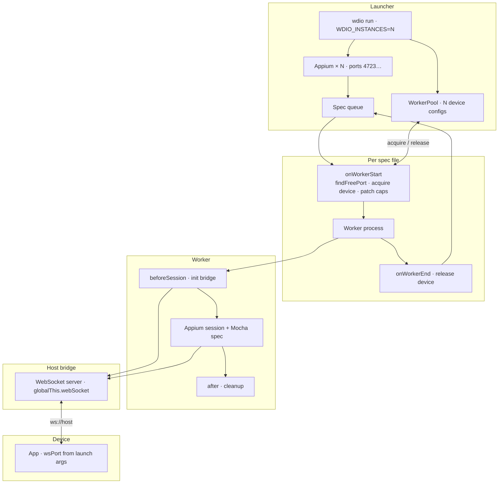
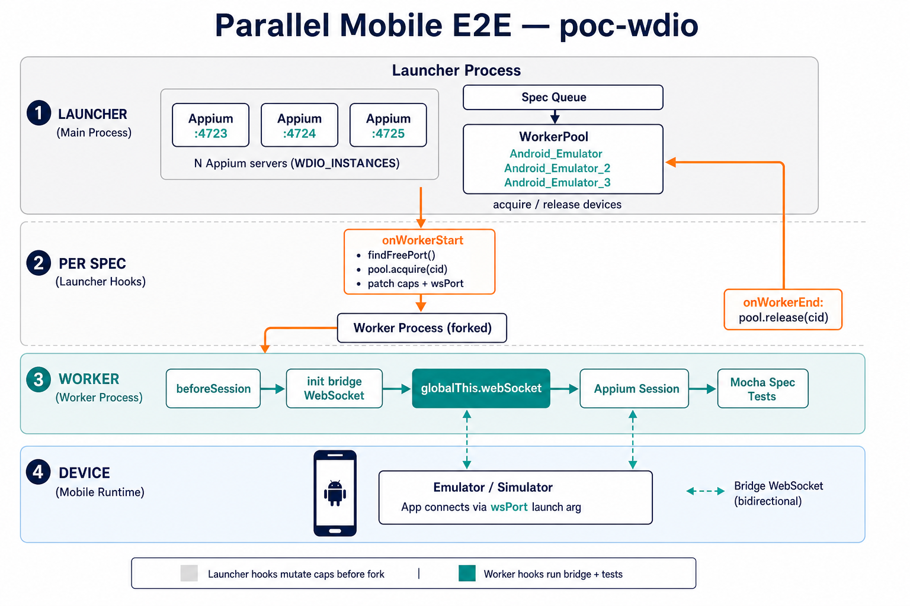

# High Level Overview:

## Mermaid JS

```mermaid
flowchart TB
  subgraph LAUNCHER["Launcher"]
    START["wdio run · WDIO_INSTANCES=N"]
    APPIUM["Appium × N · ports 4723…"]
    QUEUE["Spec queue"]
    POOL["WorkerPool · N device configs"]

    START --> APPIUM --> QUEUE
    START --> POOL
  end

  subgraph JOB["Per spec file"]
    OWNS["onWorkerStart<br/>findFreePort · acquire device · patch caps"]
    WORKER["Worker process"]
    OWEND["onWorkerEnd · release device"]

    QUEUE --> OWNS --> WORKER --> OWEND
    OWEND --> QUEUE
  end

  POOL <-->|acquire / release| OWNS

  subgraph WORKER_IN["Worker"]
    BS["beforeSession · init bridge"]
    RUN["Appium session + Mocha spec"]
    AFT["after · cleanup"]
    BS --> RUN --> AFT
  end

  WORKER --> BS

  subgraph BRIDGE["Host bridge"]
    WS["WebSocket server · globalThis.webSocket"]
  end

  subgraph DEVICE["Device"]
    APP["App · wsPort from launch args"]
  end

  BS --> WS
  WS <-->|ws://host| APP
  RUN --> WS

```

## Infographic

