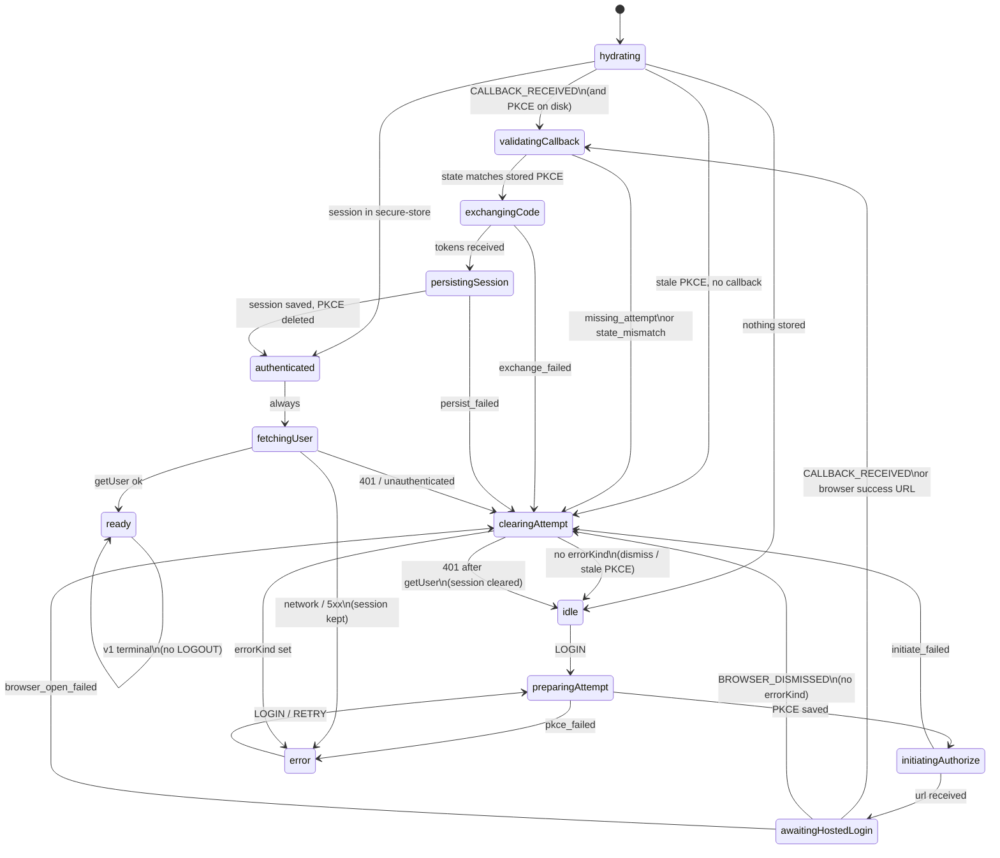

# Pay Card Auth — OAuth state-machine design tree

> Decision record. The frontier is empty, the user confirmed the recap, and LIVE-34742 is built from
> it. Round 6 holds the corrections the code review forced, and the deviations the build made.

## How this file works

- **Settled** — decided, do not re-ask.
- **Round N (open)** — frontier questions waiting on the user.
- **Blocked** — depends on an open decision.
- **Facts** — looked up in the repo; never asked of the user.

```text
root: hosted-browser OAuth login — FRONTIER EMPTY (awaiting confirmation)
├── Q1/Q8/Q10 XState 5, ports wrap RTK, useMachine, src/state/machine.ts
├── Q2/Q24/Q25 login + getUser after session; 401 clears session; network retries
├── Q17 refresh machine later in platform-card (v1 stub)
├── Q18 C async getCardSessionToken always reads secure-store (Q19 cancelled)
├── Q20 D user in RTK cache; Q26 loading until ready, then hide CardLogin
├── Q14–Q16 flow machine; platform-card session; flow PKCE
├── Q12 native expo-secure-store; web memory permanently
├── Q7/Q11 callbackUrl + browser actor; Q5 dismiss silent; Q6 inline error
└── Q21–Q23 public CardLogin only; leave hasCard; hardcoded errors
```

---

## Facts (repo)

| Fact | Source |
| --- | --- |
| Initiate already sends `mode=api` and keeps only `url` (JWT dropped) | `domain/api/card-management` |
| Token exchange and refresh endpoints exist, unused by the flow | `exchangeAuthorizationCode`, `refreshSession` |
| PKCE helper exists; **`codeVerifier` is discarded** after initiate | `authorizeAttempt.ts`, ViewModel |
| Native opener swallows `openAuthSessionAsync` success/cancel/dismiss | `openHostedLogin.native.ts` |
| Desktop opener is `window.open` (no callback) | `openHostedLogin.web.ts` |
| PKCE CSPRNG already split: `crypto.native.ts` (expo-crypto) / `crypto.web.ts` (WebCrypto) | `src/state/` |
| Redirect URI default `ledgerlive://paytab` | `shared/env` `CARD_OAUTH_REDIRECT_URI` |
| XState 5.19.2 / `@xstate/react` 5.0.2 catalogued; unused under `features/` | `pnpm-workspace.yaml` |
| Flow already depends on `@domain/api-card-management` + RTK; **not** on `@features/platform-card` | `package.json` |
| DDD allows `features/flow` → `features/platform` | structure-flow skill |
| LIVE-34738 remainder already names callback + `expo-secure-store` | `.changeset/pay-card-oauth-pkce.md` |

### Storage

`expo-secure-store` is **not** in the catalog. Closest APIs: `react-native-keychain` (LLM app password only); no Electron `safeStorage` usage.

Card **session tokens** live in `@features/platform-card` `cardSession.ts`: in-memory, never persisted. Both apps inject `getCardSessionToken` / `refreshCardSession` into `cardApiExtra`. `refreshCardSession` clears and returns null. `cardSession.set` is never called from app code. `cardApi` will not send a Bearer until something calls `set`.

**401 already has a hook, and it is not this flow.** `shared/api-services` `cardBaseQuery` calls `extra.refreshCardSession()` on any Card HTTP 401. That must run **without React and without CardLogin mounted**. A `useMachine` on CardLogin cannot be the 401 handler.

`domain/api` “persistence” in this repo is **RTK Query cache extract/restore** (`currency-token`), not OS Keychain. `domain/api` has **no** `.native`/`.web` suffixes and no `expo-*` deps. `@features/platform-card` already exists as the Card session + `cardApiExtra` accessors. LIVE-34769 is the ticket that “gives the session an owner.”

### Deep links

Mobile `DeeplinksProvider` maps `ledgerlive://paytab` → PayTab screen. It **keeps** `code` / `state`:
`getStateFromPath` ends with `parseQueryParams`, so they arrive as route params (corrected in Round 6;
the earlier claim that they are dropped was wrong). Desktop protocol handler only
`navigate("/paytab")`, and `parseDeepLink` drops the query for `paytab`.

---

## Settled

### From the original flow

1. Not Baanx API-mode credential collection. No login/OTP/`POST …/authorize`.
2. Dropped states: `awaitingCredentials` → `loggingIn` / `otp` → `authorizing`.
3. Sequence: PKCE → OS secure storage → initiate → OS secure browser → user logs in **there**.
4. Redirect: deep link to the **same page** (`ledgerlive://paytab?code&state`).
5. Compare `state` to stored PKCE, then token exchange.
6. Access + refresh tokens in OS secure storage.
7. Browser closed without redirect → wipe PKCE.
8. No implementation until this tree is done and confirmed.

### Round 1 answers (2026-08-14)

| Q | Answer |
| --- | --- |
| Q1 Orchestrator | **A — XState 5**, headless machine, platform ports |
| Q2 v1 scope | **A — login attempt only** (no refresh/logout in this machine) |
| Q3 Platform | **C + clarification:** shared machine for mobile and desktop; only ports differ (PKCE, open URL, storage). Mobile implements the callback in v1; desktop protocol completion later. |
| Q4 Storage ownership | **A — this flow ships adapters.** **Add `expo-secure-store`.** |
| Q5 Dismiss UX | **A — wipe PKCE, idle, no message** |
| Q6 Failure UX | **A — inline `errorMessage` on CardLogin, Login retries** |
| Q7 Callback injection | **C — browser-actor success URL and app-forwarded deep link, first wins** |

### Consequences (not re-asked)

- Machine stays free of React Native / Electron APIs. Platform work is ports (same pattern as existing `crypto.*` and `openHostedLogin.*`).
- `ready` is the logged-in terminal for v1. No `LOGOUT` / refresh events on this machine.
- Refresh / 401 stay on `cardApi` extra (today a stub) until a later tree. This machine’s `fetchingUser` 401 clears the session and returns to `idle`.
- `openHostedLogin` must return `{ type: "success", url } | { type: "dismissed" }` instead of swallowing the result.
- Callback URL parsing (`code`, `state`) lives in this flow. Duplicate callbacks: first wins, second ignored.
- Desktop `window.open` / custom-protocol **completion** is out of v1 implementation; the machine still compiles and runs on web with a dismiss/no-callback port.

### Q1 follow-up — RTK inside the machine?

**Hooks (`useInitiateAuthorizeMutation`) cannot run inside machine actions.** They are React-only.

XState v5 async work belongs in **invoked actors** (`fromPromise`), not in `assign` actions. Those actors **can** call RTK:

```ts
// allowed: promise from the RTK endpoint, inside a fromPromise actor
await dispatch(
  cardManagementApi.endpoints.initiateAuthorize.initiate(args),
).unwrap();
```

Not allowed: `useInitiateAuthorizeMutation()` in `actions` or in the machine module’s top level.

Settled as **Q8 A**: ViewModel ports wrap RTK `.unwrap()`.

### Round 2 answers (2026-08-14)

| Q | Answer |
| --- | --- |
| Q8 RTK binding | **A — ports** wrapping RTK `.unwrap()` |
| Q9 Session location | **Settled Round 3:** Q14 A, Q15 A, Q16 A, Q17 A |
| Q10 React binding | **A — `useMachine` + `@xstate/react`, `src/state/machine.ts`** |
| Q11 Deep-link forward | **C — PayTab `callbackUrl` prop + browser actor** |
| Q12 Storage adapters | **Native `expo-secure-store`. Web in-memory permanently** (not a v1 shim). |
| Q13 Cold start | **A — hydrate session → authenticated** |

### Q4 / Q9 — two secrets (settled Round 3)

| Secret | Owner | Store |
| --- | --- | --- |
| PKCE `{ state, codeVerifier }` | this flow | flow `expo-secure-store` (native) / memory (web) |
| Access + refresh tokens | `@features/platform-card` | `expo-secure-store` (native) / memory (web). **No JS copy for headers** (Q18 C). |

Q4 “flow ships adapters” holds for **PKCE only**. Session adapters live on platform-card.

**Fact:** `getCardSessionToken` is **synchronous** today. `expo-secure-store` is async. `cardBaseQuery` does `runWithToken(extra.getCardSessionToken())` — it does **not** use `prepareHeaders` to read storage. RTK `prepareHeaders` *can* be async, but `@shared/api-services` must not import `expo-secure-store`. Any “read Keychain on each request” must live in `extra.getCardSessionToken` becoming `async`, and `cardBaseQuery` `await`ing it.

`GET /v1/user` already exists as `useGetUserQuery`. The RTK cache **is** Redux. The schema keeps only `id` + `verificationState` (PII dropped on purpose — do not widen). PayTabBalance does **not** subscribe to it today (it uses host portfolio data).

### Round 3 answers (2026-08-14)

| Q | Answer |
| --- | --- |
| Q14 Login machine | **A — this flow** `src/state/machine.ts` |
| Q15 Session store | **A — `@features/platform-card`** `cardSession.set` = RAM + disk |
| Q16 PKCE store | **A — this flow only** |
| Q17 Future refresh machine | **A — `@features/platform-card`**, headless, started from `refreshCardSession` later |

### Consequences of Round 3 (not re-asked)

- This flow **depends on** `@features/platform-card`. Persist/hydrate session via `cardSession.set` / `getToken`, never via a second session file in the flow.
- **Both** packages add `expo-secure-store` (SDK line ~15 to match `expo-crypto` 15.0.8 / `expo-web-browser` 15.0.10). Flow: PKCE keys. Platform-card: session keys. Platform-card gains `.native` / `.web` session adapters (it has none today).
- Recommended keys (unless Round 4 objects): `payCard.pkce.attempt`, `payCard.session`.
- `refreshCardSession` **v1 remains a stub** (clear / null). Do not start a refresh machine in this work.
- Login persist writes the full `PayCardSession` (access + refresh + durations) into platform-card, then deletes PKCE.
- Architecture Option 3 is the chosen layout. Options 1, 2, 4, 5 are closed.

### Round 4 answers (2026-08-14)

| Q | Answer |
| --- | --- |
| Q18 Token on each HTTP call | **C — async `getCardSessionToken` always reads secure-store.** `cardBaseQuery` awaits it. Q19 cancelled. |
| Q20 Logged-in signal | **D — `GET /user` in the RTK cache.** Do not widen the user schema. |
| Q21 Public API | **A** |
| Q22 `hasCard` slice | **A** |
| Q23 Error copy | **A** |
| Q24 When to fetch user | **Machine step, only if a session exists:** `hydrating` → (session) `authenticated` → `fetchingUser`. Same path after `persistingSession`. Never `getUser` from `idle`. |

Q2 is amended: this machine also fetches `/user` after a session exists. Refresh/logout stay out.

`getUser` is invoked through an RTK port (`getUser.initiate().unwrap()`), so the result lands in the RTK cache. Other screens using `useGetUserQuery` see it without a second login-specific store.

### Round 5 answers (2026-08-14)

| Q | Answer |
| --- | --- |
| Q25 getUser fails | **A — 401:** clear session → `idle`. **Network/5xx:** `error`, retry → `fetchingUser` (session kept). |
| Q26 CardLogin UI | **A —** `hydrating` / `authenticated` / `fetchingUser`: loading, no button. `idle` / `error`: login. `ready`: render nothing. |

---

## Frontier

**Empty.** No product forks left. Implementation must not start until the user confirms the recap below.

### Implementation consequences (not forks)

- `cardApiExtra.getCardSessionToken` becomes `() => Promise<string | null | undefined>`; `cardBaseQuery` awaits it. `@shared/api-services` + both apps’ extra wiring/tests.
- `expo-secure-store` (~15.x) on this flow (PKCE) and `@features/platform-card` (session). Platform-card gets `.native` / `.web` adapters. Web session store is in-memory permanently (Q12).
- Keys: `payCard.pkce.attempt`, `payCard.session`. `AFTER_FIRST_UNLOCK`.
- This flow depends on `@features/platform-card`. Persist = `cardSession.set` (writes secure-store). Headers re-read store every Card call (Q18 C).
- PayTab passes `callbackUrl`; DeeplinksProvider must stop dropping `code`/`state`. `openHostedLogin` returns `{ type: "success", url } | { type: "dismissed" }`. First callback wins.
- `errorKind`: `pkce_failed` | `initiate_failed` | `browser_open_failed` | `missing_attempt` | `state_mismatch` | `exchange_failed` | `persist_failed` | `fetch_user_failed`. Hardcoded English (Q23).
- `payCardAuth` `{ hasCard }` slice untouched (Q22).
- `refreshCardSession` v1 stays a stub. Desktop protocol callback later. Do not widen `PayCardUser` schema.

### Later trees (explicitly out of v1)

Refresh machine; logout; desktop custom-protocol completion; analytics; E2E; PayTabBalance gated on user.

---

## Spec recap (confirm before implementing)

**Journey:** PKCE in this flow’s secure-store → initiate (`mode=api`, JSON `url`) → OS secure browser → deep link `ledgerlive://paytab?code&state` → compare `state` → token exchange → `cardSession.set` (access + refresh) → delete PKCE → `GET /user` into RTK cache.

**Not in this journey:** hosted email/password in-app, OTP, `POST /v1/auth/login`, `POST /v1/auth/oauth/authorize`.

**Machine** (`src/state/machine.ts`, `useMachine` in `useCardLoginViewModel`): see [XState machine](#xstate-machine) below.

**Owners**

| Concern | Package |
| --- | --- |
| Login XState, CardLogin, PKCE, callback parse | `@features/flow-pay-card-auth` |
| Session disk + `getCardSessionToken` / `refreshCardSession` | `@features/platform-card` |
| HTTP initiate / exchange / refresh / logout / getUser | `@domain/api-card-management` |
| Bearer + 401 hook | `@shared/api-services` card |

**CardLogin:** loading until `ready`; then nothing. Login button only in `idle` / `error`.

---

## XState machine

XState 5 `setup()` + `fromPromise` actors. Ports injected from the ViewModel. No RTK hooks inside the machine.

### Diagram



### States

| State | Kind | Meaning | Invoked actor | CardLogin UI |
| --- | --- | --- | --- | --- |
| `hydrating` | initial | Read PKCE (flow store) and whether a session exists (platform-card → secure-store). Apply initial `callbackUrl` if any. If a session exists, leftover PKCE is wiped before `authenticated`. | `hydrate` | Loading, no button |
| `idle` | stable | No attempt, no usable session. | — | Login button |
| `preparingAttempt` | transient | Mint PKCE, persist `{ state, codeVerifier }`. | `prepareAttempt` | Loading |
| `initiatingAuthorize` | transient | `GET …/authorize/initiate` (`mode=api`). | `initiateAuthorize` | Loading |
| `awaitingHostedLogin` | waiting | OS secure browser open. Accepts browser result **or** `CALLBACK_RECEIVED`. First wins. | `openHostedLogin` | Loading |
| `validatingCallback` | transient | Reload PKCE from disk; compare `callback.state`. | `validateCallback` | Loading |
| `exchangingCode` | transient | `POST …/oauth/token` (`authorization_code`). | `exchangeAuthorizationCode` | Loading |
| `persistingSession` | transient | `cardSession.set` (access + refresh); then delete PKCE. | `persistSession` | Loading |
| `authenticated` | transient | Session exists on disk. Always proceeds to `fetchingUser`. | — | Loading |
| `fetchingUser` | transient | `GET /v1/user` via RTK. Fills RTK cache. **Not** entered from `idle`. | `getUser` | Loading |
| `ready` | terminal (v1) | User in RTK cache. Hide CardLogin. | — | Render nothing |
| `clearingAttempt` | transient | Wipe PKCE. If 401 from `getUser`, also `cardSession.clear`. Then `idle` or `error`. | `clearAttempt` | Loading |
| `error` | stable | Recoverable failure; PKCE already cleared (session kept on network `getUser` failure). | — | Login + inline `errorMessage` |

### Events

| Event | Payload | Source | Accepted in |
| --- | --- | --- | --- |
| `LOGIN` | — | Login button | `idle`, `error` |
| `RETRY` | — | Same as Login on the error card | `error` (same target as `LOGIN`: `preparingAttempt`) |
| `CALLBACK_RECEIVED` | `{ code: string; state: string }` | Parsed `callbackUrl` prop **or** `openHostedLogin` success URL | `hydrating`, `awaitingHostedLogin` (ignored elsewhere; first wins) |
| `BROWSER_DISMISSED` | — | `openHostedLogin` → `cancel` / `dismiss` | `awaitingHostedLogin` (via actor `onDone`, mapped to this) |

Actor `onDone` / `onError` drive the rest. There is no `LOGOUT` / `REFRESH` on this machine.

### Guards

| Guard | True when |
| --- | --- |
| `hasCallback` | Hydrate input or context has `code` + `state` |
| `hasSession` | Secure-store session exists (async read during `hydrate`) |
| `hasStalePkce` | PKCE on disk, **no** callback, **no** session |
| `statesMatch` | `callback.state === storedAttempt.state` |
| `isUnauthorized` | `getUser` failed with HTTP 401 |
| `hasErrorKind` | Context `errorKind` is set (clearingAttempt → error vs idle) |

### Context

| Field | Role |
| --- | --- |
| `oauthConfig` | `{ clientId, redirectUri }` from CardLogin props (input) |
| `loginUrl` | Hosted URL from initiate; cleared after browser |
| `callback` | `{ code, state } \| null` |
| `errorKind` | See list below; `null` on dismiss / idle |

PKCE and tokens are **not** kept in context as source of truth. Disk is: flow store for PKCE, platform-card secure-store for the session.

`errorKind`: `pkce_failed` | `initiate_failed` | `browser_open_failed` | `missing_attempt` | `state_mismatch` | `exchange_failed` | `persist_failed` | `fetch_user_failed`

### Actors (ports)

| Actor | Port | Result |
| --- | --- | --- |
| `hydrate` | `loadAttempt` + `getCardSessionToken` | `{ attempt, hasSession, callback? }` |
| `prepareAttempt` | `createAuthorizeAttempt` + `saveAttempt` | `{ state, codeVerifier, codeChallenge }` |
| `initiateAuthorize` | RTK `initiateAuthorize().unwrap()` | `{ url }` |
| `openHostedLogin` | platform opener | `{ type: "success", url } \| { type: "dismissed" }` |
| `validateCallback` | `loadAttempt` | attempt or fail |
| `exchangeAuthorizationCode` | RTK `exchangeAuthorizationCode().unwrap()` | `PayCardSession` |
| `persistSession` | `cardSession.set` then `clearAttempt` | void |
| `getUser` | RTK `getUser.initiate().unwrap()` | `PayCardUser` (RTK cache filled) |
| `clearAttempt` | `clearAttempt`; on 401 also `cardSession.clear` | void |

### Transitions (happy + cancel + fail)

| From | Trigger | To |
| --- | --- | --- |
| `hydrating` | callback + PKCE | `validatingCallback` |
| `hydrating` | session, no callback | `authenticated` |
| `hydrating` | stale PKCE | `clearingAttempt` → `idle` |
| `hydrating` | nothing | `idle` |
| `idle` | `LOGIN` | `preparingAttempt` |
| `preparingAttempt` | done | `initiatingAuthorize` |
| `initiatingAuthorize` | done | `awaitingHostedLogin` |
| `awaitingHostedLogin` | success URL / `CALLBACK_RECEIVED` | `validatingCallback` |
| `awaitingHostedLogin` | dismissed | `clearingAttempt` → `idle` (no error) |
| `validatingCallback` | states match | `exchangingCode` |
| `exchangingCode` | done | `persistingSession` |
| `persistingSession` | done | `authenticated` |
| `authenticated` | always | `fetchingUser` |
| `fetchingUser` | ok | `ready` |
| `fetchingUser` | 401 | `clearingAttempt` → `idle` (session cleared) |
| `fetchingUser` | network / 5xx | `error` (`fetch_user_failed`, session kept) |
| `error` | `LOGIN` / `RETRY` | `preparingAttempt` |
| any persist-path failure | actor error | `clearingAttempt` → `error` |

`LOGIN` / `RETRY` from `error` start a **new** attempt (new PKCE), not a resume of the failed one.

---

## Interview log

| Round | Date | Questions | Answers |
| --- | --- | --- | --- |
| 1 | 2026-08-14 | Q1–Q7 | Q1 A; Q2 A; Q3 C + shared ports; Q4 A + expo-secure-store; Q5 A; Q6 A; Q7 C |
| 2 | 2026-08-14 | Q8–Q13 | Q8 A; Q9 deferred; Q10 A; Q11 C; Q12 native expo-secure-store, web memory **permanently**; Q13 A |
| 3 | 2026-08-14 | Q14–Q17 | Q14 A; Q15 A; Q16 A; Q17 A |
| 4 | 2026-08-14 | Q18, Q20–Q24 | Q18 C; Q20 D; Q21 A; Q22 A; Q23 A; Q24 machine step `authenticated` → `fetchingUser` |
| 5 | 2026-08-14 | Q25–Q26 | Q25 A; Q26 A |

---

## Round 6 (2026-08-14) — corrections and build deviations

### Two facts corrected

| Was | Is |
| --- | --- |
| `DeeplinksProvider` drops `code` / `state` | It keeps them. `getStateFromPath` parses the query, so the Pay tab screen receives them as route params. Only the flag-off branch (`getStateFromPath("card", config)`) drops them. **No provider change was needed.** |
| The machine clears the session on a `getUser` 401 | It still does, but it is the second to do so: `cardBaseQuery` already called `refreshCardSession()` on the 401, and that stub clears. The machine's own clear is a guarantee, not the only one. |

### Three decisions

| Q | Answer |
| --- | --- |
| Q27 Callback prop shape | **`callback?: { code, state }`**, not `callbackUrl?: string` (replaces Q11 C). The app's router already parsed the deep link; only the browser actor's success URL needs parsing, and the flow keeps that parser. |
| Q28 Desktop redirect | **Out of v1.** `parseDeepLink` could carry `search` through today (the `recover` route is the precedent), and the in-memory PKCE would still be there, but it stays LIVE-34740. |
| Q29 Stored session type | **Type-only dependency** from `@features/platform-card` on `@domain/api-card-management`, for `PayCardSession`. One definition, no drift, no runtime weight. |

### Deviations the build made, and why

1. **The session occupies three secure-store keys, not one.** `expo-secure-store` warns above 2048
   bytes per value and says it may throw in a later SDK. Two JWTs in one JSON blob can pass that limit.
   Each token gets its own key, with the two lifetimes in a third. The header path also gets cheaper:
   one small read per request.
2. **`hydrate` performs no writes.** The tree had it wipe a leftover attempt. An actor cannot see a
   `CALLBACK_RECEIVED` that lands after it started, so wiping there could delete the attempt the
   redirect needs. The wipe moved into `clearingAttempt`, which the session path reaches through
   `resumeAuthenticated` and leaves for `authenticated`. Same hygiene, no race.
3. **No `BROWSER_DISMISSED` event.** Nothing outside the machine sends it. The `openHostedLogin` actor
   answers `{ callback: … | null }`, and null covers every way the user left — including a redirect
   with no `code` on it.
4. **PKCE and tokens are absent from context, but the exchanged session passes through it** for the one
   step between `exchangingCode` and `persistingSession`, and is dropped on arrival. The alternative
   was a cast on an XState done-event, which buys nothing: both live in the same process memory.
   `prepareAttempt` returns only the public halves (`state`, `codeChallenge`); the verifier goes
   straight to the store.
5. **`clearAttempt` swallows its own failures.** A store that refuses to forget must not wedge the
   login, and a session left behind heals itself on the next 401.
6. **"Loading, no button" is the disabled loading Button** (Q26). Lumen exports no spinner, and that
   Button is the design system's own loading affordance. It cannot be pressed, which is what Q26 was
   protecting. `ready` renders nothing, as settled.
7. **`expo-secure-store` went into the pnpm catalog**, not pinned per package. Two packages need it,
   and the catalog is how the other twelve expo dependencies are declared.
