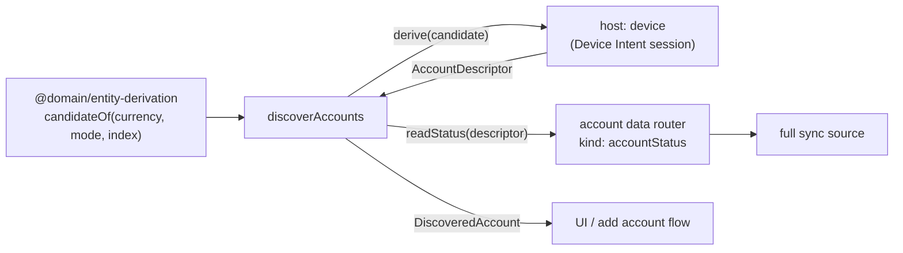

# @features/platform-account-discovery

> [!WARNING]
> **Status: UNSTABLE** — first implementation, its API may change.

Account discovery as a stream: `discoverAccounts(host, { currencyId })` is an `Observable<DiscoveredAccount>`, in the order of the legacy `scanAccounts`. It answers "which accounts does this seed have on this currency", and nothing else: no `Account`, no sync, no store.

```mermaid
flowchart LR
  D["@domain/entity-derivation<br/>candidateOf(currency, mode, index)"] --> S[discoverAccounts]
  S -- "derive(candidate)" --> H1["host: device<br/>(Device Intent session)"]
  H1 -- AccountDescriptor --> S
  S -- "readStatus(descriptor)" --> R["account data router<br/>kind: accountStatus"]
  R --> X1[full sync source]
  S -- DiscoveredAccount --> U[UI / add account flow]
```

## What the host gives

- `derive(candidate, signal)`: the `AccountDescriptor` of an `AccountCandidate`, its key derived on the device (an xpub for a UTXO account, a hex extended public key for Cardano and Kaspa, an address otherwise). Throws an `UnsupportedDerivation` when the device app has no such mode: the mode is skipped. Resolves `null` to end the mode there, keeping the accounts found before it, as the legacy scan's iterate does (Celo on an app too old for a path). Resolves `{ descriptor, keyHasMoreAccounts }` for an account looked up from a key (Hedera): while the key lists more accounts after it, an empty one does not count toward the gap limit, as the legacy `keyHasMoreAddresses`.
- `readStatus(descriptor, signal)`: whether the account was ever used, and its gate. `statusThroughRouter(router)` reads the `accountStatus` kind ([`@domain/entity-account-status`](../../../domain/entity/account-status)) from the app's sources.

## What it knows

The rules of `@domain/entity-derivation`: the modes of the currency, the gap limit, `startsAt`, non-iterable modes, the indexes a mode leaves to another, which mode offers a new account. Every used account is emitted, then the first empty account of a mode that can create one; a mode stops after `mandatoryEmptyAccountSkip` consecutive empty accounts. Each carries its `AccountStatus`: its gate tells an account to onboard first (Canton, Concordium).

## How fast

Each mode is scanned in order, one derivation at a time. While an account's status loads, the device derives the next account only when the mode reaches it whatever that status is: the empty accounts before it leave room under the gap limit (`mandatoryEmptyAccountSkip`), or its key lists more accounts. The device and the network overlap in modes with a gap limit, and the device derives exactly what the legacy scan derives.

## Failures and cancellation

- A failure surfaces once the scan reaches that account; nothing past the gap limit is asked.
- The scan fails only once the device is idle: a derivation started ahead is aborted and settles first.
- Unsubscribing aborts the `signal` handed to `derive` and `readStatus`, and starts no new derivation or status read. `statusThroughRouter` forwards it to the router, which stops the source once no other read waits for the account.

## Parity notes

- The legacy env scan rules (`KEYCHAIN_OBSERVABLE_RANGE`, `SHOW_LEGACY_NEW_ACCOUNT`) are `ScanRules` the host passes in the options.
- Parity with the legacy scan also depends on the host: its `derive` must give the descriptor the legacy scan would store, and its `readStatus` the `used` the legacy scan would compute.
