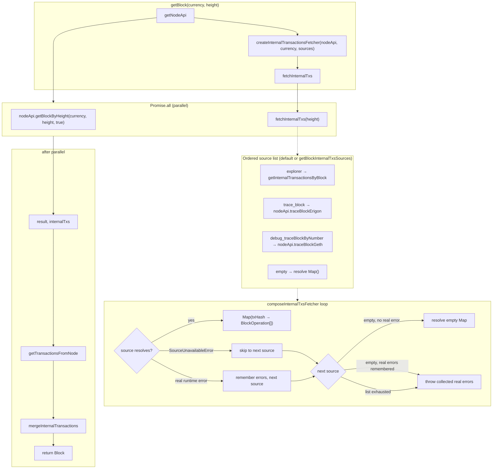

# Internal transactions retrieval in getBlock

This document describes how internal transactions are fetched and merged when calling `getBlock(currency, height)`.

## Flow overview

## Default source list

When `getBlockInternalTxsSources` is absent, the default is:

`["explorer", "trace_block", "debug_traceBlockByNumber", "empty"]`

Built via `internalTxSources().addSource("explorer").addSource("trace_block").addSource("debug_traceBlockByNumber").addSource("empty").build()` in `internalTxSources.ts`.

## Source semantics

| Source | When unavailable (skipped) | When available but fails at runtime |
|--------|---------------------------|-------------------------------------|
| `explorer` | Explorer config is not etherscan-like | Best-effort: wrapped as `SourceUnavailableError`, fall through to node traces |
| `trace_block` | `nodeApi.traceBlockErigon` is undefined | Remember error, try next source; rethrow collected errors when `empty` is reached or the list is exhausted without a later success (e.g. erigon error → geth fallback) |
| `debug_traceBlockByNumber` | `nodeApi.traceBlockGeth` is undefined | Same as `trace_block`: remember and continue; rethrow collected errors only when no later source succeeds |
| `empty` | N/A (terminal) | Resolves empty Map only if no real runtime errors were remembered; otherwise re-throws all collected real errors |

**Behaviour-preserving rule:** structurally unsupported sources are skipped (`SourceUnavailableError`). Explorer failures are always best-effort (fall through). Runtime trace failures are remembered and the loop continues to later sources (erigon → geth); collected real errors are rethrown only when `empty` is reached with remembered errors or the list ends without a success (single error rethrown as-is, multiple as `AggregateError`). A trailing `empty` resolves only when every prior source was unavailable, not when a trace call failed at runtime.

## Paths summary

| Explorer config | Primary source | Fallback |
|-----------------|----------------|----------|
| Etherscan-like (etherscan, blockscout, teloscan, klaytnfinder, corescan) | `getInternalTransactionsByBlock` → `txlistinternal` | `traceBlockErigon` → `traceBlockGeth` → empty (if traces unavailable) or propagate (if traces error) |
| Other (ledger, none, …) | `traceBlockErigon` → `traceBlockGeth` | empty (if traces unavailable) or propagate (if traces error) |

## Data flow

1. **Explorer path**  
   `getInternalTransactionsByBlock` → `EtherscanInternalTransaction[]` → `internalTxsToOperationsByHash` → `Map<string, BlockOperation[]>`.

2. **Node trace paths**  
   `traceBlockErigon` / `traceBlockGeth` → RPC `trace_block` / `debug_traceBlockByNumber` → `TraceBlockItem[]` → `traceBlockItemsToOperationsByHash` → `Map<string, BlockOperation[]>`.

3. **Merge**  
   `mergeInternalTransactions(transactions, internalTxs)` adds each `internalTxs.get(tx.hash)` as extra `operations` on the corresponding `BlockTransaction`.

## Files

- **Fetcher wiring:** `libs/coin-modules/coin-evm/src/logic/internalTransactionsFetcher.ts`
- **getBlock:** `libs/coin-modules/coin-evm/src/logic/getBlock.ts`
- **Source list builder:** `libs/coin-modules/coin-evm/src/internalTxSources.ts`
- **Config field:** `libs/coin-modules/coin-evm/src/config.ts` (`getBlockInternalTxsSources`)
- **Explorer internal txs:** `libs/coin-modules/coin-evm/src/network/explorer/etherscan.ts`
- **Explorer → operations:** `libs/coin-modules/coin-evm/src/adapters/etherscan.ts`
- **RPC traces:** `libs/coin-modules/coin-evm/src/network/node/rpc.common.ts` (`traceBlockErigon`, `traceBlockGeth`)
- **Trace → operations:** `libs/coin-modules/coin-evm/src/adapters/blockOperations.ts`
