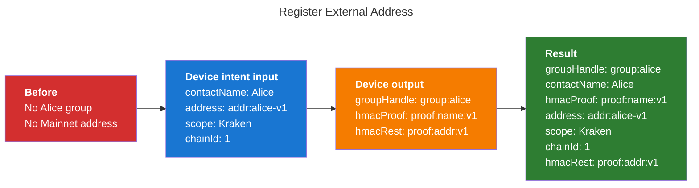
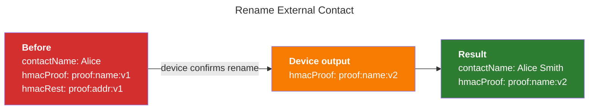
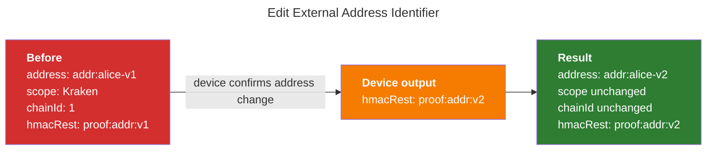
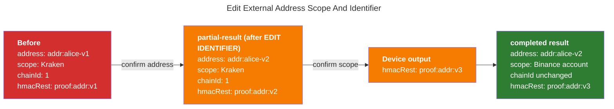
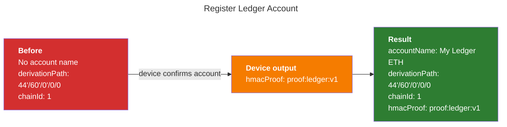
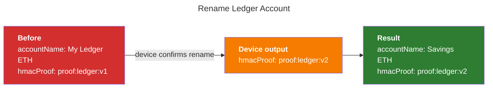

# EVM Address Book Device Intents

## Purpose

This document defines the EVM Address Book device intents that Ledger Wallet
should expose to Wallet Experience teams through the Device Intent Executor.

It is a WXP-facing contract, not an APDU reference. The lower-level device
protocol remains defined by the firmware Address Book specifications:

- [Address Book Final Specifications](https://ledgerhq.atlassian.net/wiki/spaces/FW/pages/6992035925/Address+Book+Final+Specifications)
- [Address Book - Device API](https://ledgerhq.atlassian.net/wiki/spaces/WXP/pages/7295107160/Address+Book+-+Device+API)

All intents in this document are EVM-specific. They should open the Ethereum
app, use the EVM Address Book APDUs, set `BLOCKCHAIN_FAMILY = Ethereum`, require
`chainId`, and serialize EVM identifiers as 20-byte addresses.

## Table of Contents

- [Terminology](#terminology)
  - [Common terms](#common-terms)
  - [External contact terms](#external-contact-terms)
  - [Ledger account terms](#ledger-account-terms)
- [Example Values](#example-values)
- [Storage Model](#storage-model)
- [Intents](#intents)
  - [Intent List](#intent-list)
  - [TypeScript Conventions](#typescript-conventions)
  - [External Address Registration](#external-address-registration)
    - [`registerAddressBookExternalAddressEvmIntentDefinition`](#registeraddressbookexternaladdressevmintentdefinition)
  - [External Contact Rename](#external-contact-rename)
    - [`renameAddressBookContactEvmIntentDefinition`](#renameaddressbookcontactevmintentdefinition)
  - [External Address Identifier Edit](#external-address-identifier-edit)
    - [`editAddressBookExternalAddressIdentifierEvmIntentDefinition`](#editaddressbookexternaladdressidentifierevmintentdefinition)
  - [External Address Scope Edit](#external-address-scope-edit)
    - [`editAddressBookExternalAddressScopeEvmIntentDefinition`](#editaddressbookexternaladdressscopeevmintentdefinition)
  - [External Address Convenience Edit](#external-address-convenience-edit)
    - [`editAddressBookExternalAddressEvmIntentDefinition`](#editaddressbookexternaladdressevmintentdefinition)
  - [Ledger Account Registration](#ledger-account-registration)
    - [`registerAddressBookLedgerAccountEvmIntentDefinition`](#registeraddressbookledgeraccountevmintentdefinition)
  - [Ledger Account Rename](#ledger-account-rename)
    - [`renameAddressBookLedgerAccountEvmIntentDefinition`](#renameaddressbookledgeraccountevmintentdefinition)
- [Open Decisions](#open-decisions)

## Terminology

### Common terms

- **Contact**: human-readable entity, for example `Alice`.
- **`chainId`**: EVM chain id bound into external address records and Ledger
  account contacts. It must be provided whenever the device verifies or computes
  `hmacRest` or a Ledger account `hmacProof`. External contact rename is the
  exception because it only verifies and recomputes the name proof.

### External contact terms

These apply only to third-party (external) contacts.

- **Contact group**: device-authenticated group for one contact name. It is
  represented by `groupHandle` and `hmacProof`.
- **External address record**: one registered `(scope, identifier, chainId)`
  attached to a contact group. For EVM, `identifier` is an Ethereum address.
- **Scope**: context string bound to an external address record. In product
  wording it can be called a label, but technically it is part of the proof.
- **Identifier**: blockchain identifier. For EVM this is the 20-byte account
  address, usually represented in Ledger Wallet as an EIP-55 hex address.
- **`gid` / Group ID**: random 32-byte identifier generated by the device when
  creating an external contact group. Ledger Wallet does not receive or store it
  directly; it is embedded inside `groupHandle`.
- **`groupHandle`**: opaque 64-byte device token returned when registering an
  external contact group. It contains `gid` plus a device authentication tag.
  Ledger Wallet stores it verbatim; the device later verifies it and extracts
  `gid` internally.
- **External contact `hmacProof`**: opaque 32-byte proof binding a contact
  name to a contact group. The device computes it from `gid + contactName`.
- **`hmacRest`**: opaque 32-byte proof binding an external address record:
  scope, identifier, family, and chain. The device computes it from
  `gid + scope + identifier + blockchainFamily + chainId`.

### Ledger account terms

These apply only to accounts controlled by the attached device seed.

- **Ledger account contact**: a named account controlled by the attached
  device seed, identified by `derivationPath + chainId`.
- **Ledger account `hmacProof`**: opaque 32-byte proof binding a Ledger account
  name to its account context. The device computes it from
  `contactName + blockchainFamily + chainId` (no `gid`, since Ledger accounts
  have no contact group). The `derivationPath` is not part of the signed
  message; it is only used as keying material to derive the proof key.

For external contacts, the device deliberately splits proof material into
`hmacProof` for the contact name and `hmacRest` for the external address record.
This is why renaming a contact only replaces `hmacProof`, while editing the
scope or address only replaces `hmacRest`. Ledger account commands also return a
field named `hmacProof`, but it belongs to the Ledger account proof domain and is
not paired with `hmacRest`.

`groupHandle`, `hmacProof`, and `hmacRest` are seed-bound opaque values. Ledger
Wallet must store and replay them verbatim. It must not compute, verify, or
modify them.

## Example Values

The diagrams below use intentionally short fake values for readability. Some of
them are not valid hex strings.

```ts
const aliceAddress = "addr:alice-v1";
const aliceAddressUpdated = "addr:alice-v2";
const groupHandle = "group:alice";
const hmacProof = "proof:name:v1";
const hmacRest = "proof:addr:v1";
```

In production, addresses are real EIP-55 hex strings and proof values must be
treated as opaque byte strings.

## Storage Model

Ledger Wallet owns persistence. The device is stateless.

The model below is a suggestion; WXP is free to store this data differently.
However, it accurately captures everything that must be persisted, so any
alternative shape must be able to hold the same fields.

```ts
type EvmAddressBookContactGroup = {
  /**
   * Ledger Wallet local identifier for the contact group.
   * Generated by Ledger Wallet when the contact group is created in storage.
   */
  id: string;
  /**
   * Human-readable contact name displayed to the user, for example "Alice".
   * Entered by the user in Ledger Wallet and confirmed on the device during
   * registration or rename.
   */
  contactName: string;
  /**
   * BIP32 path used by the device to derive the Address Book proof key.
   * The firmware spec requires a DERIVATION_PATH for external contact commands,
   * but this may be an Address Book constant rather than a user account path.
   * Its final source is still open and may be chosen inside DMK.
   */
  derivationPath: string;
  /**
   * Opaque token identifying the device-generated contact group.
   * Generated by the device and returned by REGISTER IDENTITY; Ledger Wallet
   * stores it verbatim and sends it back for later external-contact commands.
   */
  groupHandle: string;
  /**
   * Opaque proof binding the contact name to this contact group.
   * Generated by the device during REGISTER IDENTITY, then regenerated by the
   * device during EDIT CONTACT NAME; Ledger Wallet stores the latest value.
   */
  hmacProof: string;
};

type EvmAddressBookExternalAddress = {
  /**
   * Ledger Wallet local identifier for this external address record.
   * Generated by Ledger Wallet when the address record is created in storage.
   */
  id: string;
  /**
   * Link to the Ledger Wallet contact group that owns this address record.
   * Generated by Ledger Wallet from EvmAddressBookContactGroup.id.
   */
  contactGroupId: string;
  /**
   * Context label for this address record, for example "Ethereum Mainnet",
   * "Base", "Kraken", or "Binance account". Entered or selected by the user in
   * Ledger Wallet and confirmed on the device during registration or scope
   * edit.
   */
  scope: string;
  /**
   * EVM account address attached to the contact group for this scope and chain.
   * Entered or selected in Ledger Wallet, validated by the Ethereum app, and
   * confirmed on the device during registration or identifier edit.
   */
  address: `0x${string}`;
  /**
   * EVM chain id that disambiguates the network for this address record.
   * Selected by Ledger Wallet from the network/account context and sent to the
   * device in Address Book commands.
   */
  chainId: string;
  /**
   * Opaque proof binding scope, address, Ethereum family, and chain id to the
   * contact group. Generated by the device during REGISTER IDENTITY, then
   * regenerated by the device during EDIT IDENTIFIER or EDIT SCOPE; Ledger
   * Wallet stores the latest value for this address record.
   */
  hmacRest: string;
};

type EvmAddressBookLedgerAccount = {
  /**
   * Ledger Wallet local identifier for the Ledger-owned account contact.
   * Generated by Ledger Wallet when the account contact is created in storage.
   */
  id: string;
  /**
   * Human-readable name for the Ledger-owned account, for example "Savings ETH".
   * Entered by the user in Ledger Wallet and confirmed on the device during
   * Ledger account registration or rename.
   */
  accountName: string;
  /**
   * BIP32 path of the Ledger-owned account being named.
   * Selected by Ledger Wallet from the account context and sent to the device in
   * Ledger account Address Book commands.
   */
  derivationPath: string;
  /**
   * EVM chain id for the Ledger-owned account name.
   * Selected by Ledger Wallet from the network/account context and sent to the
   * device in Ledger account Address Book commands.
   */
  chainId: string;
  /**
   * Opaque proof binding accountName to the Ledger account context.
   * Generated by the device during REGISTER LEDGER ACCOUNT, then regenerated by
   * the device during EDIT LEDGER ACCOUNT; Ledger Wallet stores the latest
   * value.
   */
  hmacProof: string;
};
```

Proofs are seed-bound. Both contacts and addresses are bound to the seed used at
registration, so a contact registered on seed A cannot receive an address
registered on seed B, and edits are rejected across seeds. A contact synced to a
device with a different seed must therefore be registered again on that seed.

As a result, Ledger Wallet stores exactly one proof per contact group, external
address record, and Ledger account contact. To use the same external address on
a different seed, Ledger Wallet creates a separate contact/address record for
that seed and performs a separate device registration.

## Intents

### Intent List

| Intent                                                        | Device command                        | Purpose                                |
| ------------------------------------------------------------- | ------------------------------------- | -------------------------------------- |
| `registerAddressBookExternalAddressEvmIntentDefinition`       | `REGISTER IDENTITY`                   | Register a new external address record |
| `renameAddressBookContactEvmIntentDefinition`                 | `EDIT CONTACT NAME`                   | Rename an external contact group       |
| `editAddressBookExternalAddressIdentifierEvmIntentDefinition` | `EDIT IDENTIFIER`                     | Change only the address                |
| `editAddressBookExternalAddressScopeEvmIntentDefinition`      | `EDIT SCOPE`                          | Change only the scope                  |
| `editAddressBookExternalAddressEvmIntentDefinition`           | `EDIT IDENTIFIER` and/or `EDIT SCOPE` | Convenience edit intent                |
| `registerAddressBookLedgerAccountEvmIntentDefinition`         | `REGISTER LEDGER ACCOUNT`             | Register a Ledger-owned account name   |
| `renameAddressBookLedgerAccountEvmIntentDefinition`           | `EDIT LEDGER ACCOUNT`                 | Rename a Ledger-owned account          |

Each intent section uses the same contract vocabulary:

- The **TypeScript contract** defines the intent `Input`, the `Result` payload,
  and the `JobState` union. The input is what WXP / Ledger Wallet provides when
  creating the runtime intent; the result is the persistence-friendly payload
  carried by relevant `JobState` values (it combines input values with the raw
  proof material returned by the device, so the DIE caller can persist without
  reconstructing context).
- **Ledger Wallet persistence after success** is the storage mutation Ledger
  Wallet must perform only after a `JobState` carrying a result is observed.
  Device proof values carried by the result replace the previous stored values
  for future Address Book operations.

For EVM, `chainId` is required by every management intent that verifies or
updates an external address record or Ledger account contact. The only intent in
this document that does not require `chainId` is
`renameAddressBookContactEvmIntentDefinition`, because it only touches the
external contact name proof (`hmacProof`) and does not touch any address record
proof (`hmacRest`).

### TypeScript Conventions

Each intent is consumed the same way. Ledger Wallet creates the intent with
`createIntent(definition, input)`, passes it to the `DeviceIntentExecutor`
component, and observes the running job through the executor's
`onIntentJobStateChanged` prop. That callback receives every `JobState` the job
emits; the data that must be persisted is carried on the relevant `JobState`
values. There is no separate return value to await.

The concrete `JobState` unions below intentionally include UI-only states such
as `pending` and `awaiting-device-confirmation`, which exist only to drive the
intent UI. The `onIntentJobStateChanged` listener should ignore those states and
persist only when `jobState.type` is `completed`, or `partial-result` for the
convenience edit intent.

The result payloads are storage-agnostic and use granular properties rather than
the suggested storage model types. This keeps WXP free to choose its own storage
shape while still receiving every value needed to persist safely.

```ts
type EvmAddress = `0x${string}`;
type EvmChainId = number;
type GroupHandle = string;
type AddressBookProof = string;

type AddressBookEvmJobStateBase =
  | { type: "pending" }
  | { type: "awaiting-device-confirmation" }
  | { type: "failed"; error: Error };
```

### External Address Registration

#### `registerAddressBookExternalAddressEvmIntentDefinition`

Registers one `(contactName, scope, address, chainId)` tuple on the device.

TypeScript contract:

```ts
type RegisterAddressBookExternalAddressEvmIntentInput = {
  contactName: string;
  scope: string;
  address: EvmAddress;
  chainId: EvmChainId;
  derivationPath: string;
  existingContactGroup?: {
    groupHandle: GroupHandle;
    hmacProof: AddressBookProof;
  };
};

type RegisterAddressBookExternalAddressEvmResult = {
  mode: "newContactGroup" | "existingContactGroup";
  contactName: string;
  scope: string;
  address: EvmAddress;
  chainId: EvmChainId;
  derivationPath: string;
  groupHandle: GroupHandle;
  hmacProof: AddressBookProof;
  hmacRest: AddressBookProof;
};

type RegisterAddressBookExternalAddressEvmJobState =
  | AddressBookEvmJobStateBase
  | {
      type: "completed";
      result: RegisterAddressBookExternalAddressEvmResult;
    };
```

Pass an `existingContactGroup` in the input only when adding an address to an
already-registered contact group.

Ledger Wallet persistence after success:

- If the input did not include `groupHandle + hmacProof`, this registration
  created a new contact group. Create the `EvmAddressBookContactGroup` with the
  returned `groupHandle` and `hmacProof`, then create the
  `EvmAddressBookExternalAddress` with the returned `hmacRest`.
- If the input included an existing `groupHandle + hmacProof`, this registration
  only added a new address record to that group. Keep the existing contact group
  unchanged, optionally assert that the returned `groupHandle` and `hmacProof`
  match the input values, then create the new `EvmAddressBookExternalAddress`
  with the returned `hmacRest`.



### External Contact Rename

#### `renameAddressBookContactEvmIntentDefinition`

Renames the contact group. This changes the group-level proof but does not
change any address record. It does not need `scope`, `address`, or `chainId`
because those fields are only bound into `hmacRest`, which remains unchanged.

TypeScript contract:

```ts
type RenameAddressBookContactEvmIntentInput = {
  previousContactName: string;
  newContactName: string;
  derivationPath: string;
  groupHandle: GroupHandle;
  hmacProof: AddressBookProof;
};

type RenameAddressBookContactEvmResult = {
  previousContactName: string;
  contactName: string;
  derivationPath: string;
  groupHandle: GroupHandle;
  hmacProof: AddressBookProof;
};

type RenameAddressBookContactEvmJobState =
  | AddressBookEvmJobStateBase
  | {
      type: "completed";
      result: RenameAddressBookContactEvmResult;
    };
```

Ledger Wallet persistence after success:

- Update `EvmAddressBookContactGroup.contactName` from `previousContactName` to
  `newContactName`.
- Replace `EvmAddressBookContactGroup.hmacProof` with the returned
  `hmacProof`.
- Leave every `EvmAddressBookExternalAddress.hmacRest` for this contact group
  unchanged.



### External Address Identifier Edit

#### `editAddressBookExternalAddressIdentifierEvmIntentDefinition`

Changes only the EVM address for one external address record. The contact name
and scope stay unchanged.

TypeScript contract:

```ts
type EditAddressBookExternalAddressIdentifierEvmIntentInput = {
  contactName: string;
  scope: string;
  previousAddress: EvmAddress;
  newAddress: EvmAddress;
  chainId: EvmChainId;
  derivationPath: string;
  groupHandle: GroupHandle;
  hmacProof: AddressBookProof;
  hmacRest: AddressBookProof;
};

type EditAddressBookExternalAddressIdentifierEvmResult = {
  contactName: string;
  scope: string;
  previousAddress: EvmAddress;
  address: EvmAddress;
  chainId: EvmChainId;
  derivationPath: string;
  groupHandle: GroupHandle;
  hmacProof: AddressBookProof;
  hmacRest: AddressBookProof;
};

type EditAddressBookExternalAddressIdentifierEvmJobState =
  | AddressBookEvmJobStateBase
  | {
      type: "completed";
      result: EditAddressBookExternalAddressIdentifierEvmResult;
    };
```

Ledger Wallet persistence after success:

- Update the target `EvmAddressBookExternalAddress.address` from
  `previousAddress` to `newAddress`.
- Replace only that `EvmAddressBookExternalAddress.hmacRest` with the returned
  `hmacRest`.
- Leave `EvmAddressBookContactGroup.contactName`, `groupHandle`, and
  `hmacProof` unchanged.



### External Address Scope Edit

#### `editAddressBookExternalAddressScopeEvmIntentDefinition`

Changes only the scope for one external address record. The contact name and
address stay unchanged.

TypeScript contract:

```ts
type EditAddressBookExternalAddressScopeEvmIntentInput = {
  contactName: string;
  previousScope: string;
  newScope: string;
  address: EvmAddress;
  chainId: EvmChainId;
  derivationPath: string;
  groupHandle: GroupHandle;
  hmacProof: AddressBookProof;
  hmacRest: AddressBookProof;
};

type EditAddressBookExternalAddressScopeEvmResult = {
  contactName: string;
  previousScope: string;
  scope: string;
  address: EvmAddress;
  chainId: EvmChainId;
  derivationPath: string;
  groupHandle: GroupHandle;
  hmacProof: AddressBookProof;
  hmacRest: AddressBookProof;
};

type EditAddressBookExternalAddressScopeEvmJobState =
  | AddressBookEvmJobStateBase
  | {
      type: "completed";
      result: EditAddressBookExternalAddressScopeEvmResult;
    };
```

Ledger Wallet persistence after success:

- Update the target `EvmAddressBookExternalAddress.scope` from `previousScope`
  to `newScope`.
- Replace only that `EvmAddressBookExternalAddress.hmacRest` with the returned
  `hmacRest`.
- Leave the address record's `address` unchanged.
- Leave `EvmAddressBookContactGroup.contactName`, `groupHandle`, and
  `hmacProof` unchanged.


### External Address Convenience Edit

#### `editAddressBookExternalAddressEvmIntentDefinition`

Convenience intent for WXP when a user edits an external address form and may
change the identifier, the scope, or both.

TypeScript contract:

```ts
type EditAddressBookExternalAddressEvmStep = "identifier" | "scope";

type EditAddressBookExternalAddressEvmIntentInput = {
  contactName: string;
  previousScope: string;
  newScope: string;
  previousAddress: EvmAddress;
  newAddress: EvmAddress;
  chainId: EvmChainId;
  derivationPath: string;
  groupHandle: GroupHandle;
  hmacProof: AddressBookProof;
  hmacRest: AddressBookProof;
};

type EditAddressBookExternalAddressEvmResult = {
  appliedStep: EditAddressBookExternalAddressEvmStep;
  contactName: string;
  scope: string;
  address: EvmAddress;
  chainId: EvmChainId;
  derivationPath: string;
  groupHandle: GroupHandle;
  hmacProof: AddressBookProof;
  hmacRest: AddressBookProof;
};

type EditAddressBookExternalAddressEvmJobState =
  | { type: "pending" }
  | {
      type: "awaiting-device-confirmation";
      step: EditAddressBookExternalAddressEvmStep;
    }
  | {
      type: "partial-result";
      result: EditAddressBookExternalAddressEvmResult;
    }
  | {
      type: "completed";
      appliedSteps: EditAddressBookExternalAddressEvmStep[];
      result: EditAddressBookExternalAddressEvmResult;
    }
  | {
      type: "failed";
      failedStep?: EditAddressBookExternalAddressEvmStep;
      error: Error;
    };
```

The DIE caller should persist both `partial-result` and `completed` results:

```ts
function onIntentJobStateChanged(
  jobState: EditAddressBookExternalAddressEvmJobState
) {
  if (jobState.type === "partial-result" || jobState.type === "completed") {
    persistExternalAddressEdit(jobState.result);
  }
}
```

Ledger Wallet persistence after success:

- If only `address` changed, apply the same persistence rules as
  `editAddressBookExternalAddressIdentifierEvmIntentDefinition`.
- If only `scope` changed, apply the same persistence rules as
  `editAddressBookExternalAddressScopeEvmIntentDefinition`.
- If both changed, persist the final `newScope`, `newAddress`, and final
  `hmacRest`. If the first granular device command succeeded before the second
  one failed, persist or recover from the intermediate state as described below.

Behavior:

- If only `address` changed, run `EDIT IDENTIFIER`.
- If only `scope` changed, run `EDIT SCOPE`.
- If both changed, run the two granular device commands in sequence. The
  implementation may choose the order, but it must expose the order through
  `awaiting-device-confirmation.step`, `partial-result.result.appliedStep`, and
  `completed.appliedSteps`.

Important: the current device API exposes separate `EDIT IDENTIFIER` and
`EDIT SCOPE` commands. A combined edit is therefore not atomic unless firmware
adds a dedicated combined command. If the first command succeeds and the second
fails or is rejected, Ledger Wallet must persist the intermediate state returned
by the successful command, otherwise the stored proof material becomes stale.

Recommended sequence when both values changed:

1. Run `EDIT IDENTIFIER` with `previousAddress`, `newAddress`, and
   `previousScope`.
2. Emit `partial-result` with the intermediate state
   `(previousScope, newAddress, intermediateHmacRest)` so Ledger Wallet can
   persist it immediately.
3. Run `EDIT SCOPE` with `previousScope`, `newScope`, `newAddress`, and the
   intermediate `hmacRest`.
4. Emit `completed` with the final `(newScope, newAddress, finalHmacRest)`
   result.



### Ledger Account Registration

#### `registerAddressBookLedgerAccountEvmIntentDefinition`

Registers a name for an account controlled by the attached Ledger device seed.
The account is identified by `derivationPath + chainId`.

TypeScript contract:

```ts
type RegisterAddressBookLedgerAccountEvmIntentInput = {
  accountName: string;
  derivationPath: string;
  chainId: EvmChainId;
};

type RegisterAddressBookLedgerAccountEvmResult = {
  accountName: string;
  derivationPath: string;
  chainId: EvmChainId;
  hmacProof: AddressBookProof;
};

type RegisterAddressBookLedgerAccountEvmJobState =
  | AddressBookEvmJobStateBase
  | {
      type: "completed";
      result: RegisterAddressBookLedgerAccountEvmResult;
    };
```

Ledger Wallet persistence after success:

- Create the `EvmAddressBookLedgerAccount` record for `accountName`,
  `derivationPath`, and `chainId`.
- Store the returned `hmacProof` on that Ledger account contact.
- Do not store `groupHandle` or `hmacRest` for Ledger account contacts; those
  fields only exist for external contacts.



### Ledger Account Rename

#### `renameAddressBookLedgerAccountEvmIntentDefinition`

Renames a registered Ledger-owned account.

TypeScript contract:

```ts
type RenameAddressBookLedgerAccountEvmIntentInput = {
  previousAccountName: string;
  newAccountName: string;
  derivationPath: string;
  chainId: EvmChainId;
  hmacProof: AddressBookProof;
};

type RenameAddressBookLedgerAccountEvmResult = {
  previousAccountName: string;
  accountName: string;
  derivationPath: string;
  chainId: EvmChainId;
  hmacProof: AddressBookProof;
};

type RenameAddressBookLedgerAccountEvmJobState =
  | AddressBookEvmJobStateBase
  | {
      type: "completed";
      result: RenameAddressBookLedgerAccountEvmResult;
    };
```

Ledger Wallet persistence after success:

- Update `EvmAddressBookLedgerAccount.accountName` from `previousAccountName` to
  `newAccountName`.
- Replace `EvmAddressBookLedgerAccount.hmacProof` with the returned
  `hmacProof`.



## Open Decisions

- Clarify the source of `derivationPath` for external contact commands. It may
  be an arbitrary Address Book derivation path left open by the embedded spec,
  and the final implementation may use a fixed constant chosen inside DMK.
- Confirm whether firmware will add an atomic "edit scope and identifier"
  command. If not, the convenience edit intent must keep the non-atomic behavior
  documented above.
