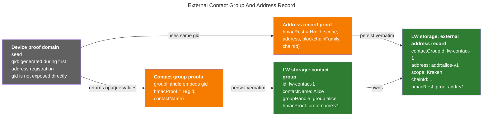
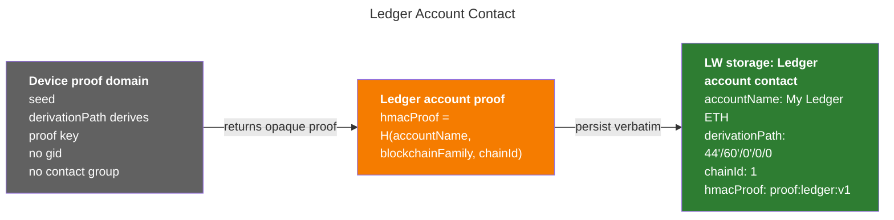
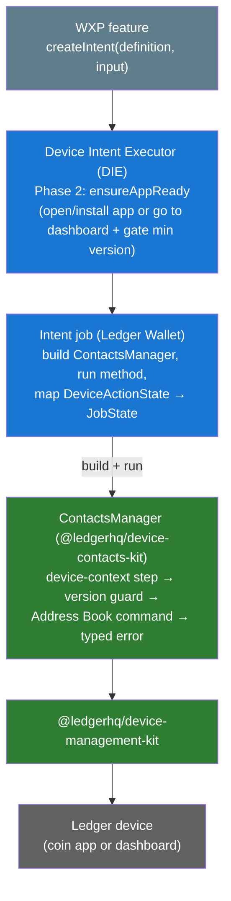
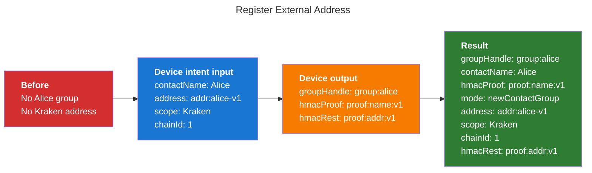
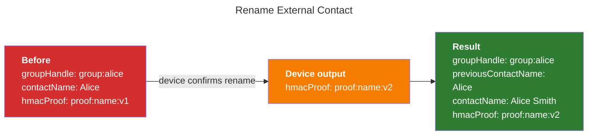
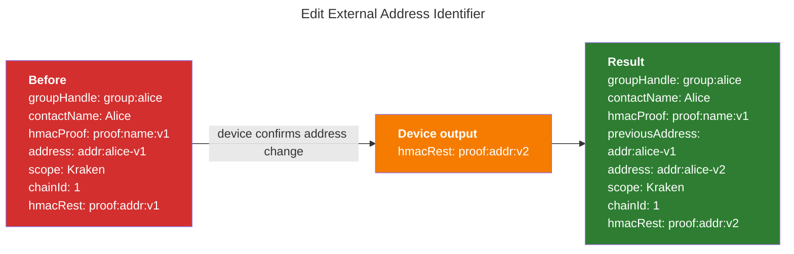
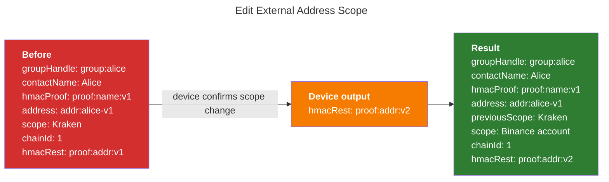
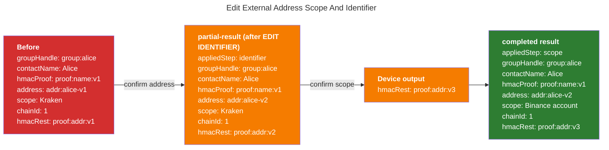
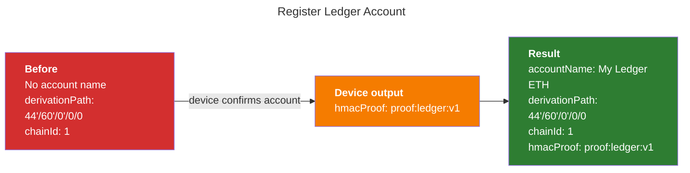
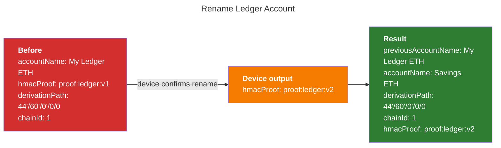

# Contacts Device Intents

## Purpose

This document defines the cross-app Contacts device intents that Ledger Wallet
should expose to Wallet Experience teams through the Device Intent Executor.

It is a WXP-facing contract, not an APDU reference. Ledger Wallet implements
these intents on top of the Device Management Kit (DMK) Contacts kit, which
provides the actual device endpoints. The lower-level device protocol remains
defined by the firmware Contacts specifications:

- [Contacts Final Specifications](https://ledgerhq.atlassian.net/wiki/spaces/FW/pages/6992035925/Address+Book+Final+Specifications)
- [Contacts - Device API](https://ledgerhq.atlassian.net/wiki/spaces/WXP/pages/7295107160/Address+Book+-+Device+API)
- Device Management Kit Contacts kit (`@ledgerhq/device-contacts-kit`), delivered
by the DXP team: [[DXP][Contacts] Epics & tasks](https://ledgerhq.atlassian.net/wiki/spaces/WXP/pages/7359627326/DXP+Contacts+Epics+tasks)

The intents are **cross-app**: all commands except external-contact rename run
in the target coin app, from the minimum Contacts-supported version of that app.
External-contact rename runs on the device dashboard.

Ledger Wallet implements each intent by calling the matching method on the DMK
Contacts kit's `ContactsManager` (built with `ContactsManagerBuilder` from the DMK
instance, the session id, and the coin `appName`). The kit owns the device
orchestration for every endpoint: it runs `openApp(appName)` for a coin-app command
(skippable with `skipOpenApp: true` when the app is already open) or
`goToDashboard()` for the external-contact rename, checks the minimum app/OS
version through the kit's version-requirements API, issues the underlying APDU, and
surfaces the required user interaction while the user validates on the device. Each
intent `JobState` mirrors the state emitted by the corresponding kit `DeviceAction`.

The contract is blockchain-family agnostic. Callers provide the target
`blockchainFamily`, the chain reference, and a family-serialized identifier.
For example, an EVM caller supplies `blockchainFamily = Ethereum`, a numeric
`chainId`, and a 20-byte account address; these are examples, not restrictions
of the Contacts intents.

## Table of Contents

- [Terminology](#terminology)
  - [Common terms](#common-terms)
  - [External contact terms](#external-contact-terms)
  - [Ledger account terms](#ledger-account-terms)
- [Object Relationships](#object-relationships)
  - [External Contact Group And Address Record](#external-contact-group-and-address-record)
  - [Ledger Account Contact](#ledger-account-contact)
- [Example Values](#example-values)
- [Storage Model](#storage-model)
- [Implementation on the DMK Contacts kit](#implementation-on-the-dmk-contacts-kit)
  - [Layers](#layers)
  - [Building an intent on top of `ContactsManager`](#building-an-intent-on-top-of-contactsmanager)
  - [Version requirements injection](#version-requirements-injection)
  - [Device-context step and user interaction](#device-context-step-and-user-interaction)
  - [Error mapping](#error-mapping)
- [Intents](#intents)
  - [Intent List](#intent-list)
  - [TypeScript Conventions](#typescript-conventions)
  - [Register External Address](#register-external-address)
    - `[registerExternalAddressIntentDefinition](#registerexternaladdressintentdefinition)`
  - [Rename External Contact](#rename-external-contact)
    - `[renameExternalContactIntentDefinition](#renameexternalcontactintentdefinition)`
  - [Edit External Address Identifier](#edit-external-address-identifier)
    - `[editExternalAddressIdentifierIntentDefinition](#editexternaladdressidentifierintentdefinition)`
  - [Edit External Address Scope](#edit-external-address-scope)
    - `[editExternalAddressScopeIntentDefinition](#editexternaladdressscopeintentdefinition)`
  - [Edit External Address](#edit-external-address)
    - `[editExternalAddressIntentDefinition](#editexternaladdressintentdefinition)`
  - [Register Ledger Account](#register-ledger-account)
    - `[registerLedgerAccountIntentDefinition](#registerledgeraccountintentdefinition)`
  - [Rename Ledger Account](#rename-ledger-account)
    - `[renameLedgerAccountIntentDefinition](#renameledgeraccountintentdefinition)`
- [Open Decisions](#open-decisions)

## Terminology

### Common terms

- **Contact**: human-readable entity, for example `Alice`.
- **Chain reference**: family-specific chain information bound into external
address records and Ledger account contacts. It must be provided whenever the
device verifies or computes `hmacRest` or a Ledger account `hmacProof`.
External contact rename is the exception because it only verifies and
recomputes the name proof. An EVM caller uses a numeric `chainId`.

### External contact terms

These apply only to third-party (external) contacts.

- **Contact group**: device-authenticated group for one contact name. It is
represented by `groupHandle` and `hmacProof`.
- **External address record**: one registered `(scope, identifier, chain)`
attached to a contact group. The identifier and chain are serialized according
to the target blockchain family.
- **Scope**: context string bound to an external address record. In product
wording it can be called a label, but technically it is part of the proof.
- **Identifier**: blockchain-family-specific account identifier. For example,
an EVM identifier is a 20-byte account address, usually represented in Ledger
Wallet as an EIP-55 hex address.
- `**gid` / Group ID**: random 32-byte identifier generated by the device when
creating a new external contact group, during the first address registration
for that group. Ledger Wallet does not receive or store it directly; it is
embedded inside `groupHandle`.
- `**groupHandle**`: opaque 64-byte device token returned when registering an
external contact group. It contains `gid` plus a device authentication tag.
Ledger Wallet stores it verbatim; the device later verifies it and extracts
`gid` internally.
- **External contact `hmacProof`**: opaque 32-byte proof binding a contact
name to a contact group. The device computes it from `gid + contactName`.
- `**hmacRest**`: opaque 32-byte proof binding an external address record:
scope, identifier, family, and chain. The device computes it from
`gid + scope + identifier + blockchainFamily + chainId`.

### Ledger account terms

These apply only to accounts controlled by the attached device seed.

- **Ledger account contact**: a named account controlled by the attached
device seed, identified by `derivationPath + chainId`.
- **Ledger account `hmacProof`**: opaque 32-byte proof binding a Ledger account
name to its account context. The device computes it from
`accountName + blockchainFamily + chainId` (called `contactName` in the
device spec, and no `gid`, since Ledger accounts have no contact group). The
`derivationPath` is not part of the signed message; it is only used as keying
material to derive the proof key.

For external contacts, the device deliberately splits proof material into
`hmacProof` for the contact name and `hmacRest` for the external address record.
This is why renaming a contact only replaces `hmacProof`, while editing the
scope or address only replaces `hmacRest`. Ledger account commands also return a
field named `hmacProof`, but it belongs to the Ledger account proof domain and is
not paired with `hmacRest`.

`groupHandle`, `hmacProof`, and `hmacRest` are seed-bound opaque values. Ledger
Wallet must store and replay them verbatim. It must not compute, verify, or
modify them.

## Object Relationships

### External Contact Group And Address Record

For external contacts, `gid` is generated when the device creates a new contact
group during the first address registration for that group. It then stays inside
the device proof domain. Ledger Wallet never stores `gid` as a standalone value.
It stores the opaque values that let the device recover or verify the same `gid`
later: `groupHandle`, `hmacProof`, and `hmacRest`.




### Ledger Account Contact

Ledger account contacts do not have a contact group, `gid`, `groupHandle`, or
`hmacRest`. The device computes a Ledger-account-domain `hmacProof` for the
account name and account context. Ledger Wallet persists that proof directly on
the Ledger account contact record.




## Example Values

The diagrams below use intentionally short fake values for readability. Some of
them are not valid hex strings.

```ts
const aliceAddress = "addr:alice-v1";
const aliceAddressUpdated = "addr:alice-v2";
const groupHandle = "group:alice";
const hmacProof = "proof:name:v1";
const hmacRest = "proof:addr:v1";
```

In production, addresses are real EIP-55 hex strings and proof values must be
treated as opaque byte strings.

## Storage Model

Ledger Wallet owns persistence. The device is stateless.

The model below is a suggestion; WXP is free to store this data differently.
However, it accurately captures everything that must be persisted, so any
alternative shape must be able to hold the same fields.

```ts
type ContactGroup = {
  /**
   * Ledger Wallet local identifier for the contact group.
   * Generated by Ledger Wallet when the contact group is created in storage.
   */
  id: string;
  /**
   * Human-readable contact name displayed to the user, for example "Alice".
   * Entered by the user in Ledger Wallet and confirmed on the device during
   * registration or rename.
   */
  contactName: string;
  /**
   * Opaque token identifying the device-generated contact group.
   * Generated by the device and returned by REGISTER IDENTITY when creating
   * the contact group during the first address registration for that group.
   * Ledger Wallet stores it verbatim and sends it back for later
   * external-contact commands.
   */
  groupHandle: string;
  /**
   * Opaque proof binding the contact name to this contact group.
   * Generated by the device during REGISTER IDENTITY, then regenerated by the
   * device during EDIT CONTACT NAME; Ledger Wallet stores the latest value.
   */
  hmacProof: string;
};

type ExternalAddress = {
  /**
   * Ledger Wallet local identifier for this external address record.
   * Generated by Ledger Wallet when the address record is created in storage.
   */
  id: string;
  /**
   * Link to the Ledger Wallet contact group that owns this address record.
   * Generated by Ledger Wallet from ContactGroup.id.
   */
  contactGroupId: string;
  /**
   * Context label for this address record, for example "Mainnet", "Kraken",
   * or "Binance account". Entered or selected by the user in Ledger Wallet and
   * confirmed on the device during registration or scope edit.
   */
  scope: string;
  /**
   * Blockchain-family-specific identifier attached to the contact group for
   * this scope and chain. Entered or selected in Ledger Wallet and confirmed on
   * the device during registration or identifier edit.
   */
  address: string;
  /**
   * Chain reference that disambiguates the network for this address record.
   * Its representation is family-specific (for example, an EVM caller uses a
   * numeric chain id). It is selected by Ledger Wallet from the network/account
   * context and sent to the device in Contacts commands.
   */
  chainId: string | number;
  /**
   * Opaque proof binding scope, address, blockchain family, and chain reference
   * to the contact group. Generated by the device during REGISTER IDENTITY,
   * then regenerated by the device during EDIT IDENTIFIER or EDIT SCOPE; Ledger
   * Wallet stores the latest value for this address record.
   */
  hmacRest: string;
};

type LedgerAccount = {
  /**
   * Ledger Wallet local identifier for the Ledger-owned account contact.
   * Generated by Ledger Wallet when the account contact is created in storage.
   */
  id: string;
  /**
   * Human-readable name for the Ledger-owned account, for example "Savings ETH".
   * Entered by the user in Ledger Wallet and confirmed on the device during
   * Ledger account registration or rename.
   */
  accountName: string;
  /**
   * BIP32 path of the Ledger-owned account being named.
   * Selected by Ledger Wallet from the account context and sent to the device in
   * Ledger account Contacts commands.
   */
  derivationPath: string;
  /**
   * Family-specific chain reference for the Ledger-owned account name.
   * Selected by Ledger Wallet from the network/account context and sent to the
   * device in Ledger account Contacts commands.
   */
  chainId: string | number;
  /**
   * Opaque proof binding accountName to the Ledger account context.
   * Generated by the device during REGISTER LEDGER ACCOUNT, then regenerated by
   * the device during EDIT LEDGER ACCOUNT; Ledger Wallet stores the latest
   * value.
   */
  hmacProof: string;
};
```

Proofs are seed-bound. Both contacts and addresses are bound to the seed used at
registration, so a contact registered on seed A cannot receive an address
registered on seed B, and edits are rejected across seeds. A contact synced to a
device with a different seed must therefore be registered again on that seed.

As a result, Ledger Wallet stores exactly one proof per contact group, external
address record, and Ledger account contact. To use the same external address on
a different seed, Ledger Wallet creates a separate contact/address record for
that seed and performs a separate device registration.

## Implementation on the DMK Contacts kit

Every intent in this document is implemented the same way: the intent job builds
a `ContactsManager` from the DMK Contacts kit, calls the single method that
matches the intent, and maps the kit `DeviceAction` states onto the intent
`JobState`s. This section describes that wiring once so the per-intent sections
below can stay focused on their input/result contracts.

### Layers



- **Device Intent Executor (DIE)** — the WXP entrypoint. The feature calls
  `createIntent(definition, input)` and renders the `DeviceIntentExecutor`
  component. DIE Phase 2 (`ensureAppReady`) brings the device to the right
  context (opens/installs the coin app for coin-app intents, or leaves it on the
  dashboard for the external-contact rename) and gates the minimum version.
- **Intent job** — the Ledger Wallet glue. It reads the connected-device
  context, builds the `ContactsManager`, runs the one matching method, maps the
  kit's `DeviceActionState` → intent `JobState`, and orchestrates the non-atomic
  convenience edit combo (identifier then scope).
- **`ContactsManager`** (DMK Contacts kit) — the stateless device-protocol unit.
  Each method returns a composed `DeviceAction`: device-context step
  (`openApp(appName)` or `goToDashboard()`) → version guard → Address Book
  command → typed error remap. It owns no persistence.
- **DMK** — sends the APDUs to the device.

### Building an intent on top of `ContactsManager`

The intent definition's job is a thin adapter. It never talks APDUs; it drives
the kit and re-emits state as `JobState`. Sketch of the shared shape (illustrative,
not the final API):

```ts
// Inside the intent job, once DIE Phase 2 has prepared the device.
const contactsManager = new ContactsManagerBuilder({
  dmk, // the DIE-provided DeviceManagementKit instance
  sessionId, // the connected device session
  appName: deviceExtractedContext.currentAppName, // coin app; ignored by rename
}).build();

// One kit method per intent (here: register an external address).
const deviceAction = contactsManager.registerExternalAddress(input);

deviceAction.observable.subscribe((deviceActionState) => {
  // Map DeviceActionState → JobState (pending / user-interaction / failed / result).
  emit(toJobState(deviceActionState));
});
```

Key points:

- **One method per intent.** The [Intent List](#intent-list) maps each intent to
  its `ContactsManager` endpoint. The only intent without a single kit method is
  the convenience edit, which the job composes from
  `editExternalAddressIdentifier()` and/or `editExternalAddressScope()`.
- **The kit is stateless.** The job persists proof material from the `Result`
  only after a result-carrying `JobState`, exactly as described per-intent below.
- **The job owns no device protocol.** Framing, version guarding, and error
  typing all live in the kit.

### Version requirements injection

Two version checks apply, and both are sourced from the kit's static helpers so
there is a single source of truth for "what does Contacts require":

- `getAppMinVersion(appName, model)` — coin-app floor, for coin-app intents.
- `getOsMinVersion(model)` — OS floor, for the external-contact rename.

These helpers are consumed in **two independent ways**:

1. **Inside the kit.** `ContactsManager` calls them itself for its own defensive
   version guard (coin-app methods use `getAppMinVersion`, `renameExternalContact`
   uses `getOsMinVersion`). This is why the minimum version is **never** passed
   into `ContactsManagerBuilder` — the instance already knows `appName` and reads
   the device model from the session.
2. **In Ledger Wallet**, to build the `getMinVersion` that DIE Phase 2
   (`ensureAppReady`) enforces before the job runs. Here Ledger Wallet must
   **compose, not replace**, the existing app-global floor:

```ts
// Ledger Wallet, only for Contacts intents.
const contactsGetMinVersion: GetMinVersion = (appName, model) =>
  maxSemver(
    liveConfigGetMinVersion(appName, model), // existing app-global floor
    contactsKit.getAppMinVersion(appName, model), // contacts floor
  );
```

`getMinVersion` in `libs/ledger-live-common/src/apps/support.ts` is
**app-global**: it gates whether the app may open for *every* flow (send,
receive, swap, …). Replacing it with the Contacts floor would block unrelated
flows on older-but-sufficient app versions, so the Contacts floor is injected
**per-flow only**, through `ensureAppReadyUseCase`'s `dependencies`
(`getMinVersion`) override. The result: the app-open version check and the kit's
internal version guard agree, and neither is a hard-coded input of the intent.

### Device-context step and user interaction

- **Coin-app intents** run `openApp(appName)`. When DIE Phase 2 already opened
  the app, the job may pass `skipOpenApp: true` to the kit method; the
  app-version guard still runs regardless.
- **The external-contact rename** runs `goToDashboard()` and gates the OS
  version. It ignores `appName` and is never skippable.
- While the command is on the device, the `DeviceAction` surfaces a **required
  user interaction** (confirm on device), and so does the underlying `openApp`.
  Each intent `JobState` mirrors those states, so the UI can prompt the user at
  the right moment.

### Error mapping

The kit never throws and never returns generic strings: failures are typed
`DAError`s on the `DeviceAction` (app-version-too-low, feature-not-supported,
plus pass-through DMK errors such as locked device, user refused, disconnected).
The job maps each to `JobState.failed` and lets the app's i18n layer render the
message.

## Intents

### Intent List


| Intent                                          | DMK `ContactsManager` endpoint                                        | Device command                        | Purpose                                        |
| ----------------------------------------------- | --------------------------------------------------------------------- | ------------------------------------- | ---------------------------------------------- |
| `registerExternalAddressIntentDefinition`       | `registerExternalAddress()`                                           | `REGISTER IDENTITY`                   | Register a new external address record         |
| `renameExternalContactIntentDefinition`         | `renameExternalContact()`                                             | `EDIT CONTACT NAME`                   | Rename an external contact group               |
| `editExternalAddressIdentifierIntentDefinition` | `editExternalAddressIdentifier()`                                     | `EDIT IDENTIFIER`                     | Change only the address                        |
| `editExternalAddressScopeIntentDefinition`      | `editExternalAddressScope()`                                          | `EDIT SCOPE`                          | Change only the scope                          |
| `editExternalAddressIntentDefinition`           | `editExternalAddressIdentifier()` and/or `editExternalAddressScope()` | `EDIT IDENTIFIER` and/or `EDIT SCOPE` | Convenience edit intent (no single kit method) |
| `registerLedgerAccountIntentDefinition`         | `registerLedgerAccount()`                                             | `REGISTER LEDGER ACCOUNT`             | Register a Ledger-owned account name           |
| `renameLedgerAccountIntentDefinition`           | `renameLedgerAccount()`                                               | `EDIT LEDGER ACCOUNT`                 | Rename a Ledger-owned account                  |


Each intent section uses the same contract vocabulary:

- The **TypeScript contract** defines the intent `Input`, the `Result` payload,
and the `JobState` union. The input is what WXP / Ledger Wallet provides when
creating the runtime intent; the result is the persistence-friendly payload
carried by relevant `JobState` values (it combines input values with the raw
proof material returned by the device, so the DIE caller can persist without
reconstructing context).
- **Ledger Wallet persistence after success** is the storage mutation Ledger
Wallet must perform only after a `JobState` carrying a result is observed.
Device proof values carried by the result replace the previous stored values
for future Contacts operations.

For every blockchain family, the chain reference is required by each management
intent that verifies or updates an external address record or Ledger account
contact. The only intent in this document that does not require a chain
reference is `renameExternalContactIntentDefinition`, because it only touches
the external contact name proof (`hmacProof`) and does not touch any address
record proof (`hmacRest`). EVM examples use a numeric `chainId`.

### TypeScript Conventions

Each intent is consumed the same way. Ledger Wallet creates the intent with
`createIntent(definition, input)`, passes it to the `DeviceIntentExecutor`
component, and observes the running job through the executor's
`onIntentJobStateChanged` prop. That callback receives every `JobState` the job
emits; the data that must be persisted is carried on the relevant `JobState`
values. There is no separate return value to await.

The concrete `JobState` unions below intentionally include UI-only states such
as `pending` and `awaiting-device-confirmation`, which exist only to drive the
intent UI. The `onIntentJobStateChanged` listener should ignore those states and
persist only when `jobState.type` is `completed`, or `partial-result` for the
convenience edit intent.

The result payloads are storage-agnostic and use granular properties rather than
the suggested storage model types. This keeps WXP free to choose its own storage
shape while still receiving every value needed to persist safely.

```ts
type ContactIdentifier = string;
type ChainId = string | number;
type GroupHandle = string;
type Proof = string;

// This is subject to changing, but any change there won't impact the integration of the intents.
type JobStateBase =
  | { type: "pending" }
  | { type: "awaiting-device-confirmation" }
  | { type: "failed"; error: Error };
```

### Register External Address

#### `registerExternalAddressIntentDefinition`

Registers one `(contactName, scope, address, chainId)` tuple on the device.

DMK endpoint: `ContactsManager.registerExternalAddress()` (runs `REGISTER IDENTITY`
in the coin app).

TypeScript contract:

```ts
type RegisterExternalAddressIntentInput = {
  contactName: string;
  scope: string;
  address: ContactIdentifier;
  chainId: ChainId;
  existingContactGroup?: {
    groupHandle: GroupHandle;
    hmacProof: Proof;
  };
};

type RegisterExternalAddressResult = {
  mode: "newContactGroup" | "existingContactGroup";
  contactName: string;
  scope: string;
  address: ContactIdentifier;
  chainId: ChainId;
  groupHandle: GroupHandle;
  hmacProof: Proof;
  hmacRest: Proof;
};

type RegisterExternalAddressJobState =
  | JobStateBase
  | {
      type: "completed";
      result: RegisterExternalAddressResult;
    };
```

Pass an `existingContactGroup` in the input only when adding an address to an
already-registered contact group.

Ledger Wallet persistence after success:

- If the input did not include `groupHandle + hmacProof`, this registration
created a new contact group. Create the `ContactGroup` with the
returned `groupHandle` and `hmacProof`, then create the
`ExternalAddress` with the returned `hmacRest`.
- If the input included an existing `groupHandle + hmacProof`, this registration
only added a new address record to that group. Keep the existing contact group
unchanged, optionally assert that the returned `groupHandle` and `hmacProof`
match the input values, then create the new `ExternalAddress`
with the returned `hmacRest`.




### Rename External Contact

#### `renameExternalContactIntentDefinition`

Renames the contact group. This changes the group-level proof but does not
change any address record. It does not need `scope`, `address`, or `chainId`
because those fields are only bound into `hmacRest`, which remains unchanged.

DMK endpoint: `ContactsManager.renameExternalContact()` (runs `EDIT CONTACT NAME`
on the device dashboard).

TypeScript contract:

```ts
type RenameContactIntentInput = {
  previousContactName: string;
  newContactName: string;
  groupHandle: GroupHandle;
  hmacProof: Proof;
};

type RenameContactResult = {
  previousContactName: string;
  contactName: string;
  groupHandle: GroupHandle;
  hmacProof: Proof;
};

type RenameContactJobState =
  | JobStateBase
  | {
      type: "completed";
      result: RenameContactResult;
    };
```

Ledger Wallet persistence after success:

- Update `ContactGroup.contactName` from `previousContactName` to
`newContactName`.
- Replace `ContactGroup.hmacProof` with the returned
`hmacProof`.
- Leave every `ExternalAddress.hmacRest` for this contact group
unchanged.




### Edit External Address Identifier

#### `editExternalAddressIdentifierIntentDefinition`

Changes only the blockchain identifier for one external address record. The
contact name and scope stay unchanged.

DMK endpoint: `ContactsManager.editExternalAddressIdentifier()` (runs
`EDIT IDENTIFIER` in the coin app).

TypeScript contract:

```ts
type EditExternalAddressIdentifierIntentInput = {
  contactName: string;
  scope: string;
  previousAddress: ContactIdentifier;
  newAddress: ContactIdentifier;
  chainId: ChainId;
  groupHandle: GroupHandle;
  hmacProof: Proof;
  hmacRest: Proof;
};

type EditExternalAddressIdentifierResult = {
  contactName: string;
  scope: string;
  previousAddress: ContactIdentifier;
  address: ContactIdentifier;
  chainId: ChainId;
  groupHandle: GroupHandle;
  hmacProof: Proof;
  hmacRest: Proof;
};

type EditExternalAddressIdentifierJobState =
  | JobStateBase
  | {
      type: "completed";
      result: EditExternalAddressIdentifierResult;
    };
```

Ledger Wallet persistence after success:

- Update the target `ExternalAddress.address` from
`previousAddress` to `newAddress`.
- Replace only that `ExternalAddress.hmacRest` with the returned
`hmacRest`.
- Leave `ContactGroup.contactName`, `groupHandle`, and
`hmacProof` unchanged.




### Edit External Address Scope

#### `editExternalAddressScopeIntentDefinition`

Changes only the scope for one external address record. The contact name and
address stay unchanged.

DMK endpoint: `ContactsManager.editExternalAddressScope()` (runs `EDIT SCOPE` in
the coin app).

TypeScript contract:

```ts
type EditExternalAddressScopeIntentInput = {
  contactName: string;
  previousScope: string;
  newScope: string;
  address: ContactIdentifier;
  chainId: ChainId;
  groupHandle: GroupHandle;
  hmacProof: Proof;
  hmacRest: Proof;
};

type EditExternalAddressScopeResult = {
  contactName: string;
  previousScope: string;
  scope: string;
  address: ContactIdentifier;
  chainId: ChainId;
  groupHandle: GroupHandle;
  hmacProof: Proof;
  hmacRest: Proof;
};

type EditExternalAddressScopeJobState =
  | JobStateBase
  | {
      type: "completed";
      result: EditExternalAddressScopeResult;
    };
```

Ledger Wallet persistence after success:

- Update the target `ExternalAddress.scope` from `previousScope`
to `newScope`.
- Replace only that `ExternalAddress.hmacRest` with the returned
`hmacRest`.
- Leave the address record's `address` unchanged.
- Leave `ContactGroup.contactName`, `groupHandle`, and
`hmacProof` unchanged.




### Edit External Address

#### `editExternalAddressIntentDefinition`

Convenience intent for WXP when a user edits an external address form and may
change the identifier, the scope, or both.

DMK endpoints: `ContactsManager.editExternalAddressIdentifier()` and/or
`ContactsManager.editExternalAddressScope()`. The kit exposes no single combined
endpoint, so this intent composes the two granular kit methods (see the
non-atomic behavior below).

TypeScript contract:

```ts
type EditExternalAddressStep = "identifier" | "scope";

type EditExternalAddressIntentInput = {
  contactName: string;
  previousScope: string;
  newScope: string;
  previousAddress: ContactIdentifier;
  newAddress: ContactIdentifier;
  chainId: ChainId;
  groupHandle: GroupHandle;
  hmacProof: Proof;
  hmacRest: Proof;
};

type EditExternalAddressResult = {
  appliedStep: EditExternalAddressStep;
  contactName: string;
  scope: string;
  address: ContactIdentifier;
  chainId: ChainId;
  groupHandle: GroupHandle;
  hmacProof: Proof;
  hmacRest: Proof;
};

type EditExternalAddressJobState =
  | { type: "pending" }
  | {
      type: "awaiting-device-confirmation";
      step: EditExternalAddressStep;
    }
  | {
      type: "partial-result";
      result: EditExternalAddressResult;
    }
  | {
      type: "completed";
      appliedSteps: EditExternalAddressStep[];
      result: EditExternalAddressResult;
    }
  | {
      type: "failed";
      failedStep?: EditExternalAddressStep;
      error: Error;
    };
```

The DIE caller should persist both `partial-result` and `completed` results:

```ts
function onIntentJobStateChanged(
  jobState: EditExternalAddressJobState
) {
  if (jobState.type === "partial-result" || jobState.type === "completed") {
    persistExternalAddressEdit(jobState.result);
  }
}
```

Ledger Wallet persistence after success:

- If only `address` changed, apply the same persistence rules as
`editExternalAddressIdentifierIntentDefinition`.
- If only `scope` changed, apply the same persistence rules as
`editExternalAddressScopeIntentDefinition`.
- If both changed, persist the final `newScope`, `newAddress`, and final
`hmacRest`. If the first granular device command succeeded before the second
one failed, persist or recover from the intermediate state as described below.

Behavior:

- If only `address` changed, run `EDIT IDENTIFIER`.
- If only `scope` changed, run `EDIT SCOPE`.
- If both changed, run the two granular device commands in sequence. The
implementation may choose the order, but it must expose the order through
`awaiting-device-confirmation.step`, `partial-result.result.appliedStep`, and
`completed.appliedSteps`.

Important: the current device API exposes separate `EDIT IDENTIFIER` and
`EDIT SCOPE` commands. A combined edit is therefore not atomic unless firmware
adds a dedicated combined command. If the first command succeeds and the second
fails or is rejected, Ledger Wallet must persist the intermediate state returned
by the successful command, otherwise the stored proof material becomes stale.

Recommended sequence when both values changed:

1. Run `EDIT IDENTIFIER` with `previousAddress`, `newAddress`, and
  `previousScope`.
2. Emit `partial-result` with the intermediate state
  `(previousScope, newAddress, intermediateHmacRest)` so Ledger Wallet can
   persist it immediately.
3. Run `EDIT SCOPE` with `previousScope`, `newScope`, `newAddress`, and the
  intermediate `hmacRest`.
4. Emit `completed` with the final `(newScope, newAddress, finalHmacRest)`
  result.




### Register Ledger Account

#### `registerLedgerAccountIntentDefinition`

Registers a name for an account controlled by the attached Ledger device seed.
The account is identified by `derivationPath + chainId`.

DMK endpoint: `ContactsManager.registerLedgerAccount()` (runs
`REGISTER LEDGER ACCOUNT` in the coin app).

TypeScript contract:

```ts
type RegisterLedgerAccountIntentInput = {
  accountName: string;
  derivationPath: string;
  chainId: ChainId;
};

type RegisterLedgerAccountResult = {
  accountName: string;
  derivationPath: string;
  chainId: ChainId;
  hmacProof: Proof;
};

type RegisterLedgerAccountJobState =
  | JobStateBase
  | {
      type: "completed";
      result: RegisterLedgerAccountResult;
    };
```

Ledger Wallet persistence after success:

- Create the `LedgerAccount` record for `accountName`,
`derivationPath`, and `chainId`.
- Store the returned `hmacProof` on that Ledger account contact.
- Do not store `groupHandle` or `hmacRest` for Ledger account contacts; those
fields only exist for external contacts.




### Rename Ledger Account

#### `renameLedgerAccountIntentDefinition`

Renames a registered Ledger-owned account.

DMK endpoint: `ContactsManager.renameLedgerAccount()` (runs `EDIT LEDGER ACCOUNT`
in the coin app).

TypeScript contract:

```ts
type RenameLedgerAccountIntentInput = {
  previousAccountName: string;
  newAccountName: string;
  derivationPath: string;
  chainId: ChainId;
  hmacProof: Proof;
};

type RenameLedgerAccountResult = {
  previousAccountName: string;
  accountName: string;
  derivationPath: string;
  chainId: ChainId;
  hmacProof: Proof;
};

type RenameLedgerAccountJobState =
  | JobStateBase
  | {
      type: "completed";
      result: RenameLedgerAccountResult;
    };
```

Ledger Wallet persistence after success:

- Update `LedgerAccount.accountName` from `previousAccountName` to
`newAccountName`.
- Replace `LedgerAccount.hmacProof` with the returned
`hmacProof`.




## Open questions

- Resolved for DMK: the `derivationPath` for external-contact commands is a fixed  
internal constant owned by the DMK Contacts kit. Its external-address endpoints  
(`registerExternalAddress`, `editExternalAddressIdentifier`,  
`editExternalAddressScope`, `renameExternalContact`) do not expose it publicly,  
and it will be dropped from the underlying `Command` later. Accordingly, the  
external-address intent inputs, results, storage `ContactGroup`, and diagrams in  
this document no longer carry `derivationPath`; Ledger Wallet does not supply it.  
Ledger-account intents keep their real account `derivationPath`.
- Scalability / Multi chain
  - Chain ID: is number relevant ? cf. Cosmos
  - Blockchain ID should be in contact ? OR just use common derivation path in contact object (regardless of the app/blockchain)
  - we might have to expose something to derive the "initialization context" required by the DIE (app name, min app version) from the contact data

