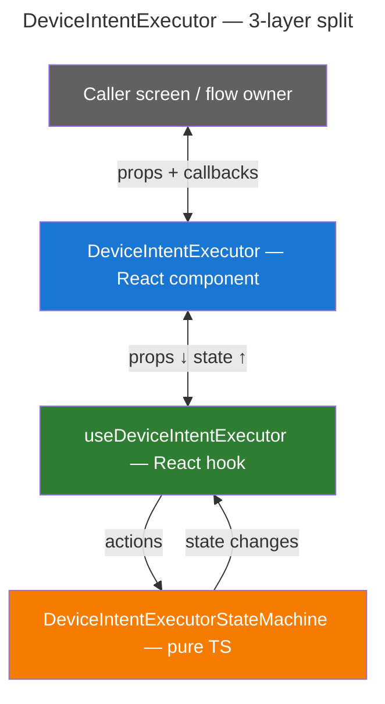
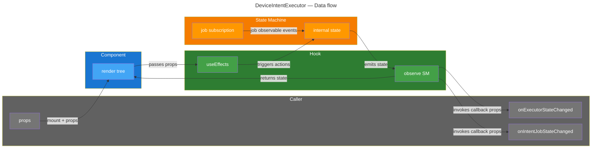
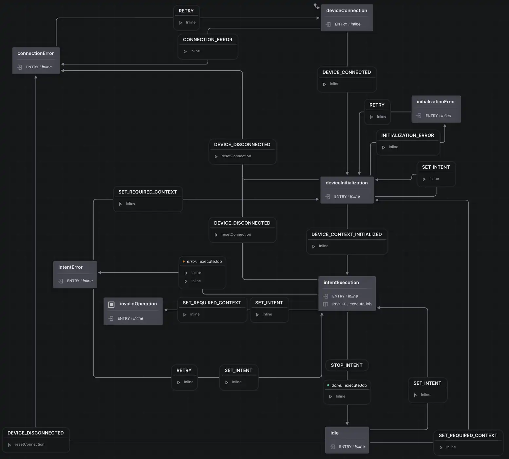

# DeviceIntentExecutor — Internal Architecture

## Overview

The `DeviceIntentExecutor` implementation is split into three layers, each with a
clear single responsibility. From outermost to innermost:



---

## Layer details

### 1. `DeviceIntentExecutor` — React component

**File:** `src/DeviceIntentExecutor.tsx`

The thinnest possible React component. A pure rendering shell with **zero
business logic or state management**. Its only job is:

- Accept `DeviceIntentExecutorProps` + `ExecutorPlatformConfiguration` (injected
  by the platform wrapper).
- Call `useDeviceIntentExecutor(...)` with those props.
- Render the appropriate UI based on the state returned by the hook:
  - **Connecting device** → render the platform-injected `DeviceConnectionComponent`.
  - **initializing context** → render the platform-injected
    `DeviceContextInitializerComponent`.
  - **Executing intent** → render `intent.component` with the current `jobState`
    and `extraProps`.
  - **Connection / initialization / intent error** → render the corresponding
    platform-injected error component (`ConnectionErrorComponent`,
    `InitializationErrorComponent`, `IntentErrorComponent`).
  - **Idle** → render the last intent snapshot (component + last `jobState` +
    `extraProps`) if one exists, otherwise render nothing.

The caller screen mounts this component and passes props. It does not need to
know anything about the hook or the state machine underneath.

### 2. `useDeviceIntentExecutor` — React hook

**File:** `src/useDeviceIntentExecutor.ts`

The bridge between the React world (props, effects, callbacks) and the pure
state machine. Responsibilities:

| Concern                              | How                                                                                                                                                                 |
| ------------------------------------ | ------------------------------------------------------------------------------------------------------------------------------------------------------------------- |
| **Props → actions**                  | `useEffect` hooks detect changes to `intent`, `requiredDeviceContext`, `enabled`, `cancelIntentRequestId` and decide which actions to trigger on the state machine. |
| **State machine → React state**      | Subscribes to the state machine's state via listeners, stores the latest state in `useState`, and returns it to the component for rendering.                        |
| **State machine → caller callbacks** | When the machine's state changes, invokes `onExecutorStateChanged` and `onIntentJobStateChanged` (callback props passed through the component).                     |
| **Lifecycle**                        | Creates the state machine instance on mount, tears it down on unmount.                                                                                              |

The hook does **not** contain the transition logic itself. It translates
React lifecycle into imperative calls on the state machine and observation of
its state.

### 3. `DeviceIntentExecutorStateMachine` — pure state machine

**File:** `src/DeviceIntentExecutorStateMachine.ts`

The heart of the executor. Owns the full lifecycle state and transition logic.
Key design constraints:

- **No React dependency.** It can be instantiated and driven in a plain TS test
  with no JSDOM or React test renderer.
- **Deterministic transitions.** Given a state and an action, the next state is
  predictable and testable.
- **Observable state.** Exposes state changes via a listener pattern
  (`StateMachineListeners`) so the hook can subscribe.
- **Manages RxJS subscriptions** for intent jobs internally (subscribe on
  execute, unsubscribe on cancel / intent change / disable).

#### Implementation: XState v5

The state machine is implemented with **XState v5** (`xstate` package, added to the
pnpm workspace catalog). Rationale:

- **Formalized states and transitions** — the machine definition is a single,
  declarative object. Every valid state and event is explicit; invalid transitions
  are impossible by construction.
- **Auto-cancellation of invoked observables** — `fromObservable` actors are
  automatically unsubscribed when the invoking state is exited, which eliminates
  an entire class of subscription-leak bugs for intent jobs.
- **Visualizer** — the XState inspector / Stately Studio can render the machine
  live for debugging.

The machine is wrapped in a `DeviceIntentExecutorStateMachine<JobState, Input, ExtraProps>`
class that exposes typed public methods for every event and accepts
`StateMachineListeners` at construction for state observation.

---

## Data flow summary



---

## File structure

```
libs/device-intent/src/
├── core.ts                              # intent & device types + createIntent helper
├── executor.ts                          # executor props, state & platform config types
├── index.ts                             # re-exports
├── DeviceIntentExecutor.tsx             # React component (layer 1)
├── useDeviceIntentExecutor.ts           # React hook (layer 2)
├── deriveHookState.ts                   # pure function mapping ExecutorState → hook return type
└── DeviceIntentExecutorStateMachine.ts  # XState v5 state machine (layer 3)
```

---

## State machine



### Transition summary

| From                           | Event                                        | Type                 | To                                                           |
| ------------------------------ | -------------------------------------------- | -------------------- | ------------------------------------------------------------ |
| ●                              | start with initial intent + required context | caller               | Phase 1: Device connection                                   |
| Phase 1: Device connection     | error                                        | internal (component) | Connection Error                                             |
| Phase 1: Device connection     | device connected                             | internal (component) | Phase 2: Device initialization                               |
| Phase 1: Device connection     | terminate                                    | caller               | ◉                                                            |
| Connection Error               | user retry                                   | internal (component) | Phase 1: Device connection                                   |
| Phase 2: Device initialization | error                                        | internal (component) | initialization Error                                         |
| Phase 2: Device initialization | device context initialized                   | internal (component) | Phase 3: Intent execution                                    |
| Phase 2: Device initialization | change intent                                | caller               | Phase 2: Device initialization (self, updates stored intent) |
| Phase 2: Device initialization | device disconnected                          | internal (component) | Connection Error                                             |
| Phase 2: Device initialization | terminate                                    | caller               | ◉                                                            |
| initialization Error           | user retry                                   | internal (component) | Phase 2: Device initialization                               |
| Phase 3: Intent execution      | job emits error                              | internal (job sub)   | Intent Error                                                 |
| Phase 3: Intent execution      | intent stopped                               | caller               | Phase 4: Idle                                                |
| Phase 3: Intent execution      | intent completed                             | internal (job sub)   | Phase 4: Idle                                                |
| Phase 3: Intent execution      | device disconnected                          | internal (component) | Connection Error                                             |
| Phase 3: Intent execution      | change intent                                | caller               | Intent Error                                                 |
| Phase 3: Intent execution      | change required context                      | caller               | Intent Error                                                 |
| Phase 3: Intent execution      | terminate                                    | caller               | ◉                                                            |
| Intent Error                   | user retry (same intent)                     | internal (component) | Phase 3: Intent execution                                    |
| Intent Error                   | change intent                                | caller               | Phase 3: Intent execution                                    |
| Phase 4: Idle                  | change intent                                | caller               | Phase 3: Intent execution                                    |
| Phase 4: Idle                  | change required context                      | caller               | Phase 2: Device initialization                               |
| Phase 4: Idle                  | device disconnected                          | internal (component) | Connection Error                                             |
| Phase 4: Idle                  | terminate                                    | caller               | ◉                                                            |

---

## Design decisions

### Hook-level orchestration of simultaneous prop changes

When both `requiredDeviceContext` and `intent` props change in the same render,
the order in which the hook dispatches `setRequiredContext` and `setIntent` to
the state machine matters — wrong ordering could trigger unnecessary errors
(e.g. `setIntent` first from idle goes to `intentExecution` with stale context,
then `setRequiredContext` causes an `intentError`).

The hook uses a **single combined `useEffect`** watching both props. When both
change, it dispatches **`setRequiredContext` first, then `setIntent`**: from
idle, `setRequiredContext` transitions to `deviceInitialization`, and then
`setIntent` is absorbed as a self-transition that updates the stored intent
without changing state. See `useDeviceIntentExecutor.ts` section 6.
