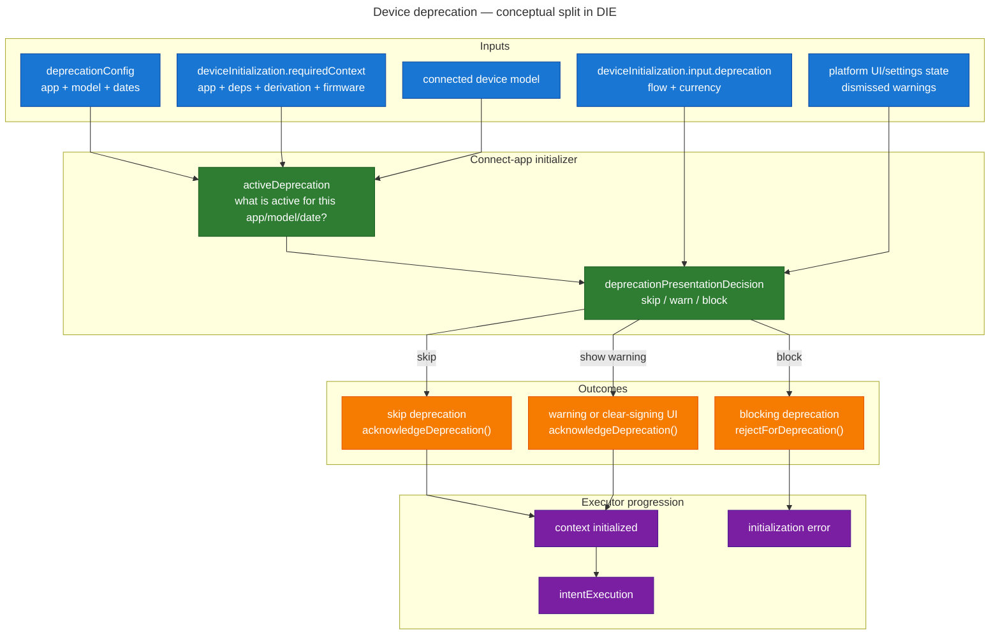
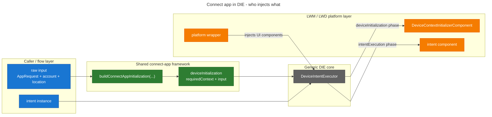

# Connect App in the Device Intent Executor

## Status

Exploratory draft. This document is intended to be the base for a future ADR.

## Scope

This document focuses on **connect-app-based intents** and on how the current
responsibilities of `connect app` should be represented in the Device Intent
Executor (DIE) world.

It does **not** try to redesign every device flow at once. The scope here is:

- the current `connect app` responsibility boundary
- the requirements originally captured by the DIE design
- the requirements that were overlooked
- a candidate architecture for integrating those requirements in the DIE

## Context

### What the initial DIE design captured

The initial DIE design identified a core concept: before an intent job can run,
the device may need to be in a specific **required device context**.

That is what `RequiredDeviceContext` currently models:

```ts
type RequiredDeviceContext = {
  appName: string;
  requiresDerivation?: RequiresDerivation;
  dependencies: string[];
  requireLatestFirmware: boolean;
  allowPartialDependencies: boolean;
};
```

At a high level, this captures the connect-app requirements that were obvious
from the start:

- which app must be open
- which dependencies may need to be installed
- whether derivation must be performed
- whether the firmware must be up to date
- whether missing dependencies can be tolerated

This is already a major improvement over the legacy device-action model,
because it separates:

- **device connection**
- **device initialization**
- **intent execution**

and makes the initializer phase explicit.

### The implicit assumption behind the initial model

The original shape implicitly assumes:

1. once the required context has been established, the intent job can run
2. the initializer mostly needs device requirements, not much caller-specific UI policy

That assumption is correct for a large part of connect-app behavior, but current
device actions show that it is incomplete.

## Overlooked Requirements

Three important requirements used by the current connect-app-based device actions
were not fully represented in the initial DIE model:

- **device deprecation** -- a config-driven pre-intent gate that can warn, block,
  or be skipped depending on device model, flow, coin, and user dismissal state
- **wrong device check** -- a post-derivation validation that ensures the
  connected physical device matches the expected account before the intent runs
- **required context derivation from account input** -- a normalization step that
  turns rich caller input (`account`, `currency`, nested dependencies, etc.)
  into the explicit initialization data consumed by the DIE initializer

All three happen **before** the real intent job should execute, but they do not
fit cleanly into the current `RequiredDeviceContext` alone.

## Device Deprecation

### Description

Device deprecation is a connect-app-time gate driven by remote product config.

At a user-facing level, it can lead to:

- no screen at all, if the current flow/coin does not match the deprecation rule
- an informational warning screen with `Update` + `Continue`
- an informational warning followed by a clear-signing warning
- a blocking error-style screen with no continue path

This behavior depends on several dimensions:

- the app being opened
- the connected device model
- the current flow (`send`, `receive`, `swap`, `staking`, etc.)
- the coin / token involved
- whether the warning was previously dismissed

So the same device can be accepted in one flow and blocked or warned in another.

From a UX perspective, this exists to:

- warn users that a device/model is being phased out for some operations
- gradually ramp from warning to blocking behavior
- support exceptions by flow or by coin
- let users dismiss some warning screens without disabling the policy globally

### Why it should be part of the DIE framework

Device deprecation should be part of the **DIE framework**, but not part of the
generic executor core.

It belongs in the framework because:

- it is a **pre-intent** concern
- it is shared by all connect-app-based intents
- callers should not reimplement this policy one by one
- LWM and LWD both need a consistent abstraction for it

It does **not** belong in the generic executor core because:

- it is product-specific policy, not generic orchestration
- it depends on connect-app-specific concepts (app, dependencies, device model)
- part of the decision also depends on:
  - flow/currency metadata coming from the caller side
  - dismissal state coming from the platform UI/settings layer

So the right place is:

- **not** the intent job
- **not** the generic executor state machine
- **yes** the connect-app initialization framework used during `deviceInitialization`

For the first iteration, the simplest implementation is to keep deprecation
inside `ConnectAppDeviceAction` and let the DIE initializer react to the
deprecation intermediate state it emits.[^deprecation-precheck]

### Conceptual refactoring

One of the motivations for the DIE-based redesign is that the current
deprecation model collapses several different concerns into one mixed payload:

- remote config
- model-specific applicability
- flow/coin presentation policy
- runtime continuation / rejection control

That is why names like `deviceDeprecationRules`, `warningScreenVisible`,
`doSkipDeprecation`, or `onContinue(true)` feel so awkward today: they are
trying to represent multiple layers of responsibility at once.

The conceptual split we should move toward is something closer to:

- `deprecationConfig`
- `activeDeprecation`
- `deprecationPresentationDecision`
- `acknowledgeDeprecation()`
- `rejectForDeprecation()`

High-level conceptual split:



This is the conceptual split we should move toward.

For the first iteration, we do **not** need to extract every box into a separate
implementation unit. In particular, we can still:

- keep the raw deprecation check inside `ConnectAppDeviceAction`
- keep the platform initializer responsible for rendering the deprecation UI
- progressively refactor the surrounding naming and data flow toward this cleaner model

## Wrong Device Check

### Description

The current connect-app-based flows can verify that the connected physical device
matches the expected account.

Today, after connect-app performs derivation, the result is compared against the
expected account identity:

- the derived address is compared to `account.freshAddress`
- and also to `account.seedIdentifier` for some special cases

If it does not match, the flow does not proceed and the UI shows a
"wrong device for account" state.

From a UX perspective, this exists to:

- prevent the user from signing or confirming with the wrong Ledger device
- make multi-device situations safer
- catch mistakes before the real intent job starts

This is fundamentally not "transaction job progress". It is a validation step
on the initialized device context.

### Why it should be part of the DIE framework

Like deprecation, wrong-device check should be part of the **DIE framework**,
but not of the generic executor core.

It belongs in the framework because:

- it is a cross-cutting requirement for connect-app-based flows
- it happens before the intent job should run
- it should be available consistently in LWM and LWD

It does **not** belong in the generic core because:

- the generic core should not become aware of raw `Account` domain objects
- the check is connect-app/account-specific validation
- it is better expressed as normalized validation input for the initializer

So here again, the best fit is:

- normalize the needed account-derived information outside the executor core
- perform the validation in the connect-app initializer
- only enter `intentExecution` if validation succeeds

### How the proposed wrong-device check would work

In the proposed DIE-based design, wrong-device validation would happen in two
steps.

#### 1. The shared builder derives the expected account identity

If the caller provides an account and the flow expects derivation-based device
validation, the shared builder would populate `expectedAccount` inside
`ConnectAppInitializationInput`.

Conceptually:

```ts
type ConnectAppInitializationInput = {
  expectedAccount?: {
    accountName: string;
    acceptableDerivedAddresses: string[];
  };
  deprecation?: {
    flow: FlowName;
    currencyName: string;
  };
};
```

The builder would derive:

- `accountName` for the user-facing error state
- `acceptableDerivedAddresses` from the current account model

In the first approximation, this means:

- always include `account.freshAddress`
- include `account.seedIdentifier` as an additional acceptable identity when the
  current legacy flow relies on it

Illustratively:

```ts
function buildExpectedAccount(account: Account): {
  accountName: string;
  acceptableDerivedAddresses: string[];
} {
  return {
    accountName: getDefaultAccountName(account),
    acceptableDerivedAddresses: [
      account.freshAddress,
      ...(account.seedIdentifier ? [account.seedIdentifier] : []),
    ],
  };
}
```

Important nuance:

- the builder should only populate `expectedAccount` when the flow actually wants
  this validation
- if a flow explicitly bypasses this check today (for example via ACRE-style
  behavior), the builder should omit `expectedAccount`

#### 2. The initializer validates the derived address before continuing

Once connect-app initialization has completed and derivation has produced a
`derivedAddress`, the platform initializer can perform the comparison.

Conceptually:

```ts
if (deviceInitialization.input.expectedAccount && extractedContext.derivedAddress) {
  const { acceptableDerivedAddresses, accountName } = deviceInitialization.input.expectedAccount;

  const isExpectedDevice = acceptableDerivedAddresses.includes(extractedContext.derivedAddress);

  if (!isExpectedDevice) {
    // render wrong-device UI, do not call onContextInitialized(...)
  }
}

// otherwise continue toward intentExecution
onContextInitialized(extractedContext);
```

So the rule becomes:

- no `expectedAccount` => no wrong-device validation
- `expectedAccount` + matching `derivedAddress` => continue
- `expectedAccount` + non-matching `derivedAddress` => show wrong-device UI and
  block the intent

This keeps the responsibilities clean:

- builder decides whether wrong-device validation is required and what the
  acceptable identities are
- initializer applies the check once the device context has been established
- generic DIE core remains unaware of raw account semantics

#### Why this matches the current behavior

This is effectively the same logic as current `app.ts`, but with the
responsibilities split more cleanly.

Today:

- `app.ts` computes the check from `appRequest.account`
- compares `state.derivation.address` against `freshAddress` and `seedIdentifier`
- exposes `inWrongDeviceForAccount`

In the proposed solution:

- the builder computes the expected identities from the account
- the initializer compares the derived address against those identities
- the initializer shows the wrong-device state before entering `intentExecution`

## Required Context Derivation from Account Input

### Description

Current connect-app-based device actions do not always start from explicit,
normalized device requirements.

Instead, they often start from richer caller-side input such as:

- `account`
- `currency`
- nested `dependencies`
- token context

Then `app.ts` derives the actual connect-app requirements from that richer
input, for example:

- infer `currency` from `account`
- infer `appName` from `currency.managerAppName`
- infer derivation requirements from `account.derivationMode` and
  `account.freshAddressPath`
- inject family-specific get-address parameters
- normalize dependency requests

From a UX perspective, this matters because callers want to express their intent
in domain terms ("use this account") rather than rebuilding low-level device
requirements themselves.

### Why it should be part of the DIE framework

This requirement should also be part of the broader **DIE framework**, but it is
slightly different from deprecation and wrong-device check.

It belongs in the framework because:

- connect-app-based callers in LWM and LWD need the same normalization behavior
- the mapping from `account` / `currency` / nested dependency inputs to explicit
  device requirements is shared business logic
- callers should not reimplement this resolution themselves

But unlike deprecation and wrong-device check, this may **not** belong inside
the initializer itself.

The reason is simple:

- the initializer should run once explicit requirements are already known
- deriving those requirements from domain input is a **pre-initializer**
  normalization step

So the likely shape is:

- raw account/request input comes from the caller
- a shared resolver turns that into:
  - `RequiredDeviceContext`
  - initializer-side validation/policy input
- the initializer then consumes those normalized structures

This is also where the overlap with wrong-device check becomes important:

- if the caller provides an `account`, the resolver can derive both
  `RequiredDeviceContext` and the expected-account validation data needed by the
  initializer
- this avoids passing the full raw `Account` deep into the generic DIE core

So the best fit is:

- **not** the intent job
- **probably not** the initializer itself
- **yes** a shared pre-initializer resolver in the broader connect-app/DIE framework

## Exploratory Integration

This section explores a solution that keeps responsibilities well scoped.

### Design principles

The design should respect these principles:

1. **Keep the executor core generic**
   The core DIE should continue to orchestrate connection, initialization,
   execution, retry, and cancellation only.

2. **Keep `RequiredDeviceContext` focused on device requirements**
   It should describe what device state must be established, not flow-specific UI
   policy or account domain objects.

3. **Move connect-app-specific policy into a reusable initialization framework**
   The framework should be available to both LWM and LWD, but layered on top of
   the generic DIE core.

4. **Normalize rich caller input before it reaches the initializer**
   Raw `AppRequest`, `Account`, `location`, etc. should be resolved
   into smaller, purpose-specific structures.

### What should not happen

The following options look tempting but would make the design worse:

#### 1. Put deprecation and wrong-device logic in each intent job

This would:

- duplicate behavior across intents
- blur the intent/job responsibility
- make job states larger again
- lose the main simplification brought by `requiredDeviceContext`

#### 2. Put product-specific policy in the generic executor core

This would:

- pollute `libs/device-intent` with connect-app and product policy concerns
- make the core harder to reuse
- force the generic state machine to know about flow/coin/account details

#### 3. Put everything into `RequiredDeviceContext`

This would turn `RequiredDeviceContext` into a grab-bag of unrelated concerns.

For example, these do **not** belong in the same bucket:

- `appName`
- `dependencies`
- `requiresDerivation`
- `currencyName`
- `dismissedDeprecations`
- `accountName`
- `acceptableDerivedAddresses`

The first group is device context.
The second group is UI policy and validation metadata.

### Proposed layering

The cleanest architecture is to split responsibilities across four layers.

#### 1. Generic DIE core

Lives in `libs/device-intent`.

Responsibilities:

- device connection orchestration
- device initialization phase
- intent execution phase
- retries, cancellation, lifecycle transitions

No connect-app-specific product policy should live here.

#### 2. Shared connect-app initialization framework

Lives in shared business logic, likely near the current connect-app / `AppRequest`
normalization code in `live-common`.

Responsibilities:

- resolve `AppRequest`-like inputs into normalized connect-app requirements
- prepare initializer-side validation/policy inputs
- expose a shared contract used by both LWM and LWD
- in the first iteration, keep deprecation execution inside `ConnectAppDeviceAction`
  rather than extracting a separate pre-connect-app gate

This is the main new layer that is missing today.

#### 3. Platform-specific connect-app initializer

Lives in:

- LWM initializer components
- LWD initializer components

Responsibilities:

- run connect-app initialization
- render deprecation UI
- render wrong-device UI
- bridge normalized initializer input to platform-specific UX
- in the first iteration, consume deprecation states coming from
  `ConnectAppDeviceAction`

This is where LWM/LWD divergence is expected and acceptable.

#### 4. Caller / flow orchestration

Lives in screens, modals, and feature wrappers.

Responsibilities:

- provide raw flow metadata
- provide account / request input
- instantiate the intent itself

The caller should **not** reimplement connect-app policy, but it still owns the
raw data from which that policy is derived.

## Proposed API Evolution

### 1. Encapsulate initialization as one object

The generic DIE currently exposes `requiredDeviceContext` as a top-level prop.

That worked when initialization mostly meant:

- app to open
- dependencies
- derivation
- firmware requirement

But once we add the overlooked requirements, the initializer now needs two kinds
of input that are tightly coupled in practice:

1. **device requirements** -- what must be established on the device
2. **initializer-side policy / validation input** -- what the initializer needs
   to decide how to render and validate while establishing that context

Those two inputs:

- belong to the same executor phase (`deviceInitialization`)
- are consumed by the same platform component (`DeviceContextInitializerComponent`)
- should likely trigger the same state-machine transition when changed

For that reason, the DIE API should probably replace top-level
`requiredDeviceContext` with a higher-level wrapper object:

```ts
type DeviceInitialization<InitInput = void> = {
  requiredContext: RequiredDeviceContext;
  input: InitInput;
};
```

This is the key distinction:

- **encapsulate** them together at the API level
- but **do not merge** them into one flat object

So `RequiredDeviceContext` stays clean, while initialization remains one atomic
concept for the executor.

### 2. Keep `RequiredDeviceContext` focused on device requirements

Inside that wrapper, `RequiredDeviceContext` remains the device-requirement
contract:

```ts
type RequiredDeviceContext = {
  appName: string;
  requiresDerivation?: RequiresDerivation;
  dependencies: string[];
  requireLatestFirmware: boolean;
  allowPartialDependencies: boolean;
};
```

This stays the right place for:

- app to open
- dependencies
- derivation
- firmware requirement

And it remains the wrong place for:

- flow metadata
- account display name
- acceptable derived addresses
- dismissed deprecation settings

### 3. Evolve the generic DIE API around `deviceInitialization`

Conceptually, the generic API would become:

```ts
type DeviceInitialization<InitInput = void> = {
  requiredContext: RequiredDeviceContext;
  input: InitInput;
};

type DeviceContextInitializerComponent<InitInput = void> = React.ComponentType<{
  connectionResult: DeviceConnectionResult;
  deviceInitialization: DeviceInitialization<InitInput>;
  onContextInitialized: (context: DeviceExtractedContext) => void;
  onError: (error: unknown) => void;
}>;

interface DeviceIntentExecutorProps<JobState, Input, IntentExtraProps, InitInput = void> {
  deviceConnectionParams: DeviceConnectionParams;
  deviceInitialization: DeviceInitialization<InitInput>;
  intent: Intent<JobState, Input, IntentExtraProps>;
  intentComponentExtraProps: IntentExtraProps;
  // ... existing callbacks and flags
}
```

This gives the generic executor:

- one initialization prop instead of multiple sibling props
- one coherent state-machine event to update initialization state
- no need to understand connect-app-specific policy details

### 4. Introduce a connect-app-specific initialization payload

The shared connect-app framework would then define its own initialization input,
for example:

```ts
type ConnectAppInitializationInput = {
  expectedAccount?: {
    accountName: string;
    acceptableDerivedAddresses: string[];
  };
  deprecation?: {
    flow: FlowName;
    currencyName: string;
  };
};

type ConnectAppDeviceInitialization =
  DeviceInitialization<ConnectAppInitializationInput>;
```

This is where the overlooked requirements naturally fit:

- **wrong device check** -> `expectedAccount`
- **device deprecation presentation input** -> `deprecation`

And it keeps the separation explicit:

- `requiredContext` = device requirements
- `input` = initializer-side validation / policy metadata

In the first iteration, this input is **not** used to move raw deprecation
execution outside `ConnectAppDeviceAction`. Instead, it gives the initializer
the flow/currency context it needs when `ConnectAppDeviceAction`
surfaces a deprecation intermediate state.

Dismissal state should stay out of `ConnectAppInitializationInput` and be read
directly by the platform initializer component from its own settings store.

### 5. Introduce a shared builder / resolver

We likely need a shared builder that converts current connect-app-style inputs
into a fully normalized initialization object.

Conceptually:

```ts
type BuildConnectAppInitializationArgs = {
  appRequest: AppRequest;
  flow: FlowName;
  currencyName: string;
};

type ResolvedConnectAppInitialization = {
  deviceInitialization: ConnectAppDeviceInitialization;
};

function buildConnectAppInitialization(
  args: BuildConnectAppInitializationArgs,
): ResolvedConnectAppInitialization;
```

The builder is important because it centralizes a transformation that is
currently spread across `app.ts`, `DeviceAction`, and flow call sites.

Its job would be to:

- resolve rich `AppRequest` input into `RequiredDeviceContext`
- derive account-based validation data for wrong-device check
- normalize deprecation presentation input from flow + currency
- hide legacy convenience inputs from the generic DIE API

In the first iteration, the builder should **not** be responsible for performing
the raw deprecation check itself. It should only prepare the normalized
initializer input that will be used around the deprecation state emitted by
`ConnectAppDeviceAction`.

Likewise, it should **not** receive or resolve dismissed-warning state. That is
better handled directly by the injected platform initializer UI component, which
already owns the settings integration.

Put differently, the builder is the point where:

- caller-side domain input
- legacy device-action conventions
- and new DIE initialization contracts

are reconciled into one explicit shape.

#### Existing code we can extract and reuse

The important point is that we do **not** need to invent the builder and the
wrong-device validator from scratch. Most of the core logic already exists in
the current legacy implementation.

##### 1. Requirements normalization already exists in `app.ts`

The strongest extraction candidate is `inferCommandParams(appRequest)` in
`libs/ledger-live-common/src/hw/actions/app.ts`.

This function already performs most of the normalization we need for the shared
builder:

- infer `currency` from `account`
- infer `appName` from `currency.managerAppName`
- normalize nested dependency requests into app-name dependencies
- compute derivation requirements
- inject family-specific get-address parameters through
  `injectGetAddressParams(account)`

Conceptually, the existing implementation does:

```ts
function inferCommandParams(appRequest: AppRequest): ConnectAppRequest {
  let { appName, currency } = appRequest;
  const { account, dependencies: appDependencies } = appRequest;

  if (!currency && account) {
    currency = account.currency;
  }

  if (!appName && currency) {
    appName = currency.managerAppName;
  }

  const dependencies = appDependencies?.map(d => inferCommandParams(d).appName);

  if (!currency) {
    return {
      appName,
      dependencies,
      requireLatestFirmware,
      allowPartialDependencies,
    };
  }

  if (account) {
    derivationMode = account.derivationMode;
    derivationPath = account.freshAddressPath;
    extra = perFamilyAccount[account.currency.family]?.injectGetAddressParams?.(account);
  } else {
    // derive default path from currency
  }

  return {
    appName,
    dependencies,
    requireLatestFirmware,
    requiresDerivation: {
      derivationMode,
      path: derivationPath,
      currencyId: currency.id,
      ...extra,
    },
    allowPartialDependencies,
  };
}
```

This is already almost the exact logic the shared builder needs.

##### 2. Wrong-device validation already exists in `app.ts`

The current wrong-device check is also already present in `app.ts`, at the end
of `createAction(...).useHook(...)`.

Conceptually, the logic is:

```ts
inWrongDeviceForAccount:
  state.derivation && appRequest.account
    ? state.derivation.address !== appRequest.account.freshAddress &&
      state.derivation.address !== appRequest.account.seedIdentifier
      ? {
          accountName: getDefaultAccountName(appRequest.account),
        }
      : null
    : null
```

This means the current behavior already decomposes into two reusable concerns:

- build the expected account identity
- compare the derived address against that identity

##### 3. Current callers already normalize the account they pass to connect-app

For transaction-like flows, the account passed to `createAppAction(...)` is not
always the raw input account from the screen.

For example:

- `transaction.ts` computes `mainAccount = getMainAccount(account, parentAccount)`
- `rawTransaction.ts` does the same
- `signMessage/index.ts` has the same pattern

This means the future shared builder should probably consume the same already
normalized account identity that current callers use today, instead of trying to
guess how to derive it inside the generic DIE core.

It also highlights an important existing nuance:

- some flows intentionally bypass the check today by passing `account: undefined`
  into `createAppAction(...)` (for example ACRE-related cases)

The builder must preserve that possibility.

#### Proposed reusable functions

To maximize reuse between legacy and new logic, a good extraction plan would be:

##### A. A pure requirements resolver

This is the generalized form of `inferCommandParams(...)`.

```ts
type ResolvedAppRequirements = {
  appName: string;
  dependencies: string[];
  requireLatestFirmware: boolean;
  allowPartialDependencies: boolean;
  requiresDerivation?: {
    currencyId: string;
    path: string;
    derivationMode: string;
    forceFormat?: string;
  };
};

function resolveAppRequestRequirements(appRequest: AppRequest): ResolvedAppRequirements;
```

Then both worlds can project from the same normalized result:

```ts
function toConnectAppRequest(req: ResolvedAppRequirements): ConnectAppRequest;
function toRequiredDeviceContext(req: ResolvedAppRequirements): RequiredDeviceContext;
```

That gives us one shared normalization step and two projections:

- legacy connect-app path
- new DIE initialization path

##### B. A pure expected-account identity builder

```ts
type ExpectedAccountIdentity = {
  accountName: string;
  acceptableDerivedAddresses: string[];
};

function buildExpectedAccountIdentity(account: Account): ExpectedAccountIdentity;
```

This helper would encapsulate the current legacy logic:

- always include `freshAddress`
- include `seedIdentifier` when it is part of the accepted legacy behavior
- derive the display name once

##### C. A pure derived-address validator

```ts
type DerivedAddressValidationResult =
  | { kind: "ok" }
  | { kind: "wrongDeviceForAccount"; accountName: string };

function validateDerivedAddress(
  derivedAddress: string | undefined,
  expected: ExpectedAccountIdentity | undefined,
): DerivedAddressValidationResult;
```

This validator can then be reused:

- by legacy `app.ts`
- by the new DIE initializer

#### What should *not* be extracted into the shared builder

Some logic in `app.ts` is runtime execution state, not static normalization. It
should stay out of the shared builder:

- `dependenciesResolvedRef`
- `firmwareResolvedRef`
- `outdatedAppRef`
- `passWarning`
- `displayUpgradeWarning`
- any RxJS subscription / retry control

Those belong either to:

- legacy action execution
- or future initializer runtime behavior

but not to the pure reusable builder.

#### Recommended file structure

To avoid leaving these helpers buried in `hw/actions/app.ts`, a cleaner long-term
home would be a dedicated shared module, for example:

```text
libs/ledger-live-common/src/hw/connectAppInitialization/
  requirements.ts
  validation.ts
  index.ts
```

With a split like:

- `requirements.ts`
  - `resolveAppRequestRequirements(...)`
  - `toConnectAppRequest(...)`
  - `toRequiredDeviceContext(...)`

- `validation.ts`
  - `buildExpectedAccountIdentity(...)`
  - `validateDerivedAddress(...)`

This would let:

- legacy `app.ts` reuse the helpers
- the shared DIE connect-app builder reuse the same helpers
- the future initializer rely on the exact same validation semantics as today's
  device actions

That would give us the best migration story:

- extract once
- reuse in both legacy and new code
- progressively delete the legacy inlined logic later

### 6. Who injects what?

This is the intended split of responsibilities.

#### Caller / flow layer injects raw business input

The caller still owns the raw flow data:

- `AppRequest`
- `Account`
- `location`
- the intent instance itself

The caller should **not** build device policy manually. It should call the
shared builder.

#### Shared connect-app framework injects normalized initialization data

The shared builder / framework is responsible for producing:

- `deviceInitialization.requiredContext`
- `deviceInitialization.input`

This is the connect-app-specific business logic that should be shared between
LWM and LWD.

#### Generic DIE injects orchestration only

The generic executor only forwards:

- `deviceConnectionParams`
- `deviceInitialization`
- `intent`

and orchestrates the phases. It should not interpret connect-app-specific
policy.

#### LWM / LWD inject platform UI implementations

LWM/LWD continue to inject:

- `DeviceConnectionComponent`
- `DeviceContextInitializerComponent`
- error components

The platform initializer then consumes the normalized `deviceInitialization`
object and renders the right UX.

This is also where platform-local UI state integration should happen, including:

- reading dismissed deprecation warnings from settings
- persisting "do not remind again" choices

### 7. High-level injection flow



This diagram reflects the intended responsibility boundary:

- caller provides raw business input
- shared builder normalizes it
- generic DIE orchestrates it
- platform injects the UI implementation

### 8. Let LWM/LWD inject UI, not business policy

LWM/LWD should continue to inject UI components, not rebuild business policy from
scratch.

In other words:

- the shared builder resolves business data into `deviceInitialization`
- the platform initializer renders the right UI for that initialization object
- the platform initializer reads its own UI/settings state when needed

This keeps the platform boundary clean.

## Resulting Responsibility Split

| Concern | Lives in |
| --- | --- |
| Generic connection / initialization / execution orchestration | `libs/device-intent` |
| `DeviceInitialization<InitInput>` wrapper | `libs/device-intent` core types |
| `RequiredDeviceContext` | `libs/device-intent` core types |
| Connect-app request resolution | shared business layer near current `connect app` / `AppRequest` logic |
| `ConnectAppInitializationInput` | shared connect-app framework |
| Raw deprecation applicability check (config + model) | `ConnectAppDeviceAction` in the first iteration |
| Deprecation presentation input normalization (flow + currency) | shared connect-app framework / builder |
| Wrong-device validation normalization | shared connect-app framework / builder |
| Dismissed deprecation warnings | platform UI/settings layer inside the initializer |
| Deprecation / wrong-device rendering | LWM/LWD connect-app initializer components |
| Raw `location`, request, account | caller / flow layer |

## Recommended Direction

The recommended direction is:

1. keep the DIE core generic
2. keep `RequiredDeviceContext` focused on device requirements
3. replace top-level `requiredDeviceContext` with a higher-level `deviceInitialization` object
4. build a shared connect-app initialization framework on top
5. in the first iteration, keep deprecation inside `ConnectAppDeviceAction`
6. let platform-specific initializers render deprecation and wrong-device UX

This gives us:

- a clean executor core
- shared connect-app-specific capabilities for all callers
- smaller intent `JobState`
- a realistic path away from the current `app.ts` / `DeviceAction` coupling

## Open Questions

- Should `DeviceInitialization<InitInput>` stay fully generic, or should the DIE package expose a more opinionated name for initializer-side input?
- Should the shared connect-app builder live next to `app.ts`, or in a new dedicated connect-app initialization module?
- Should wrong-device validation use only derived addresses, or should it preserve the current `seedIdentifier` fallback explicitly in the normalized contract?
- Should deprecation presentation be split into a shared pure decision helper plus platform-local settings lookup, to avoid duplicating flow/currency logic while keeping dismissal state UI-local?
- `passWarning` / outdated-app acceptance is adjacent to this topic but not fully covered here. Should it join the same initializer input model in the same ADR, or be treated separately?

[^deprecation-precheck]: A possible later evolution would be to extract
deprecation into a dedicated pre-connect-app initialization gate, since the raw
applicability check itself mostly depends on remote config + connected device
model. For now, keeping it inside `ConnectAppDeviceAction` is the simpler path
and preserves parity with the current DMK connect-app flow.
