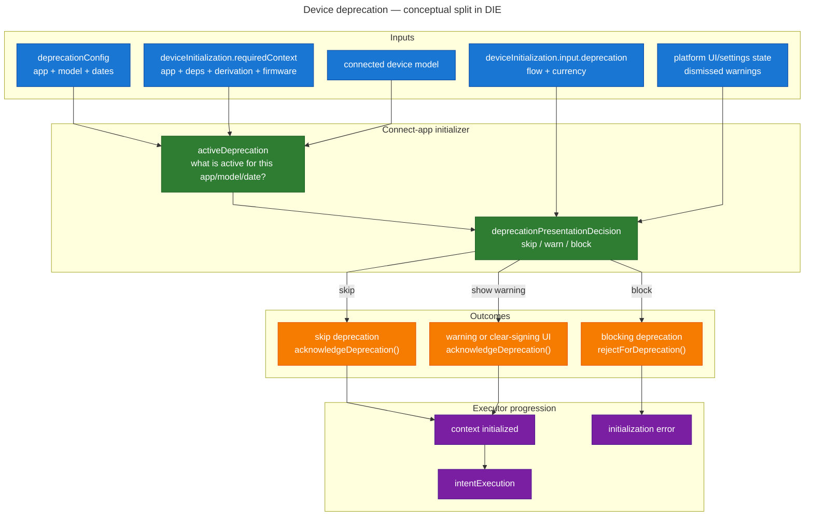

# Connect App in the Device Intent Executor

## Table of Contents

- [Status](#status)
- [Scope](#scope)
- [Context](#context)
  - [What the initial DIE design captured](#what-the-initial-die-design-captured)
  - [The implicit assumption behind the initial model](#the-implicit-assumption-behind-the-initial-model)
- [Overlooked Requirements](#overlooked-requirements)
- [Requirement 1: Device Deprecation](#requirement-1-device-deprecation)
  - [Description](#description)
  - [Why it should be part of the DIE framework](#why-it-should-be-part-of-the-die-framework)
  - [How it works today](#how-it-works-today)
  - [Proposed evolution](#proposed-evolution)
- [Requirement 2: Required Context Derivation from Account Input](#requirement-2-required-context-derivation-from-account-input)
  - [Description](#description-2)
  - [Why it should be part of the DIE framework](#why-it-should-be-part-of-the-die-framework-2)
  - [How it works today](#how-it-works-today-1)
  - [Proposed evolution](#proposed-evolution-1)
- [Requirement 3: Wrong Device Check](#requirement-3-wrong-device-check)
  - [Description](#description-1)
  - [Why it should be part of the DIE framework](#why-it-should-be-part-of-the-die-framework-1)
  - [How it works today](#how-it-works-today-2)
  - [Proposed evolution](#proposed-evolution-2)
- [Design Principles and Anti-patterns](#design-principles-and-anti-patterns)
- [Proposed API Shape](#proposed-api-shape)
- [Resulting Responsibility Split](#resulting-responsibility-split)
- [Recommended Direction](#recommended-direction)
- [Open Questions](#open-questions)

## Status

Exploratory draft. This document is intended to be the base for a future ADR.

## Scope

This document focuses on **connect-app-based intents** and on how the current
responsibilities of `connect app` should be represented in the Device Intent
Executor (DIE) world.

It does **not** try to redesign every device flow at once. The scope here is:

- the current `connect app` responsibility boundary
- the requirements originally captured by the DIE design
- the requirements that were overlooked
- a candidate architecture for integrating those requirements in the DIE

## Context

### What the initial DIE design captured

The initial DIE design identified a core concept: before an intent job can run,
the device may need to be in a specific **required device context**.

That is what `RequiredDeviceContext` currently models:

```ts
type RequiredDeviceContext = {
  appName: string;
  requiresDerivation?: RequiresDerivation;
  dependencies: string[];
  requireLatestFirmware: boolean;
  allowPartialDependencies: boolean;
};
```

At a high level, this captures the connect-app requirements that were obvious
from the start:

- which app must be open
- which dependencies may need to be installed
- whether derivation must be performed
- whether the firmware must be up to date
- whether missing dependencies can be tolerated

This is already a major improvement over the legacy device-action model,
because it separates:

- **device connection**
- **device initialization**
- **intent execution**

and makes the initializer phase explicit.

### The implicit assumption behind the initial model

The original shape implicitly assumes:

1. once the required context has been established, the intent job can run
2. the initializer mostly needs device requirements, not much caller-specific UI policy

That assumption is correct for a large part of connect-app behavior, but current
device actions show that it is incomplete.

## Overlooked Requirements

Three important requirements used by the current connect-app-based device actions
were not fully represented in the initial DIE model:

- **device deprecation** -- a config-driven pre-intent gate that can warn, block,
or be skipped depending on device model, flow, coin, and user dismissal state.
Concrete examples:
  - A user with a Nano S initiates an Ethereum send. Because the Nano S is being
  phased out, they see a deprecation warning — but can dismiss it and continue.
  - The same user tries to perform a swap. Here the device is outright blocked
  because the app version it supports is too old for that flow.
- **required context derivation from account input** -- a normalization step that
turns rich caller input (`account`, `currency`, nested dependencies, etc.)
into the explicit initialization data consumed by the DIE initializer.
Concrete example:
  - A send flow receives an Ethereum account. From that account alone, the
  framework should be able to infer the full required device context — app name
  (`Ethereum`), derivation path, dependencies, firmware requirement — without the
  caller manually specifying each parameter.
- **wrong device check** -- a post-address-derivation validation that ensures the
connected physical device matches the expected account before the intent runs.
Concrete example:
  - During a send flow, the initializer derives an address from the connected
  device. That address is compared against the expected account address so that
  if the user has plugged in a different Ledger device, the mismatch is caught
  immediately rather than failing later during transaction signing.

All three happen **before** the real intent job should execute, but they do not
fit cleanly into the current `RequiredDeviceContext` alone.

## Requirement 1: Device Deprecation

### Description

Device deprecation is a connect-app-time gate driven by remote product config.

At a user-facing level, it can lead to:

- no screen at all, if the current flow/coin does not match the deprecation rule
- an informational warning screen with `Update` + `Continue`
- an informational warning followed by a clear-signing warning
- a blocking error-style screen with no continue path

This behavior depends on several dimensions:

- the app being opened
- the connected device model
- the current flow (`send`, `receive`, `swap`, `staking`, etc.)
- the coin / token involved
- whether the warning was previously dismissed

So the same device can be accepted in one flow and blocked or warned in another.

From a UX perspective, this exists to:

- warn users that a device/model is being phased out for some operations
- gradually ramp from warning to blocking behavior
- support exceptions by flow or by coin
- let users dismiss some warning screens without disabling the policy globally

### Why it should be part of the DIE framework

Device deprecation should be part of the **DIE framework**, but not part of the
generic executor core.

It belongs in the framework because:

- it is a **pre-intent** concern
- it is shared by all connect-app-based intents
- callers should not reimplement this policy one by one
- LWM and LWD both need a consistent abstraction for it

It does **not** belong in the generic executor core because:

- it is product-specific policy, not generic orchestration
- it depends on connect-app-specific concepts (app, dependencies, device model)
- part of the decision also depends on:
  - flow/currency metadata coming from the caller side
  - dismissal state coming from the platform UI/settings layer

So the right place is:

- **not** the intent job
- **not** the generic executor state machine
- **yes** the connect-app initialization framework used during `deviceInitialization`

For the first iteration, the simplest implementation is to keep deprecation
inside `ConnectAppDeviceAction` and let the DIE initializer react to the
deprecation intermediate state it emits.[^deprecation-precheck]

### How it works today

The current deprecation flow spans five layers: remote config, connect-app
factory, DMK state machine, event mapping / reducer, and platform rendering.

#### 1. Remote config provides deprecation data

`getDeprecationConfig` reads from `LiveConfig` per app name and returns the
optional `deviceDeprecated` field:

```ts
// libs/ledger-live-common/src/apps/support.ts
export function getDeprecationConfig(appName: string, dependencies?: string[]) {
  const config =
    appName === "Exchange" && dependencies && dependencies.length > 0
      ? LiveConfig.getValueByKey(
          `config_nanoapp_${dependencies[0].toLowerCase().replace(/ /g, "_")}`,
        )
      : LiveConfig.getValueByKey(`config_nanoapp_${appName.toLowerCase().replace(/ /g, "_")}`);
  return config?.deviceDeprecated;
}
```

The returned value is a `DeviceDeprecationConfigs` array:

```ts
// libs/live-dmk-shared/src/device-action/ConnectApp/types.ts
type DeviceDeprecationScreenConfig = {
  date: string;
  deprecatedFlow: string[];
  exception?: string[];
};

type DeviceDeprecationConfig = {
  deviceModelId: string;
  warningScreen: DeviceDeprecationScreenConfig;
  errorScreen: DeviceDeprecationScreenConfig;
  warningClearSigningScreen: DeviceDeprecationScreenConfig;
};

type DeviceDeprecationConfigs = DeviceDeprecationConfig[];
```

Each `DeviceDeprecationConfig` entry targets one device model (e.g. `"nanoS"`)
and defines **three independent screen gates** -- that is, date-activated
checkpoints that can each block or warn the user before the flow proceeds:
`warningScreen`, `warningClearSigningScreen`, and `errorScreen`.

The three screens serve different purposes:

- `**warningScreen`** -- informational. The user can acknowledge and continue.
- `**warningClearSigningScreen**` -- warns that the device cannot clear-sign.
Also dismissible.
- `**errorScreen**` -- blocking. The user cannot continue the flow.

For each screen gate, the config carries:

- `**date**` -- the activation date. Once this date is in the past, the screen
becomes eligible to be shown (the state machine uses this to decide whether
to enter the deprecation path at all).
- `**deprecatedFlow**` -- the list of flow names (e.g. `"send"`, `"swap"`,
`"staking"`) for which this screen applies. If the current flow is not in this
list, the screen is skipped even if the date is past.
- `**exception**` (optional) -- a list of coin/token names exempt from the
restriction. If the current currency matches an exception entry, the screen is
skipped.

Because each screen has its own date, a phased rollout is possible: for
instance, a warning can be activated months before the blocking error, giving
users time to migrate.

#### 2. `connectApp` passes config into the DMK device action

The DMK-path `connectApp` factory injects the config when instantiating
`ConnectAppDeviceAction`:

```ts
// libs/ledger-live-common/src/hw/connectApp.ts
const deviceAction = new ConnectAppDeviceAction({
  input: {
    application: appNameToDependency(appName),
    dependencies: dependencies ? dependencies.map(name => appNameToDependency(name)) : [],
    requireLatestFirmware,
    allowMissingApplication: allowPartialDependencies,
    unlockTimeout: 0,
    requiredDerivation: requiresDerivation ? async () => { /* ... */ } : undefined,
    deprecationConfig: getDeprecationConfig(appName, dependencies),
  },
});
```

#### 3. `ConnectAppDeviceAction` state machine evaluates and gates

The state machine in `ConnectAppDeviceAction` handles deprecation through a
sequence of three states. All source lives in
`libs/live-dmk-shared/src/device-action/ConnectApp/`.

The flow is:

```text
GetDeviceStatus
  │ (device model + status now known)
  ▼
IsDeviceDeprecatedCheck ──guard: isDeprecation──▶ DeviceDeprecated
  │ (no deprecation)                                    │
  ▼                                                     │ invokes isDeviceDeprecated()
GetDeviceStatusCheck ◀──────────────────────────────────┤
  ▲                                                     ▼
  │                                    waitForDeprecationAcknowledgment
  │                                       │ onContinue(false) = resolve
  └───────────────────────────────────────┘
                                          │ onContinue(true) = reject
                                          ▼
                                        Error (DeviceDeprecationError)
```

`**IsDeviceDeprecatedCheck**` -- an immediate (eventless) transition state
reached right after `GetDeviceStatus` completes. It evaluates the
`isDeprecation` guard, which checks two things: (a) the deprecation config
contains at least one entry whose `deviceModelId` matches the connected device,
with any screen date in the past, and (b) deprecation has not already been shown
during this session. If the guard passes, the machine transitions to
`DeviceDeprecated`. Otherwise it falls through to `GetDeviceStatusCheck` and
the connect-app flow continues normally.

`**DeviceDeprecated**` -- invokes `isDeviceDeprecated(configs, modelId)` (from
`deprecation.ts`). This function finds the config entry for the connected model
and, for each of the three screen types (warning, clear-signing, error), checks
whether its date is past. It returns a `DeviceDeprecationRules` object
describing which screens are visible and carrying per-screen flow/exception
lists:

```ts
// libs/live-dmk-shared/src/device-action/ConnectApp/types.ts
type DeviceDeprecationRules = {
  warningScreenVisible: boolean;
  clearSigningScreenVisible: boolean;
  errorScreenVisible: boolean;
  modelId: LLDeviceModelId;
  date: Date;
  warningScreenRules?: DeviceDeprecationScreenRules;   // { exception, deprecatedFlow }
  clearSigningScreenRules?: DeviceDeprecationScreenRules;
  errorScreenRules?: DeviceDeprecationScreenRules;
  onContinue: (isError?: boolean) => void;
};
```

On completion the result is stored in `intermediateValue.deviceDeprecation` and
the machine moves to `waitForDeprecationAcknowledgment`.

`**waitForDeprecationAcknowledgment**` -- blocks on a promise whose resolution
is controlled by the `onContinue` callback exposed on the intermediate value.
The UI layer (see step 5) will eventually call either `onContinue(false)` to
continue the flow, or `onContinue(true)` to reject with
`DeviceDeprecationError` and abort.

#### 4. Event mapper and `app.ts` reducer propagate the state

`ConnectAppEventMapper` translates the DMK intermediate `device-deprecation`
interaction into a `ConnectAppEvent`:

```ts
// libs/ledger-live-common/src/hw/connectAppEventMapper.ts
case "device-deprecation":
  if (intermediateValue.deviceDeprecation) {
    this.eventSubject.next({
      type: "deprecation",
      deprecate: { ...intermediateValue.deviceDeprecation },
    });
  }
```

The `app.ts` reducer stores it on the action state:

```ts
// libs/ledger-live-common/src/hw/actions/app.ts
case "deprecation":
  return { ...state, deviceDeprecationRules: e.deprecate };
```

#### 5. LWM renders the deprecation UI

The platform rendering layer has several responsibilities:

- determine the **current flow** (`send`, `receive`, `swap`, etc.) from
navigation state and request metadata
- read the **"do not remind" list** from Redux settings to know which
currencies the user has previously dismissed
- for each screen gate, apply the **skip logic**: skip if the currency is in the
exception list, or if the current flow is not in `deprecatedFlow`, or if the
user already dismissed it
- **render the appropriate screen variant** (warning, clear-signing, or error)
  when the gate is not skipped. When both warning and clear-signing are active,
  they are shown **sequentially**: the warning screen is rendered first, and when
  the user acknowledges it, `DeviceDeprecationScreen` internally transitions to
  the clear-signing screen before finally calling `onContinue`.
- **call `onContinue`** to unblock the state machine: `onContinue(false)` to
  continue the flow, `onContinue(true)` to abort with a blocking error
- **persist dismissals** via the `DEPRECATION_DO_NOT_REMIND` settings action
  when the user checks "do not remind me"

`flow` determines which screen gates apply (via `deprecatedFlow`).
`currencyName` is used for three things: exception matching (some currencies are
exempt even when the flow is deprecated), per-currency dismissal lookup
(`deprecationDoNotRemind` stores currency names), and display text on the
deprecation screen.

`DeviceActionDefaultRendering` branches on `deviceDeprecationRules` and
implements the above:

```ts
// apps/ledger-live-mobile/src/components/DeviceAction/index.tsx
if (deviceDeprecationRules && request) {
  const { clearSigningScreenRules, warningScreenRules, errorScreenRules, date, modelId } =
    deviceDeprecationRules;
  const currentFlow = getFlowName(location, request);
  const skippedDeprecations = settingsState.deprecationDoNotRemind;

  const doSkipDeprecation = (exception: string[], deprecatedFlowExceptions: string[]) => {
    return (
      exception.includes(currencyName) ||
      !deprecatedFlowExceptions.includes(currentFlow) ||
      currentFlow === FlowName.unknown
    );
  };

  const alreadyDismissed = skippedDeprecations.includes(currencyName);
  // ... compute skipWarningScreen, skipClearSigningScreen, skipErrorScreen

  if (deviceDeprecationRules.errorScreenVisible) {
    deviceDeprecationRules.onContinue(!skipErrorScreen); // block or skip
  } else if (deviceDeprecationRules.warningScreenVisible && !skipWarningScreen) {
    return <DeviceDeprecationScreen /* warning variant */ />;
  } else if (deviceDeprecationRules.clearSigningScreenVisible && !skipClearSigningScreen) {
    return <DeviceDeprecationScreen /* clear-signing variant */ />;
  }
  deviceDeprecationRules.onContinue(false); // no screen needed, continue
}
```

`DeviceDeprecationScreen` renders the appropriate screen variant (informational
warning, clear-signing warning, or blocking error). It also offers a "do not
remind me" checkbox that dispatches `DEPRECATION_DO_NOT_REMIND` to the settings
store:

```ts
// apps/ledger-live-mobile/src/components/DeviceAction/Screen/DeviceDeprecationScreen.tsx
const handleContinue = useCallback(() => {
  if (isChecked) {
    dispatch({ type: SettingsActionTypes.DEPRECATION_DO_NOT_REMIND, payload: coinName });
  }
  if (displayClearSigningWarning && currentScreenName === DeviceDeprecationScreens.warningScreen) {
    setCurrentScreenName(DeviceDeprecationScreens.clearSigningScreen);
  } else if (onContinue) {
    onContinue();
  }
}, [/* ... */]);
```

### Proposed evolution

One of the motivations for the DIE-based redesign is that the current
deprecation model collapses several different concerns into one mixed payload:

- remote config
- model-specific applicability
- flow/coin presentation policy
- runtime continuation / rejection control

That is why names like `deviceDeprecationRules`, `warningScreenVisible`,
`doSkipDeprecation`, or `onContinue(true)` feel so awkward today: they are
trying to represent multiple layers of responsibility at once.

The conceptual split we should move toward is something closer to:

- `deprecationConfig`
- `activeDeprecation`
- `deprecationPresentationDecision`
- `acknowledgeDeprecation()`
- `rejectForDeprecation()`

High-level conceptual split:




This is the conceptual split we should move toward.

For the first iteration, we do **not** need to extract every box into a separate
implementation unit. In particular, we can still:

- keep the raw deprecation check inside `ConnectAppDeviceAction`
- keep the platform initializer responsible for rendering the deprecation UI
- progressively refactor the surrounding naming and data flow toward this cleaner model

#### What stays where it is

- **`ConnectAppDeviceAction`** (in `libs/live-dmk-shared`) keeps its existing
  deprecation logic: the `isDeprecation` guard, the `isDeviceDeprecated()`
  evaluation, the `waitForDeprecationAcknowledgment` state. This already works
  and emits `DeviceDeprecationRules` on its intermediate value.
- **`getDeprecationConfig`** (in `libs/ledger-live-common/src/apps/support.ts`)
  stays as the source of remote config.

#### What needs to be added

Three pieces:

1. **The shared builder** (`buildConnectAppInitialization` -- see Requirement 2)
   populates `ConnectAppInitializationInput.deprecation` with `{ flow,
   currencyName }`. Today this information is not passed explicitly: the
   rendering layer in `DeviceAction/index.tsx` derives `flow` from the
   navigation `location` and `request` via `getFlowName(location, request)`,
   and `currencyName` from the request via `getCurrencyName(request)`. In the
   proposed model, the builder resolves these values upfront from the caller's
   domain input (account, currency, flow context) and places them in
   `ConnectAppInitializationInput.deprecation`, so the initializer does not
   need to re-derive them from navigation state or raw request objects.

   This is the same builder that resolves `RequiredDeviceContext` and
   expected-account data (see Requirement 2). Its full output shape is:

   ```ts
   type ConnectAppInitializationInput = {
     expectedAccount?: { accountName: string; acceptableDerivedAddresses: string[] };
     deprecation?: { flow: FlowName; currencyName: string };
   };
   ```

   The builder produces both `requiredContext` (device requirements) and
   `input` (initializer-side metadata) in one pass from the caller's domain
   input.

2. **A pure presentation-decision function** that takes the
   `DeviceDeprecationRules` (from the device action), the `flow` and
   `currencyName` (from the initialization input), and the dismissed-currencies
   list (from settings) and returns what the UI should do. Today this logic is
   inlined inside a React component, making it untestable and duplicated across
   platforms. Extracting it as a pure function makes it testable, shared, and
   cleanly separated from rendering.

   `flow` determines which screen gates apply (via `deprecatedFlow`).
   `currencyName` serves three purposes: exception matching (some currencies
   are exempt even when the flow is deprecated), per-currency dismissal lookup,
   and display text on the deprecation screen.

   Illustratively:

   ```ts
   type DeprecationPresentationInput = {
     rules: DeviceDeprecationRules;
     flow: FlowName;
     currencyName: string;
     dismissedCurrencies: string[];
   };

   type DeprecationPresentationDecision =
     | { kind: "skip" }
     | { kind: "show"; screens: ("warning" | "clearSigning")[] }
     | { kind: "block" };

   function decideDeprecationPresentation(
     input: DeprecationPresentationInput,
   ): DeprecationPresentationDecision;
   ```

   When both warning and clear-signing screens are active, the function returns
   `{ kind: "show", screens: ["warning", "clearSigning"] }` and the UI walks
   through them sequentially (matching current behavior where the warning
   screen transitions internally to the clear-signing screen before calling
   `onContinue`).

3. **The platform initializer** (LWM/LWD `DeviceContextInitializerComponent`)
   calls `decideDeprecationPresentation` with the initialization input and
   settings state, then renders based on the result:
   - `skip` -> call `onContinue(false)` immediately
   - `show` -> render the screen variants in order, call `onContinue(false)`
     when the user has acknowledged all of them
   - `block` -> call `onContinue(true)` to abort with `DeviceDeprecationError`

   The initializer also handles the "do not remind" checkbox by dispatching
   to the platform settings store, and avoids re-showing the warning if it
   was already acknowledged during this device-action instance (a
   component-local concern, not part of the pure decision function).

#### What does not need to change yet

- The raw deprecation applicability check (config + model + date gating) stays
  inside `ConnectAppDeviceAction`. Extracting it into a dedicated
  pre-connect-app gate is a possible later evolution.[^deprecation-precheck]
- Dismissed-warning state stays in the platform settings layer, read directly by
  the initializer component -- not passed through the shared builder.

## Requirement 2: Required Context Derivation from Account Input

### Description

Current connect-app-based device actions do not always start from explicit,
normalized device requirements.

Instead, they often start from richer caller-side input such as:

- `account`
- `currency`
- nested `dependencies`
- token context

Then `app.ts` derives the actual connect-app requirements from that richer
input, for example:

- infer `currency` from `account`
- infer `appName` from `currency.managerAppName`
- infer derivation requirements from `account.derivationMode` and
  `account.freshAddressPath`
- inject family-specific get-address parameters
- normalize dependency requests

From a UX perspective, this matters because callers want to express their intent
in domain terms ("use this account") rather than rebuilding low-level device
requirements themselves.

### Why it should be part of the DIE framework

This requirement should also be part of the broader **DIE framework**, but it is
slightly different from deprecation and wrong-device check.

It belongs in the framework because:

- connect-app-based callers in LWM and LWD need the same normalization behavior
- the mapping from `account` / `currency` / nested dependency inputs to explicit
  device requirements is shared business logic
- callers should not reimplement this resolution themselves

But unlike deprecation and wrong-device check, this may **not** belong inside
the initializer itself.

The reason is simple:

- the initializer should run once explicit requirements are already known
- deriving those requirements from domain input is a **pre-initializer**
  normalization step

So the likely shape is:

- raw account/request input comes from the caller
- a shared resolver turns that into:
  - `RequiredDeviceContext`
  - initializer-side validation/policy input
- the initializer then consumes those normalized structures

This is also where the overlap with wrong-device check becomes important:

- if the caller provides an `account`, the resolver can derive both
  `RequiredDeviceContext` and the expected-account validation data needed by the
  initializer
- this avoids passing the full raw `Account` deep into the generic DIE core

So the best fit is:

- **not** the intent job
- **probably not** the initializer itself
- **yes** a shared pre-initializer resolver in the broader connect-app/DIE framework

### How it works today

The current normalization lives entirely in `inferCommandParams` inside
`app.ts`. Callers build an `AppRequest` from their domain context, and
`inferCommandParams` resolves it into a `ConnectAppRequest` that `connectApp`
can consume.

#### 1. `AppRequest` is the caller-side input

Callers express what they need in domain terms:

```ts
// libs/ledger-live-common/src/hw/actions/app.ts
type AppRequest = {
  appName?: string;
  currency?: CryptoCurrency | null;
  account?: Account;
  tokenCurrency?: TokenCurrency;
  dependencies?: AppRequest[];
  withInlineInstallProgress?: boolean;
  requireLatestFirmware?: boolean;
  allowPartialDependencies?: boolean;
};
```

Most fields are optional because the resolver can infer them from each other.
For instance, providing only `account` is enough: `currency` and `appName` will
be derived.

#### 2. `inferCommandParams` normalizes it into `ConnectAppRequest`

This function performs the full resolution chain:

```ts
// libs/ledger-live-common/src/hw/actions/app.ts
function inferCommandParams(appRequest: AppRequest): ConnectAppRequest {
  let { appName, currency } = appRequest;
  const { account, dependencies: appDependencies } = appRequest;

  // 1. infer currency from account
  if (!currency && account) currency = account.currency;

  // 2. infer appName from currency
  if (!appName && currency) appName = currency.managerAppName;

  // 3. recursively normalize nested dependencies to app-name strings
  let dependencies = appDependencies?.map(d => inferCommandParams(d).appName);

  // 4. if no currency: app-only request (no derivation)
  if (!currency) return { appName, dependencies, requireLatestFirmware, allowPartialDependencies };

  // 5. derive path and mode from account or currency defaults
  if (account) {
    derivationMode = account.derivationMode;
    derivationPath = account.freshAddressPath;
    // 6. inject family-specific get-address params (e.g. Bitcoin Cash → forceFormat: "cashaddr")
    extra = perFamilyAccount[account.currency.family]?.injectGetAddressParams?.(account);
  } else {
    // fall back to currency default derivation scheme
  }

  return {
    appName, dependencies, requireLatestFirmware,
    requiresDerivation: { derivationMode, path: derivationPath, currencyId: currency.id, ...extra },
    allowPartialDependencies,
  };
}
```

The output is a `ConnectAppRequest`, which is what `connectApp` actually
consumes:

```ts
// libs/ledger-live-common/src/hw/connectApp.ts
type ConnectAppRequest = {
  appName: string;
  requiresDerivation?: RequiresDerivation;
  dependencies?: string[];
  requireLatestFirmware?: boolean;
  allowPartialDependencies: boolean;
};
```

The key transformation is: rich, optional, domain-level input goes in;
explicit, flat, device-level requirements come out.

#### 3. Callers build `AppRequest` from their domain context

**Transaction signing** -- resolves the main account (collapsing token accounts
to their parent chain account) and passes it directly:

```ts
// libs/ledger-live-common/src/hw/actions/transaction.ts
const mainAccount = getMainAccount(txRequest.account, txRequest.parentAccount);
const appState = createAppAction(connectAppExec).useHook(reduxDevice, {
  account: mainAccount,
  appName,
  dependencies,
  requireLatestFirmware,
});
```

**Start exchange** -- builds nested `dependencies` from account currencies,
with no `account` on the root request (the Exchange app itself does not need
derivation):

```ts
// libs/ledger-live-common/src/hw/actions/startExchange.ts
const dependencies: AppRequest["dependencies"] = [];
if (mainFromAccount) {
  dependencies.push({ appName: mainFromAccount.currency.managerAppName });
}
if (mainToAccount) {
  dependencies.push({ appName: mainToAccount.currency.managerAppName });
}
// ... conditionally add Ethereum for EVM chains
return {
  appName: "Exchange",
  dependencies,
  requireLatestFirmware,
};
```

`getMainAccount` is important here: for token accounts, it returns the parent
chain account so that `currency`, `derivationMode`, and `freshAddressPath`
refer to the on-device app rather than the token row.

### Proposed evolution

Today `inferCommandParams` is private inside `app.ts`, tightly coupled to
legacy connect-app conventions. Each caller manually builds an `AppRequest`
from its own domain context, and the normalization result is only usable
through the legacy device-action hook.

The proposed evolution is to extract this normalization into a shared, public
builder function -- `buildConnectAppInitialization` -- that:

- accepts the same rich domain input (account, currency, nested dependencies,
  flow metadata)
- produces a `DeviceInitialization` object containing both:
  - `RequiredDeviceContext` -- the device requirements (app name, derivation,
    dependencies, firmware)
  - `ConnectAppInitializationInput` -- initializer-side metadata (expected
    account identity for wrong-device validation, deprecation presentation
    context)
- derives wrong-device validation data from the account in the same pass,
  avoiding a second normalization step

This way callers keep expressing their intent in domain terms, the
normalization is centralized and shared between LWM and LWD, and the generic
DIE core never sees raw `Account` objects.

## Requirement 3: Wrong Device Check

### Description

The current connect-app-based flows can verify that the connected physical device
matches the expected account.

Today, after connect-app performs derivation, the result is compared against the
expected account identity:

- the derived address is compared to `account.freshAddress`
- and also to `account.seedIdentifier` for some special cases

If it does not match, the flow does not proceed and the UI shows a
"wrong device for account" state.

From a UX perspective, this exists to:

- prevent the user from signing or confirming with the wrong Ledger device
- make multi-device situations safer
- catch mistakes before the real intent job starts

This is fundamentally not "transaction job progress". It is a validation step
on the initialized device context.

### Why it should be part of the DIE framework

Like deprecation, wrong-device check should be part of the **DIE framework**,
but not of the generic executor core.

It belongs in the framework because:

- it is a cross-cutting requirement for connect-app-based flows
- it happens before the intent job should run
- it should be available consistently in LWM and LWD

It does **not** belong in the generic core because:

- the generic core should not become aware of raw `Account` domain objects
- the check is connect-app/account-specific validation
- it is better expressed as normalized validation input for the initializer

So here again, the best fit is:

- normalize the needed account-derived information outside the executor core
- perform the validation in the connect-app initializer
- only enter `intentExecution` if validation succeeds

### How it works today

The wrong-device check happens in three steps: derivation, comparison, and
gating/rendering.

#### 1. Derivation produces the address

When `requiresDerivation` is set in the `ConnectAppRequest` (as resolved by
`inferCommandParams` -- see Requirement 2), `connectApp` calls `getAddress` on
the device once the target app is open. The result flows back as part of the
`"opened"` event:

```ts
// libs/ledger-live-common/src/hw/connectApp.ts
derivationLogic = (...) =>
  from(
    getAddress(transport, {
      currency: getCryptoCurrencyById(currencyId),
      ...derivationRest,
    }),
  ).pipe(
    map(({ address }) => ({
      type: "opened",
      app: appAndVersion,
      derivation: { address },
    })),
  );
```

The `app.ts` reducer stores it as `state.derivation`:

```ts
// libs/ledger-live-common/src/hw/actions/app.ts
case "opened":
  return { ...getInitialState(...), derivation: e.derivation, ... };
```

#### 2. `app.ts` computes `inWrongDeviceForAccount`

The hook return value compares the derived address against the account
originally passed by the caller:

```ts
// libs/ledger-live-common/src/hw/actions/app.ts
inWrongDeviceForAccount:
  state.derivation && appRequest.account
    ? state.derivation.address !== appRequest.account.freshAddress &&
      state.derivation.address !== appRequest.account.seedIdentifier
      ? { accountName: getDefaultAccountName(appRequest.account) }
      : null
    : null,
```

Key points:

- if no `account` was passed (e.g. ACRE bypasses the check by passing
  `account: undefined`), `inWrongDeviceForAccount` is always `null`
- `seedIdentifier` was added as a fallback for Hedera
- the result is either `null` (match or no check) or `{ accountName }`
  (mismatch with the display name for the error screen)

Today the derived address is **only** consumed by this comparison. It is not
returned in `AppResult`, not passed to signing bridges, and not shown to the
user directly.

#### 3. Callers gate on it, LWM renders the error

Callers like `transaction.ts` treat `inWrongDeviceForAccount` as a boolean
gate -- if truthy, the signing effect does not start:

```ts
// libs/ledger-live-common/src/hw/actions/transaction.ts
const { device, opened, inWrongDeviceForAccount, error } = appState;
useEffect(() => {
  if (!device || !opened || inWrongDeviceForAccount || error) {
    setState(initialState);
    return;
  }
  // ... start signOperation
```

On the rendering side, LWM checks the flag and shows a `WrongDeviceForAccount`
error screen with a retry option:

```ts
// apps/ledger-live-mobile/src/components/DeviceAction/index.tsx
if (inWrongDeviceForAccount) {
  return renderInWrongAppForAccount({ t, onRetry, colors, theme });
}
```

### Proposed evolution

In the proposed DIE-based design, wrong-device validation would happen in two
steps.

#### 1. The shared builder derives the expected account identity

If the caller provides an account and the flow expects derivation-based device
validation, the shared builder would populate `expectedAccount` inside
`ConnectAppInitializationInput`.

Conceptually:

```ts
type ConnectAppInitializationInput = {
  expectedAccount?: {
    accountName: string;
    acceptableDerivedAddresses: string[];
  };
  deprecation?: {
    flow: FlowName;
    currencyName: string;
  };
};
```

The builder would derive:

- `accountName` for the user-facing error state
- `acceptableDerivedAddresses` from the current account model

To match the current legacy behavior (see "How it works today" above), this means:

- always include `account.freshAddress`
- include `account.seedIdentifier` as an additional acceptable identity when the
current legacy flow relies on it

Illustratively:

```ts
function buildExpectedAccount(account: Account): {
  accountName: string;
  acceptableDerivedAddresses: string[];
} {
  return {
    accountName: getDefaultAccountName(account),
    acceptableDerivedAddresses: [
      account.freshAddress,
      ...(account.seedIdentifier ? [account.seedIdentifier] : []),
    ],
  };
}
```

Important nuance:

- the builder should only populate `expectedAccount` when the flow actually wants
this validation
- if a flow explicitly bypasses this check today (for example via ACRE-style
behavior), the builder should omit `expectedAccount`

#### 2. The initializer validates the derived address before continuing

Once connect-app initialization has completed and derivation has produced a
`derivedAddress`, the platform initializer can perform the comparison.

Conceptually:

```ts
if (deviceInitialization.input.expectedAccount && extractedContext.derivedAddress) {
  const { acceptableDerivedAddresses, accountName } = deviceInitialization.input.expectedAccount;

  const isExpectedDevice = acceptableDerivedAddresses.includes(extractedContext.derivedAddress);

  if (!isExpectedDevice) {
    // render wrong-device UI, do not call onContextInitialized(...)
  }
}

// otherwise continue toward intentExecution
onContextInitialized(extractedContext);
```

So the rule becomes:

- no `expectedAccount` => no wrong-device validation
- `expectedAccount` + matching `derivedAddress` => continue
- `expectedAccount` + non-matching `derivedAddress` => show wrong-device UI and
block the intent

This keeps the responsibilities clean:

- builder decides whether wrong-device validation is required and what the
acceptable identities are
- initializer applies the check once the device context has been established
- generic DIE core remains unaware of raw account semantics

#### Why this matches the current behavior

This is effectively the same logic as current `app.ts`, but with the
responsibilities split more cleanly.

Today:

- `app.ts` computes the check from `appRequest.account`
- compares `state.derivation.address` against `freshAddress` and `seedIdentifier`
- exposes `inWrongDeviceForAccount`

In the proposed solution:

- the builder computes the expected identities from the account
- the initializer compares the derived address against those identities
- the initializer shows the wrong-device state before entering `intentExecution`

## Design Principles and Anti-patterns

### Design principles

The proposed evolutions above should respect these principles:

1. **Keep the executor core generic** -- the core DIE should continue to
   orchestrate connection, initialization, execution, retry, and cancellation
   only.
2. **Keep `RequiredDeviceContext` focused on device requirements** -- it should
   describe what device state must be established, not flow-specific UI policy
   or account domain objects.
3. **Move connect-app-specific policy into a reusable initialization framework**
   -- the framework should be available to both LWM and LWD, but layered on
   top of the generic DIE core.
4. **Normalize rich caller input before it reaches the initializer** -- raw
   `AppRequest`, `Account`, `location`, etc. should be resolved into smaller,
   purpose-specific structures.

### What should not happen

The following options look tempting but would make the design worse:

**Put deprecation and wrong-device logic in each intent job** -- this would
duplicate behavior across intents, blur the intent/job responsibility, make job
states larger again, and lose the main simplification brought by
`requiredDeviceContext`.

**Put product-specific policy in the generic executor core** -- this would
pollute `libs/device-intent` with connect-app and product policy concerns, make
the core harder to reuse, and force the generic state machine to know about
flow/coin/account details.

**Put everything into `RequiredDeviceContext`** -- this would turn it into a
grab-bag of unrelated concerns. Device context (`appName`, `dependencies`,
`requiresDerivation`) and UI policy / validation metadata (`currencyName`,
`dismissedDeprecations`, `accountName`, `acceptableDerivedAddresses`) do not
belong in the same bucket.

## Proposed API Shape

This section summarizes the key API changes that tie the three requirement
evolutions together.

### `DeviceInitialization<InitInput>` wrapper

The generic DIE API should replace top-level `requiredDeviceContext` with a
wrapper that encapsulates device requirements and initializer-side metadata
without merging them:

```ts
type DeviceInitialization<InitInput = void> = {
  requiredContext: RequiredDeviceContext;
  input: InitInput;
};
```

`RequiredDeviceContext` stays focused on device requirements (`appName`,
`dependencies`, `requiresDerivation`, `requireLatestFirmware`,
`allowPartialDependencies`). The `input` slot carries connect-app-specific
policy metadata -- `ConnectAppInitializationInput` -- without the generic
executor needing to understand it.

### Injection flow


- **Caller** provides raw business input and calls the shared builder
- **Shared builder** normalizes it into `DeviceInitialization`
- **Generic DIE** orchestrates connection, initialization, and execution phases
- **Platform** injects UI components; the initializer calls
  `decideDeprecationPresentation` (Requirement 1) and `validateDerivedAddress`
  (Requirement 3) using the normalized input, then renders the appropriate UX

### Recommended file structure

The shared pure functions should live in a dedicated module:

```text
libs/ledger-live-common/src/hw/connectAppInitialization/
  requirements.ts    -- resolveAppRequestRequirements, toRequiredDeviceContext
  validation.ts      -- buildExpectedAccountIdentity, validateDerivedAddress
  deprecation.ts     -- decideDeprecationPresentation
  index.ts           -- buildConnectAppInitialization (composes the above)
```

This lets legacy `app.ts` reuse the same helpers during migration, while the
new DIE initializer relies on the exact same semantics.

## Resulting Responsibility Split


| Concern                                                        | Lives in                                                              |
| -------------------------------------------------------------- | --------------------------------------------------------------------- |
| Generic connection / initialization / execution orchestration  | `libs/device-intent`                                                  |
| `DeviceInitialization<InitInput>` wrapper                      | `libs/device-intent` core types                                       |
| `RequiredDeviceContext`                                        | `libs/device-intent` core types                                       |
| Connect-app request resolution                                 | shared business layer near current `connect app` / `AppRequest` logic |
| `ConnectAppInitializationInput`                                | shared connect-app framework                                          |
| Raw deprecation applicability check (config + model)           | `ConnectAppDeviceAction` in the first iteration                       |
| Deprecation presentation input normalization (flow + currency) | shared connect-app framework / builder                                |
| Wrong-device validation normalization                          | shared connect-app framework / builder                                |
| Dismissed deprecation warnings                                 | platform UI/settings layer inside the initializer                     |
| Deprecation / wrong-device rendering                           | LWM/LWD connect-app initializer components                            |
| Raw `location`, request, account                               | caller / flow layer                                                   |


## Recommended Direction

The recommended direction is:

1. keep the DIE core generic
2. keep `RequiredDeviceContext` focused on device requirements
3. replace top-level `requiredDeviceContext` with a higher-level `deviceInitialization` object
4. build a shared connect-app initialization framework on top
5. in the first iteration, keep deprecation inside `ConnectAppDeviceAction`
6. let platform-specific initializers render deprecation and wrong-device UX

This gives us:

- a clean executor core
- shared connect-app-specific capabilities for all callers
- smaller intent `JobState`
- a realistic path away from the current `app.ts` / `DeviceAction` coupling

## Open Questions

- Should `DeviceInitialization<InitInput>` stay fully generic, or should the
  DIE package expose a more opinionated name for initializer-side input?
- `passWarning` / outdated-app acceptance is adjacent to this topic but not
  fully covered here. Should it join the same initializer input model, or be
  treated separately?

[^deprecation-precheck]:
    A possible later evolution would be to extract
    deprecation into a dedicated pre-connect-app initialization gate, since the raw
    applicability check itself mostly depends on remote config + connected device
    model. For now, keeping it inside `ConnectAppDeviceAction` is the simpler path
    and preserves parity with the current DMK connect-app flow.