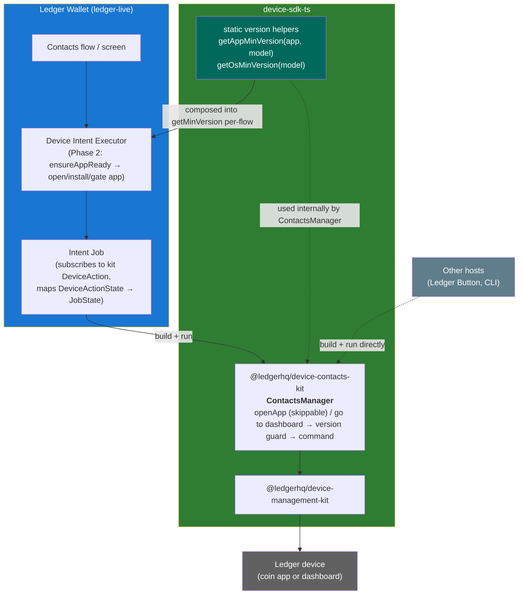
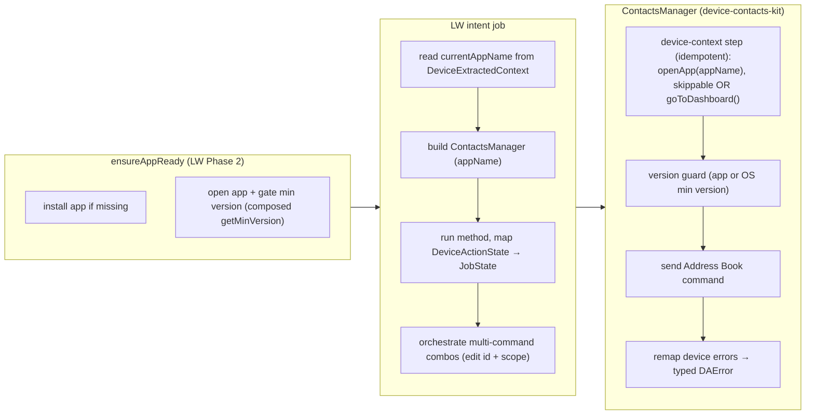
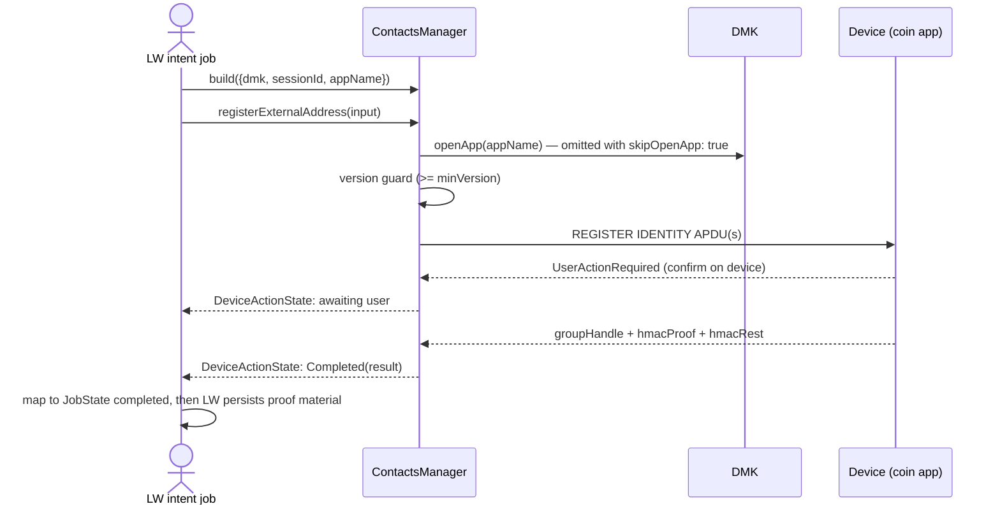
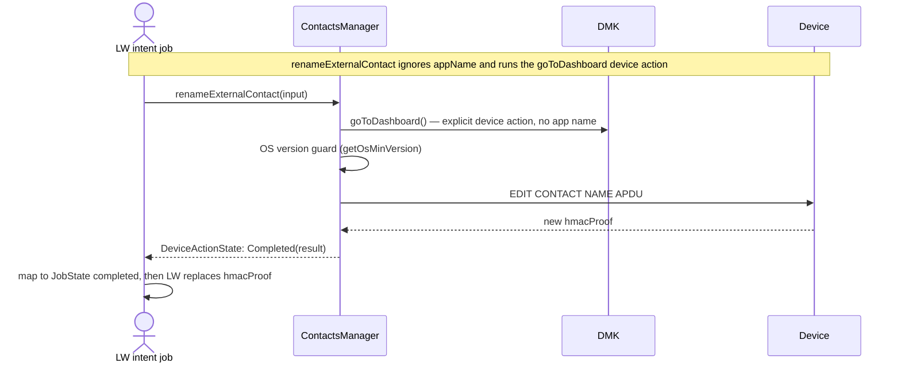
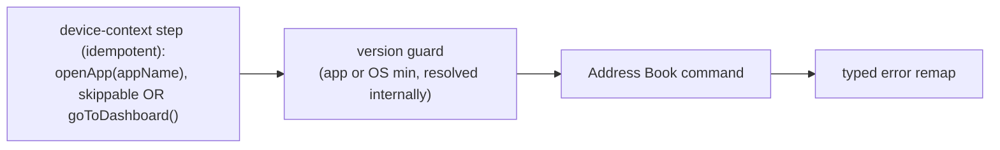

# ADR: `device-contacts-kit` (device-sdk-ts)

- **Status**: Proposed
- **Scope**: device-sdk-ts (Device Management Kit) side of the Address Book /
  Contacts feature.
- **Related**:
  - [ADR: EVM Address Book Device Intents](https://ledgerhq.atlassian.net/wiki/spaces/WXP/pages/7299039425/ADR+EVM+Address+Book+Device+Intents) (Ledger Wallet / WXP-facing intents)
  - [EVM Address Book Device Intents contract](./address-book-evm-intents.md) (in-repo)
  - [Device Intent Executor](../README.md) (DIE)
  - Firmware: [Address Book Final Specifications](https://ledgerhq.atlassian.net/wiki/spaces/FW/pages/6992035925/Address+Book+Final+Specifications),
    [Address Book - Device API](https://ledgerhq.atlassian.net/wiki/spaces/WXP/pages/7295107160/Address+Book+-+Device+API)

---

## TL;DR

We add a new Device Management Kit package, **`@ledgerhq/device-contacts-kit`**,
that exposes a single class, **`ContactsManager`**, structured like the
existing signer kits (`device-signer-kit-ethereum`). It wraps the firmware
Address Book device commands behind typed, observable **DeviceActions** so that
any host (Ledger Wallet, Ledger Button, CLI) can drive contact management on the
device.

Decisions at a glance:

| # | Decision | Choice |
|---|----------|--------|
| 1 | App-open + version gating | `ensureAppReady` (in LW) installs/gates; the kit **also** runs the device-context step (`openApp` or `goToDashboard`, idempotent) + version check itself, so it is usable without DIE. Every coin-app action can opt out of its `openApp` step with `skipOpenApp: true` when the caller already opened the app; the version check still runs. The required min version is **resolved internally** by the instance (injectable for tests), not passed in. |
| 2 | Method return type | Each method returns a **composed DeviceAction** (device-context step → version guard → command), emitting intermediate device-interaction states. |
| 3 | Naming | Package `@ledgerhq/device-contacts-kit`, class `ContactsManager`. |
| 4 | Instantiation | **Builder** (`ContactsManagerBuilder`), **one instance per device context** (`appName` bound at build time; min version resolved internally). |
| 5 | Open app vs go to dashboard | The device-context step is **one of two distinct device actions**: **`openApp(appName)`** (parameterized, and skippable with `skipOpenApp: true`) for coin-app commands, or **`goToDashboard()`** (no param) for `renameExternalContact` (which gates on OS version). The dashboard is not an app. |
| 6 | Family encoding | Kit is **encoding-agnostic**: it takes an already-serialized identifier + explicit `blockchainFamily` + chain descriptor. Per-family encoding lives in the caller. |
| 7 | Convenience "edit both" | Kit exposes **only granular** 1:1 device commands; the address+scope combo is orchestrated by the LW intent job. |
| 8 | Derivation path | Kit owns a **default Address Book derivation path** for external-contact commands (overridable); Ledger-account methods take the real `derivationPath`. |
| 9 | Errors | Kit emits **typed `DAError`s** (app/device/version); the LW job maps them to `JobState`. |
| 10 | State | Kit is **stateless**: proof material in → new proof material out; LW owns persistence. |
| 11 | Min-version source | Kit exports **static helpers** (`getAppMinVersion`, `getOsMinVersion`); LW **composes** (does not replace) them into `getMinVersion` per-flow. |

### High-level architecture



The kit is the reusable unit of "talk to the device's Address Book". DIE is the
Ledger-Wallet UX layer that gets the right app open first; the kit does not
depend on DIE and re-verifies readiness defensively so non-DIE hosts work too.

---

## Context

The [EVM Address Book Device Intents contract](./address-book-evm-intents.md)
defines the **Ledger-Wallet-facing** intents (inputs, results, `JobState`s) for
managing contacts on the device. Those intents run through the
[Device Intent Executor](../README.md): a `Job` receives a connected device +
extracted context and returns an `Observable<JobState>`.

What is missing is the **device-sdk-ts side**: the actual code that sends the
Address Book APDUs to the device. Today there is no package for it. This ADR
proposes that package and how it plugs into the existing DIE flow.

Two facts shaped the design:

- The firmware commands run **in a coin app** (from a minimum app version)
  **except** the external-contact rename (`EDIT CONTACT NAME`), which runs on
  the **dashboard**. So the package must not be EVM-specific, and its
  device-context step must support two **distinct device actions**: **open app**
  (parameterized by app name) for coin-app commands, and **go to dashboard** (no
  param) for the external-contact rename. The dashboard is not a lightweight app;
  it is a separate device action.
- DIE's Phase 2 (`ensureAppReadyUseCase` → `ConnectAppDeviceAction`) already
  opens/installs apps and enforces a **per-device-model minimum version**
  (`ApplicationConstraint { minVersion, applicableModels }`), plus
  `requireLatestFirmware`. We reuse that rather than duplicate it.

---

## Decision

### Component responsibilities



- **`device-contacts-kit`** owns everything device-protocol: framing Address
  Book commands, running the device-context step (open app or go to dashboard,
  idempotently), guarding the minimum version, and translating device errors
  into typed errors. It is **stateless** and **UI-agnostic**.
- **The LW intent job** owns everything Ledger-Wallet: reading the device
  context, choosing which command(s) to run, mapping the kit's `DeviceAction`
  states to the intent `JobState`, and orchestrating non-atomic combos.
- **`ensureAppReady`** (DIE Phase 2) owns install + gating in the LW flow, using
  a **composed** `getMinVersion` that adds the contacts floor on top of the
  existing app-global floor (see [Minimum-version helpers](#minimum-version-helpers-and-getminversion-composition)).

### Flow: register an external address (coin app)



### Flow: rename an external contact (dashboard)



---

## Technical details

> Everything below is the lower-level contract. The sections above are enough to
> understand the shape of the solution.

### Package & builder

New package `@ledgerhq/device-contacts-kit` in the device-sdk-ts monorepo,
depending only on `@ledgerhq/device-management-kit` (no `@ledgerhq/context-module`:
there is no clear-signing context to resolve here).

```ts
type ContactsManagerBuilderArgs = {
  dmk: DeviceManagementKit;
  sessionId: DeviceSessionId;
  /** Coin app name (e.g. "Ethereum"), used by the openApp step of coin-app commands. */
  appName: string;
  originToken?: string;
  /**
   * Optional override of the version-requirement lookup. Defaults to the kit's
   * built-in static helpers (getAppMinVersion / getOsMinVersion). Injected only
   * in tests to exercise the version guard without stubbing the module.
   */
  versionRequirements?: {
    getAppMinVersion: (appName: string, model?: DeviceModelId) => string | undefined;
    getOsMinVersion: (model?: DeviceModelId) => string | undefined;
  };
};

new ContactsManagerBuilder(args).build(): ContactsManager;
```

Only `appName` is bound per instance ⇒ **one instance per coin app**. Each
method's composed DeviceAction begins with a **device-context step**, which is
one of two distinct DMK device actions:

- **coin-app commands** → `openApp(appName)` (parameterized by the instance
  `appName`, and skippable per action with `skipOpenApp: true`), then gate the
  **app** version via `getAppMinVersion(appName, model)`;
- **`renameExternalContact`** → `goToDashboard()` (no param), then gate the
  **OS** version via `getOsMinVersion(model)`. It does **not** use `appName`.

The minimum version is **not** passed in: the instance resolves it itself, since
it already knows `appName` and can read the device model from the session
(`dmk.getConnectedDevice({ sessionId }).modelId`). The lookup is injectable
purely for testing.

`ApplicationChecker` from `@ledgerhq/device-management-kit` is a candidate for
the app-version guard. The final version-requirements API and implementation
will be decided when that work is specified.

Because `renameExternalContact` runs its own `goToDashboard` device action, it
can be called from any instance regardless of the `appName` it was built with.
`skipOpenApp` is only available to coin-app actions; dashboard navigation for
`renameExternalContact` is always performed.

### Public methods

All methods return a **DeviceAction return type** (`...DAReturnType`, i.e. an
observable of `DeviceActionState` + `cancel()`), mirroring the signer kits. Each
DeviceAction is internally composed:



Granular commands only (1:1 with firmware commands):

| Method | Firmware command | Device-context step |
|--------|------------------|---------------------|
| `registerExternalAddress` | `REGISTER IDENTITY` | `openApp(appName)` (or skip with `skipOpenApp: true`) |
| `editExternalAddressIdentifier` | `EDIT IDENTIFIER` | `openApp(appName)` (or skip with `skipOpenApp: true`) |
| `editExternalAddressScope` | `EDIT SCOPE` | `openApp(appName)` (or skip with `skipOpenApp: true`) |
| `renameExternalContact` | `EDIT CONTACT NAME` | **`goToDashboard()`** |
| `registerLedgerAccount` | `REGISTER LEDGER ACCOUNT` | `openApp(appName)` (or skip with `skipOpenApp: true`) |
| `renameLedgerAccount` | `EDIT LEDGER ACCOUNT` | `openApp(appName)` (or skip with `skipOpenApp: true`) |

The device-context step is one of the two distinct device actions above:
`openApp(appName)` (unless `skipOpenApp: true`) gates the app version;
`goToDashboard()` gates the OS version. Skipping the app-open action does not
skip the app-version guard.

The convenience "edit identifier **and** scope" combo is **not** a kit method:
the LW intent job runs `editExternalAddressIdentifier` then
`editExternalAddressScope`, emitting `partial-result` between them (as specified
in the [EVM intents doc](./address-book-evm-intents.md#external-address-convenience-edit)).

### Encoding-agnostic inputs (no family branching in the kit)

Per the repo's `coin-families-contract` rule, the kit must not branch on family.
Callers pass an **already-serialized** identifier plus explicit family/chain
descriptors; the kit only frames the APDU.

```ts
type SerializedIdentifier = Uint8Array; // family-encoded by the caller (e.g. 20-byte EVM address)
type ContactsProof = Uint8Array;        // opaque; stored & replayed verbatim by the caller
type GroupHandle = Uint8Array;          // opaque

type BlockchainFamily = string;         // device BLOCKCHAIN_FAMILY value
type ChainDescriptor = { chainId: number } | { /* future non-EVM shapes */ };

type RegisterExternalAddressInput = {
  contactName: string;
  scope: string;
  identifier: SerializedIdentifier;
  blockchainFamily: BlockchainFamily;
  chain: ChainDescriptor;
  derivationPath?: string; // optional override; kit default otherwise
  existingContactGroup?: { groupHandle: GroupHandle; hmacProof: ContactsProof };
};
```

The remaining inputs/results mirror the EVM intents doc field-for-field, with
EVM-specific types (`0x${string}` address, numeric `chainId`) replaced by the
generic `SerializedIdentifier` / `ChainDescriptor`.

### Stateless results (proof material in → out)

The kit never persists. Each method returns the raw proof material the device
produced; the caller (LW) writes it to storage:

```ts
type RegisterExternalAddressResult = {
  mode: "newContactGroup" | "existingContactGroup";
  groupHandle: GroupHandle;
  hmacProof: ContactsProof;
  hmacRest: ContactsProof;
  // plus echoed inputs needed to persist without reconstructing context
};
```

### Derivation path ownership

External-contact commands (`REGISTER IDENTITY`, `EDIT CONTACT NAME`,
`EDIT IDENTIFIER`, `EDIT SCOPE`) use a **kit-owned default Address Book
derivation path** (a protocol detail, not a business input), **overridable** via
an optional `derivationPath` argument. Ledger-account methods
(`REGISTER/EDIT LEDGER ACCOUNT`) take the real account `derivationPath` from the
caller. Consequence: external-contact intent inputs on the LW side no longer
need to carry `derivationPath` (the kit fills it in).

### Typed error taxonomy

Errors are emitted as part of each DeviceAction's `DAError` union (never thrown,
never generic strings). The human-readable message lives in the app's i18n layer.

| Typed error | Cause |
|-------------|-------|
| `ContactsAppVersionTooLowError` | Kit version guard failed before sending (app present but below the resolved contacts min version). |
| `ContactsNotSupportedByAppError` | Coin-app command (after `openApp`), device returned INS/CLA-not-supported (`0x6D00` / `0x6E00`). |
| `ContactsNotSupportedByDeviceError` | Dashboard command (after `goToDashboard`), OS lacks the feature. |
| _(pass-through)_ | Standard DMK errors: locked device, user refused on device, disconnected, etc. |

The version guard giving its own typed error means "too old" is a clean signal
even on apps that respond ambiguously to unknown instructions. The LW job maps
each of these to `JobState.failed` with an appropriate message.

### Minimum-version helpers and `getMinVersion` composition

The kit exports two static helpers as the canonical "what does contacts need":

```ts
// @ledgerhq/device-contacts-kit
export function getAppMinVersion(appName: string, model?: DeviceModelId): string | undefined;
export function getOsMinVersion(model?: DeviceModelId): string | undefined;
```

These helpers are consumed in two independent ways:

1. **Inside the kit** — `ContactsManager` calls them itself for its own
   version guard (coin-app methods → `getAppMinVersion`, `renameExternalContact`
   → `getOsMinVersion`), which is why the min version is not a builder argument.
2. **In LW** — to build the `getMinVersion` used by `ensureAppReady`. Here LW
   must **compose, not replace**, the existing Live-Config-sourced
   `getMinVersion`:

> `getMinVersion(appName)` in `libs/ledger-live-common/src/apps/support.ts` is
> **app-global** — it gates whether the app is allowed to open for *every* flow
> (send, receive, swap, …). Replacing it with the contacts floor would block
> unrelated flows on older-but-sufficient app versions. So the contacts floor is
> injected **per-flow** only.

```ts
// LW, only for contacts intents
const contactsGetMinVersion: GetMinVersion = (appName, model) =>
  maxSemver(
    liveConfigGetMinVersion(appName, model),      // existing app-global floor
    contactsKit.getAppMinVersion(appName, model),  // contacts floor
  );
```

This is injectable: `ensureAppReadyUseCase` accepts
`dependencies?: Partial<EnsureAppReadyUseCaseDependencies>` (which includes
`getMinVersion`), and the LWM context-initializer view model already forwards a
`dependencies` prop. **Plumbing to add**: expose that `dependencies` (or a
`getMinVersion` override) up through `DeviceIntentExecutorLWM`'s props so the
contacts flow can pass its composed function.

### LW integration mapping

1. Build `deviceInitializationInput` for the intent:
   - coin-app intents: `appName` = the coin app; contacts floor injected via the
     composed `getMinVersion`.
   - rename-contact intent: Phase 2 must leave the device **on the dashboard** (a
     go-to-dashboard initialization), not open a coin app. How DIE expresses this
     today is open — see open question 1.
2. In the job: read `deviceExtractedContext.currentAppName` /
   `currentAppVersion`, build `ContactsManager`, run the method, and map
   `DeviceActionState` → `JobState`.
3. Persist proof material only on `completed` (and `partial-result` for the
   convenience combo), per the EVM intents doc.

---

## Open questions

1. **Go-to-dashboard initialization + OS-version gating for the rename path.**
   `renameExternalContact` needs the device brought to the dashboard via the
   `goToDashboard` device action and gated on a minimum OS version. Two
   sub-questions:
   - (i) How does DIE Phase 2 express a **go-to-dashboard** initialization rather
     than opening a coin app? `ensureAppReady` is app-centric today.
   - (ii) `ensureAppReady`'s OS gate is the boolean `requireLatestFirmware`, not a
     specific min OS version.

   Candidate resolutions:
   - (a) add a go-to-dashboard + min-OS-version mode to `ensureAppReady`;
   - (b) use `requireLatestFirmware` for the rename intent;
   - (c) rely on the kit's own `goToDashboard` + OS guard with a connect-only
     Phase 2, surfacing `ContactsNotSupportedByDeviceError`.
2. **`DeviceIntentExecutorLWM` plumbing** for a per-intent `getMinVersion` /
   `dependencies` override (needed to inject the composed contacts floor).
3. **Chain descriptor shape** for non-EVM families (the doc's "is `number`
   relevant for Cosmos?" question). Kept generic here; finalize when a second
   family lands.
4. **Address Book derivation path** value/source (kit default vs firmware-
   parameterized) — same open item as the EVM intents doc.
5. **Same APDUs across all coin apps?** If they diverge per app, the kit may need
   per-app command variants behind the same method surface.

---

## Consequences

**Positive**

- One reusable, testable device-protocol unit shared by LW, Ledger Button, CLI.
- No duplication of app-open/version logic between the kit and DIE in the LW
  flow; the kit stays independently usable via its own defensive checks.
- Generic (non-EVM) surface aligned with the repo's coin-families contract.
- Typed errors give every host precise, localizable UX.

**Negative / costs**

- Bumping a contacts minimum version requires a kit release (static helpers),
  unless later made config-driven.
- Callers own family serialization (more responsibility in the intent/coin-family
  layer).
- The dashboard/OS gating story is not fully resolved (see open questions).
- Slight redundancy: unless callers opt into `skipOpenApp: true`, the kit's
  idempotent `openApp` + version check re-runs work DIE already did (cheap, but
  not free).
