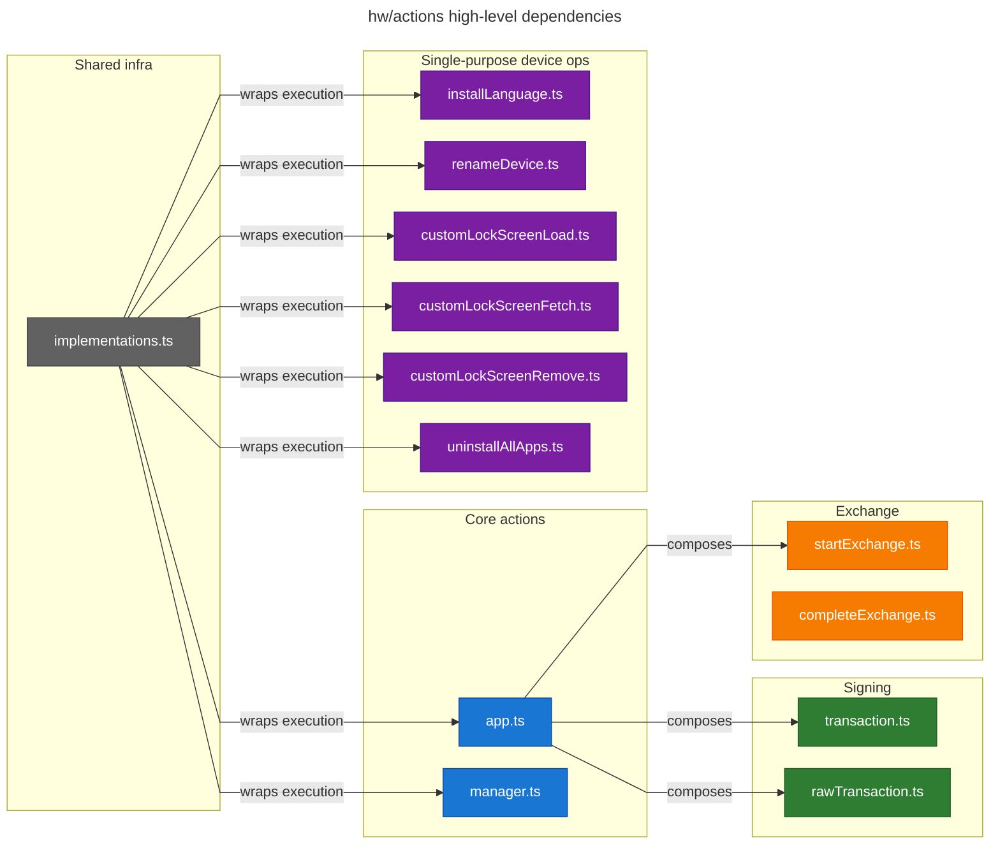
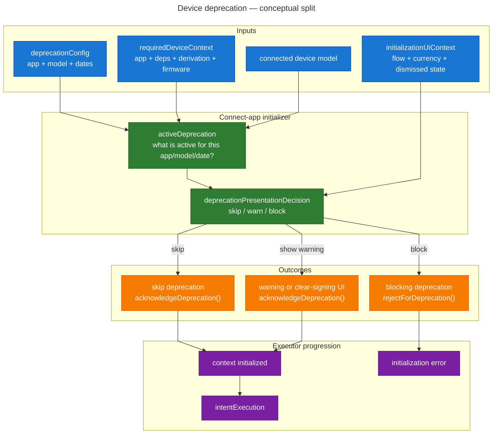

# Device Actions to Device-Intent Migration

## Goal

This document captures:

- how device actions are implemented today in `libs/ledger-live-common/src/hw/actions`
- how desktop/mobile `DeviceAction` currently consume their state
- which parts of the wide UI `status` object belong to which action
- a practical migration path toward per-action device-intent jobs and smaller UIs

The immediate goal is not to rewrite anything yet. The first step is to make state ownership explicit so we can:

1. split the current big `DeviceAction` renderer into action-specific renderers plus shared UI blocks
2. replace the current hook state soup with typed job states emitted by device-intent observables

## Current Architecture

### 1. Action contract

Every action in `live-common` follows the same contract:

- `useHook(device, request) => HookState`
- `mapResult(hookState) => Result | null`

The contract lives in `libs/ledger-live-common/src/hw/actions/types.ts`.

This means the "device action state" is not a Redux slice and not a single global source of truth. It is the return value of each action hook, and desktop/mobile chose to treat those return values as if they all fit inside one big UI status shape.

### 2. Shared execution wrapper

Most actions are built on top of `getImplementation(currentMode)` from `libs/ledger-live-common/src/hw/actions/implementations.ts`.

That wrapper:

- runs in `event` or `polling` mode depending on transport / platform constraints
- injects synthetic `deviceChange` and wrapped `error` events
- forwards or delays some device-side events depending on mode; for example, in `polling` mode `unresponsiveDevice` is filtered before the consumer sees it
- is responsible for reconnect / timeout behavior

So part of the UI state is action-specific, but part of it is inherited from the transport/execution wrapper.

Another subtlety: `app.ts` does not just expose the wrapped execution stream. It also stops its subscription once `requiresAppInstallation` or `error` is reached, via `takeWhile(..., true)`, so its lifecycle is slightly different from manager-style single-purpose actions.

### 3. Shared UI entry points

There is no `DeviceAction.tsx` file. The two entry points are:

- desktop: `apps/ledger-live-desktop/src/renderer/components/DeviceAction/index.tsx`
- mobile: `apps/ledger-live-mobile/src/components/DeviceAction/index.tsx`

Both follow the same core pattern, with platform-specific wrappers around it:

1. call `action.useHook(device, request)`
2. compute `payload = action.mapResult(status)`
3. pass both to a large default renderer

The "big state object" is therefore a UI-level superset of many hook return types, not a canonical model designed action-by-action.

Desktop still adds some wrapper behavior on top of that core pattern:

- it reads the device from Redux instead of receiving it as a prop
- it can short-circuit entirely via `useBuyDeviceIntercept`
- it keeps the screen awake while the inner device action is mounted

### 4. Executor injection

The action factories in `live-common` are dependency-injected.

For example:

- `transaction.ts` does not import `connectApp.ts` directly
- instead, desktop/mobile build the action by calling `createAction(connectAppExec)`
- `connectAppExec` is usually the default export of `libs/ledger-live-common/src/hw/connectApp.ts`
- in mock mode, the same seam is used to inject mocked event emitters instead

This matters for migration because it is already a useful abstraction boundary:

- UI code depends on an action factory
- the action factory depends on an executor
- the executor can be legacy transport logic, DMK-backed logic, or a mock

## Action Families Today


| Family                      | Main files                        | Notes                                                    |
| --------------------------- | --------------------------------- | -------------------------------------------------------- |
| Connect / open app backbone | `app.ts`, `connectApp.ts`         | Core `AppState`, most reused flow                        |
| Manager / My Ledger         | `manager.ts`, `connectManager.ts` | Separate reducer with repair modal state                 |
| Sign transaction            | `transaction.ts`                  | `AppState` + signing-specific flags                      |
| Sign raw transaction        | `rawTransaction.ts`               | Same UI family as `transaction.ts`                       |
| Sign message                | `../signMessage/index.ts`         | `AppState` + one sign-message step                       |
| Start exchange              | `startExchange.ts`                | `AppState` + start-exchange result/error + frozen device |
| Complete exchange           | `completeExchange.ts`             | Separate reducer, exchange confirmation specific         |
| Install language            | `installLanguage.ts`              | Manager-style permission/progress action                 |
| Custom lock screen load     | `customLockScreenLoad.ts`         | Manager-style permission/progress action                 |
| Custom lock screen fetch    | `customLockScreenFetch.ts`        | Manager-style fetch/backup action                        |
| Custom lock screen remove   | `customLockScreenRemove.ts`       | Manager-style remove action                              |
| Rename device               | `renameDevice.ts`                 | Manager-style permission action                          |
| Uninstall all apps          | `uninstallAllApps.ts`             | Manager-style permission action                          |


## High-Level Mermaid




Notes:

- Solid arrows show real action composition. Today, `transaction.ts`, `rawTransaction.ts`, and `startExchange.ts` all build on top of `app.ts`.
- `completeExchange.ts` is intentionally isolated here: it is in the exchange family, but it does not currently compose `app.ts`.
- `implementations.ts` is only shown where it materially shapes runtime behavior. It drives the polling/event wrapper used by `app.ts`, `manager.ts`, and the manager-style single-purpose actions.
- To keep the graph readable, two cross-cutting couplings are not drawn:
  - all action files also depend on `types.ts` for the shared `Action` / `Device` contract
  - `manager.ts`, `installLanguage.ts`, `renameDevice.ts`, `customLockScreen*`, and `uninstallAllApps.ts` currently import `currentMode` from `app.ts`
- `../signMessage/index.ts` also builds on `app.ts`, but it lives outside `actions/`, so it is not part of this diagram.

## What The Wide UI State Actually Represents

The desktop `States` type and mobile `Status` type are best understood as a **UI superset**, not a domain model.

Three important consequences:

1. The real shared core is `AppState` from `app.ts`, not the desktop/mobile `States` / `Status` types.
2. Some fields in the wide type are actual hook state.
3. Some fields are request echo, terminal result plumbing, or stale / partially unused baggage.

Examples:

- `manifestId` and `manifestName` are request data copied into the transaction/raw-transaction hook result so the renderer can pass them to confirmation components.
- `amountExpectedTo` is not emitted by any action reducer. The wide status types include it, but desktop/mobile default renderers actually read the live value from the exchange `request`, not from `status`.
- `imageLoadRequested`, `loadingImage`, `imageLoaded`, and `imageCommitRequested` exist in the desktop/mobile type, but the common default renderer does not currently branch on them.
- `customLockScreenFetch` and `uninstallAllApps` expose important state that is not represented in the shared desktop/mobile status superset at all.
- `renameDevice` also has meaningful terminal fields (`completed`, `name`) that are not represented in the desktop/mobile status superset.

This is one of the main reasons the current setup feels over-coupled: the type tries to be universal, but it is neither complete nor well-separated.

## State Ownership Map

### 1. Connect-app backbone: `app.ts`

This is the most important shared state source.

Owned fields:

- `device`
- `deviceInfo`
- `deviceId`
- `request`
- `error`
- `isLoading`
- `unresponsive`
- `isLocked`
- `requestQuitApp`
- `requestOpenApp`
- `allowOpeningRequestedWording`
- `allowOpeningGranted`
- `allowManagerRequested`
- `allowManagerGranted`
- `requiresAppInstallation`
- `opened`
- `appAndVersion`
- `derivation`
- `latestFirmware`
- `displayUpgradeWarning`
- `installingApp`
- `progress`
- `listingApps`
- `listedApps`
- `installQueue`
- `currentAppOp`
- `itemProgress`
- `skippedAppOps`
- `deviceDeprecationRules`
- `onRetry`
- `passWarning`
- `inWrongDeviceForAccount`

Notes:

- `inWrongDeviceForAccount` is not emitted by the device. It is computed in `app.ts` from derivation/account comparison.
- `request` here is reducer state carried through the connect-app pipeline. It is not the same thing as the raw caller input in every intermediate step.
- This family is the backbone reused by `transaction.ts`, `rawTransaction.ts`, `startExchange.ts`, and `../signMessage/index.ts`.
- `app.ts` also stops its execution stream after `requiresAppInstallation` or `error`, which is a lifecycle nuance other action families do not share in the same way.
- If we want a common device-intent "connect/open-app" job, `AppState` is the best current starting point.

### 2. Manager family: `manager.ts`

Owned fields:

- `device`
- `deviceInfo`
- `deviceId`
- `error`
- `isLoading`
- `unresponsive`
- `isLocked`
- `requestQuitApp`
- `allowManagerRequested`
- `allowManagerGranted`
- `result`
- `repairModalOpened`
- `onRepairModal`
- `onAutoRepair`
- `closeRepairModal`
- `onRetry`

Notes:

- This is a separate family from `AppState`.
- The repair modal behavior is truly manager-specific and should not leak into a generic action renderer.

### 3. Transaction and raw transaction: `transaction.ts`, `rawTransaction.ts`

These actions are:

- `AppState`
- plus signing-specific state

Owned fields on top of `AppState`:

- `deviceSignatureRequested`
- `deviceStreamingProgress`
- `transactionChecksOptInTriggered`
- `transactionChecksOptIn`
- `manifestId`
- `manifestName`

Terminal-only fields that are **not** really shared-renderer state:

- `signedOperation`
- `transactionSignError`

Notes:

- `manifestId` / `manifestName` are UI/context passthrough, not transport state.
- This is a very coherent future job family: transaction sign and raw transaction sign mostly differ by request/result payload, not by transport UI steps.

### 4. Sign message: `../signMessage/index.ts`

This action is:

- `AppState`
- plus one sign-message-specific step

Owned fields on top of `AppState`:

- `signMessageRequested`

Terminal-only fields:

- `signMessageResult`
- `signMessageError`

Notes:

- `signMessageRequested` is initialized from `request.message` and then cleared on terminal paths; it is not reducer-driven in the same way `deviceSignatureRequested` is for transaction signing.
- This is much simpler than transaction signing.
- It is a good candidate for an early migration once the common `connect/open-app` states are extracted.

### 5. Start exchange: `startExchange.ts`

This action is:

- `AppState`
- plus exchange-start-specific state

Owned fields on top of `AppState`:

- `startExchangeResult`
- `startExchangeError`
- `freezeReduxDevice`
- `isLoading`

Notes:

- UI mostly reuses the app/open-app flow here.
- because `useHook` returns `{ ...appState, ...state }`, the local `isLoading` shadows `AppState.isLoading`
- the local `State` type also declares `error?: Error`, but the reducer in this file does not currently populate it
- `freezeReduxDevice` is execution control state. It should not become part of a public shared UI contract.

### 6. Complete exchange: `completeExchange.ts`

Owned fields:

- `completeExchangeStarted`
- `completeExchangeResult`
- `completeExchangeError`
- `estimatedFees`
- `freezeReduxDevice`
- `isLoading`
- `device`

Important mismatch to keep in mind:

- the file declares `CompleteExchangeState = AppState & State`
- but `useHook` actually returns `{ ...state, device }`
- so this action is typed as if it shared `AppState`, while at runtime it does not
- the typed `State` also declares `completeExchangeRequested`, while the reducer and the UI actually use `completeExchangeStarted`

This mismatch is a good example of why the current giant status superset is hard to trust.

Also note:

- `amountExpectedTo` used by the UI is request data, not hook state

### 7. Install language: `installLanguage.ts`

Owned fields:

- `device`
- `deviceInfo`
- `error`
- `isLoading`
- `unresponsive`
- `requestQuitApp`
- `languageInstallationRequested`
- `installingLanguage`
- `languageInstalled`
- `progress`
- `onRetry`

### 8. Custom lock screen load: `customLockScreenLoad.ts`

Owned fields:

- `device`
- `deviceInfo`
- `error`
- `isLoading`
- `unresponsive`
- `requestQuitApp`
- `imageLoadRequested`
- `imageCommitRequested`
- `loadingImage`
- `imageLoaded`
- `progress`
- `imageHash`
- `imageSize`
- `onRetry`

Notes:

- `imageHash` and `imageSize` are result-oriented fields, not part of the common desktop/mobile status superset.
- The common `DeviceAction` renderer does not currently own this sub-flow despite carrying some of its flags in the type.

### 9. Custom lock screen fetch: `customLockScreenFetch.ts`

Owned fields:

- `device`
- `deviceInfo`
- `error`
- `isLoading`
- `unresponsive`
- `requestQuitApp`
- `fetchingImage`
- `imageFetched`
- `hexImage`
- `imgHash`
- `progress`
- `completed`
- `imageAlreadyBackedUp`
- `onRetry`

Notes:

- This action does not really fit in the current shared renderer.
- Most of its useful state is absent from the desktop/mobile status superset.

### 10. Custom lock screen remove: `customLockScreenRemove.ts`

Owned fields:

- `device`
- `deviceInfo`
- `error`
- `isLoading`
- `unresponsive`
- `requestQuitApp`
- `imageRemoveRequested`
- `imageRemoved`
- `onRetry`

### 11. Rename device: `renameDevice.ts`

Owned fields:

- `device`
- `deviceInfo`
- `error`
- `isLoading`
- `unresponsive`
- `allowRenamingRequested`
- `completed`
- `name`
- `onRetry`

Notes:

- The shared renderer only really knows about `allowRenamingRequested`.
- The actual terminal output is the renamed `name`.
- `renameDevice.ts` also handles `disconnected` explicitly, resetting loading from `e.expected`.

### 12. Uninstall all apps: `uninstallAllApps.ts`

Owned fields:

- `device`
- `deviceInfo`
- `error`
- `isLoading`
- `unresponsive`
- `requestQuitApp`
- `uninstallAppsRequested`
- `appsUninstalled`
- `onRetry`

Notes:

- This action is another example of an action that does not fit the current shared desktop/mobile status superset.
- its state type declares `requestQuitApp`, but the reducer never sets it, so it currently stays `false`

### Common subtlety for sections 7-12

Several of these smaller action state types declare fields that make them look closer to `manager.ts` than they really are.

- `installLanguage.ts`, `renameDevice.ts`, `customLockScreenLoad.ts`, `customLockScreenFetch.ts`, `customLockScreenRemove.ts`, and `uninstallAllApps.ts` all declare `deviceInfo` in their state shape
- unlike `app.ts` and `manager.ts`, their reducers never populate it, so it currently remains `null` at runtime
- `customLockScreenRemove.ts` and `uninstallAllApps.ts` also declare `requestQuitApp`, but their reducers never set it, so it is currently inert

## What The Common Renderer Really Owns Today

The large desktop/mobile `DeviceActionDefaultRendering` functions own a mix of common and action-specific branches.

### Clearly shared branches

These are good candidates for shared job UI blocks:

- device deprecation screens
- generic "connect your device"
- generic loading state
- generic locked / unresponsive / error handling
- request to quit current app
- request to open an app
- request manager permission
- requires app installation
- inline app installation progress
- wrong device for account

### Action-family-specific branches currently mixed into the same renderer

These should become dedicated action/family renderers:

- transaction confirm
- raw transaction confirm
- sign message confirm
- exchange confirmation
- manager repair flow
- install language flow
- custom lock screen flows
- rename device flow

### Fields carried by the wide type but not really owned by the common renderer

Examples:

- `amountExpectedTo`
- `imageLoadRequested`
- `loadingImage`
- `imageLoaded`
- `imageCommitRequested`
- `fetchingImage`
- `imageFetched`
- `hexImage`
- `imageAlreadyBackedUp`
- `uninstallAppsRequested`
- `appsUninstalled`
- `signedOperation`
- `transactionSignError`
- `signMessageResult`
- `signMessageError`
- `startExchangeResult`
- `startExchangeError`

This is a strong signal that the renderer is simultaneously too generic and not generic enough.

## Desktop / Mobile Differences To Preserve During Migration

The two apps are conceptually aligned, but they are not identical wrappers around the same status object.

- desktop reads the device from Redux inside `DeviceAction`; mobile receives the selected device as a prop
- desktop adds wrapper behavior (`useBuyDeviceIntercept`, `useKeepScreenAwake`) that mobile does not have in this component
- desktop has a slightly wider status type than mobile (`latestFirmware`, `imageRemoved`, `manifestId`, `manifestName`, `onRepairModal`)
- mobile collapses `!device`, `unresponsive`, and `isLocked` into the same connect-device branch more aggressively than desktop
- desktop confirmation UI receives `manifestId` / `manifestName`; mobile confirmation UI does not
- desktop can render terminal payloads with a `Result` component, while mobile only supports callback / `renderOnResult` style completion
- desktop persists `latestFirmware` through this component; mobile only persists last-seen device info
- desktop exposes `onRepairModal` all the way down to `ConnectYourDevice`; mobile does not
- exchange rendering is platform-specific and already behaves more like a dedicated action renderer than a shared one
- even inside similar branches there are small platform drifts, for example desktop waits for `!isLoading` before its complete-exchange confirmation branch, while mobile does not

This matters because the best migration target is probably:

- shared job state definitions in `live-common`
- shared common UI blocks where behavior truly matches
- platform-specific family renderers where behavior or tracking already diverges

## Connect-App as Required Context

### Connect-app-based intents should move connect-app into required context

For the intents that currently depend on `app.ts` (`transaction.ts`, `rawTransaction.ts`, `../signMessage/index.ts`, `startExchange.ts`, and similar future intents), the cleanest device-intent shape is:

- executor phase: establish `requiredDeviceContext`
- intent phase: run the intent-specific job only after context initialization succeeds

This means the old connect-app concerns move out of each intent job:

- install / list dependencies
- request manager permission
- request open app
- outdated app / firmware gating
- derivation-based wrong-device checks

For connect-app-based intents, this should make `JobState` much narrower. A future transaction-sign intent can focus on states like:

- waiting for signature
- streaming progress
- signed
- error

instead of also carrying most of `AppState`.

Important nuance: this does **not** mean the executor always re-runs connect-app before every intent. In the current device-intent executor model, initialization is its own phase and only runs again when the required context changes or needs to be re-established.

### `RequiredDeviceContext` is close to `ConnectAppRequest`, not raw `AppRequest`

Current `device-intent` core models required context as:

- `appName`
- `requiresDerivation`
- `dependencies`
- `requireLatestFirmware`
- `allowPartialDependencies`

This is conceptually close to the normalized `ConnectAppRequest` produced by `app.ts` after `inferCommandParams(...)`.

It is **not** the same shape as the richer `AppRequest` used by current device actions, because `AppRequest` still allows convenience inputs such as:

- `account`
- `currency`
- `dependencies: AppRequest[]`
- `tokenCurrency`
- `withInlineInstallProgress`

In other words, `AppRequest` mixes:

- declarative device context requirements
- convenience inputs used to infer those requirements
- UI-oriented extras

### What the current `account` is used for in `app.ts`

When a transaction-like action passes an `account` into `createAppAction(...).useHook(...)`, it is not because connect-app needs the whole account object directly on the device side.

Today, `app.ts` uses the account mainly to:

- infer `currency` when only `account` is provided
- infer `appName` from `currency.managerAppName`
- compute `requiresDerivation` from `account.derivationMode` and `account.freshAddressPath`
- inject family-specific get-address params via `injectGetAddressParams(account)` when needed
- later compare the derived address against `account.freshAddress` / `account.seedIdentifier` to compute `inWrongDeviceForAccount`
- derive `accountName` for the UI message shown in the wrong-device case

So the migration implication is:

- a future connect-app-based intent should not pass a raw account into the intent job just to recover context
- instead, the app layer should resolve the account into explicit `requiredDeviceContext`
- any remaining UI-specific metadata (for example the account name needed for a wrong-device message) should stay outside the executor-level context contract

### Caveats to keep in mind during migration

- The `device-intent` shape is good for normalized connect-app requirements, but some current `AppRequest` conveniences still need a resolver step before building `RequiredDeviceContext`.
- The current DMK-native mobile initializer already follows this model conceptually, but still has TODOs for full `requiredDerivation` and deprecation support.
- This simplification mainly applies to connect-app-based intents. Manager-style flows may want their own required-context concept later, but that is a separate migration step.

### Suggested extraction: shared resolver before splitting to executor context

To avoid duplicating logic during migration, we should probably extract a pure shared resolver out of `app.ts`.

Today, `inferCommandParams(appRequest)` already performs most of the normalization work. A good intermediate target would be:

```ts
type ResolvedAppRequirements = {
  appName: string;
  dependencies: string[];
  requireLatestFirmware: boolean;
  allowPartialDependencies: boolean;
  requiresDerivation?: {
    currencyId: string;
    path: string;
    derivationMode: string;
    forceFormat?: string;
  };
};

function resolveAppRequest(appRequest: AppRequest): ResolvedAppRequirements
function toConnectAppRequest(req: ResolvedAppRequirements): ConnectAppRequest
function toRequiredDeviceContext(req: ResolvedAppRequirements): RequiredDeviceContext
```

Why this shape is useful:

- current `app.ts` can keep its legacy `connectApp` path by projecting `ResolvedAppRequirements` to `ConnectAppRequest`
- device-intent-based flows can project the same resolved shape to `RequiredDeviceContext`
- the account/currency/dependency inference lives in one place instead of being reimplemented during migration

This also keeps the separation clean:

- `ResolvedAppRequirements` = normalized device context requirements
- `ConnectAppRequest` = legacy connect-app transport contract
- `RequiredDeviceContext` = executor initialization contract
- UI-only metadata stays outside those contracts

That extraction would be a good early migration step even before phase 3, because it would reduce duplication while leaving current behavior unchanged.

## Device Deprecation

### High-level spec

At a user-facing level, "device deprecation" is a connect-app-time gate that can appear before the actual action continues.

Depending on the device model, app, flow, and coin, the user can experience one of these outcomes:

- no screen at all, and the flow continues normally
- an informational warning screen with `Update` + `Continue`
- an informational warning screen followed by a clear-signing warning screen, then `Continue`
- a blocking error-style screen with no continue path

In other words, the current system does **not** simply say "device is deprecated, therefore always block." It is more nuanced:

- the config decides whether the situation is a warning, a clear-signing warning, or a blocking error
- the current flow and coin decide whether that screen actually applies here
- the user's previous "do not remind again" choice can suppress some warning screens

For a user, this means the same deprecated device can behave differently depending on:

- the app being opened
- the connected device model
- the current flow (`send`, `receive`, `swap`, `staking`, etc.)
- the coin / token involved
- whether the warning was previously dismissed

### What the UI looks like today

The UI currently distinguishes three deprecation screen families:

- `warningScreen`
- `clearSigningScreen`
- `errorScreen`

The warning-style screens render through `DeviceDeprecationScreen` and show:

- an `Update` CTA
- a `Continue` CTA
- a `Learn more` link
- for the first warning screen, an optional "do not remind again" choice

If the config indicates both a generic warning and a clear-signing warning:

- the user first sees the warning screen
- pressing continue can advance to the clear-signing warning
- pressing continue there finally allows the flow to resume

The blocking error case is different:

- the user gets a deprecation error screen
- there is no continue button
- the only meaningful actions are update / learn more / close the flow

### How the current implementation works

The current deprecation behavior is spread across several layers.

#### 1. Remote product config

The source of truth comes from LiveConfig via `getDeprecationConfig(appName, dependencies)` in `libs/ledger-live-common/src/apps/support.ts`.

That config is looked up per app:

- `config_nanoapp_<appName>`
- special case: for `Exchange`, if dependencies exist, the config is taken from the first dependency instead of the `Exchange` app itself

The config can contain per-device-model dates and rule sets for:

- generic warning screen
- clear-signing warning screen
- blocking error screen

Each screen config may also declare:

- `deprecatedFlow`
- `exception`

which are later used by the UI to decide whether to actually show the screen.

Code example: remote config shape and lookup

```ts
// libs/live-dmk-shared/src/device-action/ConnectApp/types.ts
type DeviceDeprecationScreenConfig = {
  date: string;
  deprecatedFlow: string[];
  exception?: string[];
};

type DeviceDeprecationConfig = {
  deviceModelId: string;
  warningScreen: DeviceDeprecationScreenConfig;
  errorScreen: DeviceDeprecationScreenConfig;
  warningClearSigningScreen: DeviceDeprecationScreenConfig;
};

type DeviceDeprecationConfigs = DeviceDeprecationConfig[];

// libs/ledger-live-common/src/apps/support.ts
export function getDeprecationConfig(appName: string, dependencies?: string[]) {
  const config =
    appName === "Exchange" && dependencies && dependencies.length > 0
      ? LiveConfig.getValueByKey(
          `config_nanoapp_${dependencies[0].toLowerCase().replace(/ /g, "_")}`,
        )
      : LiveConfig.getValueByKey(`config_nanoapp_${appName.toLowerCase().replace(/ /g, "_")}`);
  return config?.deviceDeprecated;
}
```

Illustratively, a remote-config payload for one app looks conceptually like:

```ts
const exampleDeviceDeprecatedConfig = [
  {
    // This entry applies only to Nano S devices.
    deviceModelId: "NANO_S",
    warningScreen: {
      // Starting on 2025-01-01, Nano S shows a non-blocking warning
      // for send and receive flows...
      date: "2025-01-01",
      deprecatedFlow: ["send", "receive"],
      // ...except for Bitcoin, which is explicitly excluded.
      exception: ["Bitcoin"],
    },
    warningClearSigningScreen: {
      // Starting on 2025-03-01, Nano S also gets a clear-signing warning
      // for send before the final blocking date above.
      date: "2025-03-01",
      deprecatedFlow: ["send"],
      exception: [],
    },
    errorScreen: {
      // Starting on 2025-06-01, Nano S becomes blocking for send.
      // The UI should surface a deprecation error screen and not allow continuing.
      date: "2025-06-01",
      deprecatedFlow: ["send"],
      exception: [],
    },
  },
];
```

Meaning of this example:

- for Nano S + `receive`, the user gets a warning from `2025-01-01`, except for Bitcoin
- for Nano S + `send`, the user first gets a warning from `2025-01-01`
- for Nano S + `send`, a clear-signing warning can also apply from `2025-03-01`
- for Nano S + `send`, the flow becomes blocking from `2025-06-01`
- for other device models, this particular config entry does nothing

#### 2. Connect-app execution layer

In the DMK connect-app path, `libs/ledger-live-common/src/hw/connectApp.ts` passes `deprecationConfig` into `ConnectAppDeviceAction`.

That is the important point: device deprecation is currently modeled as part of connect-app execution, not as a separate action.

Inside `libs/live-dmk-shared/src/device-action/ConnectApp/ConnectAppDeviceAction.ts`:

- device status is fetched first so the current device model is known
- the machine checks whether deprecation applies for that model and config
- if it does, the machine enters a deprecation step before continuing normal connect-app logic

The computed payload comes from `libs/live-dmk-shared/src/device-action/ConnectApp/deprecation.ts`, which turns config + DMK model into `DeviceDeprecationRules`:

- `warningScreenVisible`
- `clearSigningScreenVisible`
- `errorScreenVisible`
- `warningScreenRules`
- `clearSigningScreenRules`
- `errorScreenRules`
- `date`
- `modelId`

Then `ConnectAppDeviceAction` pauses in `waitForDeprecationAcknowledgment` and injects:

- `onContinue(false)` => continue connect-app
- `onContinue(true)` => reject with `DeviceDeprecationError`

So the DMK action itself owns the "pause until user acknowledges deprecation" behavior.

#### 3. Event mapping back to legacy device actions

The DMK device action is then remapped back into the legacy `ConnectAppEvent` stream by `libs/ledger-live-common/src/hw/connectAppEventMapper.ts`.

When the DA exposes `requiredUserInteraction === "device-deprecation"`, the event mapper emits:

- `{ type: "deprecation", deprecate: DeviceDeprecationRules }`

Then `libs/ledger-live-common/src/hw/actions/app.ts` stores that in:

- `deviceDeprecationRules`

At that point, the legacy `AppState` / `DeviceAction` world takes over.

#### 4. Flow-aware UI policy in `DeviceAction`

Desktop and mobile `DeviceAction` then interpret `deviceDeprecationRules` in the renderer.

This is where the "same deprecated device behaves differently depending on the flow" logic lives today.

The renderer derives:

- `currentFlow` from `location` + `request`
- `currencyName` from `request`
- dismissed warning state from settings (`deprecationDoNotRemind`)

Those helpers come from:

- `apps/ledger-live-desktop/src/renderer/components/DeviceAction/utils.ts`
- `apps/ledger-live-mobile/src/components/DeviceAction/utils.ts`
- shared helper logic in `libs/ledger-live-common/src/device-action/utils.ts`

The UI then decides whether to:

- auto-skip the deprecation
- show the warning screen
- show the clear-signing warning screen
- escalate to a blocking error

The rule is:

- config chooses the deprecation type
- flow / coin / dismissal settings choose whether that type applies here

The renderer calls `deviceDeprecationRules.onContinue(...)` accordingly:

- `false` when continuing
- `true` when the deprecation should block and surface as `DeviceDeprecationError`

Code example: how flow and coin context are determined today

```ts
// Example call site: apps/ledger-live-mobile/src/screens/ReceiveFunds/03a-ConnectDevice.tsx
<DeviceActionModal
  action={action}
  device={device}
  request={{ account: mainAccount, tokenCurrency }}
  location={HOOKS_TRACKING_LOCATIONS.receiveFlow}
/>

// libs/ledger-live-common/src/device-action/utils.ts
export function getCurrencyName(request: unknown): string {
  const req = request as {
    tokenCurrency?: TokenCurrency;
    account?: Account;
  };

  return req.tokenCurrency?.name ?? req.account?.currency?.name ?? "";
}

export function getFlowNameFromMapping<TLocation extends string | number | symbol>(
  location: TLocation | undefined,
  request: unknown,
  flowMapping: Partial<Record<TLocation, FlowName>>,
): FlowName {
  if (!location) return FlowName.unknown;

  const mapped = flowMapping[location] ?? FlowName.unknown;

  // send modal + non-send tx mode => staking
  if (mapped === FlowName.send) {
    const req = request as { transaction?: { mode?: string } };
    if (req?.transaction?.mode !== FlowName.send) {
      return FlowName.staking;
    }
  }

  return mapped;
}

// apps/ledger-live-mobile/src/components/DeviceAction/utils.ts
export function getFlowName(
  location: HOOKS_TRACKING_LOCATIONS | undefined,
  request: unknown,
): FlowName {
  const flowMapping: Partial<Record<HOOKS_TRACKING_LOCATIONS, FlowName>> = {
    [HOOKS_TRACKING_LOCATIONS.sendFlow]: FlowName.send,
    [HOOKS_TRACKING_LOCATIONS.receiveFlow]: FlowName.receive,
    [HOOKS_TRACKING_LOCATIONS.swapFlow]: FlowName.swap,
    [HOOKS_TRACKING_LOCATIONS.addAccount]: FlowName.addAccount,
  };

  return getFlowNameFromMapping(location, request, flowMapping);
}
```

Code example: how the UI decides to skip, show, or block

```ts
// simplified excerpt from apps/ledger-live-mobile/src/components/DeviceAction/index.tsx
const currencyName = getCurrencyName(request);
const currentFlow = getFlowName(location, request);
const skippedDeprecations = settingsState.deprecationDoNotRemind;

const doSkipDeprecation = (exception: string[], deprecatedFlow: string[]) => {
  return (
    exception.includes(currencyName) ||
    !deprecatedFlow.includes(currentFlow) ||
    currentFlow === FlowName.unknown
  );
};

const alreadyDismissed = skippedDeprecations.includes(currencyName);
const skipWarningScreen =
  doSkipDeprecation(
    warningScreenRules?.exception || [],
    warningScreenRules?.deprecatedFlow || [],
  ) ||
  alreadyDismissed;

const skipErrorScreen = doSkipDeprecation(
  errorScreenRules?.exception || [],
  errorScreenRules?.deprecatedFlow || [],
);

if (deviceDeprecationRules.errorScreenVisible) {
  deviceDeprecationRules.onContinue(!skipErrorScreen);
} else if (deviceDeprecationRules.warningScreenVisible && !skipWarningScreen) {
  return <DeviceDeprecationScreen screenName={DeviceDeprecationScreens.warningScreen} />;
}
```

### Why it varies by flow and coin

The current flow / coin variation is not guessed by connect-app itself. It is derived in the UI layer from the `DeviceAction` inputs:

- flow comes from `location`, passed by the screen / modal / feature wrapper
- coin name comes from `request.account.currency.name` or `request.tokenCurrency.name`
- staking is inferred as a special case when a send flow carries a non-`send` transaction mode

So today the deprecation decision uses a mix of:

- explicit call-site metadata (`location`)
- light auto-resolution from `request`
- settings state
- remote config

That is why it feels spread out: there is no single "deprecation policy object" today.

### Current quirks and scope boundaries

There are a few important subtleties to keep in mind.

- The config-driven deprecation path described above is effectively part of the DMK connect-app path. The legacy non-DMK `cmd(...)` path does not mirror this architecture in the same way.
- Desktop and mobile deprecation skip logic are conceptually similar but not perfectly identical. In particular, their clear-signing follow-up logic and dismissal interactions are not fully aligned.
- There is also a separate temporary mobile-only Nano S deprecation rule for some Aptos / Hedera flows that lives outside the DMK connect-app deprecation pipeline. It should not be confused with the config-driven connect-app deprecation described here.
- The current DMK-native mobile `DeviceContextInitializerComponentLWM` explicitly lists deprecation support as a TODO, so the device-intent path has not yet absorbed this concern.

### Why the current deprecation naming feels bad

The naming in the current implementation is a good signal that several different concerns are collapsed into one object and one renderer branch.

For example:

- `deviceDeprecationRules` sounds like a pure config/rules object, but it also carries the runtime `onContinue(...)` control callback
- `warningScreenVisible` / `errorScreenVisible` sound like final UI decisions, but they are only the raw config/model result before flow-aware filtering
- `doSkipDeprecation` is named like an imperative action even though it returns a boolean
- `onContinue(true)` actually means "block with deprecation error", not "continue"

So the naming pain is not only cosmetic. It reflects a real modeling problem:

- remote config
- model-specific applicability
- flow/coin/settings presentation policy
- runtime continuation / rejection control

are all blended together in today's deprecation payload and UI logic.

One of the benefits of moving this logic into a cleaner DIE initializer architecture would be to separate these concepts explicitly, for example into:

- `deprecationConfig`
- `activeDeprecation`
- `deprecationPresentationDecision`
- `acknowledgeDeprecation()`
- `rejectForDeprecation()`

Even if the exact names differ, the important point is to stop using one "rules" object for all four roles at once.

High-level conceptual split:



This is the conceptual split we should move toward.

Today, the implementation collapses much of this into:

- one mixed `deviceDeprecationRules` payload coming from connect-app
- renderer-side flow/currency/settings logic in `DeviceAction`
- runtime continuation control hidden behind `onContinue(...)`

### Recommendation for the Device Intent Executor

#### Recommendation in one sentence

Treat device deprecation as part of **connect-app-driven device initialization**, not as a separate intent and not as generic executor-core behavior.

#### Why not a separate intent?

Deprecation is not an independent business step like "sign transaction" or "confirm swap."

It is a gate that must be resolved before the real intent can run. Modeling it as a separate intent would:

- complicate sequencing
- duplicate connect-app / model detection work
- make the intent graph less intuitive

#### Why not the generic executor core?

The generic executor core should stay responsible for:

- connection
- initialization
- intent execution
- high-level retries / cancellation

It should **not** encode product-specific policy like Nano S deprecation rules, flow exceptions, or currency-based skip behavior.

Those rules belong closer to the connect-app initializer for connect-app-based intents.

#### Best fit: the connect-app initializer

The right home is the connect-app-specific `DeviceContextInitializerComponent` used during the `deviceInitialization` phase.

For connect-app-based intents, that initializer should:

- inject `deprecationConfig` into `ConnectAppDeviceAction`
- observe the DA intermediate state
- handle the deprecation user interaction before signaling `onContextInitialized(...)`

Conceptually:

- no deprecation => continue normal initialization
- warning / clear-signing warning => render deprecation UI and call `onContinue(false)` when accepted
- blocking deprecation => block initialization and surface a deprecation-specific initialization error

This keeps the intent job clean: transaction/sign-message/etc. should not know anything about deprecation.

#### What should change in the DIE shape?

`RequiredDeviceContext` should stay focused on device requirements:

- app name
- dependencies
- derivation
- firmware requirement
- partial dependency policy

It should **not** be overloaded with flow-specific UI policy such as:

- current flow ID
- currency / coin name
- dismissed deprecation preferences

Instead, the executor / initializer boundary should probably gain a second, UI-oriented input for initialization policy, for example:

- `DeviceInitializationUiContext`
- or a narrower `DeprecationUiContext`

That extra input would carry the flow/currency/settings information currently inferred in `DeviceAction`.

At a high level, the split should be:

- `RequiredDeviceContext` = what device state must be established
- `DeviceInitializationUiContext` = how initialization-specific policy should be presented in this flow

#### Suggested implementation shape

For connect-app-based intents, a good target would be:

1. caller resolves current app/account/currency inputs into `RequiredDeviceContext`
2. caller also provides initialization UI policy context (flow, currency name, dismissal state)
3. `DeviceContextInitializerComponent` runs `ConnectAppDeviceAction` with deprecation config
4. initializer computes whether deprecation should be skipped or shown
5. initializer renders `DeviceDeprecationScreen` when needed
6. only once initialization is accepted does the executor move to `intentExecution`

This preserves the current semantics while cleaning the layering:

- deprecation detection stays near connect-app
- flow-aware presentation stays in app/platform UI
- business intents stay small

#### Migration guidance

The recommended migration order for deprecation is:

1. extract pure helpers where possible:
  - config/model -> `DeviceDeprecationRules`
  - flow/currency/settings + rules -> "show / skip / block" decision
2. teach the connect-app initializer to consume those helpers
3. remove the deprecation branch from the giant legacy `DeviceAction` flow for connect-app-based DIE screens
4. keep non-DIE legacy paths working until the migration is complete

## Proposed Migration Target

### 1. Move from "wide hook state" to per-action `JobState`

Each action should emit a narrow discriminated union, for example:

- `ConnectAppJobState`
- `ManagerJobState`
- `TransactionSignJobState`
- `RawTransactionSignJobState`
- `SignMessageJobState`
- `StartExchangeJobState`
- `CompleteExchangeJobState`
- `InstallLanguageJobState`
- `CustomLockScreenLoadJobState`
- `CustomLockScreenFetchJobState`
- `CustomLockScreenRemoveJobState`
- `RenameDeviceJobState`
- `UninstallAllAppsJobState`

Each union should use a `type` field instead of many unrelated booleans.

Examples:

- current `requestQuitApp: true` becomes `{ type: "request-quit-app" }`
- current `allowManagerRequested: true` becomes `{ type: "request-manager-permission" }`
- current `deviceSignatureRequested: true` becomes `{ type: "confirm-transaction" }`
- current `deviceStreamingProgress` becomes `{ type: "device-streaming", progress }`
- current `imageCommitRequested: true` becomes `{ type: "confirm-custom-lock-screen-commit" }`
- current `completeExchangeStarted + estimatedFees` becomes `{ type: "confirm-exchange", estimatedFees, ... }`

### 2. Keep only truly common states shared

The future shared UI layer should only own states that are genuinely reused across many actions:

- waiting for device / no device
- device changed / reconnecting
- device locked
- device unresponsive
- generic recoverable error
- request to quit current app
- request to open app
- request manager permission
- install app progress

Everything else should belong to an action/family-specific renderer.

### 3. Prefer terminal states over `mapResult`

Today, `mapResult` does not mean one consistent thing across actions.

Depending on the action, it can mean:

- true terminal success/error (`transaction.ts`, `completeExchange.ts`)
- "ready to continue" rather than "done" (`app.ts`, `manager.ts`)
- a loose payload projection rather than a strict terminal marker (`renameDevice.ts`, `customLockScreenLoad.ts`, `../signMessage/index.ts`)

For device-intent jobs, a clearer model would be:

- the observable emits typed states until completion
- terminal success/error is represented as an explicit final state
- the UI layer decides what to do with the terminal state

That would remove a lot of implicit coupling between hook state shape and `mapResult`.

## Recommended Extraction Plan

### Phase 0. Use this document as the inventory

Before changing behavior, treat the ownership map above as the checklist.

For each field in desktop/mobile `status`:

- identify the owning action family
- decide whether it is common UI, action-specific UI, request echo, internal execution state, or terminal result

### Phase 1. Split the renderer without changing live-common actions

Keep the current hooks, but stop rendering everything through one giant switchboard.

The routing mechanism for this phase should be explicit:

- add a UI-only `uiFamily` prop to desktop/mobile `DeviceAction`
- pass it from the app layer that already chooses the action instance
- do **not** add `uiFamily` to `live-common` hook state or to the `Action` contract

In other words, phase 1 should split rendering like this:

- `status` keeps dynamic runtime state emitted by the current hooks
- `uiFamily` is static renderer metadata used to select the right family renderer

Good sources for `uiFamily` are the places that already centralize action construction:

- desktop: `apps/ledger-live-desktop/src/renderer/hooks/useConnectAppAction.ts`
- mobile: `apps/ledger-live-mobile/src/hooks/deviceActions.ts`
- feature-specific wrappers like change-language, custom-image, or exchange screens can also pass it directly when they wrap `DeviceAction`

This keeps phase 1 app-local:

- `live-common` actions stay unchanged
- the renderer split does not depend on status-flag heuristics
- we avoid putting one more UI concern into the already overloaded hook state

Illustratively, the shape becomes:

```tsx
<DeviceAction
  action={action}
  request={request}
  uiFamily="transaction"
/>
```

Suggested split:

- `CommonDeviceActionRenderer`
- `AppActionRenderer`
- `ManagerActionRenderer`
- `TransactionActionRenderer`
- `SignMessageActionRenderer`
- `ExchangeActionRenderer`
- `InstallLanguageActionRenderer`
- `CustomLockScreenActionRenderer`
- `RenameDeviceActionRenderer`
- `UninstallAllAppsActionRenderer`

The input can still be the current hook state at first, but narrowed per family.

### Phase 2. Add per-action adapters over the current hooks

For each existing action, add a pure adapter:

- current hook state -> action-specific view model / job state

This lets us:

- preserve behavior
- remove boolean soup gradually
- validate which states are truly needed by the UI

### Phase 3. Introduce device-intent jobs

Once the UI is split and each family already consumes a narrow state model:

- reimplement the execution side as device-intent jobs returning observables of typed `JobState`
- keep the action-specific renderers unchanged as much as possible

At that point, the migration becomes mostly an execution-layer swap instead of a UI + execution rewrite at the same time.

### Phase 4. Remove the giant status superset

When each family uses its own typed job state:

- delete desktop `States`
- delete mobile `Status`
- delete branches that were only needed because everything passed through one common renderer

## Suggested Migration Order

From simplest / least coupled to most coupled:

1. `renameDevice`
2. `customLockScreenRemove`
3. `installLanguage`
4. `customLockScreenLoad`
5. `customLockScreenFetch`
6. `uninstallAllApps`
7. `signMessage`
8. `transaction` + `rawTransaction`
9. `manager`
10. `startExchange`
11. `completeExchange`

Reasoning:

- manager-style single-purpose actions are easiest to turn into dedicated jobs
- `signMessage` is simpler than transaction signing
- transaction/raw transaction are core but structurally clean once `AppState` is isolated
- exchange should come later because it mixes request data, device freezing, app opening, and custom confirmation UI

## Open Questions

- Should we create one reusable `ConnectAppJobState` family that other jobs compose, or should each action flatten the states it needs?
- Should device deprecation stay in a shared renderer, or move to a policy/pre-check layer above action rendering?
- Should `mapResult` survive as an adapter for compatibility, or should terminal `JobState` fully replace it?
- Should `manager` repair modal remain part of action state, or become a separate workflow owned by manager screens only?

## Summary

Today, device actions are not coupled because they all share the same business logic. They are coupled because desktop/mobile decided to funnel many different hook state shapes into one wide UI status object and one large ordered renderer.

The clean migration path is:

1. make ownership explicit
2. split rendering by action family
3. introduce narrow typed job states
4. migrate execution to device-intent one family at a time

If we do that in this order, device-intent can replace the execution model without forcing a risky all-at-once rewrite of both UI and live-common hooks.