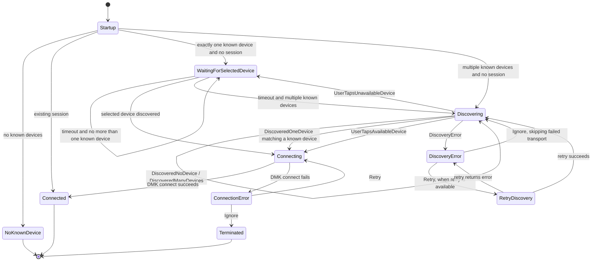

# ConnectDeviceStateMachine

`ConnectDeviceStateMachine` drives the DMK-based device connection flow used by
`connectDeviceUseCase`. It starts from the known-device list and an optional
existing session, filters DMK discoveries against those known devices, then
emits UI states for discovery, selection, connection, errors, and successful
connection.

## State Diagram

## Notes

- If startup receives no known devices, the machine emits `NoKnownDevice` and
  does not start discovery.
- If startup receives an existing session, the machine emits `Connected`, skips
  discovery, and calls `onConnected` with that session's connected device.
- If startup receives exactly one known device and no existing session, the
  machine selects that device immediately and waits for it to be discovered
  instead of first rendering the discovery list.
- `Discovering` starts the discovery service and renders all known devices as
  available or unavailable depending on the latest matched discoveries.
- DMK discovery emissions are filtered before reaching the state machine:
  discovered devices must match a known device by transport and by the
  transport-specific identity rules. BLE devices match through the legacy
  `findMatchingNewDevice` name/id/model logic, while USB devices match by model
  identifier.
- Tapping an available device connects immediately using the matched discovered
  device.
- Tapping an unavailable device moves to `WaitingForSelectedDevice`, where the
  machine keeps discovery running until that specific known device is matched or
  the 30 second waiting timeout expires. On timeout, the machine stays in
  `WaitingForSelectedDevice` when there is no more than one known device;
  otherwise it returns to `Discovering` and renders the known-device list again.
- Discovery errors stop discovery. Ignoring a discovery error records its
  `transportId` in `skipTransportIds`, then restarts discovery with that
  transport ignored. Retry is only exposed for retryable discovery errors; a
  successful retry restarts discovery, while a failed retry emits the returned
  discovery error.
- Connection errors expose retry/ignore actions without losing the selected
  matched device.
- `Connecting` stops discovery before calling `dmk.connect` with the selected
  matched discovered device and disables the DMK session refresher.
- `Connected` emits the success UI state and calls `onConnected` with the DMK
  session, connected device, and legacy compatibility fields used by existing
  device flows.
