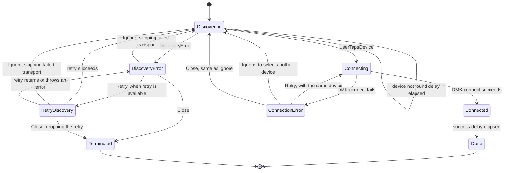

# ConnectNewDeviceStateMachine

`ConnectNewDeviceStateMachine` drives the DMK-based connection to a device the
user has not connected before. It discovers devices, lets the user select one,
connects to it, and reports the result. Unlike `ConnectDeviceStateMachine`, it
does no known-device matching and does not reuse an existing session.

## State Diagram

## Notes

- `Discovering` starts the discovery service and emits every discovered device
  with an `onSelect` callback. `scanningTransports` is the discovery service
  `transportIds` without the skipped transports.
- Each entry into `Discovering` clears the previous devices, the selection and
  the errors, sets `showDeviceNotFound` to `false` and starts the device not
  found delay (`DEFAULT_DEVICE_NOT_FOUND_DELAY`, 5 s). When the delay elapses,
  `Discovering` is emitted again with `showDeviceNotFound: true`. Leaving
  `Discovering` cancels the delay.
- Discovery errors stop discovery. `retry` is only set when the error has a
  resolution that is not `"none"`. Ignoring a discovery error adds its
  `transportId` to `skipTransportIds`, then starts discovery again without that
  transport. A successful retry starts discovery again. A failed retry emits
  the returned error, or an unknown discovery error if the retry throws. The
  unknown discovery error keeps the `transportId` of the retried error.
- The discovery error state has a `close` action for when the user closes its
  sheet. It moves to `Terminated`, also while a retry runs: the retry result is
  then dropped.
- `Connecting` stops discovery, then calls `dmk.connect` with the selected
  discovered device and the DMK session refresher disabled.
- A connection failure is mapped with `mapConnectionError` (for example BLE
  pairing refused, or pairing removed on the device) and emitted with `retry`
  and `ignore`. Retry connects again to the same device. Ignore goes back to
  `Discovering`, with the skipped transports kept, so that the user can select
  another device. Its `close` action does the same as ignore.
- Only the error states handle `close`, and only the `close` of the current
  error. A late `close` from a sheet that closes after a retry or an ignore
  does nothing, also when the machine is already in a new error state.
- `Connected` is the visible success state. After the success delay
  (`DEFAULT_SUCCESS_DELAY`, 1.5 s), the machine moves to `Done`.
- `Done` emits the `Done` UI state and calls `onConnected` one time with the
  DMK session, the connected device and the legacy compatibility fields.
- `Terminated` emits the `Terminated` UI state and calls `onClose` one time.
- `stop()` stops discovery and the timers, and calls neither `onConnected` nor
  `onClose`. If `stop()` runs before the machine stores the session of a
  successful connection, or during the success delay, the machine disconnects
  that session, because no caller received it.
- Both delays can be injected with `deviceNotFoundDelay` and `successDelay`.
