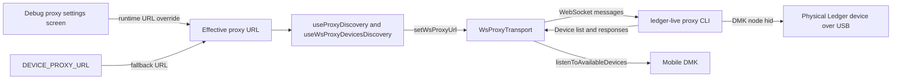
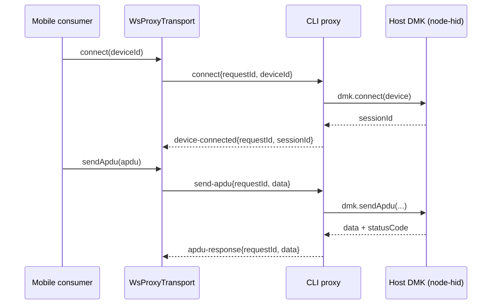

# @ledgerhq/live-dmk-ws-proxy-client

WebSocket proxy transport for Device Management Kit (DMK).

This package enables Ledger Wallet Mobile running in an emulator/simulator to communicate with a real Ledger device connected by USB to the host machine.

## Why this exists

Emulators cannot access a real transport directly (USB or BLE).

This package bridges that gap by connecting Mobile DMK to a host-side CLI proxy (`ledger-live proxy`) over WebSocket, while preserving DMK transport semantics (discovery, connect/disconnect lifecycle, APDU exchange).

## Typical usage

1. Start `ledger-live proxy` (or `pnpm run:cli proxy`) on the host machine.
2. Launch Ledger Wallet Mobile in emulator/simulator.
3. Configure the proxy URL (`DEVICE_PROXY_URL` or runtime debug setting).
4. Discover and select the proxied device from Mobile.

## Public API

- `wsProxyTransportFactory`
  - DMK transport factory (`WS_PROXY_IDENTIFIER = "WS-PROXY"`).
- `setWsProxyUrl(url: string | null)`
  - Sets the active proxy URL globally for this transport (`null` disables it).
- `useWsProxyDevicesDiscovery({ dmk, url })`
  - React hook returning `{ devices, error }` for proxied discovery.
- `WsProxyLegacyTransportCompat`
  - Compatibility bridge for legacy `hw-transport` consumers still present in Mobile flows.
- Protocol types
  - Shared client/server message types from `@ledgerhq/live-dmk-ws-proxy-shared`.

## Protocol (quick reference)

Client -> server:

- `connect { requestId, deviceId }`
- `send-apdu { requestId, deviceId, data, abortTimeoutMs? }`
- `disconnect { requestId?, deviceId }`

Server -> client:

- `discovered-devices-updated { discoveredDevices[] }`
- `device-connected { requestId, deviceId, sessionId, deviceModel }`
- `apdu-response { requestId, deviceId, data }`
- `error { requestId?, deviceId?, message }`
- `device-disconnected { deviceId }`

## Integration points

- Mobile transport registration: `apps/ledger-live-mobile/src/services/registerTransports.ts`
- Mobile discovery usage: `apps/ledger-live-mobile/src/transport/useProxyDiscovery.ts`
- Mobile debug proxy settings UI: `apps/ledger-live-mobile/src/screens/Settings/Debug/Connectivity/ProxyDiscoverySettings.tsx`
- Mobile device selection UI: `apps/ledger-live-mobile/src/components/SelectDevice2/index.tsx`
- CLI command entrypoint: `apps/cli/src/commands/device/proxy.ts`
- Server runtime package: `libs/live-dmk-ws-proxy-server`

## Architecture (brief)

### 1) URL wiring and discovery

### 2) Connect and APDU exchange

## Implementation notes (maintainers)

- Single active URL model: one active proxy URL at a time.
- Single socket model: one WebSocket connection for the active URL.
- URL changes trigger connection reconciliation and cleanup.

## Related packages

- `@ledgerhq/live-dmk-ws-proxy-server`: host-side runtime used by CLI proxy command.
- `@ledgerhq/live-dmk-ws-proxy-shared`: shared wire protocol types.
