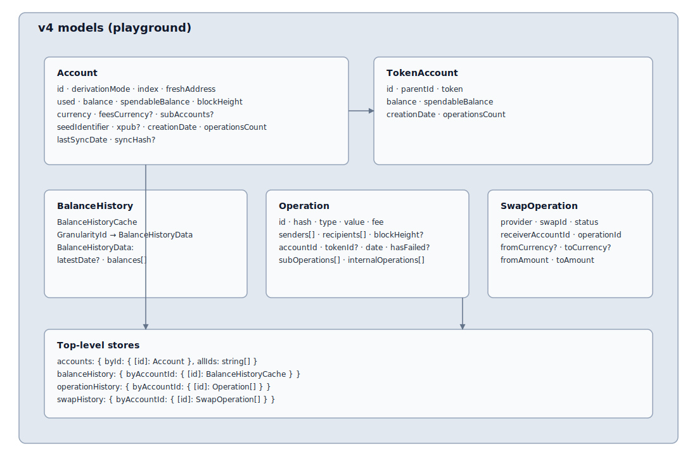

## Account model rework

IMPORTANT: this is not finished. many fields still need to be removed and more model decision to continue. I try to document my doubts here.

General idea is that Account is exploded into multiple parts. Technically we start to "denormalize" it, in the continuation of what was done for Account starred & names: instead of having Account#name being a field, we have made a accountNames map. This allows to collocate the management of account names as well as the lifecycle (e.g. saving to wallet sync). The idea is now to apply the same principle on: operations, balanceHistory, swapHistory. More may follow.

- balanceHistory will be directly consumed and loaded by the Portfolio Graph feature
- operationHistory will be directly consumed and loaded by the exploration of transactions
- swapHistory will be also managed by the Swap feature

By removing this from the Account object, we can expect coins to work much lightly: a coin no longer need to calculate them at the sync time. The remaining `account` state has only a few field remaining and we can allow the idea that Account gets added without their operations or their balance history calculated yet !

That means we can also optimize a lot the scanAccounts algorithm, the general idea is that a coin could yield the basic account field and while `.used` is true, we can continue the exploration. 

However, new coin API will be required to allow this efficiently (for features like scanning for accounts, pulling operations, fetching balanceHistory (that I assume must be a new http api on coin side)).

### What about TokenAccount

The existance of TokenAccount under an Account was kept for the moment, but we should continue discussing, from an UI perspective what we want to do. and from a MVP aspect, are token accounts strictly needed when you scan for Ethereum(/others) accounts. The question also is: does a TokenAccount exists on its own? today the answer is strictly no: the parent account is always passed in context with a token account, so this is why we have represented to belong to its parent.

### currencyId or Currency ?

TBD in model if we can replace Account#currency bu Account#currencyId but the downside is that a lot of codebase will have to be reworked if we go that path & there is no big pro side. However, in the current code, we have to make the schema accepting some sort of resolver instead of parser of Currency?