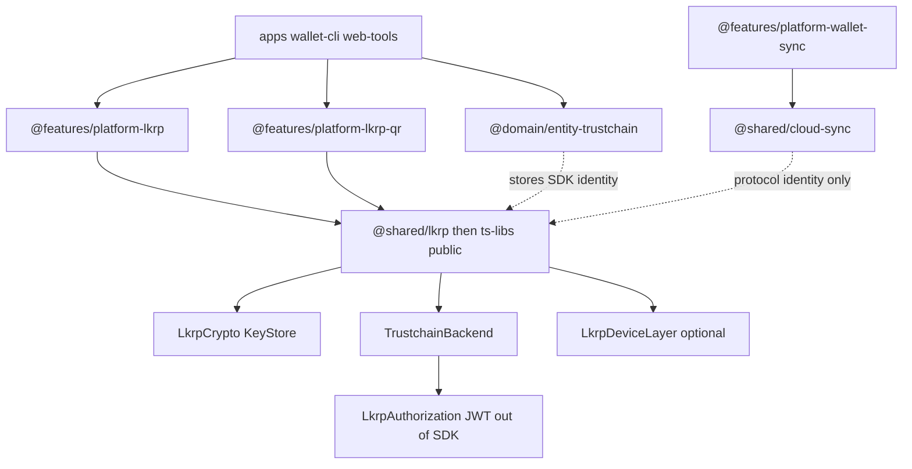
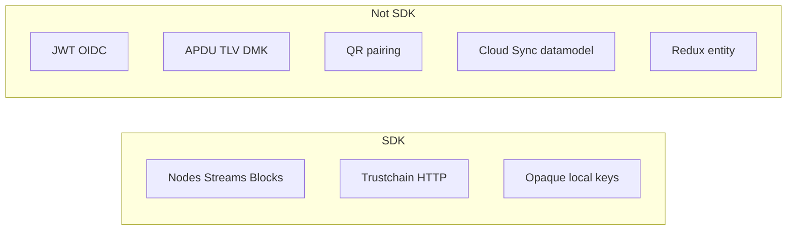

# `@shared/lkrp`

> [!CAUTION]
> **Status: UNSTABLE** — Contracts only; no protocol implementation yet.

Ledger Key Ring Protocol SDK (ADR [Solution 2](https://github.com/LedgerHQ/architecture-as-code/pull/380)): one client entry point, optional injected device layer.

> [!IMPORTANT]
> **`shared/*` is temporary.** `@shared/lkrp` is a private monorepo home while the API is unstable. It is **not** the long-term package. Once the contracts settle, this SDK becomes a **public library in Ledger `ts-libs`**. Do not treat the `shared/` path or the `@shared/lkrp` name as the published surface.

## Layers





## Shell

Instantiable today: `LkrpSdk`, `createTrustchainHttpBackend`, `createCommandStreamCodec`, `createSoftwareDeviceLayer`, `createMockLkrpSdk`. Protocol methods reject with `LkrpNotImplementedError`. Private keys never leave `LkrpKeyStore`.

```ts
const sdk = new LkrpSdk({ crypto, keyStore, backend, device: trustedApp });
```

Wallet glue: `@features/platform-lkrp`. QR: `@features/platform-lkrp-qr`. Persisted instance: `@domain/entity-trustchain`.
