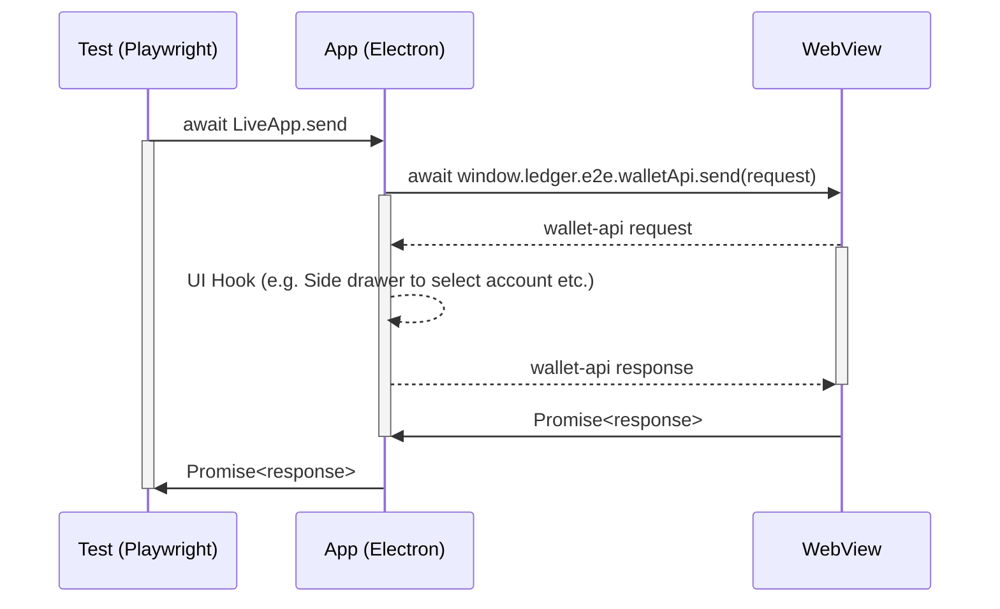
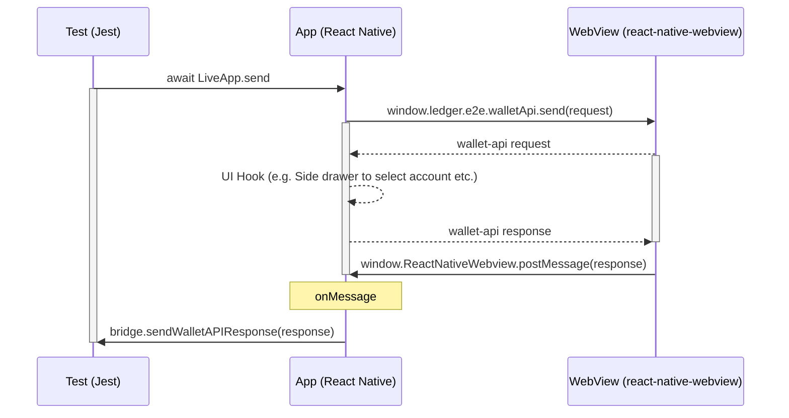

# Dummy Wallet API App

The purpose of this app is to allow automated front end testing of Ledger Live's Wallet API server implementation, and verify that Ledger Live correctly:

- handles the rendering of external Live Apps
- handles calls of the Wallet API client from external Live apps

The app is a simple [Create React App](https://github.com/facebook/create-react-app) which uses the [Wallet API](https://www.npmjs.com/package/@ledgerhq/wallet-api).

## Local Dummy App setup steps

```sh
pnpm i
pnpm dummy-wallet-app start # Start development server
```

## Serve production build

```sh
### Setup

pnpm i
pnpm build:dummy-wallet-app

### Desktop
pnpm build:lld:deps
pnpm desktop build:testing
### Run the setup only once if not done yet
pnpm desktop test:playwright:setup
pnpm desktop test:playwright wallet-api.spec.ts

###  Mobie
pnpm mobile start

### iOS
pnpm build:llm:deps
pnpm mobile e2e:build -c ios.sim.debug
pnpm mobile e2e:test -c ios.sim.debug apps/ledger-live-mobile/e2e/specs/wallet-api.spec.ts

### Android
pnpm build:llm:deps
pnpm mobile e2e:build -c android.emu.debug
pnpm mobile e2e:test -c android.emu.debug apps/ledger-live-mobile/e2e/specs/wallet-api.spec.ts
```

# How does it work?

## Desktop



- `LiveApp.send`: This method turns a JSON-RPC request object into JSON. Then, it calls injected method via [`webview.executeJavaScript`](https://www.electronjs.org/docs/latest/api/webview-tag#webviewexecutejavascriptcode-usergesture). It allows testing engineers to simply await for a response from Live's wallet server and `expect` against the response.
- `window.ledger.e2e.walletApi.send`: This is an injected method in Dummy App to send a request to the Wallet API server. It returns `Promise<response>` which is saved in a queue on the Dummy app side.
- Ledger Live Desktop either responds immediately with a response to the Wallet API request from the Live app, or after we've done some actions on the native LLD side (for example select an account, or mock a nano action). With this response the queued promise on the Live side is fulfilled with the result of the Wallet API request.
- The `webview.executeJavascript` promise on the Playwright test side is then subsequently fulfilled with the result of the Wallet API request, and we can use this to assert the expected result.

### Steps to write a test

First we start the local Dummy app at port 3000 by default and check that it can be accessed. Then we load a manifest which corresponds to this live app into the `MOCK_REMOTE_LIVE_MANIFEST` environmental variable (make sure the URL of the live app matches that of the live app, typically `http://localhost:3000`).

```typescript
import { getMockAppManifest } from "PATH/TO/utils/serve-dummy-app";

let continueTest = false;

test.beforeAll(async () => {
  continueTest = await LiveApp.start(request);
});
```

Then in the test we first send the Wallet API method that we want from the live app, perform any actions in Ledger Live, receive the response in the Live app, and verify the response by fulfilling the promise we initiated in the first step:

```typescript
const discoverPage = new DiscoverPage(page);

await test.step("account.request", async () => {
  // previous test steps....

  // generate a random id
  const id = randomUUID();

  // send the account.request method. This send method gives us the Wallet API message id and a promise from the 'inject javascript' step that we will resolve later
  const { id, response } = discoverPage.send({
    jsonrpc: "2.0",
    id,
    method: "account.request",
    params: {
      currencyIds: ["ethereum", "bitcoin"],
    },
  });

  // perform actions in Ledger Live to get the wallet API response
  await drawer.selectCurrency("bitcoin");
  await drawer.selectAccount("bitcoin");

  // verify the response is as expected. Be careful to only resolve this one all the required user actions are finished
  await expect(res).resolves.toStrictEqual({
    jsonrpc: "2.0",
    id,
    result: {
      rawAccount: {
        id: "2d23ca2a-069e-579f-b13d-05bc706c7583",
        // etc..
      },
    },
  });
});
```

## Mobile



The mobile side works similarly to desktop but with a few key differences:

- `LiveAppWebview.send`: The same as desktop but uses [`webview.runScript`](https://wix.github.io/Detox/docs/api/webviews/#runscriptscript) from detox instead.
- `window.ledger.e2e.walletApi.send`: This global method in the dummy app behaves differently on mobile. In desktop/playwright the JS injection `send` method in the live app returns the response to the test process, whereas the mobile/detox method doesn't return anything. To get around this the live app looks for `window.ReactNativeWebView` which is injected by the `react-native-webview` module, and then calls `window.ReactNativeWebView.postMessage` method to send the Wallet API response back to the LLM App runtime. This message will be caught with the `onMessage` handler passed to the LLM webview component. Then, the handler sends the request to the Test runtime via the E2E websocket bridge server. Finally the bridge server sends the response to the test via `e2eBridgeServer` RxJS subject.

### Steps to write a test

First we start the local Dummy app at port 52619 (hardcoded for now) which matches the live app manifest in `.env.mock`. In future we can make this dynamic by passing a manifest from the test to LLM Live app Provider via the E2E Bridge, but this way is simpler for initial tests.

Then in the `beforeAll` we check that the server is running and then navigate to the live app.

```typescript
import { getMockAppManifest } from "PATH/TO/utils/serve-dummy-app";

test.beforeAll(async () => {
  try {
    const port = await server.start("dummy-wallet-app/dist");
    const url = `http://localhost:${port}`;
    const response = await request.get(url);
    if (response.ok()) {
      continueTest = true;
      console.info(
        `========> Dummy Wallet API app successfully running on port ${port}! <=========`,
      );
      process.env.MOCK_REMOTE_LIVE_MANIFEST = JSON.stringify(
        server.liveAppManifest({
          id: "dummy-live-app",
          url,
          name: "Dummy Wallet API Live App",
          apiVersion: "2.0.0",
          content: {
            shortDescription: {
              en: "App to test the Wallet API",
            },
            description: {
              en: "App to test the Wallet API with Playwright",
            },
          },
        }),
      );
    } else {
      throw new Error("Ping response != 200, got: " + response.status);
    }
  } catch (error) {
    console.warn(`========> Dummy test app not running! <=========`);
    console.error(error);
  }

  if (!continueTest || !isAndroid()) {
    console.warn("Stopping Wallet API test setup");
    return; // need to make this a proper ignore/jest warning
  }

  // start navigation
  portfolioPage = new PortfolioPage();
  discoverPage = new DiscoveryPage();
  liveAppWebview = new LiveAppWebview();
  cryptoDrawer = new CryptoDrawer();

  loadConfig("1AccountBTC1AccountETHReadOnlyFalse", true);

  await portfolioPage.waitForPortfolioPageToLoad();
  await discoverPage.openViaDeeplink("dummy-live-app");

  const title = await detox.web.element(detox.by.web.id("image-container")).getTitle();
  expect(title).toBe("Dummy Wallet API App");
});
```

Then in the test we first send the Wallet API method that we want from the live app, perform any actions in Ledger Live, receive the response in the Live app, and verify the response by fulfilling the promise we initiated in the first step:

```typescript
it("account.request", async () => {
  // send wallet API request for the webview to send to LLM
  const { id, response } = await liveAppWebview.send({
    method: "account.request",
    params: {
      currencyIds: ["ethereum", "bitcoin"],
    },
  });

  // perform any required actions in LLM for the test
  await cryptoDrawer.selectCurrencyFromDrawer("Bitcoin");
  await cryptoDrawer.selectAccountFromDrawer("Bitcoin 1 (legacy)");

  // verify the response after the Wallet API response is received and all the test steps are finished
  await expect(response).resolves.toMatchObject({
    jsonrpc: "2.0",
    id,
    result: {
      rawAccount: {
        id: "2d23ca2a-069e-579f-b13d-05bc706c7583",
        address: "1xeyL26EKAAR3pStd7wEveajk4MQcrYezeJ",
      },
    },
  });
});
```

## Dummy App

The most important part of the dummy app is handled by `useE2EInjection()`, which injects the `window.ledger.e2e.walletApi.send()` method. This is the method that is used by the tests to simulate a user doing an action that requires a Wallet API response from Ledger Live.

`useE2EInjection()` also initialises the Wallet API transports (like any live app needs to communicate with Ledger Live), and also has a 'pending request' queue that keeps track of the requests it has sent to the Wallet API, so we can send responses back to the test for assertion.
