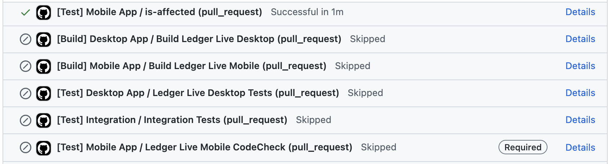
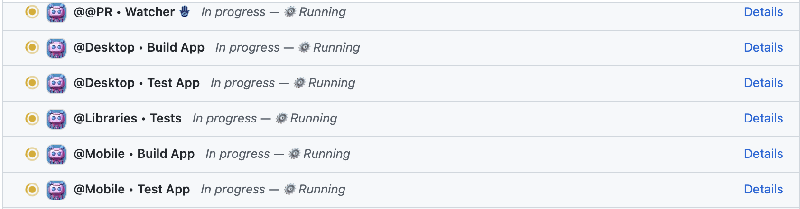

# Orchestrator

#### A tool within our Github-bot that streamlines the launch and monitoring of workflows on Github Actions CI.

| _Turning this:_ | _Into this:_ |
| --- | --- |
|  |  |

## In a nutshell 🌰

### What?

- The Continuous Integration (CI) is now managed by a Github App (or Bot) hosted on Vercel
- Instead of having X required checks, we now have a single required check run that is updated with the status of the workflows
- Workflows are not triggered directly by Github but by the App

### Why?

- Github required checks are great but were too rigid and not adapted to our needs
- Because of this we used to need to spawn every possible combination of workflows to please Github's required checks
- It swarmed the Pull Requests checks list with useless checks and made it hard to understand what was going on

### How?

- The Bot listens to webhook events sent by Github to trigger workflows and update check runs
- The required check status is computed from and kept in sync with the status of the workflows spawned by the bot

### Then?

- Now we are smarter and only run workflows that are needed by the PR changes
- We populate check runs with useful information related to the workflow run and provide call-to-action buttons to fix issues
- We save time and energy

## Intro

Previously, we had a strict set of checks that needed to pass before a pull request (PR) could be merged. This ensured that the code was of a certain quality before it was merged.

This approach had several limitations though.

Depending on the changes we might not need to run all the workflows against the codebase. For example if a PR only changes markdown documentation then running the LLD/LLM tests would be useless.

**However, in Github, setting a skipped check as not required is not possible as the check run would stay in pending state forever blocking the merge.**

To bypass this limitation, we had to create duplicate workflow runs ("doppelgangers") having the same name as the required check runs and that would always pass, spawning a CI instance and exiting right away with status code 0. This was not ideal and flooded the pull request checks list.

Additionally, we received feedback from multiple developers stating that they found the CI output confusing and hard to interpret.

The Orchestrator addresses these issues by allowing us to run only necessary workflows, providing support and valuable information in the check run summary report, and providing call-to-action buttons to fix issues.

## How it works

##### The Orchestrator is integrated into our Github App, which is hosted on Vercel.

The entry point will always be the `gate.yml` workflow.

It is triggered on any pull request event, and upon completion, it broadcasts the packages affected by the PR changes to the App. Using this information, the App then launches the necessary workflows and a `Watcher` check run. The `Watcher` check run is a required check that will block the PR from being merged until all the workflows are green.

  

As the workflows are executed and their statuses change, the App updates the associated check run accordingly. The `Watcher` workflow also receives updates on the status of the workflows, and it's updated with a composite status based on the outcome of all workflows.

The workflow can also optionally expose a summary report that is displayed in the check run page. The summary report can also contain call-to-action buttons that trigger workflows and code annotations.

This composite status is used to determine whether the PR can be merged or not.

  

### In depth

So far, we have seen an overview of how the Orchestrator works. Let's delve deeper into the details.

#### The `gate.yml` workflow

The `gate.yml` workflow serves as the entry point for the Orchestrator. It is triggered on any pull request event, and upon completion, it broadcasts the packages affected by the PR changes to the App.

It uses `turborepo` under the hood to determine which packages are impacted by the pull request changes and saves the results in an artifact file named `affected.json`.

#### The Orchestrator

The Orchestrator is integrated into our [Probot](https://probot.github.io/) App, and it is responsible for listening to the events emitted by Github and dispatching the workflows.

Workflows need to be marked as "monitored" by the Orchestrator so that it can listen to their events and single them out. This is done in the [`src/features/orchestrator/const.ts`](https://github.com/LedgerHQ/ledger-live/tree/develop/tools/github-bot/src/features/orchestrator/const.ts) file which contains all the workflow metadata, including the way to retrieve workflow output so that the Orchestrator can pimp the check run page with useful information about the run.

The orchestrator listens to the following [**webhook events**](https://docs.github.com/en/developers/webhooks-and-events/webhooks/webhook-events-and-payloads):

- `workflow_run.requested`: creates a check run for the workflow
- `workflow_run.in_progress`: create or recreates a check run for the workflow
- `workflow_run.completed`:
  - _if the workflow is `gate.yml`:_ retrieves the affected packages (from the `affected.json` file) and dispatch the workflows
  - _else:_ update the associated check run with the workflow status keep the Watcher check run updated
- `check_run.created`: create the Watcher check run and update it with the status of the other check runs
- `check_run.completed`: keep the Watcher check run updated

## How to add a new monitored workflow

The code of the Orchestrator lives in the [`src/features/orchestrator`](https://github.com/LedgerHQ/ledger-live/tree/develop/tools/github-bot/src/features/orchestrator) directory.

To add a new workflow, you need to:
- write the workflow as a `.yaml` file in the `.github` folder of the repository (as usual)
- **the workflow should react to `on: workflow_dispatch` events**; this is necessary so that the orchestrator can trigger the workflow from the App
- add an entry in the [`src/features/orchestrator/const.ts`](https://github.com/LedgerHQ/ledger-live/tree/develop/tools/github-bot/src/features/orchestrator/const.ts) file; the entry should contain the following information:
  - `checkRunName`: the name of the check run the will be associated with the workflow
  - `description` _(optional)_: a description that will be written in the check run summary report
  - `runsOn`: restricts if the workflow will target forks; one of: `RUNNERS.internal`, `RUNNERS.internal`, `RUNNERS.both`
  - `affected`: a list of packages that the workflow is affected by
  - `summaryFile` _(optional)_: the name of the artifact that contains the summary report
  - `getInputs`: a function that returns the inputs that will be passed to the workflow when dispatched

